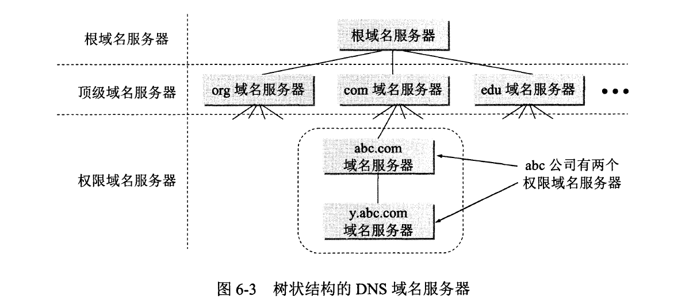
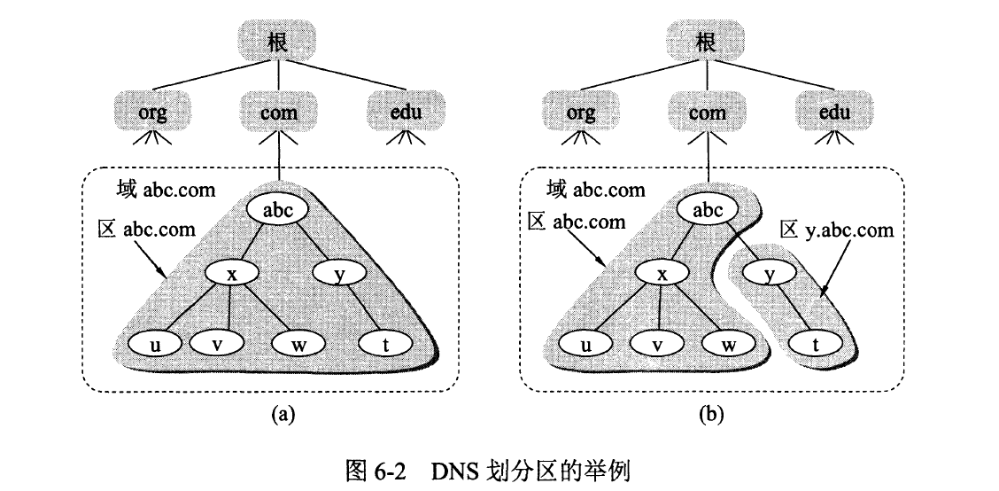
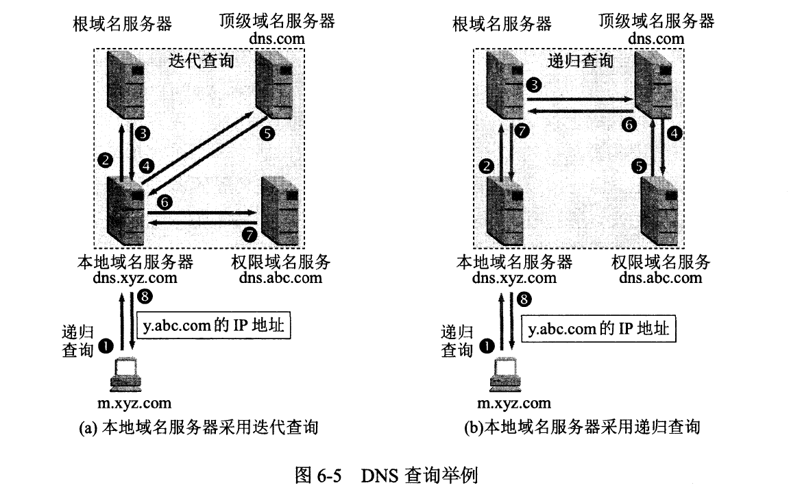

# 域名服务器

1. **根域名服务器**（`Root name server`）：根域名服务器是最高层次的域名服务器。所有的根域名服务器都知道==所有的顶级域名服务器的域名==和==IP地址==。根域名服务器是最重要的域名服务器，因为不管是哪一个本地域名服务器，若要对互联网上任何一个域名进行解析（即转换为P地址），只要自己无法解析，就首先要求助于根域名服务器。
2. **顶级域名服务器**（`Top Level Domain Server`）：这些域名服务器负责管理在该顶级域名服务器注册的所有二级域名。当收到DNS查询请求时，就给出相应的回答（可能是最后的结果，也可能是下一步应当找的域名服务器的IP地址）。
3. **权限域名服务器**（`Authoritative name server`）：一个服务器所负责管辖的（或有权限的）范围叫做区（zone）。各单位根据具体情况来划分自己管辖范围的区。但在一个区中的所有节点必须是能够连通的。每一个区设置相应的**权限域名服务器**，==用来保存该区中的所有主机的域名到IP地址的映射==。当一个权限域名服务器还不能给出最后的査询回答时，就会告诉发出查询请求的DNS客户，下一步应当找哪一个权限域名服务器。例如在图6-2（）中，区abc.com和区y.abc.com各设有一个权限域名服务器。

4. **本地域名服务器**（`Local name server`）：当一台主机发出DNS查询请求时，这个查询请求报文就发送给本地域名服务器，首先在此服务器中进行ip解析。每一个互联网服务提供者ISP，或一个大学，甚至一个大学里的系，都可以拥有一个本地域名服务器。

# 域名解析过程

**查询方式：**

1. **主机向本地域名服务器的查询**一般都是采用`递归查询（recursive query）`。

   **递归查询**：如果主机所询问的本地域名服务器不知道被查询域名的IP地址，那么本地域名服务器就以DNS客户的身份，向其他根域名服务器继续发出查询请求报文（即替该主机继续查询），而不是让该主机自己进行下一步的查询。因此，递归查询返回的查询结果或者是所要查询的IP地址，或者是报错，表示无法查询到所需的IP地址。

2. **本地域名服务器向根域名服务器的查询**通常是采用`迭代查询（Iterative query）`。

   **迭代查询**：当**根域名服务器**收到**本地域名服务器**发出的迭代查询请求报文时要么给出所要查询的IP地址，要么告诉本地域名服务器：“你下一步应当向哪一个域名服务器进行查询”。

   然后让本地域名服务器进行后续的查询（而不是替本地域名服务器进行后续的查询）。**根域名服务器**通常是把自己知道的**顶级域名服务器**的IP地址告诉本地域名服务器，让**本地域名服务器**再向**顶级域名服务器**查询。

   **顶级域名服务器**在收到**本地域名服务器**的查询请求后，要么给出所要查询的IP地址，要么告诉本地域名服务器下一步应当向哪一个**权限域名服务器**进行查询，本地域名服务器就这样进行迭代查询。

   最后，知道了所要解析的域名的IP地址，然后把这个结果返回给发起查询的主机。当然，本地域名服务器也可以采用递归查询，这取决于最初的查询请求报文的设置是要求使用哪一种查询方式。

**查询流程：**

> 假定域名为 m.xyz.com 的主机想知道另一台主机（域名为y.abc.com）的IP地址，图（a）就是所有的查询步骤

1. 主机 m.xyz.com 先向其本地域名服务器 dns xyz.com 进行递归查询。

2. 本地域名服务器采用迭代查询。它先向一个根域名服务器查询。

3. 根域名服务器告诉本地域名服务器，下一次应查询的顶级域名服务器 dns.com的IP地址。

4. 本地域名服务器向顶级域名服务器 dns.com进行查询。

5. 顶级域名服务器 dns.com告诉本地域名服务器，下一次应查询的权限域名服务器dns.abc con的IP地址。

6. 本地域名服务器向权限域名服务器 dns.abc.com进行查询

7. 权限域名服务器 dns.abc.com告诉本地域名服务器，所查询的主机的IP地址。

8. 本地域名服务器最后把查询结果告诉主机 m.xyz.com 

以上 8 个步骤总共要使用 8 个UDP用户数据报的报文。本地域名服务器经过三次迭代査询后，从权限域名服务器dns:abc.com得到了主机y.abc.com的IP地址，最后把结果返回给发起查询的主机 m.xyz.com 

> 图（b）是本地域名服务器采用递归查询的情况
>
> 在这种情况下，本地域名服务器只需向根域名服务器查询一次，后面的几次查询都是在其他几个域名服务器之间进行的整个的查询也是使用8个UDP报文

# 提高DNS查询效率

> 为了提高DNS查询效率，并减轻根域名服务器的负荷和减少互联网上的DNs查询报文数量，在域名服务器中广泛地使用了高速缓存（有时也称为高速缓存域名服务器）

- 高速缓存用来存放最近查询过的域名以及从何处获得域名映射信息的记录。
  - 例如，在图（a）的查询过程中，若在不久前已经有用户查询过域名为y.abc.com的IP地址，那么本地域名服务器就不必向根域名服务器重新查询y.abc.com的IP地址，而是直接把高速缓存中存放的上次査询结果（即y.abc.com的P地址）告诉用户。
  - 假定本地域名服务器的缓存中并没有y.abc.com的P地址，而是存放着顶级域名服务器dns.com的IP地址，那么本地域名服务器也可以不向根域名服务器进行查询，而是直接向com顶级域名服务器发送查询请求报文。

- 由于名字到地址的绑定并不经常改变，为保持高速缓存中的内容正确，域名服务器应为每项内容设置计时器并处理超过合理时间的项
- 不但在本地域名服务器中需要高速缓存，在主机中也很需要。许多主机在启动时从本地域名服务器下载名字和地址的全部数据库，维护存放自己最近使用的域名的高速缓存，并且只在从缓存中找不到名字时才使用域名服务器。