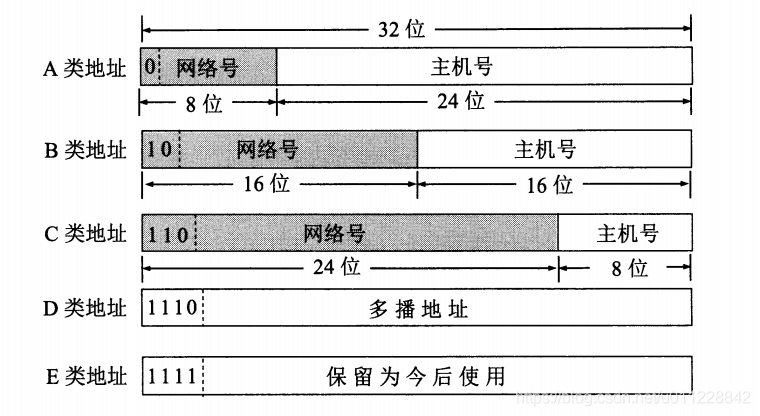
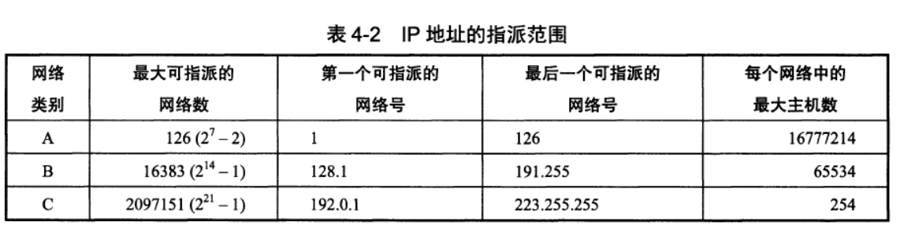
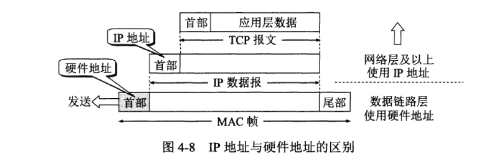
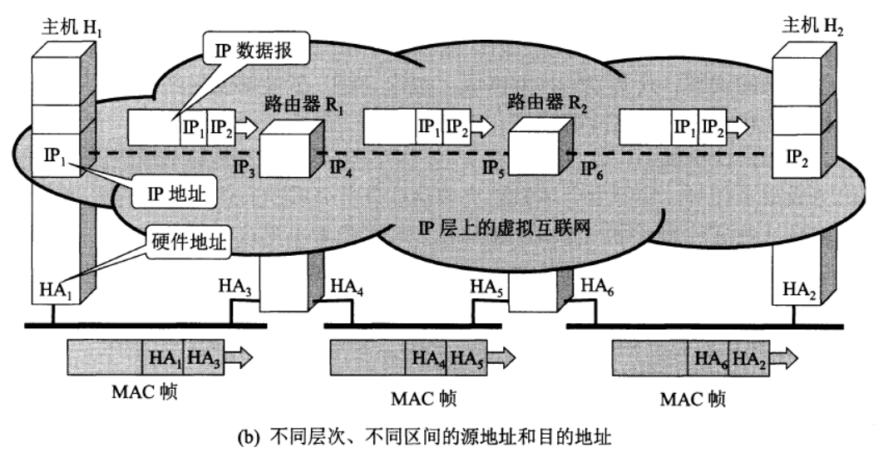
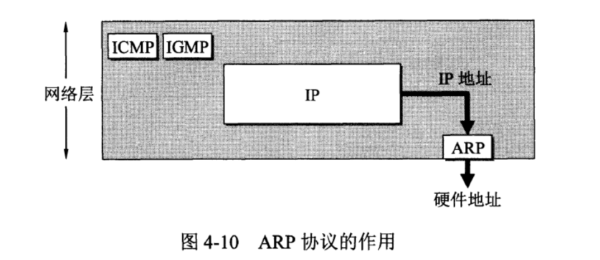
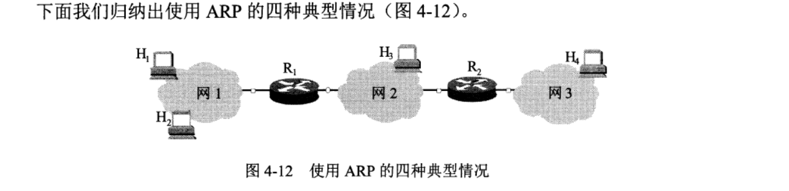
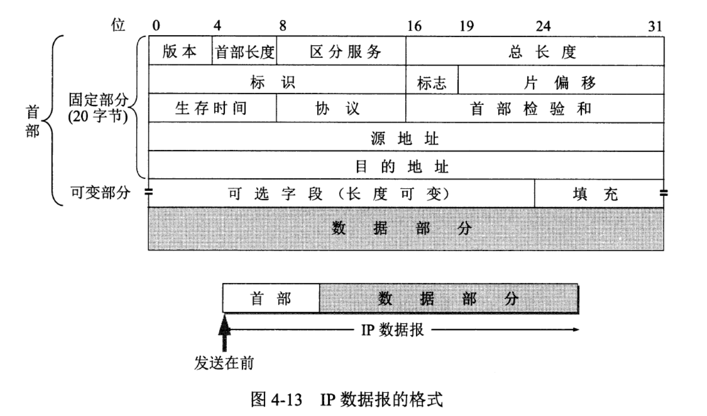
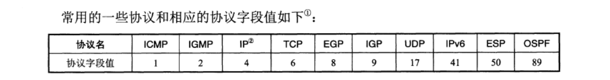

[TOC]

# 网际协议IP

## IP地址的分类

分类的IP地址就是将IP地址划分为若干个固定类，每一类地址都由两个固定长度的字段组成。

**第一个字段是网络号（net-id）**，它标志主机（或路由器）所连接到的网络。一个网络号在整个互联网范围内必须是唯一的。

**第二个字段是主机号（host-id）**，它标志该主机（或路由器）。一台主机号在它前面的网络号所指明的网络范围内必须是唯一的。

因此一个IP地址在整个互联网范围内是唯一的。

这种两级的IP地址可以记为

​															IP地址∷={<网络号>，<主机号>}

下图给出了各种IP地址的网络号字段和主机号字段，这里A类、B类和C类地址都是单播地址（一对一通信），是最常用的。

- A类、B类和C类地址的`网络号字段`（在图中这个字段是灰色的）**分别为1个、2个和3个字节长**，而在网络号字段的最前面有1~3位的类别位，其数值分别规定为0、10、110。
- A类、B类和C类地址的`主机号字段`**分别为3个、2个和1个字节长**。
- D类地址（前4位是110）用于多播（一对多通信）
- E类地址（前4位是111）保留为以后用

## 常用的三类IP地址

**A类地址的网络号**字段占1个字节，只有7位可供使用（该字段的第一位已固定为0），但可指派的网络号是126个（2^7-2）。`减2的原因：`网络号全0为保留地址，表示本网络。网络号为127（011111111）的地址保留用于环回测试本主机的进程间通信

**A类地址的主机号**占3个字节，因此每一个A类网络中的最大主机数是(2^24-2)，即16770214。`减2的原因是：`**全0的主机号字段表示该IP地址是“本主机”所连接到的单个网络地址**（例如，一主机的IP地址为5.6.7.8，则该主机所在的网络地址就是5.0.0.0），**全1的主机号字段表示该网络上的所有主机**。

> A类IP地址空间共有2^32（即4294967296）个地址。整个A类地址空间有2^31个地址，占整个IP地址空间的50%

**B类地址的网络号字段**有2个字节，但前面两位（10）已经固定了，只剩下14位可以进行分配。因为网络号字段后面的14位无论怎样取值也不可能出现使整个2字节的网络号字段成为全0或全1，因此这里不存在网络总数减2的问题。但实际上`B类网络地址1280.0.0是不指派的`，而可以指派的B类最小网络地址是128.1.0.0。因此B类地址可指派的网络数为2^14-1，即16383。

**B类地址的最大主机数**是2^16，即65534。这里需要`减2`是因为要**扣除全0和全1的主机号**。

> B类地址空间共约有2^30个地址，占整个P地址空间的25%。

**C类地址有3个字节的网络号字段**，最前面的3位是（110），还有21位可以进行分配。`C类网络地址192.0.0.0是不指派的`，可以指派的C类最小网络地址是192.0.1.0，因此C类地址可指派的网络总数是2^21-1，即2097151。

每一个C类地址的最大主机数是2^8-2，即254，`减2`是因为要**扣除全0和全1的主机号**。

> C类地址空间共约有2^29个地址，占整个IP地址的12.5%。

## IP地址与硬件地址

​	**物理地址**是`数据链路层`和`物理层`使用的`地址，`而`IP地址是网络层`和`以上各层使用的地址`，是一种逻辑地址（称IP地址为逻辑地址是因为IP地址是用软件实现的）

**IP地址仅在网络层及以上使用**

**物理地址只在数据链路层和物理层使用**

**网际层会对TCP/UDP数据报进行封装**，并在IP数据报的首部添加目的IP地址和源IP地址，并交付给数据链路层

**数据链路层将IP数据报封装为MAC帧**，MAC帧的首部有目的硬件地址和源硬件地址，并在各个主机(路由)上进行传播

> 各个主机(路由)会对MAC帧进行解析，获取IP地址信息后选择对其进行接收，或者再次打包转发

## ARP地址解析

> 由于IP协议使用了ARP协议，因此通常就把ARP协议划归网络层。
>
> `ARP协议`的用途是将网络层的`IP地址`，`解析`为数据链路层的`硬件地址`

​	**每一台主机都设有一个ARP高速缓存（ARP cache）**，当主机A要向本局域网上的某台主机B发送IP数据报时，就先在其ARP高速缓存中查看有无主机B的IP地址。如有，就在ARP高速缓存中查出其对应的硬件地址，再把这个硬件地址写入MAC帧，然后通过局域网把该MAC帧发往此硬件地址。也有可能查不到主机B的IP地址的项目。

在局域网中主机A对所有主机进行广播，收到广播的主机B会对主机A进行单播响应

​	由于在未来一段时间内主机AB可能还会继续通信，因此**主机A在发送其ARP请求分组时**，就把自己的IP地址到硬件地址的映射写入ARP请求分组。**当主机B收到A的ARP请求分组时**，就把主机A的这一地址映射写入主机B自己的ARP高速缓存中。以后主机B向A发送数据报时就很方便了。

​	**当发送主机和目的主机不在同一个局域网中时**，即便知道目的主机的MAC地址，两者也不能直接通信，必须经过路由转发才可以。所以此时，发送主机通过ARP协议获得的将不是目的主机的真实MAC地址，而是一台可以通往局域网外的路由器的MAC地址。于是此后发送主机发往目的主机的所有帧，都将发往该路由器，通过它向外发送。这种情况称为委托ARP或ARP代理（ARP Proxy）

​	同时ARP高速缓存内的映射信息是有生存时间的，到达一定时间后就会被清除，主要是因为硬件地址可能会发生改变（主机断电，主机坏了等）

**使用ARP的四种情况**

1. 发送方是主机（如H1），要把IP数据报发送到**同一个网络**上的另一台主机（如H2）。这时H1发送ARP请求分组（在网1上广播），找到目的主机H2的硬件地址
2. 发送方是主机（如H1），要把IP数据报发送到**另一个网络上**的一台主机（如H3或H4）。这时H1发送ARP请求分组（在网1上广播），找到网1上的一个路由器R1的硬件地址。剩下的工作由路由器R1来完成。R1要做的事情是下面的（3）或（4）。
3. 发送方是路由器（如R1），要把IP数据报转发到与R1连接在同一个网络（网2）上的主机（如H3）。这时R1发送ARP请求分组（在网2上广播），找到目的主机H3的硬件地址。
4. 发送方是路由器（如R1），要把IP数据报转发到网3上的一台主机（如H4）。H4与R1不是连接在同一个网络上。这时R1发送ARP请求分组（在网2上广播），找到连接在网2上的一个路由器R2的硬件地址。剩下的工作由这个路由器R2来完成。

## IP数据报格式

**IP数据报首部的固定部分中的各字段**

1. **版本占4位**，指IP协议的版本。通信双方使用的IP协议的版本必须一致。目前广泛使用的IP协议版本号为4（即IPv4）或IPv6（即版本6的IP协议）
2. **首部长度占4位**，可表示的`最大十进制数值是15`。请注意，`首部长度字段所表示数的单位是32位字`（1个32位字长是4字节）。因为IP首部的固定长度是20字节，因此首部长度字段的最小值是5（即二进制表示的首部长度是0101 = 5，表示大小 = 5 * 4 (32 位字 = 20 字节)）。而当首部长度为最大值1111时（即十进制数的15），就表明首部长度达到最大值15个32位字长，即60字节。当IP分组的首部长度不是4字节的整数倍时，必须利用最后的填充字段加以填充。因此IP数据报的数据部分永远在4字节的整数倍时开始，这样在实现IP协议时较为方便。首部长度限制为60字节的缺点是有时可能不够用。但这样做是希望用户尽量减少开销。最常用的首部长度是20字节（即首部长度为0101），这时不使用任何选项。
3. **区分服务占8位**，用来获得更好的服务。这个字段在旧标准中叫做服务类型，但实际上一直没有被使用过。1998年ITF把这个字段改名为区分服务DS（Differentiated Services）只有在使用区分服务时，这个字段才起作用（见844节）。在一般的情况下都不使用这个字段[RFC2474，3168，3260]。
4. **总长度**   指首部和数据之和的长度，单位为字节。`总长度字段为16位`，因此数据报的最大长度为2^16-1=65535字节。尽可能长的IP数据报会使传输效率得到提高，但数据报短些也有好处。每一个IP数据报越短，路由器转发的速度就越快。为此，IP协议规定，在互联网中所有的主机和路由器，必须能够接受长度不超过576字节的数据报。这是假定上层交下来的数据长度有512字节（合理的长度），加上最长的IP首部60字节，再加上4字节的富余量，就得到576字节。当主机需要发送长度超过576字节的数据报时，就要进行分片。
5. **标识（identification）占16位**。IP软件在存储器中维持一个计数器，每产生一个数据报，计数器就加1，并将此值赋给标识字段。但这个“标识”并不是序号，因为IP是无连接服务，数据报不存在按序接收的问题。当数据报由于长度超过网络的MTU而必须分片时，这个标识字段的值就被复制到所有的数据报片的标识字段中。`相同的标识字段的值使分片后的各数据报片最后能正确地重装成为原来的数据报`
6. **标志（flag）占3位**，但目前只有两位有意义。
   `标志字段中的最低位记为MF`（More Fragment）
   1. MF=1即表示后面“还有分片”的数据报。
   2. MF=0表示这已是若干数据报片中的最后一个。
   3. 标志字段中间的一位记为DF（Don't Fragment），意思是“不能分片”。只有当DF=0时才允许分片。
7. **片偏移占13位**。片偏移指出：较长的分组在分片后，某片在原分组中的相对位置。也就是说，相对于用户数据字段的起点，该片从何处开始。`片偏移以8个字节为偏移单位`。这就是说，每个分片的长度一定是8字节（64位）的整数倍。
8. **生存时间占8位**，生存时间表示为TTL（Time To live），表明这是数据报在网络中的寿命。由发出数据报的源点设置这个字段。其目的是防止无法交付的数据报无限制地在互联网中兜圈子。
9. **协议占8位**，协议字段指出此数据报携带的数据是使用何种协议，以便使目的主机的IP层知道应将数据部分上交给哪个协议进行处理。

10. **首部检验和占16位。**该字段**只检验数据报的首部，但不包括数据部分**。这是因为数据报每经过一个路由器，路由器都要重新计算一下首部检验和（一些字段，如生存时间、标志、片偏移等都可能发生变化）。不检验数据部分可减少计算的工作量。为了进一步减小计算检验和的工作量

    检验和计算方法：**在发送方**，先把IP数据报首部划分为许多16位字的序列，并把检验和字段置零。用反码算术运算把所有16位字相加后，将得到的和的反码写入检验和字段。

    **接收方收到数据报后**，将首部的所有16位字再使用反码算术运算相加一次。将得到的和取反码，即得出接收方检验和的计算结果。若首部未发生任何变化，则此结果必为0，于是就保留这个数据报。否则即认为出差错，并将此数据报丢弃。

11. **源地址占32位。**

12. **目的地址占32位。**