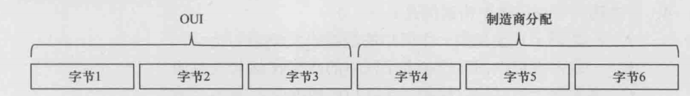
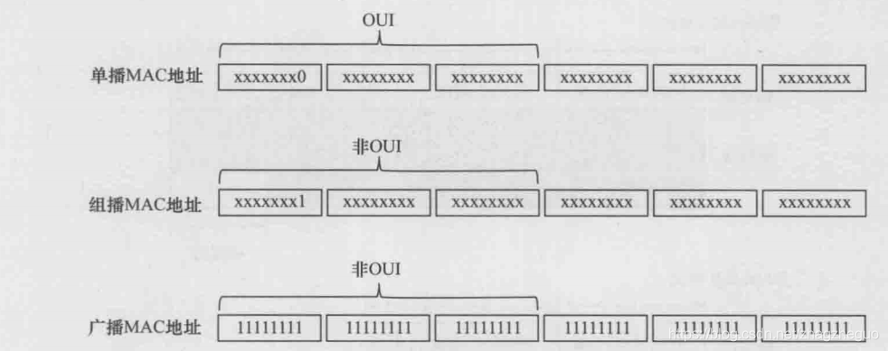
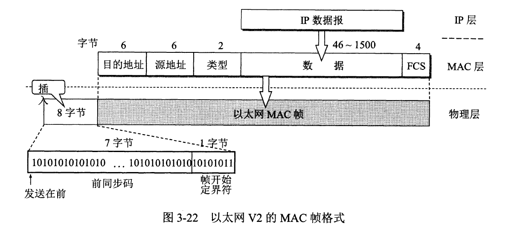

# Mac地址	

​	在局域网中，**硬件地址**又称为**物理地址或MAC地址**（因为这种地址用在**MAC帧中**）

IEEE802标准为局域网规定了一种**48位**的全球地址（一般都简称为“地址”），是指局域网上的每台计算机中固化在适配器的ROM中的地址。

IEEE802标准规定MAC地址字段可采用**6字节（48位**）或2字节（16位）这两种中的一种。

​	**6字节的地址字段**可使全世界所有的局域网适配器都具有不相同的地址，因此现在的局域网适配器实际上使用的都是6字节MAC地址现在正IEEE的注册管理机构RA（Registration Authority）是局域网全球地址的法定管理机构W-IEEERA]，==它负责分配地址字段的6个字节中的前三个字节（即高位24位）==。世界上凡要生产局域网适配器的厂家都必须向IEEE购买由这三个字节构成的这个号（即地址块），这个号的正式名称是组织唯一标识符OUI（Organizationally Unique Identifier），通常也叫做公司标识符（company id）[RFC7042]。

例如，3Com公司生产的适配器的MAC地址的前三个字节是02-60-8C。地址字段中的**后三个字节（即低位24位）则由厂家自行指派**，**称为扩展标识符**（extended identifier），只要保证生产出的适配器没有重复地址即可。

在生产适配器时，这种6字节的MAC地址已被固化在适配器的ROM中。因此，MAC地址也叫做硬件地址 hardware address或物理地址。

IEEE规定地址字段的**第一字节的最低位为I/G位**。IG表示 Individual/Group。当G位为0时，地址字段表示一个单个站地址。**当I/G位为1时表示组地址，用来进行多播**（以前曾译为组播）。因此，IEEE只分配地址字段前三个字节中的23位。

（1）单播 unicas帧（一对一），即收到的帧的MAC地址与本站的硬件地址相同

（2）广播（broadcast）帧（一对全体），即发送给本局域网上所有站点的帧（每个比特都是 1 的 MAC 地址）

（3）多播 multicast）帧（一对多），即发送给本局域网上一部分站点的帧

​	IEEE还考虑到可能有人并不愿意向IEEE的RA购买OUI。为此，**IEEE把地址字段第1字节的最低第二位规定为G位**，**表示 Global/Local**。当G/L位为0时是全球管理（保证在全球没有相同的地址）在全球管理时，对每一个站的地址可用46位的二进制数字来表示（最低位和最低第2位均为0时）。剩下的46位组成的地址空间可以有246个地址，已经超过70万亿个，可保证世界上的每一个适配器都可有一个唯一的地址。

# Mac帧

​	常用的以太网MAC帧格式有两种标准，一种是 DIX Ethernet v2标准（即以太网V2枥准），另一种是IEEE的8023标准。这里只介绍使用得最多的以太网V2的MAC帧格式

​	以太网V2的MAC帧较为简单，由五个字段组成。

前两个字段分别为6字节长的**目的地址(**目的地的Mac地址)和**源地址字段**（数据源的Mac地址）。

第三个字段是2字节的类型字段，用来**标志上一层使用的是什么协议**，以便把收到的MAC帧的数据上交给上一层的这个协议。例如，当类型字段的值是0x0800时，就表示上层使用的是IP数据报。若类型字段的值为0x8137，则表示该帧是由 Novell IPX发过来的。

第四个字段是数据字段，其长度在46到1500字节之间（46字节是这样得出的：最小长度64字节减去18字节的首部和尾部就得出数据字段的最小长度）。

最后一个字段是4字节的帧检验序列FCS（使用CRC检验）。当传输媒体的误码率为1×103时，MAC子层可使未检测到的差错小于1×10