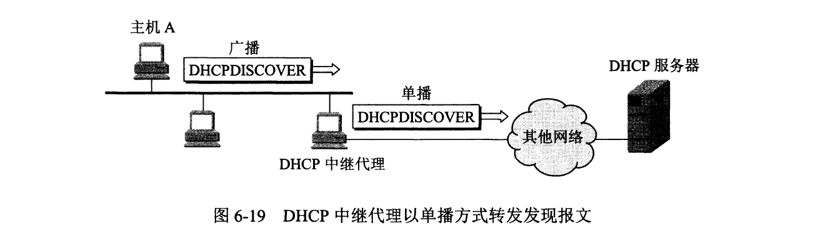

**问题的产生：**

​	当一台便携式的笔记本想要接入到互联网中，则需要协议软件包括配置项：

- IP地址
- 子网掩码
- 默认路由器的IP地址
- 域名服务器的IP地址

> 用人工进行协议配置很不方便，而且容易出错。因此，应当采用自动协议配置的方法。
> 互联网现在广泛使用的是动态主机配置协议`DHCP`（`Dynamic Host Configuration Protoco`），它提供了一种机制，称为即插即用连网（plug-and-play networking）。这种机制允许台计算机加入新的网络和获取IP地址而不用手工参与！

**DHCP对运行客户软件和服务器软件的计算机都适用**

- 当运行客户软件的计算机移至个新的网络时，就可使用DHCP获取其配置信息而不需要手工干预。
- DHCP给运行服务器软件而位置固定的计算机指派一个永久地址，而当这计算机重新启动时其地址不改变。

**DHCP进行协议配置的方式**

1. 当需要IP地址的主机A在启动时就向DHCP服务器**广播**发送发现报文（`DHCPDISCOVER`）（将目的IP地址置为全1，即255.255.255.255），这时该主机就成为了DHCP客户。

2. 发送广播报文是因为现在还不知道DHCP服务器在什么地方，因此要发现DHCP服务器的IP地址。这台主机目前还没有自己的IP地址，因此它将IP数据报的源IP地址全部设置为0。这样，在**本地网络**上的**所有主机**都能够收到这个广播报文，但==只有DHCP服务器才对此广播报文进行回答==。

3. DHCP服务器先在其数据库中查找该计算机的配置信息。若找到，则返回找到的该主机的相关配置信息。若找不到，则从服务器的IP地址池（`address pool`）中取一个地址分配给该计算机。DHCP服务器的回答报文叫做提供报文（`DHCPOFFER`），表示“提供”了IP地址等配置信息。

> ​	但是我们并不愿意在每一个网络上都设置一个DHCP服务器，因为这样会使DHCP服务器的数量太多。因此现在是使每一个网络至少有一个DHCP中继代理（`relay agen`）（通常是一台路由器，见上图），它配置了DHCP服务器的IP地址信息。当DHCP中继代理收到主机 A 以广播形式发送的发现报文后，就以单播方式向DHCP服务器转发此报文，并等待其回答。
>
> ​	收到DHCP服务器回答的提供报文后，DHCP中继代理再把此提供报文发回给主机A。需要注意的是，图6-19只是个示意图。实际上，DHCP报文只是UDP用户数据报的数据，它还要加上UDP首部、IP数据报首部，以及以太网的MAC帧的首部和尾部后，才能在链路上传送。

**关于DHCP服务器分发IP的使用时间**

​	DHCP服务器分配给DHCP客户的IP地址是临时的，因此DHCP客户只能在一段有限的时间内使用这个分配到的IP地址。DHCP协议称这段时间为租用期（ease period），但并没有具体规定租用期应取为多长或至少为多长，这个数值应由DHCP服务器自己决定。

​	例如：一个校园网的DHCP服务器可将租用期设定为1小时。

> ​	DHCP服务器在给DHCP客户发送的提供报文的选项中给出租用期的数值。按照RFC2132的规定，租用期用4字节的二进制数字表示，单位是秒。因此可供选择的租用期范围从1秒到136年。DHCP客户也可在自己发送的报文中（例如，发现报文）提出对租用期的要求。

