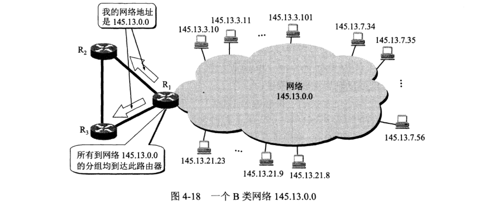
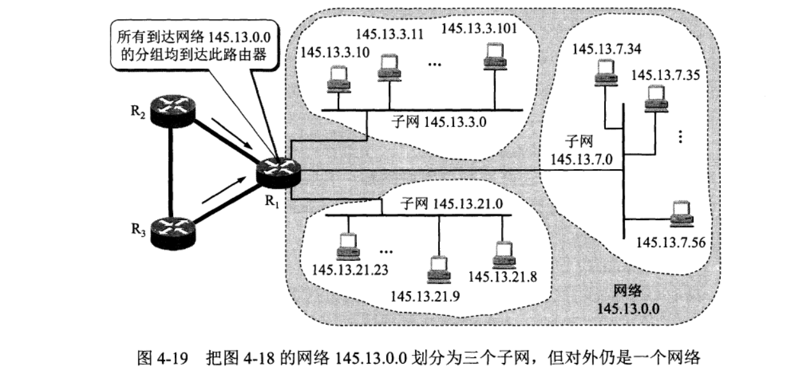
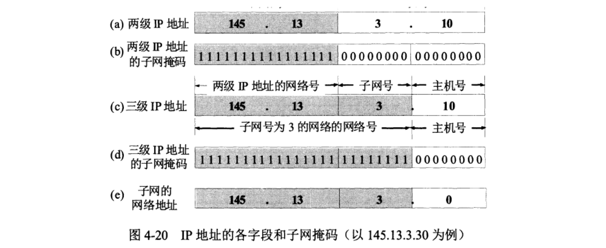
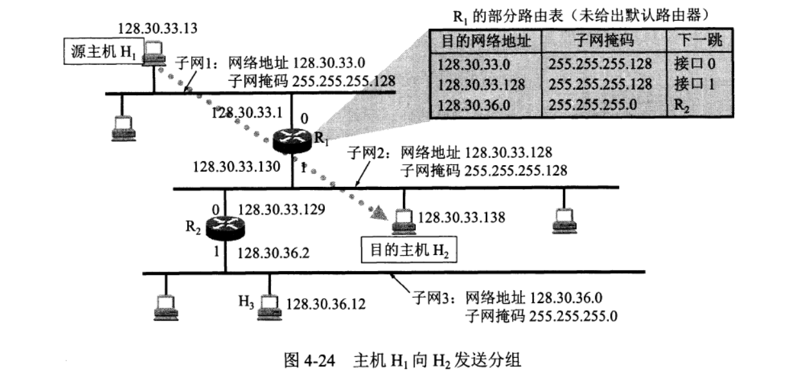

## 1. 子网划分

- 一个拥有许多物理网络的单位，可将所属的物理网络划分为`若干个子网`（subne）。这个单位对外仍然表现为一个网络.

- 划分子网的方法是从网络的主机号借用若干位作为子网号（subnet-id）,于是两级IP地址在本单位内部就变为三级IP地址：网络号、子网号和主机号。标记法如下：

  ​															`IP地址::={<网络号>，<子网号>，<主机号>}`

- 其他网络发送给本单位某台主机的IP数据报，仍然是根据IP数据报的目的网络号找到连接在本单位网络上的路由器。但此路由器在收到IP数据报后，再按目的网络号和子网号找到目的子网，把IP数据报交付目的主机。

下面用例子说明划分子网的概念。图4-18表示某单位网络地址是`145.13.0.0`（网络号是145.13）。凡目的地址为`145.13.x.x`的数据报都被送到该单位的路由器R1。

对上述网络以8位网络号进行子网划分。所划分的三个子网分别是：`145.13.3.0`，`145.13.7.0`和`145.13.21.0`。在划分子网后，整个网络对外部仍表现为一个网络，其网络地址仍为`145.13.0.0`。但网络`145.13.0.0`上的路由器R1在收到外来的数据报后，再根据数据报的目的地址把它转发到相应的子网。

总之，当没有划分子网时，IP地址是两级结构。划分子网后IP地址变成了三级结构划分子网只是把IP地址的主机号这部分进行再划分，而不改变IP地址原来的网络号。

## 2. 子网掩码

假定有一个数据报（其目的地址是`145.13.3.10`）已经到达了路由器R1。那么这个路由器如何把它转发到子网`145.13.3.0`呢？

- 图 a 是IP地址为`145.13.3.10`的主机本来的两级P地址结构。

- 图 b 是这个两级IP地址的子网掩码。

- 图 c 是同一地址的三级IP地址结构，请注意，现在子网号为3的网络的网络地址是`145.13.3.0`
- 图 d 是三级IP地址的子网掩码，它也是32位，由一串24个1和跟随的一串8个0组成。子网掩码中的1
  对应于IP地址中原来二级地址中的16位网络号加上新增加的8位子网号，而子网掩码中的
  0对应于现在的8位主机号。
- 图 e 表示`R1`把**三级IP地址的子网掩码**和收到的**数据报的目的IP地址**`145.13.3.10`逐位相“与”，得出了所要找的子网的网络地址`145.13.3.0`。

使用子网掩码的好处就是：不管网络有没有划分子网，只要把子网掩码和IP地址进行逐位的“与”运算（AND），就立即得出网络地址来。

**子网掩码是一个网络或一个子网的重要属性**。路由器和相邻路由器交换路由信息时，必须把自己所在网络的子网掩码告诉相邻路由器。在路由器的路由表中的每一个项目，除了要给出目的网络地址外，还必须同时给出该网络的子网掩码。若一个路由器连接在两个子网上就拥有两个网络地址和两个子网掩码。

## 3. 子网分组转发

在划分子网的情况下，路由器转发分组的算法如下：

1. 从收到的数据报的首部提取目的IP`地址D`。
2. 先判断是否为直接交付。对路由器直接相连的网络逐个进行检查：用各网络的`子网掩码`和`D`逐位相“与”，看结果是否和相应的网络地址匹配。若匹配，则把分组进行直接交付（当然还需要把D转换成物理地址，把数据报封装成帧发送出去），转发任务结束。否则就是间接交付，执行（3）。
3. 若路由表中有目的地址为D的特定主机路由，则把数据报传送给路由表中所指明的下一跳路由器；否则，执行（4）
4. 对路由表中的每一行（目的网络地址，子网掩码，下一跳地址），用其中的子网掩码和D逐位相“与”，其结果为N。若N与该行的目的网络地址匹配，则把数据报传送给该行指明的下一跳路由器；否则，执行（5）
5. 若路由表中有一个默认路由，则把数据报传送给路由表中所指明的默认路由器；否则，执行（6）
6. 报告转发分组出错。

下图有三个子网、两个路由器，现在源主机H1想目的地主机H2发送分组：

1. 源主机H1向目的主机H2发送的分组的目的地址是H2的`IP地址128.30.33.138`
2. 源主机H1首先要进行的操作是要判断：发送的这个分组，是在本子网上进行直接交付还是要通过本子网上的路由器进行间接交付？
3. 源主机H1把本子网的`子网掩码255.255.255.128`与目的主机H2的`IP地址128.30.33.138`逐位相“与”，得出`128.30.33.128`，它不等于H1的网络地址。这说明H2与H1不在同一个子网上。因此交给子网上的默认路由器R1，由R1来转发。
4. 路由器R1在收到一个分组后，就在其路由表中逐行寻找有无匹配的网络地址先看R1路由表中的第一行。用这一行的子网掩码`255.255.255.128”`和收到的分组的`目的地址128.30.33.138`逐位相“与”，得出`128.30.33.128`。与路由表中的目的网络地址（`128.30.33.0`）比较。但比较的结果不一致。
5. 继续用第二行的子网掩码`255.255.255.128`和该分组的`目的地址128.30.33.138`逐位相“与”，结果也是`128.30.33.128`。这个结果和第二行的目的网络地址`128.30.33.128`相匹配，说明这个网络（子网2）就是收到的分组所要寻找的目的网络。于是不需要再继续查找下去。R1把分组从接口1直接交付主机H2（它们都在一个子网上）。