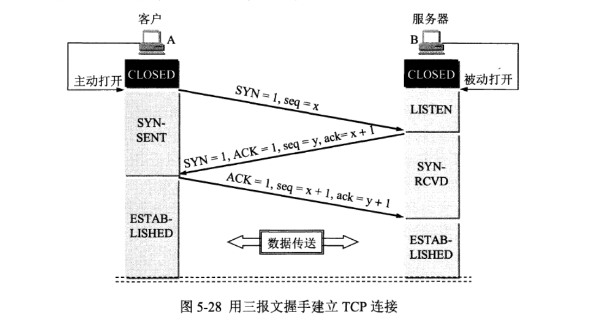

# 运输层协议概述

## 进程间的通信

## 运输层的两个主要协议

:four_leaf_clover:**用户数据报协议UDP（User Datagram protoco）**

UDP在传送数据之前不需要先建立连接。远地主机的运输层在收到UDP报文后，不需要给出任何确认。

:four_leaf_clover:**传输控制协议TCP（Transmission Control Protoco）**

TCP则提供面向连接的服务。在传送数据之前必须先建立连接，数据传送结束后要释放连接。TCP不提供广播或多播服务。由于TCP要提供可靠的、面向连接的运输服务，因此不可避免地增加了许多的开销。

## 运输层的端口

当两台计算机进行通信的时候，不仅需要对方的ip地址，还需要知道双方应用层中目标进程的软件端口号，它是应用层的各种协议进程与运输实体进行层间交互的一种地址。因此在应用层纷繁复杂的进程中，使用指定的端口号，获取对应的进程，从而进行通信。

TCP/IP的运输层用一个16位端口号来标志一个端口。，端口号只具有本地意义，它只是为了标志本计算机应用层中的各个进程在和运输层交互时的层间接口。16位的端口号可允许有65535个不同的端口号。

**服务器端使用的端口号**

服务器端使用的端口号分为两类：**系统端口号和登记端口号**

**:maple_leaf: 熟知端囗号/系统端口号**，数值为0-1023，这些端口号被指派给了 TCP/IP最重要的一些应用程序，让所有的用户都知道

**:maple_leaf:登记端口号**，数值为1024-49151。这类端口号是为没有熟知端口号的应用程序使用的。使用这类端口号必须在IANA按照规定的手续登记，以防止重复。

**客户端使用的端口号范围**

客户端使用的端口号数值为49152-65535。由于这类端口号仅在客户进程运行时才动态选择，这类端口号留给客户进程选择暂时使用。当指定端口号的进程运行结束后就会释放所分配的端口号。

# 用户数据报协议UDP

## UDP概述

> 用户数据报协议UDP只在IP的数据报服务之上增加了很少一点的功能，这就是**复用和分用的功能**以及差错检测的功能。

**UDP的主要特点：**

1. **UDP是无连接的**。即发送数据之前不需要建立连接（当然，发送数据结束时也没有连接可释放），因此减少了开销和发送数据之前的时延。

2. **UDP使用尽最大努力交付**，即不保证可靠交付，因此主机不需要维持复杂的连接状态表。

3. **UDP是面向报文的**。发送方的UDP对应用程序交下来的报文，在添加首部后就向下交付IP层。UDP对应用层交下来的报文，既**不合并，也不拆分**，而是保留这些报文的边界。这就是说，应用层交给UDP多长的报文，UDP就照样发送，**即一次发送一个报文**。

   因此，应用程序必须选择合适大小的报文。若报文太长，UDP把它交给IP层后，IP层在传送时可能要进行分片，这会降低IP层的效率。反之，若报文太短，UDP把它交给IP层后，会使IP数据报的首部的相对长度太大，这也降低了IP层的效率。

   

4. **UDP没有拥塞控制。**因此网络出现的拥塞不会使源主机的发送速率降低。IP电话、实时视频会议等要求源主机以恒定的速率发送数据，并且允许在网络发生拥塞时丢失一些数据，但却不允许数据有太大的时延。

5. UDP支持一对一、一对多、多对一和多对多的交互通信。

6. **UDP的首部开销小，**只有8个字节，比TCP的20个字节的首部要短。

## UDP的首部格式

> 用户数据报UDP有两个字段：数据字段和首部字段。首部字段很简单，只有8个字节，由四个字段组成，每个字段的长度都是两个字节。

1. **源端口：**在需要对方回信时选用。不需要时可用全0。
2. **目的端口：**这在终点交付报文时必须使用。
3. **长度：**UDP用户数据报的长度，其最小值是8（仅有首部）。
4. **检验和：**检测UDP用户数据报在传输中是否有错。有错就丢弃。

## UDP数据校验

 **:four_leaf_clover: 在计算检验和时，要在UDP用户数据报之前增加12个字节的伪首部**。

**伪首部**仅在计算**UDP检验和**时，临时添加在UDP用户数据报前面，得到一个临时的UDP用户数据报。伪首部既不向下传送也不向上传送。因此伪首部就是伪，即不存在，不占用空间地址。

其目的是让UDP**两次检查数据**是否已经正确到达目的地：

1. 第一次检查是UDP确认该数据报是不是发送给本机IP地址的
2. 第二次检查是确认IP有没有将数据报误传给UDP

根据上图 5-5可知：伪首部包含——32位源IP地址、32位目的IP地址、8位填充0，8位协议，16位UDP长度

**:four_leaf_clover:如何计算UDP检验和以及检验UPD数据信息是否正确**

**计算UDP检验和：**初始化UDP检验和为 0。将UDP伪首部，首部信息，数据信息，以16位二进制数进行划分，若UDP数据部分信息不足16位，对其进行补0。然后将划分好的二进制数进行求和操作，然后对求和结果取反，即为UDP检验和。

**UPD数据校验：**接收方将UPD数据报按照16位二进制数进行划分，求和结果为全1，则说明数据正确，否则数据错误，一般将错误的数据报进行丢弃。

# 传输控制协议TCP

## TCP协议概述

**:palm_tree: TCP最主要的特点**

1. **TCP是面向连接的运输层协议。**应用程序在使用TCP协议之前，必须先建立TCP连接。在传送数据完毕后，必须释放TCP连接。
2. **每一条TCP连接只能有两个端点**
3. **TCP提供可靠交付的服务。**通过TCP连接传送的数据，无差错、不丢失、不重复，并且按序到达。
4. **TCP提供全双工通信。**TCP允许通信双方的应用进程在任何时候都能发送数据，**TCP连接的两端都设有发送缓存和接收缓存，用来临时存放双向通信的数据**。在发送时，应用程序在把数据传送给TCP的缓存后，就可以做自己的事，而TCP在合适的时候把数据发送出去。在接收时，TCP把收到的数据放入缓存，上层的应用进程在合适的时候读取缓存中的数据。
5. **面向字节流。**TCP中的“流”（stream）指的是流入到进程或从进程流出的字节序列。
   “面向字节流”的含义是：虽然应用程序和TCP的交互是一次一个数据块（大小不等），但TCP把应用程序交下来的数据仅仅看成是一连串的无结构的字节流。TCP并不知道所传送的字节流的含义。对字节流的解释权留给应用层双方。

## TCP的连接

**:palm_tree: TCP把连接作为最基本的抽象。**每一条TCP连接有两个端点。TCP连接的端点叫做**套接字（socket）**。

**套接字为：**IP地址拼接端口号。因此，套接字的表示方法是在点分十进制的IP地址后面写上端口号，中间用冒号或逗号隔开。例如，若P地址是192.3.4.5而端口号是80，则套接字就是（192.3.4.5：80）

## TCP报文段首部格式

**:palm_tree: TCP报文段首部的前20个字节是固定的**，后面有4n字节是根据需要而增加的选项（n是整数）。因此TCP首部的最小长度是20字节。

**:palm_tree: 首部固定部分各字段的意义如下：**

1. **源端口和目的端口各占2个字节**，分别写入源端口号和目的端口号。

2. **序号占4字节**。序号范围是[0，2^32 - 1]，共2^32（即4294967296）个序号。序号增加到2^32 - 1后，下一个序号就又回到 0。首部中的序号字段值指的是本报文段所发送的数据的第一个字节的序号。

   **例如：**一报文段的序号字段值是301，而携带的数据共有100字节。这就表明：本报文段的数据的第一个字节的序号是301，最后一个字节的序号是400。

3. **确认号占4字节**，是期望收到对方下一个报文段的第一个数据字节的序号。

   **例如：**B正确收到了A发送过来的一个报文段，其序号字段值是501，数据长度是200字节（序号501~700），这表明B正确收到了A发送的到序号700为止的数据。因此，B期望收到A的下一个数据序号是701，于是B在发送给A的确认报文段中把确认号置为701。

4. **数据偏移占4位，**它指出**TCP报文段的数据部分起始处**距离**TCP报文段的起始**处有多远。也就是`指出TCP报文段的首部长度。`**“数据偏移”的单位是32位**（即以4字节长为计算单位）。由于4位二进制数能够表示的最大十进制数字是15，因此数据偏移的最大值是 15 * 32 = 15 * 4 字节 = 60 字节，这也是TCP首部的最大长度（即选项长度不能超过40字节）。

5. **保留占6位，**保留为今后使用，但目前应置为0。

6. **紧急URG**（URGent）当URG=1时，表明紧急指针字段有效。它告诉系统此报文段中有紧急数据，应尽快传送（相当于高优先级的数据），而不要按原来的排队顺序来传送。

7. **确认ACK**（ACKnowledgment）仅当ACK=1时确认号字段才有效。当ACK=0时，确认号无效。TCP规定，在连接建立后所有传送的报文段都必须把ACK置1。

8. **推送PSH**（PuSH）当两个应用进程进行交互式的通信时，有时在一端的应用进程希望在键入一个命令后立即就能够收到对方的响应。在这种情况下，TCP就可以使用推送（pus）操作。这时，发送方TCP把PSH置1，并立即创建一个报文段发送出去。接收方TCP收到PSH=1的报文段，就尽快地（即“推送”向前）交付接收应用进程，而不再等到整个缓存都填满了后再向上交付。

9. **复位RST**（ReseT）当RST=1时，表明TCP连接中出现严重差错），必须释放连接，然后再重新建立运输连接。RST置1还用来拒绝一个非法的报文段或拒绝打开一个连接。RST也可称为重建位或重置位。

10. **同步SYN**（SYNchronization）在连接建立时用来同步序号。当SYN=1而ACK=0时，表明这是一个连接请求报文段。对方若同意建立连接，则应在响应的报文段中使SYN=1和ACK=1。

11. **终止FIN（FINiS）用来释放一个连接**。当FIN=1时，表明此报文段的发送方的数据已发送完毕，并要求释放运输连接。

12. **窗口占2字节。**窗口值是[0，216-1]之间的整数。**窗口指的是发送本报文段一方的接收窗口**（而不是自己的发送窗口）。窗口值告诉对方：从本报文段首部中的确认号算起，接收方目前允许对方发送的数据量（以字节为单位）

13. **检验和占2字节。**检验和字段检验的范围**包括首部和数据这两部分。**与UDP类似，在计算检验和时，要在TCP报文段的前面加上12字节的伪首部。伪首部第4个字段中的17改为6（TCP的协议号是6），把第5字段中的UDP长度改为TCP长度。

14. **紧急指针占2字节。**紧急指针仅在URG=1时才有意义，它指出本报文段中的紧急数据的字节数（紧急数据结束后就是普通数据）

15. **选项长度可变，最长可达40字节。**当没有使用“选项“时，TCP的首部长度是20字节

## TCP的运输连接管理

**:deciduous_tree: TCP是面向连接的协议。运输连接是用来传送TCP报文的。**TCP运输连接的建立和释放是每一次面向连接的通信中必不可少的过程。因此，运输连接就有三个阶段，即**：连接建立、数据传送和连接释放。**
在TCP连接建立过程中要解决以下三个问题：

1. 要使每一方能够确知对方的存在。

2. 要允许双方协商一些参数（如最大窗口值、是否使用窗口扩大选项和时间戳选项以及服务质量等）

3. 能够对运输实体资源（如缓存大小、连接表中的项目等）进行分配。

**:deciduous_tree: TCP连接的建立采用客户服务器方式。**主动发起连接建立的应用进程叫做客户 （client），而被动等待连接建立的应用进程叫做服务器（server）

### TCP的连接建立

**TCP建立连接的过程叫做握手，握手需要在客户和服务器之间交换三个TCP报文段。**

三报文握手建立TCP连接的过程**:point_down:** 其中 SYN是同步序号、seq是报文序号，ack是响应确认号，ACK是首部确认号

**:deciduous_tree: 假定主机A运行的是TCP客户程序，而B运行TCP服务器程序。**最初两端的TCP进程都处于 CLOSED（关闭）状态。本例中，A主动打开连接，而B被动打开连接。

1. B 的TCP服务器进程先创建传输控制块TCB，准备接受客户进程的连接请求。然后服务器进程就处于 LISTEN（收听）状态，等待客户的连接请求。如有，即作出响应。
2. A的TCP客户进程也是首先创建传输控制模块TCB。然后，**在打算建立TCP连接时，向B发出连接请求报文段，这时首部中的同步位SYN=1，同时选择一个初始序号seq=x。**TCP规定，SYN报文段（即SYN=1的报文段）不能携带数据，但要消耗掉一个序号。这时，`TCP客户进程进入 SYN-SENT（同步已发送）状态。`
3. **B收到连接请求报文段后，如同意建立连接，则向A发送确认。在确认报文段中应把SYN位和ACK位都置1，确认号是ack=x+1，同时也为自己选择一个初始序号seq=y。**请注意，这个报文段也不能携带数据，但同样要消耗掉一个序号。`这时TCP服务器进程进入 SYN-RCVD（同步收到）状态。`
4. **TCP客户进程收到B的确认后，还要向B给出确认。确认报文段的ACK置1，确认号ack=y+1，而自己的序号seq=x+1。**TCP的标准规定，ACK报文段可以携带数据。但如果不携带数据则不消耗序号，在这种情况下，下一个数据报文段的序号仍是seq=x+1。**这时，TCP连接已经建立，A进入 ESTABLISHED（已建立连接）状态。**
5. **当B收到A的确认后，也进入 ESTABLISHED状态。**

> B发送给A的报文段，也可拆成两个报文段。先发送一个确认报文段（ACK=1，ack=x+1），然后再发送一个同步报文段（SYN=1，seq=y）。这样的过程就变成了四报文握手，但效果是样的。

#### 为什么A最后还要发送一次确认呢？

==这主要是为了防止已失效的连接请求报文段突然又传送到了B，因而产生错误。==

**“已失效的连接请求报文段”产生的原因：**

**:deciduous_tree: 考虑一种正常情况，**A发出连接请求，但因连接请求报文丢失而未收到确认。于是A再重传一次连接请求。后来收到了确认，建立了连接。数据传输完毕后，就释放了连接。A共发送了两个连接请求报文段，其中第一个丢失，第二个到达了B，没有“已失效的连接请求报文段”。
**:deciduous_tree: 假定出现一种异常情况，**即A发出的第一个连接请求报文段并没有丢失，而是在某些网络结点长时间滞留了，以致**延误到连接释放以后的某个时间才到达B。**本来这是一个早已失效的报文段。但B收到此失效的连接请求报文段后，就误认为是A又发出一次新的连接请求。于是就向A发出确认报文段，同意建立连接。假定不采用报文握手，那么只要B发出确认，新的连接就建立了。
由于现在A并没有发出建立连接的请求，因此不会理睬B的确认，也不会向B发送数据。但B却以为新的运输连接已经建立了，并一直等待A发来数据。B的许多资源就这样白白浪费了。

### TCP连接释放

:christmas_tree: 数据传输结束后，通信的双方都可释放连接。现在A和B都处于 ESTABLISHED状态

1. **A 的应用进程先向其TCP发出连接释放报文段，并停止再发送数据，主动关闭TCP连接。**

   A把连接释放报文段首部的`终止控制位FIN置1，其序号seq=u`，它等于前面已传送过的数据的最后一个字节的序号加1。这时**A进入 FIN-WAIT-1（终止等待1）状态**，等待B的确认。请注意，TCP规定，FIN报文段即使不携带数据，它也消耗掉一个序号。`

2. **B 收到连接释放报文段后即发出确认，**确认号是ack=u+1，报文段自己的序号是v，等于B前面已传送过的数据的最后一个字节的序号加1。然后**B就进入 CLOSE WAIT（关闭等待）状态**。`TCP服务器进程这时应通知高层应用进程，因而从A到B这个方向的连接就释放了，这时的TCP连接处于半关闭 Thalf-close）状态，`即A已经没有数据要发送了，但B若发送数据，A仍要接收。

3. **A 收到来自B的确认后，就进入 FIN-WAIT2（终止等待2）状态，等待 B 发出的连接释放报文段。**

4. 若B已经没有要向A发送的数据，其应用进程就通知TCP释放连接。这时**B发出的连接释放报文段必须使FIN=1。现假定B的序号为w**（在半关闭状态B可能又发送了一些数据）。**B还必须重复上次已发送过的确认号ack=u+1。这时B就进入 LAST-ACK（最后确认）状态，等待A的确认。**

5. **A 在收到 B 的连接释放报文段后，必须对此发出确认。**在确认报文段中把ACK置1，确认号ack=w+1，而自己的序号是seq=u+1（根据TCP标准，前面发送过的FN报文段要消耗一个序号）。`然后进入到 TIME-WAIT（时间等待）状态`。**现在TCP连接还没有释放掉。必须经过时间等待计时器（TIME-WAIT timer）设置的时间2MSL后，A才进入到 CLOSED状态。**时间MSL叫做最长报文段寿命 Maximum Segment Lifetime），RFC793建议设为2分钟。

#### 为什么A在 TIME-WAIT状态必须等待2MSL的时间呢？

1. **为了保证A发送的最后一个ACK报文段能够到达B。**这个ACK报文段有可能丢失，因而使处在 LAST-ACK状态的B收不到对已发送的FIN+ACK报文段的确认。**B会超时重传这个FIN+ACK报文段，而A就能在2MSL时间内收到这个重传的FIN+ACK报文段。接着A重传一次确认，重新启动2MSL计时器。**最后，A和B都正常进入到CLOSED状态。如果A在 TIME-WAIT状态不等待一段时间，而是在发送完ACK报文段后立即释放连接，那么就无法收到B重传的FN+ACK报文段，因而也不会再发送一次确认报文段。这样，B就无法按照正常步骤进入 CLOSED状态。
2. **防止“已失效的连接请求报文段”出现在本连接中。**A在发送完最后一个ACK报文段后，再经过时间2MSL，就可以使本连接持续的时间内所产生的所有报文段都从网络中消失。这样就可以使下一个新的连接中不会出现这种旧的连接请求报文段。**B只要收到了A发出的确认，就进入 CLOSED状态。**同样，B在撤销相应的传输控制块TCB后，就结束了这次的TCP连接。可以看到，B结束TCP连接的时间要比A早些。

#### TCP保活计时器（keepalive timer）

> 客户已主动与服务器建立了TCP连接。但后来客户端的主机突然出故障。服务器以后就不能再收到客户发来的数据。

因此，应当有措施使服务器不要再白白等待下去。这就是使用保活计时器。

**:christmas_tree: 服务器每收到一次客户的数据，就重新设置保活计时器，时间的设置通常是两小时。**若两小时没有收到客户的数据，服务器就发送一个探测报文段，以后则每隔75秒钟发送一次。若一连发送10个探测报文段后仍无客户的响应，服务器就认为客户端出了故障，接着就关闭这个连接。

#### TCP的有限机状态

