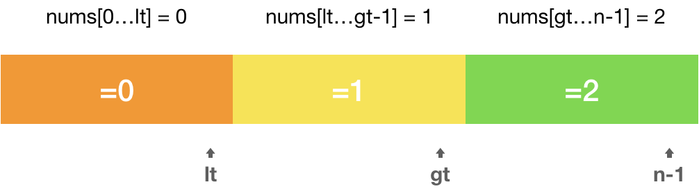
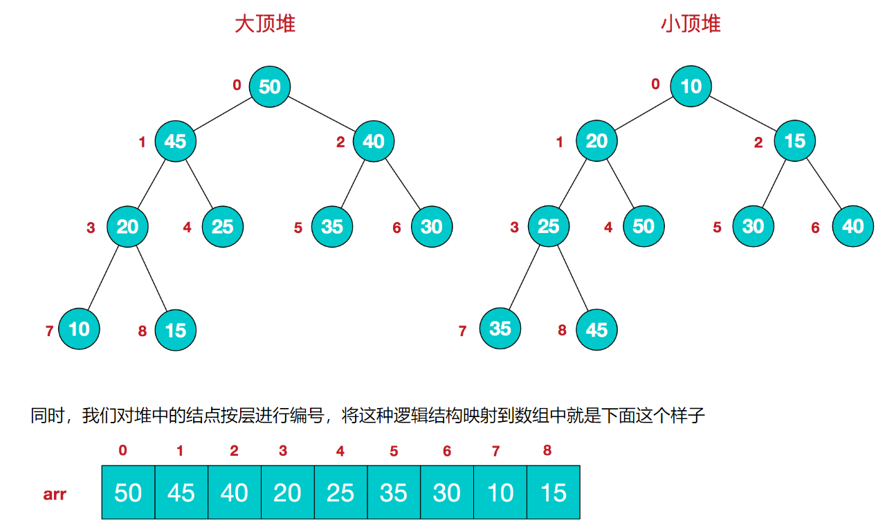
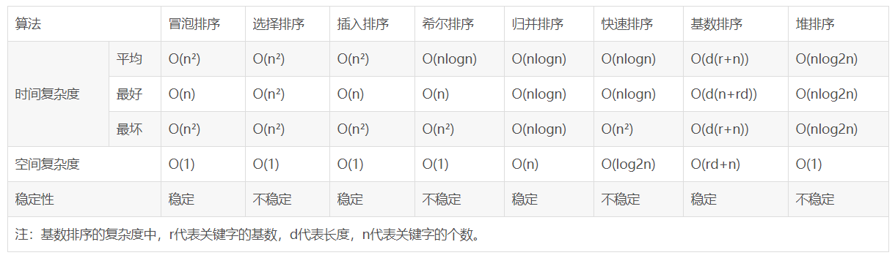

# 1. 数组

## 1.1 移动数组元素

### 旋转数组

给定一个数组，将数组中的元素向右移动 k 个位置，其中 k 是非负数。

**示例 1:**

```
输入: [1,2,3,4,5,6,7] 和 k = 3
输出: [5,6,7,1,2,3,4]
解释:
向右旋转 1 步: [7,1,2,3,4,5,6]
向右旋转 2 步: [6,7,1,2,3,4,5]
向右旋转 3 步: [5,6,7,1,2,3,4]
```


**示例 2:**

```
输入: [-1,-100,3,99] 和 k = 2
输出: [3,99,-1,-100]
解释: 
向右旋转 1 步: [99,-1,-100,3]
向右旋转 2 步: [3,99,-1,-100]
```

**说明:**

尽可能想出更多的解决方案，至少有三种不同的方法可以解决这个问题。
**要求使用空间复杂度为 O(1) 的 原地 算法**。

解题思路：使用环形替换，最终所有的数值都移动了一次

```
nums: [1, 2, 3, 4, 5, 6]
k: 2
```


```java
class Solution {
    public void rotate(int[] nums, int k) {
        if (k < 1 || nums == null || nums.length < 2) return;

        int count = 0;
        for (int start = 0; count < nums.length; start++){
            int current = start;
            int pre = nums[start];
            
            do {
                int next = (current + k) % nums.length;
                int temp = nums[next];
                nums[next] = pre;
                pre = temp;
                current = next;
                count++;
            }while (start != current);
        }
    }
}
```

### 移动零

给定一个数组 `nums`，编写一个函数将所有 `0` 移动到数组的末尾，同时保持非零元素的相对顺序。

**示例:**

```
输入: [0,1,0,3,12]
输出: [1,3,12,0,0]
```

**说明**:

1. 必须在原数组上操作，不能拷贝额外的数组。
2. 尽量减少操作次数。

> 解题思路：扫描数组内所有非零的元素，将其逐个添加到数组前列，数组空余的部分直接用零填充。

```java
public static void moveZeroes(int[] nums) {

    if (nums == null || nums.length == 0) {
        throw new NullPointerException();
    }

    int idx = 0;	// 记录数组索引下标

    // 将所有非零值插入到数组前列
    for (int i = 0; i < nums.length; i++) {
        if (nums[i] != 0) {
            nums[idx++] = nums[i];
        }
    }

    // 将idx索引后的空间全部置零
    for (int i = idx; i < nums.length; i++) {
        nums[i] = 0;
    }
}
```

### 移除元素

给你一个数组 *nums* 和一个值 *val*，你需要原地移除所有数值等于 *val* 的元素，并返回移除后数组的新长度。

不要使用额外的数组空间，你必须仅使用 O(1) 额外空间并**原地修改输入数组**。

元素的顺序可以改变。你不需要考虑数组中超出新长度后面的元素。

**示例:**

```
给定 nums = [0,1,2,2,3,0,4,2], val = 2,

函数应该返回新的长度 5, 并且 nums 中的前五个元素为 0, 1, 3, 0, 4。

注意这五个元素可为任意顺序。

你不需要考虑数组中超出新长度后面的元素。
```

> 解题思想：同移动零，只需当索引的值 == val 时 对数组长度减一即可

```java
public static int removeElement(int[] nums, int val) {

    int idx = 0;
    int size = nums.length;

    for (int i = 0; i < nums.length; i++) {
        if (nums[i] != val) {
            nums[idx++] = nums[i];
        } else {
            size--;
        }
    }
    return size;
}
```

### 删除排序数组中的重复项

给定一个排序数组，你需要在原地删除重复出现的元素，使得每个元素只出现一次，返回移除后数组的新长度。

不要使用额外的数组空间，你必须在**原地修改输入数组**并在使用 O(1) 额外空间的条件下完成。

 **示例 1:**

```
给定数组 nums = [1,1,2], 

函数应该返回新的长度 2, 并且原数组 nums 的前两个元素被修改为 1, 2。 

你不需要考虑数组中超出新长度后面的元素。
```

**示例 2:**

```
给定 nums = [0,0,1,1,1,2,2,3,3,4],

函数应该返回新的长度 5, 并且原数组 nums 的前五个元素被修改为 0, 1, 2, 3, 4。

你不需要考虑数组中超出新长度后面的元素。
```

> 解题思路：使用索引idx指向当前元素，遍历整个数组，遇到 nums[idx] != nums[i] 的元素时，将 nums[i] 赋值于num[++idx]

```java
public int removeDuplicates(int[] nums) {

    int idx = 0;
    for (int i = 0; i < nums.length; i++) {
        
        if (nums[idx] != nums[i]) {
            nums[++idx] = nums[i];
        }
    }
    return idx + 1; // 返回当前索引值+1
}
```

### 删除排序数组中的重复项 II

给定一个排序数组，你需要在原地删除重复出现的元素，**使得每个元素最多出现两次**，返回移除后数组的新长度。

不要使用额外的数组空间，你必须在**原地修改输入数组**并在使用 O(1) 额外空间的条件下完成。

**示例 1:**

```
给定 nums = [1,1,1,2,2,3],

函数应返回新长度 length = 5, 并且原数组的前五个元素被修改为 1, 1, 2, 2, 3 。

你不需要考虑数组中超出新长度后面的元素。
```

**示例 2:**

```
给定 nums = [0,0,1,1,1,1,2,3,3],

函数应返回新长度 length = 7, 并且原数组的前五个元素被修改为 0, 0, 1, 1, 2, 3, 3 。

你不需要考虑数组中超出新长度后面的元素。
```

> 解题思路：当前索引从2开始，默认前两个数值相同，比较`nums[idx-2] != nums[i]`，若不相同，则 `nums[idx++] = nums[i]` （将当前值赋值给 idx 的下一个索引）

```java
public int removeDuplicates(int[] nums) {

    if(nums.length == 0) return 0;

    int idx = 2;

    for (int i = 2; i < nums.length; i++) {
        if (nums[idx-2] != nums[i]) {
            nums[idx++] = nums[i];
        }
    }
    return idx;
}
```

## 1.2 数组排序

### 颜色分类

给定一个包含红色、白色和蓝色，一共 *n* 个元素的数组，**[原地](https://baike.baidu.com/item/原地算法)**对它们进行排序，使得相同颜色的元素相邻，并按照红色、白色、蓝色顺序排列。

此题中，我们使用整数 0、 1 和 2 分别表示红色、白色和蓝色。

**注意:**
不能使用代码库中的排序函数来解决这道题。

**示例:**

```
输入: [2,0,2,1,1,0]
输出: [0,0,1,1,2,2]
```

> 三路快速排序方法
>
> 设置三个 lt, gt, i 定义：nums[0...lt] == 0，nums[lt+1...i-1] = 1，nums[gt...n-1] == 2，遍历一遍改数列保持这个定义



```java
public static void sortColors(int[] nums) {

    int start = -1;
    int i = 0;
    int end = nums.length;

    while (i < end){
        if (nums[i] == 0){
            start++;
            swap(nums,i,start);
            i++;
        }else if (nums[i] == 2){
            end--;
            // 将最后的值与当前 i 索引的值交换， 
            // 并在下次循环中判断交换后 索引i 的值，此时i索引的值大小未知（因此索引i不前进）
            swap(nums,i,end);   
        }else {
            // 只要将0和2换到固定位置，则1也会被换到固定位置，只需进行 前进索引 i
            i++;    
        }
    }
}
```

###  合并两个有序数组

给你两个有序整数数组 *nums1* 和 *nums2*，请你将 *nums2* 合并到 *nums1* 中*，*使 *nums1* 成为一个有序数组。

**说明:**

- 初始化 *nums1* 和 *nums2* 的元素数量分别为 *m* 和 *n* 。
- 你可以假设 *nums1* 有足够的空间（空间大小大于或等于 *m + n*）来保存 *nums2* 中的元素。

**示例:**

```
输入:
nums1 = [1,2,3,0,0,0], m = 3
nums2 = [2,5,6],       n = 3

输出: [1,2,2,3,5,6]
```

> 解题思路：使用尾插法 O(N)
>
> 因为两个有序数组末尾的值都是最大的，仅需比较两个数组的末尾值，选择大的插入到nums1尾部中，然后更新两个数组的索引位置

```java
class Solution {
    public void merge(int[] nums1, int m, int[] nums2, int n) {
        
        int idx = m + n - 1;
        int i = m - 1;
        int j = n - 1;

        while (i >= 0 && j >= 0){
            nums1[idx] = nums1[i] > nums2[j] ? nums1[i--] : nums2[j--];
            idx -= 1;
        }

        // 当 nums1 数组的值全部就位后，将nums2 的值全部赋值给 num1
        while (j >= 0) {
            nums1[idx--] = nums2[j--];
        }
    }
}
```

## 1.3 数组双索引技巧

### 两数之和 II - 输入有序数组

给定一个已按照***升序排列\*** 的有序数组，找到两个数使得它们相加之和等于目标数。

函数应该返回这两个下标值 index1 和 index2，其中 index1 必须小于 index2*。*

**说明:**

- 返回的下标值（index1 和 index2）不是从零开始的。
- 你可以假设每个输入只对应唯一的答案，而且你不可以重复使用相同的元素。

**示例:**

```
输入: numbers = [2, 7, 11, 15], target = 9
输出: [1,2]
解释: 2 与 7 之和等于目标数 9 。因此 index1 = 1, index2 = 2 。
```

> 解题思路：使用双指针遍历数组 O(N)
>
> 使用front和tail指针，遍历数组，如果**当前索引值之和大于target**，则 `tail--`；否则 `front++`

```java
public static int[] twoSum(int[] numbers, int target) {

    int[] tmp = new int[2];

    int i = 0;
    int j = numbers.length - 1;

    while (i < j){

        if (numbers[i] + numbers[j] == target){
            tmp[0] = i+1;
            tmp[1] = j+1;
            return tmp;
        }

        if (numbers[i] + numbers[j] > target){
            j--;
        }else {
            i++;
        }
    }
    return tmp;
}
```

###  验证回文串

给定一个字符串，验证它是否是回文串，只考虑字母和数字字符，可以忽略字母的大小写。

**说明：**本题中，我们将空字符串定义为有效的回文串。

**示例 1:**

```
输入: "A man, a plan, a canal: Panama"
输出: true
```

**示例 2:**

```
输入: "race a car"
输出: false
```

> 解题思想：
>
> ​	1、将字符串转换为有效字符数组
>
> ​	2、使用双索引指针判断两头元素是否相等

```java
class Solution {
    public boolean isPalindrome(String s) {
                
        // 将字符串转为有效的字符数组
        char[] newChars = formatToCharacterArray(s);
        
        // "" -> true; "a" -> true
        if (newChars.length == 0) {
            return true;
        }

        int left = 0;
        int right = newChars.length - 1;

        // 使用双指针front 和 tail 分别探测索引值是否相等
        while (left < right) {
            if (newChars[left] == newChars[right]) {
                left++;
                right--;
            } else {
                break;
            }
        }
        if (newChars[left] == newChars[right]) {
            return true;
        }
        return false;
    }

    private char[] formatToCharacterArray(String s){

        // 将字符串转化为字符数组
        char[] chars = s.toCharArray();

        // 计算字符数组除过特殊符号外的大小
        int count = 0;
        for (int i = 0; i < chars.length; i++) {
            if ((chars[i] >= 65 && chars[i] <= 90) || (chars[i] >= 97 && chars[i] <= 122)) {
                ++count;
            } else if ((chars[i] >= 48 && chars[i] <= 57)) {
                ++count;
            }
        }

        char[] newChars = new char[count];
        int i = 0;
        // 将大写字符转为小写
        for (int k = 0; k < chars.length; k++) {
            if (chars[k] >= 48 && chars[k] <= 57) {  // 判断当前字符是否为数字 0 - 9
                newChars[i++] = chars[k];
            }
            if (chars[k] >= 65 && chars[k] <= 90) {  // 判断当前字符是否为数字 A - Z
                newChars[i++] = (char) (chars[k] + 32); // 将大写转小写
            }
            if (chars[k] >= 97 && chars[k] <= 122) {  // 判断当前字符是否为数字 a - z
                newChars[i++] = chars[k];
            }
        }
        return newChars;
    }
}
```

###  反转字符串中的元音字母

编写一个函数，以字符串作为输入，反转该字符串中的元音字母。

**示例 1:**

```
输入: "hello"
输出: "holle"
```

**示例 2:**

```
输入: "leetcode"
输出: "leotcede"
```

**说明:**
元音字母不包含字母"y"。

```java
class Solution {
    public String reverseVowels(String s) {

    if (s == "" || s == null)
            return s;

        int i = 0, j = s.length() - 1;

        char[] str = s.toCharArray();

        while (i < j) {
            while (i < j && !judgeVowel(str[i]))    // 当前字符非元音字符则 右指针++;
                i++;
            while (i < j && !judgeVowel(str[j]))    // 当前字符非元音字符则 左指针--;
                j--;
            if (i < j) {                            // 交换两个字符
                char temp = str[i];
                str[i] = str[j];
                str[j] = temp;
                i++;
                j--;
            }
        }
        return new String(str);
    }
    
    /**
     * @Description: 判断当前字符是否为元音字符
     * @Param:
     * @return: 
     */
    public boolean judgeVowel(char c){
        return c == 'a' || c == 'e' || c == 'i' || c == 'o' || c == 'u' ||
                c == 'A' || c == 'E' || c == 'I' || c == 'O' || c == 'U';
    }
}
```

### 盛最多水的容器

给你 *n* 个非负整数 *a*1，*a*2，...，*a*n，每个数代表坐标中的一个点 (*i*, *ai*) 。在坐标内画 *n* 条垂直线，垂直线 *i* 的两个端点分别为 (*i*, *ai*) 和 (*i*, 0)。找出其中的两条线，使得它们与 *x* 轴共同构成的容器可以容纳最多的水。

**说明：**你不能倾斜容器，且 *n* 的值至少为 2。


**示例：**

```
输入：[1,8,6,2,5,4,8,3,7]
输出：49
```

> 解题思路：
>
> ​	1、使用双索引指针，遍历整个数组
>
> ​	2、以最低的索引值为高，计算当前的容器大小
>
> ​	3、使用maxArea保存最大的容器大小

```java
class Solution {
    public int maxArea(int[] height) {
        
        if (height.length == 0) {
            return 0;
        }

        int front = 0;
        int tail = height.length - 1;
        int maxArea = 0;
        int h = 0;

        while (front < tail) {

            int width = tail - front;   // 当前宽度
            if (height[front] < height[tail]) { // 左右索引对比，以最低的索引为 高
                h = height[front];
                front++;
            } else {
                h = height[tail];
                tail--;
            }

            maxArea = Math.max(maxArea, width * h); // 记录最高的面积
        }
        return maxArea;

    }
}
```

### 最长不含重复字符的子字符串

请从字符串中找出一个最长的不包含重复字符的子字符串，计算该最长子字符串的长度。

**示例 1:**

```
输入: "abcabcbb"
输出: 3 
解释: 因为无重复字符的最长子串是 "abc"，所以其长度为 3。
```

**示例 2:**

```
输入: "bbbbb"
输出: 1
解释: 因为无重复字符的最长子串是 "b"，所以其长度为 1。
```

**示例 3:**

```
输入: "pwwkew"
输出: 3
解释: 因为无重复字符的最长子串是 "wke"，所以其长度为 3。
     请注意，你的答案必须是 子串 的长度，"pwke" 是一个子序列，不是子串。
```

 提示：

- `s.length <= 40000`

[解题思路](https://leetcode-cn.com/problems/zui-chang-bu-han-zhong-fu-zi-fu-de-zi-zi-fu-chuan-lcof/solution/mian-shi-ti-48-zui-chang-bu-han-zhong-fu-zi-fu-d-9/)：本题使用双指针索引技巧+HashMap对时间复杂度进行优化

```java
class Solution {
    public int lengthOfLongestSubstring(String s) {
        Map<Character, Integer> map = new HashMap<>();

        // 初始化变量
        int i = -1; // 指向左索引字符
        int j = 0; // 指向右索引字符
        int maxLen = 0; // 记录最长字符串长度

        for (; j < s.length(); j++) {

            if (map.containsKey(s.charAt(j)))
                // 如果包含相同的字符，则更新左索引的值
                i = Math.max(i, map.get(s.charAt(j)));

            // map中不包含当前索引字符，则记录当前字符信息，并计算自字符串长度
            map.put(s.charAt(j), j);
            maxLen = Math.max(maxLen, j - i);
        }
        return maxLen;
    }
}
```

## 1.4 数组双索引——滑动窗口

### 最小子数组

给定一个含有 **n** 个正整数的数组和一个正整数 **s ，**找出该数组中满足其和 **≥ s** 的长度最小的 **连续** 子数组，并返回其长度**。**如果不存在符合条件的子数组，返回 0。

**示例：**

```
输入：s = 7, nums = [2,3,1,2,4,3]
输出：2
解释：子数组 [4,3] 是该条件下的长度最小的子数组。
```

> 解一：自己写的渣渣算法，击败了 7% 的对手，害~
>
> 使用双指针，遍历寻找和 **≥ target**的长度度最小的 **连续** 子数组

```java
class Solution {
    public int minSubArrayLen(int target, int[] nums) {
        if (nums == null || nums.length == 0) {
            return 0;
        }

        int minVal = nums.length;
        int length = 0;
        for (int i = 0; i < nums.length; i++) {
            int idx = i;
            int result = target;
            int count = 0;
            // 正好碰到目标值时直接返回 1;
            if (nums[idx] == target) {
                return minVal = 1;
            }

            // 索引当前数组 寻找 ≥ target 的长度最小的 连续 子数组
            while (result > 0 && idx < nums.length) {
                ++count;
                result = result - nums[idx++];
                // 当索引到最后一个元素时，退出循环,并且阻止idx索引越界
                if (idx == nums.length) {
                    break;
                }
            }

            // 计算索引长度
            if (result <= 0) {
                length = idx - i;
            } else if (count == nums.length && result > 0) {  // 所有数的总和小于 target
                minVal = 0;
            }

            // 当每次循环获得长度后，将该长度与上一次长度进行判断，取最短的长度
            if (length > 0) {
                minVal = Math.min(length, minVal);
            }
        }
        return minVal;
    }
}
```

**使用滑动窗口遍历数组，同时存储最小子数组的长度**

```java
public static int minSubArrayLen(int target, int[] nums) {

        if (nums == null || nums.length == 0) {
            return 0;
        }

        // 设置 最大连续 子数组长度
        int len = nums.length + 1;
        int sum = 0;
        int i = 0;
        int j = -1;
        while (i < nums.length) {

            // 若 sum < target 则 j 向后索引,并加入当前 nums[j]
            // 设置 j + 1 < nums.length 是限制最后一个值的索引
            if (sum < target && j + 1 < nums.length) {
                sum = sum + nums[++j];
            } else { // 否则 i 向后索引，并剔除当前 nums[i]
                sum = sum - nums[i++];
            }

            // 当 sum >= target 时，记录一次最小的连续子数组
            if (sum >= target) {
                len = Math.min(len, j - i + 1);
            }
        }

        // 若次条件成立，则数组内的数值的和没有满足 >= target
        if (len == nums.length + 1) return 0;

        return len;
    }
```

**网友精简版滑动窗口解法**

```java
class Solution {
    public int minSubArrayLen(int s, int[] nums) {
        int i = 0;
        int sum = 0;
        int len = 0;
        for (int j = 0; j < nums.length; j++) {
            sum += nums[j];
            while (sum >= s) {
                len = len == 0 ? j - i + 1 : Math.min(len, j - i + 1);
                sum -= nums[i++];
            }
        }
        return len;
    }
}
```

### 滑动窗口的最大值

给定一个数组 nums 和滑动窗口的大小 k，请找出所有滑动窗口里的最大值。

**示例:**

```
输入: nums = [1,3,-1,-3,5,3,6,7], 和 k = 3
输出: [3,3,5,5,6,7] 
```

**解释:** 

```json
  滑动窗口的位置                最大值
[1  3  -1] -3  5  3  6  7       3
 1 [3  -1  -3] 5  3  6  7       3
 1  3 [-1  -3  5] 3  6  7       5
 1  3  -1 [-3  5  3] 6  7       5
 1  3  -1  -3 [5  3  6] 7       6
 1  3  -1  -3  5 [3  6  7]      7
```


提示：你可以假设 k 总是有效的，在输入数组不为空的情况下，1 ≤ k ≤ 输入数组的大小

```java
/**
 * 执行用时：41 ms, 在所有 Java 提交中击败了12.70%的用户
 * 内存消耗：47.1 MB, 在所有 Java 提交中击败了55.22%的用户
 */
class Solution {
    public int[] maxSlidingWindow(int[] nums, int k) {
        if(nums == null || nums.length == 0) return new int[]{};
        // 设置首尾指针，固定滑动窗口
        int front = 0, tail = k - 1;
        // 初始化返回数组
        int[] res = new int[nums.length - k + 1];
        int idx = 0;
        // 当tail指针遍历到数组尾部时结束
        while (tail < nums.length) {
            // 在窗口内获取最大值
            int max = searchMaxNum(front, tail, nums);
            res[idx++] = max;
            tail++;
            front++;
        }
        return res;
    }

    private int searchMaxNum(int front, int tail, int[] nums) {
        int max = nums[front];
        while (front <= tail) {
            max = Math.max(max, nums[front++]);
        }
        return max;
    }
}
```

解法二：

使用双端队列保存滑动窗口内的`最大值的下标`（保存下标的原因：判断最大值是否还在滑动窗口的范围内）。

初始化双端队列保存**第一个滑动窗口**的最大值下标，然后依次从k开始遍历整个数组。

依次判断队尾索引的数值和当前索引的数值大小，如果队尾索引数值小于当前索引数值，则依次将队尾索引出队。

判断当前最大值的下标是否还在滑动窗口内：`maxIndex >= 当前索引下标 - 窗口大小`

当前索引的数字小于队尾下标对应的数值时，将其下标加入队列，因为它可能是下一个窗口的最大值下标

```java
/**
 * 执行用时：42 ms, 在所有 Java 提交中击败了16.70%的用户
 * 内存消耗：51.1 MB, 在所有 Java 提交中击败了52.22%的用户
 */
class Solution {
    public int[] maxSlidingWindow(int[] nums, int k) {
        Deque<Integer> deque = new LinkedList<>();
        int[] res = new int[nums.length - k + 1];
        int idx = 0;
        if (nums.length >= k && k >= 1){

            // 先遍历前k个数值，将第一个滑动窗口内的最大值的下标保存到队列中
            for (int i = 0; i < k; i++){
                while (!deque.isEmpty() && nums[i] >= nums[deque.peekLast()]){
                    deque.pollLast();
                }
                deque.addLast(i);
            }
            res[idx++] = nums[deque.peekFirst()];
            // 在滑动窗口中寻找最大值和可能成为下一个窗口的最大值的下标
            for (int i = k; i < nums.length; i++){

                // 如果队尾的索引值小于当前索引值，则依次将队尾元素出队
                while (!deque.isEmpty() && nums[i] >= nums[deque.peekLast()])
                    deque.pollLast();

                // 判断队列中最大值的索引是否还在滑动窗口范围内
                if (!deque.isEmpty() && deque.peekFirst() <= i - k)
                    deque.pollFirst();

                // 将当前索引加入队尾
                deque.addLast(i);
                res[idx++] = nums[deque.peekFirst()];
            }
        }
        return res;
    }
}
```

## 1.5 二维数组

### 顺时针打印数组（打印螺旋数组）


输入一个矩阵，按照从外向里以顺时针的顺序依次打印出每一个数字。

**示例 1：**

```
输入：matrix = [[1,2,3],[4,5,6],[7,8,9]]
输出：[1,2,3,6,9,8,7,4,5]
```

**示例 2：**

```
输入：matrix = [[1,2,3,4],[5,6,7,8],[9,10,11,12]]
输出：[1,2,3,4,8,12,11,10,9,5,6,7]
```

**限制：**

- `0 <= matrix.length <= 100`
- `0 <= matrix[i].length <= 100`


```java
public int[] spiralOrder(int[][] matrix) {

    if (matrix == null || matrix.length == 0) {
        return new int[0];
    }

    int rows = matrix.length;
    int cols = matrix[0].length;

    int[] arr = new int[rows * cols];

    // 不管是几乘几的矩阵，每一圈对应的左上角的坐标符合：总列数>每一列*2&&总行数>每一行*2
    int start = 0;
    int count = 0;

    /**
         * 保存每一圈的数值
         */
    while (cols > start * 2 && rows > start * 2) {

        // 根据cols rows start确定每圈的末尾行和列
        // cols - 1 是因为 数组下标是从0开始，假如cols = 5，则下标为用 0-4保存数据，rows同理
        int endCol = cols - 1 - start;
        int endRow = rows - 1 - start;

        // 从左到右保存
        for (int i = start; i <= endCol; i++){
            arr[count++] = matrix[start][i];
        }

        // 从上至下保存:考虑到二维数组只有一行的情况下，从上至下需要判断是否越界
        if (start < endRow){
            for (int i = start + 1; i <= endRow; i++){
                arr[count++] = matrix[i][endCol];
            }
        }

        // 从右至左保存，考虑到只有一列和一行的情况下：因此需要对列和行进行约束
        if (start < endCol && start < endRow){
            for (int i = endCol-1; i >= start; i--){
                arr[count++] = matrix[endRow][i];
            }
        }

        // 从下至上保存,考虑到只有一列和两行的情况，因为从上之下，从左至右已经把所有的数据保存完毕了
        if (start < endCol && start < endRow - 1){
            for (int i = endRow -1; i >= start + 1; i--){
                arr[count++] = matrix[i][start];
            }
        }

        start++; // start++ 进行下一圈数据的遍历
    }
    return arr;
}
```

# 2. 查找

## 2.1 二分查找

给定一个 `n` 个元素有序的（升序）整型数组 `nums` 和一个目标值 `target` ，写一个函数搜索 `nums` 中的 `target`，如果目标值存在返回下标，否则返回 `-1`。

**示例 1:**

```
输入: nums = [-1,0,3,5,9,12], target = 9
输出: 4
解释: 9 出现在 nums 中并且下标为 4
```

> - 初始条件：`start = 0, end = length-1`
> - 终止：`start > end`
> - 向左查找：`end = mid-1`
> - 向右查找：`start = mid+1`

```java
public int search(int[] nums, int target) {
        
    if (nums == null ||nums.length == 0) {
        return -1;
    }

    int start = 0;
    int end = nums.length -1;

    while (start <= end) {
		
        // mid = (end + start ) / 2
        int mid = (end - start) / 2 + start;

        if (nums[mid] < target) {
            start = mid + 1;
        } else if (nums[mid] > target) {
            end = mid - 1;
        } else if (nums[mid] == target) {
            return mid;
        }
    }
    return -1;
}
```

## 2.2 搜索插入位置

给定一个排序数组和一个目标值，在数组中找到目标值，并返回其索引。如果目标值不存在于数组中，返回它将会被按顺序插入的位置。

你可以假设数组中无重复元素。

**示例 1:**

```
输入: [1,3,5,6], 5
输出: 2
示例 2:

输入: [1,3,5,6], 2
输出: 1
示例 3:

输入: [1,3,5,6], 7
输出: 4
示例 4:

输入: [1,3,5,6], 0
输出: 0
```

解题思路：可以使用二分查找在有序数组内寻找target，可能会遇到如下情况

1. 寻找的target在数组内存在；
2. target在数组内不存在，但是 nums[0] < target < nums[len-1]；
3. target在数组内不存在，此时 target < num[0] ；
4. target在数组内不存在，此时 target > nums[len-1]；

```java
class Solution {
    public int searchInsert(int[] nums, int target) {
        int left = 0, right = nums.length - 1;

        int mid = (left + right) / 2;

        while (left <= right) {
            
            // 解决问题1
            if (target == nums[mid]) return mid;

            if (target > nums[mid]) left = mid + 1;
            else if (target < nums[mid]) right = mid - 1;
            
            mid = (left + right) / 2;
        }
        
        // 解决问题2
        if (left > right && left != 0) return right + 1;
        // 解决问题3
        else if (left == 0) return 0;
        // 解决问题4
        else return nums.length;
    }
}
```


# 3. 排序

## 3.1 插入排序

> 核心思想：假设当前集合是有序集合(默认第一个元素为有序集合)，
>
> 从第二个元素开始，向前遍历当前元素与前一个元素的大小，并进行交换(不断重复该步骤)
>
> 时间复杂度：`O(N^2)`，`最坏时间复杂度：O(N^2)`
>
> `空间复杂度：O(1)`


```java
/**
 * @Description: 插入排序
 * @Param: arr
 * @return: void
 */
public static void insertionSort(int[] arr) {

    for (int i = 1; i < arr.length; i++) { // 从第二个元素开始

        int j = i;  // 记录当前元素位置

        // 从 i 处 向前索引并判断arr[j-1] 与 arr[j] 的大小
        while (j > 0 && arr[j - 1] > arr[j]) {
            swap(arr, j - 1, j);    // 当前一个元素大于后一个元素时，进行交换
            --j;
        }
    }
}

/**
 * @Description: 交换元素
 * @Param: arr 数组
 * @Param: i，j数组下标
 * @return: void
 */
public static void swap(int[] arr, int i, int j) {

    int temp = arr[i];
    arr[i] = arr[j];
    arr[j] = temp;
}
```

> 简单插入排序在最好情况下，需要比较n-1次，无需交换元素，时间复杂度为O(n);在最坏情况下，时间复杂度依然为O(N^2)

## 3.2 希尔排序

> 核心思想：将待排序的集合进行分组，分别为 length/2、length/4 …… length/n =1为止
>
> 时间复杂度：`O( NlogN ) - O(N^2)`
>
> 空间复杂度：`O(1)`


```java
public static <T extends Comparable<? super T>> void shellSort(T[] arr) {

    int j;

    // 对数组进行分组
    for (int gap = arr.length / 2; gap > 0; gap /= 2) {

        // 从当前gap值开始索引，至整个数组大小结束
        for (int i = gap; i < arr.length; i++) {
			
            // 记录当前索引值
            T tmp = arr[i];

            for (j = i; j >= gap && tmp.compareTo(arr[j - gap]) < 0; j -= gap) {
                // 若当前值 arr[j] < arr[j-gap],则进行赋值，并且向前回溯，直到arr[j] > arr[j-gap]
                arr[j] = arr[j - gap];
            }

            // 此时 j 为最小值所在的位置，则将 tmp 赋值给 arr[j]
            arr[j] = tmp;
        }
    }
}
```

## 3.3 堆排序

> 主要思想：
>
> 算法时间复杂度`O(NlogN)`
>
> ​	1、将无需序列构建成一个堆，根据升序降序需求选择**大顶堆或小顶堆**
>
> ​	2、将**堆顶元素与末尾元素交换**，将`最大元素"沉"到数组末端`，同时接着**重新调整堆的结构**
>
> ​	3、继续交换堆顶元素与当前末尾元素，**反复执行调整+交换步骤**，直到整个序列有序

[本文参考地址]: https://www.cnblogs.com/chengxiao/p/6129630.html

每个结点的值都`大于或等于其左右孩子结点`的值，称为**大顶堆**；或者每个结点的值都`小于或等于`其左右孩子结点的值，称为**小顶堆**



该数组从逻辑上讲就是一个堆结构，我们用简单的公式来描述一下堆的定义就是：

**大顶堆：arr[i] >= arr[2i+1] && arr[i] >= arr[2i+2]**  

**小顶堆：arr[i] <= arr[2i+1] && arr[i] <= arr[2i+2]**  

**二叉树相关知识：**

​		**第一个非叶子节点 m = arr.length / 2 -1**

​		**第一个非叶子节点的左孩子节点 n = 2 * m + 1**

```java
package com.jason.sort;

/**
 * @Authot CodeDuck
 * @Date 2020/7/17-13:20
 */
public class HeapSort {

    public static void main(String[] args) {
        int[] arr = {11, 7, 18, 3, 5, 4, 10, 9};
        sort(arr);
        for (int a : arr) {
            System.out.println(a);
        }
    }

    /**
     * @Description: 堆排序
     * @Param: arr数组
     * @return: void
     */
    public static void sort(int[] arr) {

        // 1、构建大顶堆
        for (int i = arr.length / 2 - 1; i >= 0; i--) {
            // 从第一个非叶子结点从下至上，从右至左调整结构
            adjustHeap(arr, i, arr.length);
        }

        // 2、调整堆结构+交换堆顶元素与末尾元素
        for (int i = arr.length - 1; i > 0; i--) {
            swap(arr, 0, i);
            adjustHeap(arr, 0, i);
        }
    }

    /**
     * @Description: 调整为大顶堆
     * @Param: arr数组
     * @Param: i 所要调整的节点
     * @Param: length：数组长度
     * @return: void
     */
    public static void adjustHeap(int[] arr, int i, int length) {

        int temp = arr[i]; // 获取当前交换的节点val
        for (int k = 2 * i + 1; k < length; k = 2 * k + 1) { // 获取当前节点的左孩子节点

            // 若左孩子节点小于右孩子节点，k指向右孩子节点
            if (k + 1 < length && arr[k] < arr[k + 1]) { 
                k++;
            }

            if (arr[k] > temp) {  // 如果当前孩子节点大于父节点
                arr[i] = arr[k];  // 将父节点的值 赋值于 被交换孩子节点
                i = k;            // 将 i 指向被交换孩子节点
            } else {
                break;
            }
        }
        arr[i] = temp; // 将temp赋值于被交换孩子节点
    }


    /**
     * @Description: 交换元素
     * @Param: arr 元素组
     * @Param: i，j数组下标
     * @return: void
     */
    public static void swap(int[] arr, int i, int j) {

        int temp = arr[i];
        arr[i] = arr[j];
        arr[j] = temp;
    }
}
```

> 堆排序是一种选择排序，整体主要由构建初始堆+交换堆顶元素和末尾元素并重建堆两部分组成。
>
> 建立N个元素的二叉堆花费时间：O(n)
>
> 在交换并重建堆的过程中，需交换n-1次，而重建堆的过程中，根据完全二叉树的性质，[log2(n-1),log2(n-2)...1]逐步递减，近似为`O(NlogN)`
>
> 因此，堆排序在面对最好和最坏的情况下都是稳定的

## 3.4 归并排序

[本文参考](https://www.cnblogs.com/chengxiao/p/6194356.html)

> 主要思想：将集合不断拆分，排序并合并的过程
>
> `时间复杂度稳定O（NlogN）`


```java
package com.jason.sort;

/**
 * @program: LeetCode
 * @description: 归并排序
 * @author: CodeDuck
 * @create: 2020-07-17 17:25
 **/
public class MergeSort {

    public static void main(String[] args) {
        Integer[] arr = {11, 7, 18, 3, 5, 4, 10, 9};
        mergeSort(arr);
        for (Integer a : arr) {
            System.out.println(a);
        }
    }


    // 类型 T 必须实现 Comparable 接口，并且这个接口的类型是 T 或 T 的任一父类,T 的实例和它的父类的实例之间，可以相互比较大小
    public static <T extends Comparable<? super T>> void mergeSort(T[] arr) {

        // 在排序前，先建好一个长度等于原数组长度的临时数组，避免递归中频繁开辟空间
        T[] tmpArr = (T[]) new Comparable[arr.length];

        mergeSort(arr, tmpArr, 0, arr.length - 1);
    }

    // 实现 拆分操作(从左至右进行拆分)
    private static <T extends Comparable<? super T>> void mergeSort(T[] arr, T[] tmpArr, int left, int right) {

        if (left < right) {
            int mid = (left + right) / 2;
            mergeSort(arr, tmpArr, left, mid);          // 左边归并排序，使得左子序列有序
            mergeSort(arr, tmpArr, mid + 1, right);  	// 右边归并排序，使得右子序列有序
            merge(arr, tmpArr, left, mid, right);       // 将两个有序子数组合并操作
        }
    }

    private static <T extends Comparable<? super T>> void merge(T[] arr, T[] tmpArr, int left, int mid, int right) {

        int i = left;    // 左序列指针
        int j = mid + 1; // 右序列指针
        int t = 0;       // 临时数组指针

        while (i <= mid && j <= right) {
            if (arr[i].compareTo(arr[j]) <= 0) {
                tmpArr[t++] = arr[i++];
            } else {
                tmpArr[t++] = arr[j++];
            }
        }
        while (i <= mid) { // 将左边剩余元素填充进tmpArr中
            tmpArr[t++] = arr[i++];
        }
        while (j <= right) { // 将右序列剩余元素填充进tmpArr中
            tmpArr[t++] = arr[j++];
        }

        t = 0;
        
        // 将tmpArr中的元素全部拷贝到原数组中
        while (left <= right) {
            arr[left++] = tmpArr[t++];
        }
    }
}
```

## 3.5 快速排序

> 核心思想：
>
> 1、选取一个左边第一个元素为基数，从两头遍历集合( i、j 分别从两端索引)
>
> 2、i 索引大于 基数的 值，j  索引小于 基数的值 （j 先索引，然后 i 索引，当遇到符合的条件时停止索引）
>
> 3、交换两个索引的数值，然后继续索引
>
> 4、当 i 与 j 相遇时 结束当前索引
>
> 5、将基数所在位置与 i，j 所索引位置的值进行交换
>
> 6、递归调用两端的集合
>
> 快速排序的`时间复杂度为O(NlogN)`，
>
> 空间复杂度为`O(logN)`

```java
package com.jason.sort;

/**
 * @program: LeetCode
 * @description: 快速排序
 * @author: CodeDuck
 * @create: 2020-07-17 20:23
 **/
public class QuickSort {

    public static void main(String[] args) {
        int[] arr = {6, 7, 18, 3, 5, 4, 10, 9};
        quickSort(arr);
        for (int a : arr) {
            System.out.println(a);
        }
    }

    public static void quickSort(int[] arr) {
        quickSort(arr, 0, arr.length - 1);
    }

    /**
     * @Description: 快速排序
     * @Param: int[] 数组
     */
    private static void quickSort(int[] arr, int left, int right) {

        if (left >= right) {    // 当满足条件时结束当前递归
            return;
        }

        int i = left;   // 左索引
        int j = right;  // 右索引

        // 从数组的最左端开始，选取基准数
        int baseNum = arr[left];

        // 关于为什么是 右边的 J 先走问题
        // 此排序为升序排序，如果 I 先走，走到最后与J相遇是主动跑到J位置上
        // 此时的数是大于基数的，不能将此数同基数交换
        while (i < j) {
            while (arr[j] >= baseNum && i < j) {    // 从右至左选择小于基数的数
                j--;
            }
            while (arr[i] <= baseNum && i < j) {    // 从左至右选择大于基数的数
                i++;
            }

            if (i < j) {
                swap(arr, i, j);                    // 交换两个数值
            }
        }

        arr[left] = arr[i];                         // 将当前i与j相遇的值与技术交换
        arr[i] = baseNum;

        quickSort(arr, left, i - 1);            // 递归调用基数左边的集合
        quickSort(arr, i + 1, right);            // 递归调用基数右边的集合

    }

    /**
     * @Description: 交换元素
     * @Param: arr 元素组
     * @Param: i，j数组下标
     * @return: void
     */
    private static void swap(int[] arr, int i, int j) {

        int temp = arr[i];
        arr[i] = arr[j];
        arr[j] = temp;
    }
}
```

## 3.6 各项算法复杂度总结



# 4. 链表

## 4.1 单链表的数据结构

```java
public class ListNode {
     int val;
     ListNode next;
     ListNode(int x) { val = x; }
}
```

## 4.2 实现单链表翻转

**算法思想**

>  1、初始化时 使用指针Front、Marker指向头结点、而Tail指针指向 Front.next
>  2、将Tail.val赋值给newNode，并将newNode插入到Front之前
>  3、插入完成后Front前移一位 指针指向newNode
>  4、Tail指针后移一位 Tail = Tail.next;
>  5、当Tail.next == null时，特殊处理

**示例:**

```
输入: 1->2->3->4->5->NULL
输出: 5->4->3->2->1->NULL
```

**算法实现**

```java
public ListNode reverseList(ListNode head) {

    ListNode frontMarker = head;
    ListNode tailMarker = head;
    ListNode marker = head;

    if (frontMarker == tailMarker) {
        tailMarker = frontMarker.next;
        frontMarker.next = tailMarker;
    }

    // 会遗漏掉tailMarker.next == null的节点
    while (tailMarker.next != null) {

        ListNode newNode = new ListNode(tailMarker.val);
        newNode.next = frontMarker;
        frontMarker = newNode;
        tailMarker = tailMarker.next;
    }

    if (tailMarker.next == null) {
        ListNode newNode = new ListNode(tailMarker.val);
        newNode.next = frontMarker;
        frontMarker = newNode;
        marker.next = null;
    }

    return frontMarker;

}
```

解法二：

仅需保存三个节点——前驱节点，当前节点，和后驱节点，

使当前节点.next指向前驱，然后当前指向后驱。

当遍历到为节点时（curNode.next == null），则应该把head指向curNode

```java
public ListNode reverseList(ListNode head) {

    ListNode curNode = head;
    ListNode preNode = null;    // preNode初始为反转链表的尾结点null

    while (curNode != null) {

        ListNode nextNode = curNode.next;   // 保存当前节点的下一个节点

        // 当遍历到尾结点时，则head节点指向curNode，然后进行最后的链接操作
        if (nextNode == null) {
            head = curNode;
        }

        curNode.next = preNode;
        preNode = curNode;
        curNode = nextNode;
        
        // 或者取消上方的 if (nextNode == null),如果当前节点为空则说明是尾结点，然后将head指向前驱节点
        /*
        if (curNode == null){
               head = preNode;
        }
        */

    }

    return head;
}
```

## 4.3 从尾到头打印链表

输入一个链表的头节点，从尾到头反过来返回每个节点的值（用数组返回）。 

**示例 1：**

```
输入：head = [1,3,2]
输出：[2,3,1]
```

解题思路：

1. 使用LinkedList模拟栈，对链表数据进行保存，然后出栈数据保存到数组中

```java
public int[] reversePrint(ListNode head) {
        
    int count = 0;
    LinkedList<Integer> list = new LinkedList<>();
    while (head != null) {
        count++;
        list.offer(head.val);
        head = head.next;
    }
    int[] nums = new int[count];
    for (int i = 0; i < count; i++) {
        nums[i] = list.pollLast();
    }

    return nums;
}
```

2. 反正都要循环遍历两遍，与其使用额外的空间结构，还不如直接遍历两遍，倒序存放数据到数组中

```java
public static int[] reversePrint(ListNode head) {
    ListNode node = head;
    int count = 0;
    while (node != null) {
        ++count;
        node = node.next;
    }
    int[] nums = new int[count];
    node = head;
    for (int i = count - 1; i >= 0; --i) {
        nums[i] = node.val;
        node = node.next;
    }
    return nums;
}
```

## 4.4 删除单项链表中重复的元素

> 编写代码，移除未排序链表中的重复节点。保留最开始出现的节点。

**示例1:**

```
 输入：[1, 4, 1, 3, 2, 1]
 输出：[1, 4, 3, 2]
```

本题有两种解法：

1. 使用set集合，将所有元素保存起来，重新生成一个链表返回（单循环）

2. 没有额外的空间，需要O(N2)的时间。可以使用两个指针，其中第二个指针在第一个指针之前遍历所有元素。

   遇到相同的元素，则丢弃当前节点。当第二个指针遍历结束，第一个指针索引执行下一个节点（双重循环）

使用解法一

**注意点：**Set的底层是Map实现的，Map是根据 key（set.add(val)）计算散列码，由散列码决定存放顺序。因此整型的数据被map存放起来是有序存放的。使用LinkedHashSet()是按照add的添加顺序存放的。

```java
public static ListNode removeDuplicateNodes(ListNode head) {

    if (head == null) {
        return null;
    }

    // LinkedHashSet存放元素是按照存放顺序存放的
    // HashSet存放元素是有序存放的
    Set<Integer> set = new LinkedHashSet<>();

    ListNode curNode = head;

    while (curNode != null) {
        set.add(curNode.val);
        curNode = curNode.next;
    }

    Iterator iterator = set.iterator();

    curNode = head;
    while (iterator.hasNext()) {
        curNode.val = (int)iterator.next();
        if (!iterator.hasNext()){
            curNode.next = null;
        }else {
            curNode = curNode.next;
        }
    }
    return head;
}
```

## 4.5 删除链表中重复的元素II

给定一个排序链表，删除所有含有重复数字的节点，只保留原始链表中 没有重复出现 的数字。

```
示例 1:

输入: 1->2->3->3->4->4->5
输出: 1->2->5
```

> 删除重复的数字节点 需要两个指针preNode和curNode
>
> preNode用来指向重复节点的前一个节点  2
>
> curNode用来遍历寻找重复的节点，指向 3
>
> 删除节点 3 使得preNode.next指向4，curNode指向 4
>
> 最后preNode.next指向5，curNode指向5，此时curNode.next指向空

  ListNode preNode = null;	

前置节点设置为空是为了判断重复的节点存在链表首部，这时可以使head指向重复节点的下一个节点。

```java
public ListNode deleteDuplicates(ListNode head) {

    if (head == null) {
        return null;
    }

    // 删除重复的数字节点 需要两个指针preNode和curNode
    ListNode preNode = null;
    ListNode curNode = head;

    while (curNode != null && curNode.next != null) {

        // nextNode 记录 当前节点的下一个节点
        ListNode nextNode = curNode.next;
        boolean needDel = false;

        // curNode 探寻是否存在重复的节点
        if ((curNode != null) && (curNode.val == nextNode.val)) {
            needDel = true;
        }

        if (!needDel) {
            preNode = curNode;
            curNode = preNode.next;
        } else {
            // 记录重复节点的val
            int value = curNode.val;
            ListNode toBeDel = curNode;
            // 循环删除所有相同val的节点，返回相同节点的下一节点nextNode
            while (toBeDel != null && toBeDel.val == value) {
                nextNode = toBeDel.next;
                toBeDel = nextNode;
            }

            // 如果preNode指向null，则说明重复的节点在链表首部
            if (preNode == null) {
                head = nextNode;
            } else {
                preNode.next = nextNode;
            }
            curNode = nextNode;
        }
    }
    return head;
}
```

## 4.6 合并两个有序链表

输入两个递增排序的链表，合并这两个链表并使新链表中的节点仍然是递增排序的。

**示例1：**

```
输入：1->2->4, 1->3->4
输出：1->1->2->3->4->4
```

**限制：**

```
0 <= 链表长度 <= 1000
```

**递归实现**

解题思路：比较两个链表的头结点，选择最小的头节点返回。

```java
public ListNode mergeTwoLists(ListNode l1, ListNode l2) {

    // 如果链表1为null返回链表2，如果2为null返回1，如果都为空返回null
    if (l1 == null){
        return l2;
    }else if (l2 == null){
        return l1;
    }

    // 递归实现
    if (l1.val < l2.val){
        l1.next = mergeTwoLists(l1.next,l2);
        return l1;
    }else {
        l2.next = mergeTwoLists(l1,l2.next);
        return l2;
    }
}
```

**迭代实现**

```java
public ListNode mergeTwoLists(ListNode l1, ListNode l2) {

    ListNode head = new ListNode(8848);	// 任意设置一个头结点,用来接收一个拼接的链表
    ListNode tailNode = head;			// 指向head链表的尾结点用来接收两个链表的节点

    while (l1 != null && l2 != null) {
        if (l1.val < l2.val) {
            tailNode.next = l1;
            tailNode = tailNode.next;
            l1 = l1.next;
        } else {
            tailNode.next = l2;
            tailNode = tailNode.next;
            l2 = l2.next;
        }
    }

    if (l1 == null) {
        tailNode.next = l2;
    } else {
        tailNode.next = l1;
    }
    return head.next;
}
```

## 4.7 判断链表中是否有环

为了表示给定链表中的环，我们使用整数 pos 来表示环的入口（索引从 0 开始）。 如果 pos 是 -1，则在该链表中没有环。

 

```
示例 1：

输入：head = [3,2,0,-4], pos = 1
输出：true
解释：链表中有一个环，其尾部连接到第二个节点。
```


```
示例 2：

输入：head = [1,2], pos = 0
输出：true
解释：链表中有一个环，其尾部连接到第一个节点。
```


```
示例 3：

输入：head = [1], pos = -1
输出：false
解释：链表中没有环。
```


解题思路：解决环的问题一般使用快慢指针。快指针走两步，慢指针走一步，如果快指针追上慢指针则存在环。

```java
public boolean hasCycle(ListNode head) {
    
    if (head == null) {
        return false;
    }

    // 快慢指针的初始化有一定的技巧
    ListNode slowNode = head.next;

    if (slowNode == null) {
        return false;
    }
    ListNode fastNode = slowNode.next;

    while (fastNode != null && slowNode != null) {
        
        // 如果快指针追上慢指针则返回true
        if (fastNode == slowNode) {
            return true;
        }

        slowNode = slowNode.next;
        
        fastNode = fastNode.next;
        if (fastNode != null) {
            fastNode = fastNode.next;
        }
    }
    return false;
}
```

### 环形链表 II

给定一个链表，返回链表开始入环的第一个节点。 如果链表无环，则返回 `null`。

为了表示给定链表中的环，我们使用整数 `pos` 来表示链表尾连接到链表中的位置（索引从 0 开始）。 如果 `pos` 是 `-1`，则在该链表中没有环。

**说明：**不允许修改给定的链表。

 

```
示例 1：

输入：head = [3,2,0,-4], pos = 1
输出：tail connects to node index 1
解释：链表中有一个环，其尾部连接到第二个节点。
```


解题思路：

1. 首先判断链表是否存在环，如果存在则返回环中的节点
2. 根据返回环中的节点，遍历环中的节点，记录环中的节点数目count
3. 根据环中的节点数目，使用一个指针向head头结点，然后向后移动count位
4. 使用一个指针指向链表的head头结点，然后该指针和3中的指针同时向后移动，如果两个指针指向同一个节点，则该节点一定是环的入口节点。

```java
/**
 * 给定一个链表，返回链表开始入环的第一个节点。 如果链表无环，则返回 null。
 */
public ListNode detectCycle(ListNode head) {

    // 如果存在环则返回的节点一定环内
    ListNode node = hasCycle(head);

    if (node == null) {
        return null;
    }

    // 获取环内节点数目
    int nodeCount = 1;
    ListNode nextNode = node.next;
    while (node != nextNode) {
        nextNode = nextNode.next;
        nodeCount++;
    }

    // 使用双指针遍历链表
    ListNode tailNode = head;
    ListNode frontNode = head;

    // tail指针向后走环中节点的数目步
    for (int i = 0; i < nodeCount; i++) {
        tailNode = tailNode.next;
    }

    // 如果front指针不等于tail指针，则 两个指针同时先后移动
    // 如果两个指针指向同一个位置，则必为环的入口
    while (tailNode != frontNode) {
        tailNode = tailNode.next;
        frontNode = frontNode.next;
    }
    return frontNode;
}

/**
 *  判断链表是否存在环,如果存在环则返回的节点一定环内
 */
public ListNode hasCycle(ListNode head) {
	
    if (head == null) {
    	return null;
    }

	// 快慢指针的初始化有一定的技巧
	ListNode slowNode = head.next;

	if (slowNode == null) {
		return null;
	}
	ListNode fastNode = slowNode.next;

	while (fastNode != null && slowNode != null) {

        // 如果快指针追上慢指针则返回true
        if (fastNode == slowNode) {
        	return fastNode;
        }

        slowNode = slowNode.next;

        fastNode = fastNode.next;
        if (fastNode != null) {
            fastNode = fastNode.next;
        }
    }
    return null;
}
```

# 5. 二叉树

## 5.1 二叉树的数据结构

```java
public class TreeNode {
    int val;
    TreeNode left;
    TreeNode right;

    TreeNode(int x) {
        val = x;
    }
}
```

## 5.2 先序遍历二叉树

**算法思想**

> 使用 栈 实现二叉树的先序遍历（通过迭代的方法）
>
> 1、将当前根节点node入栈
>
> 2、当栈不为空时
>
> ​	2.1 将栈顶node节点弹出
>
> ​	2.2 当node节点的右子树不为空时入栈
>
> ​	2.3 当node节点的左子树不为空时入栈
>
> 3、循环第二个步骤

**示例:**

```
输入: [1,null,2,3]  
   1
    \
     2
    /
   3 

输出: [1,2,3]
```

```java
public List<Integer> preorderTraversal(TreeNode root) {

    ArrayList<Integer> list = new ArrayList<>();

    if (root == null){
        return list;
    }else {
        Stack<TreeNode> stack = new Stack<>();
        stack.push(root);
        while (!stack.isEmpty()){
            TreeNode node = stack.pop();
            list.add(node.val);
            if (node.right != null){
                stack.push(node.right);
            }
            if (node.left != null){
                stack.push(node.left);
            }
        }
    }
    return list;
}
```

## 5.3 中序遍历二叉树

> - 遇到一个结点，就把它压入栈，并去遍历它的左子树
> - 当左子树遍历结束后，从栈顶弹出这个结点并访问它
> - 然后按其右指针再去中序遍历该节点的右子树
>
> **PS：**中序遍历至根节点时，会将栈内所有的节点弹出（此时栈为空）、再去遍历根节点的右孩子节点的所有左孩子节点

**示例:**

```
输入: [1,null,2,3]
   1
    \
     2
    /
   3

输出: [1,3,2]
```

```java
public List<Integer> inorderTraversal(TreeNode root) {

    ArrayList<Integer> list = new ArrayList<>();
    if (root == null){
        return list;
    }

    Stack<TreeNode> stack = new Stack<>();
    while (root != null || !stack.isEmpty()){
        while (root != null){   // 将所有的左孩子节点入栈
            stack.push(root);
            root = root.left;
        }
        if (!stack.isEmpty()){  // 弹出栈顶节点并转向右孩子节点
            root = stack.pop();
            list.add(root.val);
            root = root.right;
        }
    }
    return list;
}
```

## 5.4 后序遍历二叉树

> 巧方法：类似前序遍历，不过在入栈过程中，先入左节点，后入右节点，然后将得到的元素集合反转就是后序遍历

**示例:**

```
输入: [1,null,2,3]  
   1
    \
     2
    /
   3 

输出: [3,2,1]
```

```java
public List<Integer> postorderTraversal(TreeNode root) {
    ArrayList<Integer> list = new ArrayList<>();
    if (root == null) {
        return list;
    }

    Stack<TreeNode> stack = new Stack<>();
    stack.push(root);
    while (!stack.isEmpty()) {
        TreeNode node = stack.pop();
        list.add(node.val);
        if (node.left != null) {	// 左节点入栈
            stack.push(node.left);
        }
        if (node.right != null) {	// 右节点入栈
            stack.push(node.right);
        }
    }
    Collections.reverse(list);		// 反转集合
    return list;
}
```

## 5.5 层次遍历二叉树

> 使用队列存储每一层的节点(使用双向链表模拟队列)
>
> 1、将root根节点入队
>
> 2、若队列不为空，出队当前root节点
>
> 3、判断root节点是否有左右子节点，有则入队
>
> 循环 2-3 步骤

**示例：**
二叉树：`[3,9,20,null,null,15,7]`,

```
    3
   / \
  9  20
    /  \
   15   7
```

返回其层次遍历结果：

```
[
  [3],
  [9,20],
  [15,7]
]
```

**解：**

```java
public List<List<Integer>> levelOrder(TreeNode root) {

	List<List<Integer>> result = new ArrayList<List<Integer>>();

    if (root == null) {
        return result;
    }
    LinkedList<TreeNode> queue = new LinkedList<>();
    queue.add(root);
    while (!queue.isEmpty()) {

        ArrayList<Integer> list = new ArrayList<>();
        int queueSize = queue.size(); // 获取当前层元素个数（即队列大小） 

        // 将当前层节点逐个出队，并将出队节点的子节点入队
        for (int i = 0; i < queueSize; i++) {
            
            TreeNode node = queue.poll();
            list.add(node.val);
            // 如果当前节点存在左右子节点，则子节点入队
            if (node.left != null) {
                queue.add(node.left); 
            }
            if (node.right != null) {
                queue.add(node.right);
            }
        }
        result.add(list);
    }
    return result;
}
```

## 5.6 二叉树最大深度

**示例：**
给定二叉树 `[3,9,20,null,null,15,7]`，返回它的最大深度 3 

```
    3
   / \
  9  20
    /  \
   15   7
```

> “自底向上” 是另一种递归方法。 在每个递归层次上，我们首先对所有子节点递归地调用函数，然后根据返回值和根节点本身的值得到答案

```java
class Solution {
    public int maxDepth(TreeNode root) {
        
        if(root == null){
            return 0;
        }
        
        int leftMaxDepth = maxDepth(root.left);
        int rightMaxDepth = maxDepth(root.right);

        return Math.max( leftMaxDepth, rightMaxDepth ) + 1;
    }
}
```

##  5.7 平衡二叉树

输入一棵二叉树的根节点，判断该树是不是平衡二叉树。如果某二叉树中任意节点的左右子树的深度相差不超过1，那么它就是一棵平衡二叉树。

 **示例 1:**

给定二叉树 `[3,9,20,null,null,15,7]`

```
    3
   / \
  9  20
    /  \
   15   7
```

返回 `true` 。

**示例 2:**

给定二叉树 `[1,2,2,3,3,null,null,4,4]`

```
       1
      / \
     2   2
    / \
   3   3
  / \
 4   4
```

返回 `false` 。

 **限制：**

- `1 <= 树的结点个数 <= 10000`

解题思路：基于上一题中的二叉树的最大深度记录每个节点的深度，判断每个节点的左右子树是否平衡。

平衡的条件是 `-1 <= 左子树深度 - 右子树深度 <= 1`，如果不符合平衡条件，则选择一个标志符（下述算法在不平衡的条件下返回 -1）来标记该树不平衡

```java
class Solution {
    public boolean isBalanced(TreeNode root) {
        return recur(root) != -1;
    }

    public int recur(TreeNode node){

        if(node == null) return 0;

        int left = recur(node.left);
        if(left == -1) return -1;

        int right = recur(node.right);
        if(right == -1) return -1;

        return Math.abs(left - right) < 2 ? Math.max(left, right) + 1 : -1;
    }
}
```

## 5.8 对称二叉树

> 给定一个二叉树，检查它是否是镜像对称的。
>
> 使用递归 思想判断： 
>
> 以根节点以及其左右子树，
>
> 左子树的左子树和右子树的右子树相同，左子树的右子树和右子树的左子树相同
>
> 以上两个条件都要符合
>
> 所以我们第一个传根节点的左子树和右子树，先判断左右子树根结点的比较。
>
> 然后分别对左子树的左子树和右子树的右子树，并对左子树的右子树和右子树的左子树进行判断。
>
> 只有两个条件都满足则返回的是true，一层一层递归进入，则可以得到结果。

例如，二叉树 `[1,2,2,3,4,4,3]` 是对称的。

```
    1
   / \
  2   2
 / \ / \
3  4 4  3
```

 但是下面这个 `[1,2,2,null,3,null,3]` 则不是镜像对称的:

```
    1
   / \
  2   2
   \   \
   3    3
```


```java
class Solution {
    public boolean isSymmetric(TreeNode root) {
        
        return judSymmetric(root, root);
    }

    private boolean judSymmetric(TreeNode leftNode, TreeNode rightNode) {

        if (leftNode == null && rightNode == null) {      // 若左节点为空，右节点也为空
            return true;
        }

        if (rightNode == null || leftNode ==null) {
            return false;           // 左节点不为空，右节点为空
        }

        if (leftNode.val != rightNode.val) {
            return false;
        }
        return 
            judSymmetric(leftNode.left, rightNode.right) 
            && 
            judSymmetric(leftNode.right, rightNode.left);
    }
}
```

## 5.9 二叉搜索树的后序遍历序列

输入一个整数数组，判断该数组是不是某二叉搜索树的后序遍历结果。如果是则返回 `true`，否则返回 `false`。假设输入的数组的任意两个数字都互不相同。 

参考以下这颗二叉搜索树：

```
     5
    / \
   2   6
  / \
 1   3
```

**示例 1：**

```
输入: [1,6,3,2,5]
输出: false
```

**示例 2：**

```
输入: [1,3,2,6,5]
输出: true 
```

**提示：**

1. `数组长度 <= 1000`

解题思路：排序二叉树中，经过后序遍历后，最后一个必是root根节点。

root左子树的值均小于rootVal，而右子树的值均大于rootVal。

以根节点为划分，依照这个规则递归遍历整个二叉树

```
[ 1,   3,   2,   6,   5]
第一次划分: root = 5, 左子树的root = 2, 右子树的root = 6
```

```java
class Solution {
    // 要点：二叉搜索树中根节点的值大于左子树中的任何一个节点的值，小于右子树中任何一个节点的值，子树也是
    public boolean verifyPostorder(int[] postorder) {
        if (postorder.length < 2) return true;
        return verify(postorder, 0, postorder.length - 1); 
    }

    // 递归实现
    private boolean verify(int[] postorder, int left, int right){
        if (left >= right) return true; // 当前区域不合法的时候直接返回true就好

        int rootValue = postorder[right]; // 当前树的根节点的值

        int k = left;
        while (k < right && postorder[k] < rootValue){ // 从当前区域找到第一个大于根节点的，说明后续区域数值都在右子树中
            k++;
        }

        for (int i = k; i < right; i++){ // 进行判断后续的区域是否所有的值都是大于当前的根节点，如果出现小于的值就直接返回false
            if (postorder[i] < rootValue) return false;
        }

        // 当前树没问题就检查左右子树
        if (!verify(postorder, left, k - 1)) return false; // 检查左子树

        if (!verify(postorder, k, right - 1)) return false; // 检查右子树

        return true; // 最终都没问题就返回true
    }
}
```

## 5.10 二叉树路径总和

**示例:** 
给定如下二叉树，以及目标和 `sum = 22`，

```
                              5			
                             / \
                            4   8		(左)sum = sum - 5 = 17
                           /   / \
                          11  13  4		(左)sum	= sum - 4 = 13
                         /  \      \
                        7    2      1	(左)sum = sum - 11 = 2 
```

返回 `true`, 因为存在目标和为 22 的根节点到叶子节点的路径 `5->4->11->2`。

> 使用递归，分别遍历左右子树，当左右子树中有一个路径满足条件，则返回true
>
> 递归结束条件：root.left == null && root.right == null && sum == root.val
>
> sum的值自顶向下 逐层递减 sum = sum - root.val。

```java
class Solution {
    public boolean hasPathSum(TreeNode root, int sum) {
       
        // 当前节点为空，sum 大于等于 0；例如：root = []，sum = 0、sum = 1
        if (root == null && sum >= 0) {
            return false;
        }

        // 当前节点为空，sum 小于 0；例如：root = []，sum = -1
        if (root == null && sum < 0) {
            return false;
        }

        // 当且仅当 左右孩子节点为空 且 sum = root.val 时，则找到目标
        if (root.left == null && root.right == null && sum == root.val) {
            return true;
        }

        // 遍历目标节点的左子树和右子树 ，当左右子树中有一个返回true(即找到目标) 时，则返回true；
        // sum = sum - root.val,当到达叶子节点且sum= root.val则 找到目标
        return hasPathSum(root.left, sum - root.val) || hasPathSum(root.right, sum - root.val);
    }
}
```

## 5.11 二叉树中和为某一值的路径

输入一棵二叉树和一个整数，打印出二叉树中节点值的和为输入整数的所有路径。从树的根节点开始往下一直到叶节点所经过的节点形成一条路径。

**示例:**
给定如下二叉树，以及目标和 `sum = 22`，

```
              5
             / \
            4   8
           /   / \
          11  13  4
         /  \    / \
        7    2  5   1
```

返回:

```
[
   [5,4,11,2],
   [5,8,4,5]
]
```

**提示：**

1. `节点总数 <= 10000`

解题思路：从根节点开始递归遍历，每遍历一个节点，则把当前节点入栈。

同时判断 sum == 当前节点.val（每遍历一个节点时，其sum = sum - 父节点.val）。

如果到达叶子节点且sum = 当前节点.val，则说明找到了正确的路径，就将栈内的所有元素保存到链表中。

每次返回父节点前都要将栈顶的节点删除再返回父节点。

```java
class Solution {
    List<List<Integer>> resList = new ArrayList<>();
    LinkedList<TreeNode> stack = new LinkedList<>();

    public List<List<Integer>> pathSum(TreeNode root, int sum) {
        if (root == null) {
            return new ArrayList<>();
        }

        findPath(root, sum);

        return resList;
    }

    public void findPath(TreeNode root, int currentSum) {

        // 将当前根节点入栈
        stack.push(root);

        // 判断节点状态及sum数值,找到合适的路径就将栈内元素保存到链表中
        if ((root.left == null && root.right == null) && currentSum == root.val) {

            ArrayList<Integer> list = new ArrayList<>();

            for (int i = stack.size() - 1; i >= 0; i--) {
                TreeNode node = stack.get(i);
                list.add(node.val);
            }
            resList.add(list);
        }

        // 如果不是叶子节点，则继续遍历其子节点
        if (root.left != null) {
            findPath(root.left, currentSum - root.val);
        }

        if (root.right != null) {
            findPath(root.right, currentSum - root.val);
        }

        // 递归返回其父节点前，将栈内路径上的当前节点删除
        stack.pop();
    }
}
```


# 6. 散列表

## 6.1 哈希集合

### 判断数组内是否含有重复的数据

> 如果任意一值在数组中出现至少两次，函数返回 `true` 。如果数组中每个元素都不相同，则返回 `false` 。
>
> **解：**可以使用HashSet（set集合中不允许出现重复的数据）将数组中的元素逐个加入Set集合中，并判断集合中是否有重复的元素

**示例 1:**

```
输入: [1,2,3,1]
输出: true
```

**示例 2:**

```
输入: [1,2,3,4]
输出: false
```

```java
class Solution {
    public boolean containsDuplicate(int[] nums) {

        public boolean containsDuplicate(int[] nums) {
        HashSet<Integer> hashSet = new HashSet<>();
        for (Integer num : nums) {
            if (hashSet.contains(num)) {
                return true;
            }
            hashSet.add(num);
        }
        return false;
    }
}
```

### 只出现一次的数字

> 给定一个**非空**整数数组，除了某个元素只出现一次以外，其余每个元素均出现两次。找出那个只出现了一次的元素。

**说明：**

你的算法应该具有线性时间复杂度。 你可以不使用额外空间来实现吗？

**示例 1:**

```
输入: [4,1,2,1,2]
输出: 4
```

> 解一：
>
> 使用set集合，对不重复出现数字的进行添加。重复出现的数字则移除集合（最后只剩出现一次的数字）

```java
class Solution {
    public static int singleNumber(int[] nums) {
        HashSet<Integer> hashSet = new HashSet<>();
        int rs = nums[0];

        for (Integer num : nums) {
            if (hashSet.contains(num)) {
                hashSet.remove(num);
            } else {
                hashSet.add(num);
            }
        }
        Iterator<Integer> iterator = hashSet.iterator();
        if (iterator.hasNext()) {
            rs = iterator.next();
        }
        return rs;
    }
}
```

> 解二：定义一个变量 flag = 0 。 对数组内所有的数进行异或操作，则最后只出现一次的数字为 flag
>
> 异或运算： 0 ^ 1 = 1 、 1 ^ 0 = 1、1 ^ 1 = 0 、0 ^ 0 = 0 ( x ^ 1010 = 1100  =>  1100 ^ 1010 = x)

```java
class Solution {
    public int singleNumber(int[] nums) {
        int flag = 0;
        for (int num : nums) {
            flag = flag ^ num;
        }
        return flag;
    }
}
```

###  两个数组的交集

> 给定两个数组，编写一个函数来计算它们的交集。

**示例 1：**

```
输入：nums1 = [4,9,5], nums2 = [9,4,9,8,4]
输出：[9,4]
```

**说明：**

- 输出结果中的每个元素一定是唯一的。
- 我们可以不考虑输出结果的顺序。

> 解：使用两个Set集合set1、set2，
>
> set1 集合收集第一数组的所有值，
>
> set2 集合收集当数组二中的值存在于 set1 中
>
> 最后，set2 中只存在两个数组的交集

```java
class Solution {
    public int[] intersection(int[] nums1, int[] nums2) {
        
        Set<Integer> hashSet = new HashSet<>();
        Set<Integer> hashSet1 = new HashSet<>();

        for (int num : nums1) {
            hashSet.add(num);
        }

        for (int num : nums2) {
            if (hashSet.contains(num)) {
                hashSet1.add(num);
            }
        }

        int[] rs = new int[hashSet1.size()];
        int i = 0;
        Iterator<Integer> iterator = hashSet1.iterator();
        while (iterator.hasNext()) {
            rs[i++] = iterator.next();
        }
        return rs;

    }
}
```

### 快乐数

编写一个算法来判断一个数 `n` 是不是快乐数。

「快乐数」定义为：对于一个正整数，每一次将该数替换为它每个位置上的数字的平方和，然后重复这个过程直到这个数变为 1，也可能是 **无限循环** 但始终变不到 1。如果 **可以变为** 1，那么这个数就是快乐数。

如果 `n` 是快乐数就返回 `True` ；不是，则返回 `False` 。

 **示例：**

```
输入：19
输出：true
解释：
1^2 + 9^2 = 82
8^2 + 2^2 = 68
6^2 + 8^2 = 100
1^2 + 0^2 + 0^2 = 1
```

> 解题思想：主要问题是如何解决一个数不是快乐数，并且会陷入死循环
>
> 如果陷入死循环，肯定会出现相同的`sum`值，因此可以用 `set`存储所有的`sum`值，
>
> 当遇到重复的值时 返回 `false`，否则 `n = sum` 继续循环
>
> 当遇到`sum=1` 返回true

```java
class Solution {
    public boolean isHappy(int n) {

        // 因为该数可能会无限循环，因此可以使用set集合，add所有的sum值
        // 当遇到相同的sum时，则返回false，否则一直循环查找

        Set<Object> set = new HashSet<>();
        while (true){
            int sum = 0;
            while (n > 0) {
                sum = sum + (n % 10) * ( n % 10);
                n = n /10;
            }

            if (sum == 1){
                return true;
            }

            if (set.contains(sum)){
                return false;
            }else {
                set.add(sum);
                n = sum;
            }
        }
    }
}
```

**网友版：快慢指针进行索引**

```java
//参考英文网站热评第一。这题可以用快慢指针的思想去做，有点类似于检测是否为环形链表那道题
//如果给定的数字最后会一直循环重复，那么快的指针（值）一定会追上慢的指针（值），也就是
//两者一定会相等。如果没有循环重复，那么最后快慢指针也会相等，且都等于1。
class Solution {
    public boolean isHappy(int n) {
        int fast = n;
        int slow = n;
        do {
            slow = squareSum(slow);	// 慢指针走一步
            fast = squareSum(fast);	// 快指针走两步
            fast = squareSum(fast);	// 如果出现重复的数字，则 走两步的 fast 就会追上走一步的 slow
        } while (slow != fast);
        if (fast == 1)
            return true;
        else return false;
    }

    private int squareSum(int m) {
        int squaresum = 0;
        while (m != 0) {
            squaresum += (m % 10) * (m % 10);
            m /= 10;
        }
        return squaresum;
    }
}
```

## 6.2 哈希映射

###  同构字符串

给定两个字符串 ***s*** 和 ***t\***，判断它们是否是同构的。

如果 ***s*** 中的字符可以被替换得到 ***t\*** ，那么这两个字符串是同构的。

所有出现的字符都必须用另一个字符替换，同时保留字符的顺序。两个字符不能映射到同一个字符上，但字符可以映射自己本身。

**示例 1:**

```
输入: s = "egg", t = "add"
输出: true
```

**示例 2:**

```
输入: s = "foo", t = "bar"
输出: false
```

**示例 3:**

```
输入: s = "paper", t = "title"
输出: true
```

**说明:**
你可以假设 ***s*** 和 ***t\*** 具有相同的长度。

> 解题思想：使用两个Map分别反向存储 当前索引字符

```java
public static boolean isIsomorphic(String s, String t) {

    if (s.length() != t.length()) return false;

    // 使用两个map分别反向存储两个字符串的字符
    // map 中遇到相同的字符时
    // 获取 该 key1 对应的 value 即 等于当前的 key2
    Map<Character, Character> map = new HashMap<>();
    Map<Character, Character> antiMap = new HashMap<>();

    for (int i = 0; i < s.length(); i++) {
        char sc = s.charAt(i);
        char tc = t.charAt(i);
        if (map.containsKey(sc)) {
            // 如果当前map所包含的当前sc 对应的 tc != 当前的tc 则返回 false
            if (tc != map.get(sc)) { 
                return false;
            }
        } else {
            // 由于map中不包含 当前sc，若 antiMap中包含 tc 则返回 false
            if (antiMap.containsKey(tc)) { 
                return false;
            }
        }
        // 两个map反向存储字符
        map.put(sc, tc);
        antiMap.put(tc, sc);
    }
    return true;
}
```

# 7. 递归

## 7.1 斐波那契数列 I

**斐波那契数学公式**
$$
f(n) = \begin{cases} 0, n=0\\ 1, n=1\\ f(n-1) + f(n-2) n>1 \end{cases}
$$
**算法问题：青蛙跳台阶**

> 一直青蛙一次可以跳上 1 级台阶，也可以跳上二级台阶。
>
> 求该青蛙跳上一个 n 级台阶总共有多少中跳发。

**解：**

1. 若只有一层台阶，则只有一种跳法
2. 若有两层台阶，则有两种跳法

把 n 级台阶看作为 n 的函数，记为 f ( n )， 当 n > 2 时，第一次跳有两种不同的选择

1. 只跳一层，则剩下的跳法数目等于 n - 1 级台阶的跳法数目
2. 跳两层，则剩下的跳法数目等于 n - 2 级台阶的跳法数目

因此 n 级台阶的不同跳法的总数为：
$$
f(n) = f(n-1) + f(n+1)
$$
**算法实现方式**

1. **递归实现: **时间效率低

```java
public static long fibonacci(int n){
    if ( n <= 0){
        return 0;
    }
    if (n == 1){
        return 1;
    }else if (n == 2){
        return 2;
    }

    return fibonacci(n-1) + fibonacci(n - 2);
}
```

2. **循环实现：**提升时间效率

```java
 public static long f(int n) {
     
     int[] result = {0, 1, 2};
     if (n < 0) {
         return 0;
     }

     if (n < 3) {
         return result[n];
     }

    /**
     * firstNum = f(n - 1)
     * lastNum = f(n - 2)
     */
     int lastNum = result[1];
     int firstNum = result[2];
     int num = 0;
     for (int i = 3; i <= n; i++) {
         num = firstNum + lastNum;
         lastNum = firstNum;
         firstNum = num;
     }
     return num;
}
```

## 7.2 斐波那契数列 II

写一个函数，输入 `n` ，求斐波那契（Fibonacci）数列的第 `n` 项。斐波那契数列的定义如下：

```
F(0) = 0,   F(1) = 1
F(N) = F(N - 1) + F(N - 2), 其中 N > 1.
```

斐波那契数列由 0 和 1 开始，之后的斐波那契数就是由之前的两数相加而得出。

答案需要取模 1e9+7（1000000007），如计算初始结果为：1000000008，请返回 1。

 **示例 1：**

```
输入：n = 2
输出：1
```

**示例 2：**

```
输入：n = 5
输出：5
```

**提示：**

- `0 <= n <= 100`

> 本题不能选择递归方法，因为太耗时间。因此使用循环

```java
class Solution {
    public int fib(int n) {
        
        int[] res = {0,1};

        if(n < 2) return res[n];

        int fibOne = 1;
        int fibTwo = 0;
        int temp = 0;
        for(int i = 2; i <= n; i++){

            temp = fibOne + fibTwo;

            if(temp > 1000000007){
                temp = temp % 1000000007;
            }
            fibTwo = fibOne;
            fibOne = temp;
        }
    	return temp;
	}
}
```

## 7.3 圆圈中最后剩下的数字

0,1,,n-1这n个数字排成一个圆圈，从数字0开始，每次从这个圆圈里删除第m个数字。求出这个圆圈里剩下的最后一个数字。

例如，0、1、2、3、4这5个数字组成一个圆圈，从数字0开始每次删除第3个数字，则删除的前4个数字依次是2、0、4、1，因此最后剩下的数字是3。

**示例 1：**

```
输入: n = 5, m = 3
输出: 3
```

**示例 2：**

```
输入: n = 10, m = 17
输出: 2
```

**限制：**

- `1 <= n <= 10^5`
- `1 <= m <= 10^6`

解题思路：可以将n个数字放入一个环形链表中，每次删除第m个数字，直到剩下最后一个节点。

下列方法使用数组链表存放数据，用`(idx + m - 1) % n;`和`n--`进行环形数据结构的模拟。

PS：本题不能使用LinkedList存放数据。由于m接近于n，运行时间为O(n^2),会超时。此外本题使用改方法解答效率低下，还有一个`使用数学分析的方法进行解答`

```java
public int lastRemaining(int n, int m) {
    List<Integer> list = new ArrayList<>();
    for (int i = 0; i < n; i++) list.add(i);

    int idx = 0;
    while (list.size() > 1) {
        idx = (idx + m - 1) % n;    // 构造一个环结构
        list.remove(idx);
        n--;
    }
    return list.get(0);
}
```

# 8. 分治

## 8.1 复制复杂链表

请实现 copyRandomList 函数，复制一个复杂链表。在复杂链表中，每个节点除了有一个 next 指针指向下一个节点，还有一个 random 指针指向链表中的任意节点或者 null。

示例 1：

输入：head = [[7,null],[13,0],[11,4],[10,2],[1,0]]
输出：[[7,null],[13,0],[11,4],[10,2],[1,0]]

示例 2：

输入：head = [[1,1],[2,1]]
输出：[[1,1],[2,1]]

示例 3：

输入：head = [[3,null],[3,0],[3,null]]
输出：[[3,null],[3,0],[3,null]]

示例 4：
输入：head = []
输出：[]

解释：给定的链表为空（空指针），因此返回 null。

`提示：`

- 10000 <= Node.val <= 10000
- Node.random 为空（null）或指向链表中的节点。
- 节点数目不超过 1000 。

解题思路：将复制复杂链表的流程划分为三段。

1. 将原链表复制为：S->s-N->n->Q->q（大写节点的为原链表节点，小写节点为复制节点）
2. 根据原链表节点的random指针设置克隆节点的random指针
3. 将链表 S->s->N->n->Q->q拆分为S->N->Q和 s->n->q，并返回克隆的链表

```java
/*
// Definition for a Node.
class Node {
    int val;
    Node next;
    Node random;

    public Node(int val) {
        this.val = val;
        this.next = null;
        this.random = null;
    }
}
*/
class Solution {
    /**
     * 复制复杂链表
     * <p>
     * 请实现 copyRandomList 函数，复制一个复杂链表。在复杂链表中，每个节点除了有一个 next 指针指向下一个节点，还有一个 random 指针指向链表中的任意节点或者 null。
     */
    public Node copyRandomList(Node head) {
        clonedNodes(head);
        connectExtNodes(head);
        return reconnectNodes(head);
    }

    /**
     * 复制节点
     * <p>
     * 将链表复制为 S->s-N->n->Q->q
     * 其中大写节点的为原链表节点，小写节点为复制节点
     */
    public void clonedNodes(Node head) {
        Node node = head;
        while (node != null) {
            Node clonedNode = new Node(node.val);
            clonedNode.next =node.next;
            node.next = clonedNode;
            node = clonedNode.next;
        }
    }

    /**
     * 连接当前节点 除 next指针外的另一个random指针。
     */
    public void connectExtNodes(Node head){
        Node node = head;
        while (node != null){
            Node clonedNode = node.next;
            if (node.random != null){
                clonedNode.random = node.random.next;
            }
            node = clonedNode.next;
        }
    }

    /**
     * 将原链表拆分为两个链表
     * 将 S->s->N->n->Q->q拆分为S->N->Q和 s->n->q
     * 上述省略了每个节点的额外指针
     */
    public Node reconnectNodes(Node head){

        if (head == null){
            return null;
        }

        Node node = head;
        Node clonedNode = node.next;    // 指向第一个克隆节点：s
        Node clonedHead = clonedNode;   // 设置克隆链表的头结点：clonedHead指向s

        node.next = clonedNode.next;    // 将原链表node.next指向克隆节点的下一个节点：S->N
        node = clonedNode.next;         // node指向克隆节点的下一个节点：node指向N

        while (node != null){
            clonedNode.next = node.next;    // s -> n
            clonedNode = node.next;         // cloneNode 指向 n
            node.next = clonedNode.next;    // N -> Q
            node = clonedNode.next;         // node指向Q
        }
        return clonedHead;
    }
}
```

# 9. 栈

> 在Java 中对栈的模拟使用Deque双端队列的数据结构，不使用Stack。

## 9.1 栈的压入、弹出序列

输入两个整数序列，第一个序列表示栈的压入顺序，请判断第二个序列是否为该栈的弹出顺序。假设压入栈的所有数字均不相等。例如，序列 {1,2,3,4,5} 是某栈的压栈序列，序列 {4,5,3,2,1} 是该压栈序列对应的一个弹出序列，但 {4,3,5,1,2} 就不可能是该压栈序列的弹出序列。

 **示例 1：**

```
输入：pushed = [1,2,3,4,5], popped = [4,5,3,2,1]
输出：true
解释：我们可以按以下顺序执行：
push(1), push(2), push(3), push(4), pop() -> 4,
push(5), pop() -> 5, pop() -> 3, pop() -> 2, pop() -> 1
```

**示例 2：**

```
输入：pushed = [1,2,3,4,5], popped = [4,3,5,1,2]
输出：false
解释：1 不能在 2 之前弹出。 
```

**提示：**

1. `0 <= pushed.length == popped.length <= 1000`
2. `0 <= pushed[i], popped[i] < 1000`
3. `pushed` 是 `popped` 的排列。

**解题思路：**popped数组是出栈的序列，那么可以使用一个辅助栈来存储popped数组的逆序序列。以示例1为例：

```java
auxStack = [1,2,3,5,4]
```

此时`stack`对`pushed`进行入栈，当两个栈的栈顶元素相同时，两个栈同时出栈

```java
// push
stack = [1,2,3,4]

// pop
stack = [1,2,3]
auxStack = [1,2,3,5]

// push
stack = [1,2,3,5]

// pop
stack = [1,2,3]
auxStack = [1,2,3]

// 依次类推，如果两个栈的入栈和出栈序列匹配时，最终两个栈都会全部出栈
```

```java
class Solution {
    public boolean validateStackSequences(int[] pushed, int[] popped) {

        Deque<Integer> stack = new ArrayDeque<Integer>();
        Deque<Integer> auxStack = new ArrayDeque<Integer>();

        // 辅助栈用来存储出栈序列的逆序列
        for (int i = popped.length - 1; i >= 0; i--){
            auxStack.push(popped[i]);
        }

        // 将pushed压栈进入stack中，如果stack栈顶元素和auxStack栈顶元素相同
        // 则两个栈同时出栈，最终两个栈都为空
        for (int i = 0; i < pushed.length; i++){
            stack.push(pushed[i]);

            while (!stack.isEmpty()&&stack.peek().equals(auxStack.peek())){
                stack.pop();
                auxStack.pop();
            }
        }
        return stack.isEmpty();
    }
}
```

# 10. 堆

## 10.1 数据流中的中位数

如何得到一个数据流中的中位数？如果从数据流中读出奇数个数值，那么中位数就是所有数值排序之后位于中间的数值。如果从数据流中读出偶数个数值，那么中位数就是所有数值排序之后中间两个数的平均值。

例如，

```
[2,3,4] 的中位数是 3

[2,3] 的中位数是 (2 + 3) / 2 = 2.5
```

设计一个支持以下两种操作的数据结构：

void addNum(int num) - 从数据流中添加一个整数到数据结构中。
double findMedian() - 返回目前所有元素的中位数


解题思路：

假设数据中的数据个数为奇数，则中位数大于左侧的所有数据，小于右侧的所有数据。

若数据中的数据个数为偶数，则中间的两个数分别大于左侧的所有数据和小于右侧的所有数据。

因此可以把数据源中的数据放入两个堆中，大顶堆存储中位数左侧的数据，小顶堆，存储中位数右侧的数据，这样最靠近中位数的数据将会位于堆顶。

**唯一要注意的点就是两个堆的大小差不能超过1，**因此，当是奇数个数据时，直接取某个堆的堆顶元素即可。若是偶数个数据时，取两个堆顶数据的平均值即可。

```java
public class MedianFinder {

    PriorityQueue<Integer> maxHeap;  // 构造大顶堆，存储中位数左侧的数据
    PriorityQueue<Integer> minHeap;  // 构造小顶堆，存储中位数右侧的数据

    /**
     * initialize your data structure here.
     */
    public MedianFinder() {
        maxHeap = new PriorityQueue<>((o1, o2) -> o2 - o1);
        minHeap = new PriorityQueue<>();
    }

    /**
     * 从数据流中添加一个整数到数据结构中
     */
    public void addNum(int num) {

        // 大顶堆中存储的始终是<中位数的数据
        maxHeap.add(num);

        // 小顶堆中存储的始终是>中位数的数据
        minHeap.add(maxHeap.poll());

        // 平衡两个堆中的元素个数差不超过 1
        if (maxHeap.size() + 1 < minHeap.size()) {
            maxHeap.add(minHeap.poll());
        }
    }

    /**
     * 返回目前所有元素的中位数
     */
    public double findMedian() {

        // 如果数据个数为奇数，则中位数存储在 小顶堆中
        if (maxHeap.size() < minHeap.size()) return minHeap.peek();
        return (double) (maxHeap.peek() + minHeap.peek()) / 2;
    }
}
```

# 11. 动态规划（dp问题）

## 11.1 n个骰子的点数

把n个骰子扔在地上，所有骰子朝上一面的点数之和为s。输入n，打印出s的所有可能的值出现的概率。

 你需要用一个浮点数数组返回答案，其中第 i 个元素代表这 n 个骰子所能掷出的点数集合中第 i 小的那个的概率。

**示例 1:**

```
输入: 1
输出: [0.16667,0.16667,0.16667,0.16667,0.16667,0.16667]
```

**示例 2:**

```
输入: 2
输出: [0.02778,0.05556,0.08333,0.11111,0.13889,0.16667,0.13889,0.11111,0.08333,0.05556,0.02778]
```

**限制：**

```
1 <= n <= 11
```

```java
/**
 *  n 枚骰子
 *  1 <= n <= 11
 *
 *  所有骰子的所有点数出现的次数和为6^n
 *  即 1个 骰子，点数的次数和为 6
 *  2个骰子，次数和为 36
 *
 *  6^11 = 3 6279 7056 < 21 4748 3647 = int的范围
 *
 */
public double[] twoSum(int n) {
    int[][] dp = new int[n + 1][n * 6 + 1];
    // 只有一枚骰子的情况下
    for (int i = 1; i <= 6; i++) dp[1][i] = 1;

    for (int i = 2; i <= n; i++) {
        // 计算 i 枚骰子的情况下，各个点数出现的次数
        for (int s = i; s <= i * 6; s++) {

// 计算公式: 和为n的骰子出现的次数 = 上一轮中骰子点数和n-1、n-2、n-3、n-4、n-5、n-6的次数总和
// 当有两枚骰子时，点数和12出现的次数，取决于上一轮一枚骰子点数和为 11、10、9、8、7、6出现的次数和，即为 1
// 当有两枚骰子时，点数和5出现的次数，取决于上一轮一枚骰子点数和为 4 3 2 1出现的次数和，即为 4
// 根据点数和5的情况，因此 需要对 s - d 的边界进行约束
            for (int d = 1; d <= 6 && (s - d) >= (i - 1); d++) {
                dp[i][s] += dp[i - 1][s - d];
            }
        }
    }

    double total = Math.pow(6, n);
    // 当有n个骰子时，前n-1个点数是不存在
    // 当有6个骰子时，点数5~1是不存在的，因此数组的大小为 6*n-(n-1) = 5*n + 1
    double[] res = new double[5 * n + 1];
    for (int i = n; i <= 6 * n; i++) {
        res[i - n] = (double) dp[n][i] / total;
    }
    return res;
}
```

## 11.2 股票的最大利润 I

假设把某股票的价格按照时间先后顺序存储在数组中，请问买卖该股票一次可能获得的最大利润是多少？

**示例 1:**

```
输入: [7,1,5,3,6,4]
输出: 5
解释: 在第 2 天（股票价格 = 1）的时候买入，在第 5 天（股票价格 = 6）的时候卖出，最大利润 = 6-1 = 5 。
     注意利润不能是 7-1 = 6, 因为卖出价格需要大于买入价格。
```

**示例 2:**

```
输入: [7,6,4,3,1]
输出: 0
解释: 在这种情况下, 没有交易完成, 所以最大利润为 0。
```

 **限制：**

```
0 <= 数组长度 <= 10^5
```

解题思路：用min来记录当前索引中最小的值，然后遍历整个数组记录最大利润。

需要注意几个特殊的输入参数：`[],[1],[2,1]`

```java
class Solution {
    public int maxProfit(int[] prices) {
        // 数组为空表示不能买入也不能卖出、数组长度为1表示只能买入不能卖出
        if (prices == null || prices.length < 2) return 0;
        // min记录当前索引i以内，即0~i中最小的值
        int min = prices[0];
        int maxProfit = 0;

        for (int i = 1; i < prices.length; i++) {
            if (prices[i] < min) min = prices[i];

            int profile = prices[i] - min;
            if (profile > maxProfit) maxProfit = profile;
        }
        return maxProfit;
    }
}
```

## 11.3 买卖股票的最佳时机 II

给定一个数组，它的第 i 个元素是一支给定股票第 i 天的价格。

设计一个算法来计算你所能获取的最大利润。你可以尽可能地完成更多的交易（多次买卖一支股票）。

注意：你不能同时参与多笔交易（你必须在再次购买前出售掉之前的股票）。

 **示例 1:**

```
输入: [7,1,5,3,6,4]
输出: 7
解释: 在第 2 天（股票价格 = 1）的时候买入，在第 3 天（股票价格 = 5）的时候卖出, 这笔交易所能获得利润 = 5-1 = 4 。
     随后，在第 4 天（股票价格 = 3）的时候买入，在第 5 天（股票价格 = 6）的时候卖出, 这笔交易所能获得利润 = 6-3 = 3 。
```

**示例 2:**

```
输入: [1,2,3,4,5]
输出: 4
解释: 在第 1 天（股票价格 = 1）的时候买入，在第 5 天 （股票价格 = 5）的时候卖出, 这笔交易所能获得利润 = 5-1 = 4 。
     注意你不能在第 1 天和第 2 天接连购买股票，之后再将它们卖出。
     因为这样属于同时参与了多笔交易，你必须在再次购买前出售掉之前的股票。
```

**示例 3:**

```
输入: [7,6,4,3,1]
输出: 0
解释: 在这种情况下, 没有交易完成, 所以最大利润为 0。
```

**提示：**

`1 <= prices.length <= 3 * 10 ^ 4`
`0 <= prices[i] <= 10 ^ 4`

解题思路：策略是所有上涨交易日都买卖（赚到所有利润），所有下降交易日都不买卖（永不亏钱）

```java
class Solution {
    public int maxProfit(int[] prices) {
        int profit = 0;
        for (int i = 1; i < prices.length; i++) {
            int tmp = prices[i] - prices[i - 1];
            if (tmp > 0) profit += tmp;
        }
        return profit;
    }
}
```

# 12. 无处安放 

## 12.1 求1+2+…+n

求 `1+2+...+n` ，要求不能使用乘除法、for、while、if、else、switch、case等关键字及条件判断语句（A?B:C）。

 **示例 1：**

```
输入: n = 3
输出: 6
```

**示例 2：**

```
输入: n = 9
输出: 45
```

**限制：**

- `1 <= n <= 10000`


`解题思路1：`使用逻辑运算表达式模拟判断条件，然后进行递归运算

```java
class Solution {
    public int sumNums(int n) {
        // 当n=0时，开始逐层返回n的值
        boolean  flag = n > 0 && (n += sumNums(n -  1)) > 0;
        return n;
    }
}
```

`解题思路2：` 计算 1+2+...+n 的求和公式为`n * ( n + 1) / 2`，因此可以使用下列的俄罗斯乘法模拟两数相乘，的到的最终值进行右移运算即可。

```java

/**
 * 俄罗斯乘法：计算35 * 72
 * 35 72
 * 17 144      35 >> 1      72  << 1
 * 8 288       17 >> 1      144 << 1
 * 4 576       8  >> 1      288 << 1
 * 2 1152      ...
 * 1 2304
 *
 * 从上到下，对每一行，若左边的数字若为奇数，则将右边的数字取出，累加。
 * 72+144+2304=2520
 * 累加的结果2520即为乘积。
 */
public static int quickMulti(int a, int b) {
    int ans = 0;
    for (; b > 0; b >>= 1) {
        // 如果b为奇数，则累加a
        if ((b & 1) > 0) {
            ans += a;
        }
        a <<= 1;
    }
    return ans;
}


class Solution {
    public int sumNums(int n) {
        int ans = 0, A = n, B = n + 1;
        boolean flag;

        // 如果B为奇数，则对 A 进行累加
        flag = ((B & 1) > 0) && (ans += A) > 0;
        A <<= 1;
        B >>= 1;

        flag = ((B & 1) > 0) && (ans += A) > 0;
        A <<= 1;
        B >>= 1;

        flag = ((B & 1) > 0) && (ans += A) > 0;
        A <<= 1;
        B >>= 1;

        flag = ((B & 1) > 0) && (ans += A) > 0;
        A <<= 1;
        B >>= 1;

        flag = ((B & 1) > 0) && (ans += A) > 0;
        A <<= 1;
        B >>= 1;

        flag = ((B & 1) > 0) && (ans += A) > 0;
        A <<= 1;
        B >>= 1;

        flag = ((B & 1) > 0) && (ans += A) > 0;
        A <<= 1;
        B >>= 1;

        flag = ((B & 1) > 0) && (ans += A) > 0;
        A <<= 1;
        B >>= 1;

        flag = ((B & 1) > 0) && (ans += A) > 0;
        A <<= 1;
        B >>= 1;

        flag = ((B & 1) > 0) && (ans += A) > 0;
        A <<= 1;
        B >>= 1;

        flag = ((B & 1) > 0) && (ans += A) > 0;
        A <<= 1;
        B >>= 1;

        flag = ((B & 1) > 0) && (ans += A) > 0;
        A <<= 1;
        B >>= 1;

        flag = ((B & 1) > 0) && (ans += A) > 0;
        A <<= 1;
        B >>= 1;

        flag = ((B & 1) > 0) && (ans += A) > 0;
        A <<= 1;
        B >>= 1;

        return ans >> 1;
    }
}
```


## 12.2 不用加减乘除做加法

写一个函数，求两个整数之和，要求在函数体内不得使用 “+”、“-”、“*”、“/” 四则运算符号。

 **示例:**

```
输入: a = 1, b = 1
输出: 2
```

 **提示：**

- `a`, `b` 均可能是负数或 0
- 结果不会溢出 32 位整数

`解题思路：`**计算 5 + 17 其二进制为 00101 + 10001**

```shell
# 1.对两个二进制数的每一位相加，而不进位，其本质就是异或运算
10001 ^ 00101 = 10100

10001
00101
------
10100

# 2. 对两个二进制数进行与运算，然后左移一位
10001 & 00101 << 1

10001
00101
------
00001 << 1 = 00010

# 3. 将1和2两个计算结果进行求和，求和的过程依然是1,2两个步骤。此时计算步骤1时已经不产生进位，所以异或结果就是求和结果，执行2步骤的结果为0，依此条件可以退出循环
10100
00010
------
10110 = 22 = 5 + 17

# 在计算机系统中，数值一律用 补码 来表示和存储。补码的优势： 加法、减法可以统一处理（CPU只有加法器）。因此，以上方法 同时适用于正数和负数的加法 。
```

```java
class Solution {
    public int add(int a, int b) {
        int sum, carry;
        do {
            sum = a ^ b;
            carry = (a & b) << 1;
            a = sum;
            b = carry;
        }while (b != 0);
        return a;
    }
}
```


