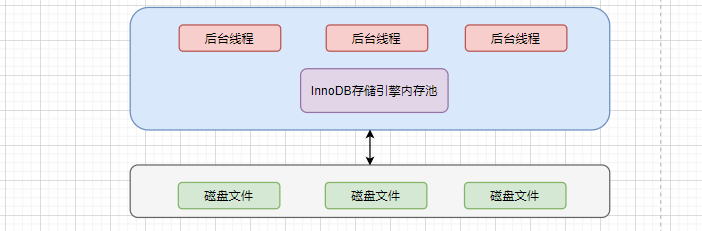
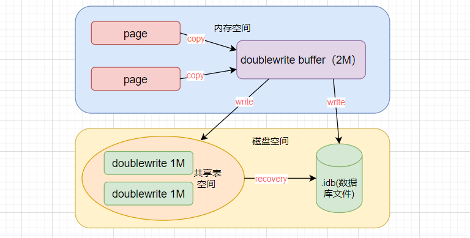

# InnoDB存储引擎

## InnoDB的体系架构

InnoDB存储引擎的体系架构如下图所示，多个InnoDB存储引擎内存块组成了一个大的内存池主要负责如下工作：

- 维护所有进程/线程需要访问的内部数据结构；
- 缓存磁盘上的数据，对磁盘文件修改之间在这里先缓存，提高读取速度；
- 重做日志（redo log）缓冲；
- 按照策略将缓存的内容刷新到磁盘文件中；



### 后台线程

#### Master Thread

Master Thread是一个非常核心的后台线程，主要负责将缓冲池中的数据异步刷新到磁盘，保证数据的一致性，包括脏页的刷新、合并插入缓冲（INSERT BUFFER）、UNDO页的回收等；（内容太多待整理……）

#### IO Thread

查看mysql的版本如下：

```sql
mysql> show variables like 'innodb_version';
+----------------+--------+
| Variable_name  | Value  |
+----------------+--------+
| innodb_version | 5.7.31 |
+----------------+--------+
```

IO线程分别是：write、read、insert、buffer和log IO thread。下列命令显示IO线程的数量。

```shell
show engine innodb status\G;

I/O thread 0 state: waiting for i/o request (insert buffer thread)
I/O thread 1 state: waiting for i/o request (log thread)
I/O thread 2 state: waiting for i/o request (read thread)
I/O thread 3 state: waiting for i/o request (read thread)
I/O thread 4 state: waiting for i/o request (read thread)
I/O thread 5 state: waiting for i/o request (read thread)
I/O thread 6 state: waiting for i/o request (write thread)
I/O thread 7 state: waiting for i/o request (write thread)
I/O thread 8 state: waiting for i/o request (write thread)
I/O thread 9 state: waiting for i/o request (write thread)
```

#### Purge Thread

事务被提交后，其所使用的 undo log可能不再需要，因此需要 PurgeThread来回收已经使用并分配的undo页。查看Purge Thread命令如下：

```
mysql> show variables like 'innodb_purge_threads';
+----------------------+-------+
| Variable_name        | Value |
+----------------------+-------+
| innodb_purge_threads | 4     |
+----------------------+-------+
1 row in set (0.01 sec)
```

#### Page Cleaner Thread

Page Cleaner Thread其作用是将之前版本中脏页的刷新操作都放人到单独的线程中来完成。其目的是为了减轻原 Master Thread的工作及对于用户査询线程的阻塞，进一步提高 InnoDB存储引擎的性能。

### 内存

#### 缓冲池

缓冲池是用来弥补磁盘速度较慢对数据库性能的影响。在数据库中进行读取页的操作，首先将从磁盘读到的页存放在缓冲池中，这个过程称为将页“FIX”在缓冲池中。下一次再读相同的页时，首先判断该页是否在缓冲池中。若在缓冲池中，称该页在缓冲池中被命中，直接读取该页。否则，读取磁盘上的页。

对于数据库中页的修改操作，则首先修改在缓冲池中的页，然后再以一定的频率刷新到磁盘上。这里需要注意的是，页从缓冲池刷新回磁盘的操作并不是在每次页发生更新时触发，而是通过一种称为 Checkpoint的机制刷新回磁盘。

查看缓冲池的大小命令如下：

```
mysql> show variables like 'innodb_buffer_pool_size';
+-------------------------+-----------+
| Variable_name           | Value     |
+-------------------------+-----------+
| innodb_buffer_pool_size | 134217728 |
+-------------------------+-----------+
1 row in set (0.00 sec)
```

缓冲池中缓存的数据页类型有：索引页、数据页、undo页、插入缓冲（insert buffer）、自适应哈希索引（adaptive hash index）、InnoDB存储的锁信息（lock info）、数据字典信息（data dictionary）等。不能简单地认为，缓冲池只是缓存索引页和数据页，它们只是占缓冲池很大的一部分而已。

缓冲池结构如下所示：


#### 缓冲池的管理

数据库中的缓冲池是通过LRU（Latest recent used，最近最少使用）算法来进行管理的。即最频繁使用的页在LRU列表的前端，而最少使用的页在LRU列表的尾端。当缓冲池不能存放新读取到的页时，将首先释放LRU列表中尾端的页。

而InnoDB存储引擎对传统的LRU进行了优化。InnoDB的存储引擎中，LRU列表中还加人了 midpoint位置。新读取到的页，虽然是最新访问的页，但并不是直接放入到LRU列表的首部，而是放入到LRU列表的 midpoint位置。在默认配置下，该位置在LRU列表长度的5/8处。midpoint位置可由参数indb_old blocks pct控制，如：

```sql
mysql> show variables like 'innodb_old_blocks_pct';
+-----------------------+-------+
| Variable_name         | Value |
+-----------------------+-------+
| innodb_old_blocks_pct | 37    |
+-----------------------+-------+
1 row in set, 1 warning (0.00 sec)
```

参数 innodb_old_blocks_pct默认值为37，表示新读取的页插入到LRU列表尾端的37%的位置（差不多38的位置）。在 InnoDB存储引擎中，把midpoint之后的列表称为old列表，之前的列表称为new列表。可以简单地理解为new列表中的页都是最为活跃的热点数据。

InnoDB存储引擎还引入了另一个参数来进一步管理LRU列表，这个参数是 innodb_old_blocks_time，用于表示页读取到mid位置后需要等待多久才会被加入到LRU列表的热端。可以通过下面的方法尽可能使LRU列表中热点数据不被刷出。

```sql
mysql> set global innodb_old_blocks_time=1000;
Query OK, 0 rows affected (0.00 sec)
```

LRU列表用来管理已经读取的页，但当数据库刚启动时，LRU列表是空的，即没有任何的页。这时页都存放在**Free List**中，当需要从缓冲池中分页时，首先从Free列表中查找是否有可用的空闲页，若有则将该页从Free列表中删除，放入到LRU列表中。

在LRU列表中的页被修改后，称该页为脏页（dirty page），即缓冲池中的页和磁盘上的页的数据产生了不一致。这时数据库会通过 CHECKPOINT机制将脏页刷新回磁盘，而 **Flush List**中的页即为脏页列表。

#### 重做日志缓冲（redo log buffer）

InnoDB存储引擎首先将重做日志信息先放人到重做日志缓冲区，然后按一定频率将其刷新到重做日志文件。重做日志缓冲一般不需要设置得很大，因为一般情况下每一秒钟会将重做日志缓冲刷新到日志文件，因此用户只需要保证每秒产生的事务量在这个缓冲大小之内即可。

```sql
mysql> show variables like 'innodb_log_buffer_size';
+------------------------+---------+
| Variable_name          | Value   |
+------------------------+---------+
| innodb_log_buffer_size | 1048576 |
+------------------------+---------+
1 row in set, 1 warning (0.00 sec)
```

下列三种情况下会将重做日志缓冲中的内容刷新到外部磁盘的重做日志文件中

- Master Thread每一秒将重做日志缓冲刷新到重做日志文件；
- 每个事务提交时会将重做日志缓冲刷新到重做日志文件；
- 当重做日志缓冲池剩余空间小于1/2时，重做日志缓冲刷新到重做日志文件；

#### 额外的内存池

在 InnoDB存储引擎中，对内存的管理是通过一种称为内存堆（heap）的方式进行的。

在对一些数据结构本身的内存进行分配时，需要从额外的内存池中进行申请，当该区域的内存不够时，会从缓冲池中进行申请。例如，分配了缓冲池（innodb_buffer_pool），但是每个缓冲池中的帧缓冲（frame buffer）还有对应的缓冲控制对象（buffer control block），这些对象记录了一些诸如LRU、锁、等待等信息，而这个对象的内存需要从额外内存池中申请。因此，在申请了很大的 InnoDB缓冲池时，也应考虑相增加额外内存池的容量。

## Checkpoint技术

如果从缓冲池将页的新数据刷新到磁盘宕机时，事务型数据库通常做法：采用 Write Ahead Log策略，即当事务提交时先写重做日志的缓存（redo log），再修改缓冲池中的页。因此，即使发生宕机的情况，也可以通过redo log来恢复数据，这就是事务ACID中的D（Durability持久性）。

当重做日志不断增加，难免会让数据恢复时间增加，而Checkpoint技术就是记录哪些redo log是需要进行恢复的。Checkpoint（检查点）技术的目的是解决以下几个问题：

- 缩短数据库的恢复时间；
- 缓冲池不够用时，将脏页刷新到磁盘
- 重做日志不可用时，刷新脏页。

当数据库发生宕机时，数据库不需要重做所有的日志，因为 Checkpoint之前的页都已经刷新回磁盘。故数据库只需对 Checkpoint后的重做日志进行恢复。

## InnoDB的关键特性

### 插入缓冲

#### Insert Buffer

 Insert Buffer针对非聚集索引（二级索引或辅助索引）的插入或更新操作，不是每一次直接插入到索引页中，而是先判断插入的非聚集索引页是否在缓冲池中，若在，则直接插入；若不在，则先放人到一个 Insert Buffer对象中，好似欺骗数据库这个非聚集的索引已经插到叶子节点，而实际并没有，只是存放在另一个位置。然后再以一定的频率和情况进行 Insert Buffer和辅助索引页子节点的 merge（合并）操作，这时通常能将多个插入合并到一个操作中（因为在一个索引页中），这就大大提高了对于非聚集索引插入的性能。

Insert Buffer的使用需要同时满足以下两个条件：

- 索引是辅助索引（secondary index）；
- 索引不是唯一（unique）的；

#### Change Buffer

Change Buffer，可将其视为 Insert Buffer的升级。
InnoDB存储引擎可以对INSERT、DELETE、UPDATE都进行缓冲，他们分别是：Insert Buffer、Delete Buffer、Purge buffer，和之前 Insert Buffer一样，Change Buffer适用的对象依然是非唯一的辅助索引对一条记录进行 UPDATE操作可能分为两个过程：

- 将记录标记为已删除；
- 真正将记录删除；

因此 Delete Buffer对应 UPDATE操作的第一个过程，即将记录标记为删除。Purg Buffer对应 UPDATE操作的第二个过程，即将记录真正的删除。

### Merge Insert Buffer

Insert/Change Buffer是一棵B+树。若需要实现插入记录的辅助索引页不在缓冲池中，那么需要将辅助索引记录首先插入到这棵B+树中。但是 Insert Buffer中的记录何时合并（merge）到真正的辅助索引中呢？
概括地说，Merge Insert Buffer的操作可能发生在以下几种情况下

- 辅助索引页被读取到缓冲池时；
- Insert Buffer Bitmap页追踪到该辅助索引页已无可用空间时；
- Master Thread主动刷新；

第一种情况：当辅助索引页被读取到缓冲池中时，例如这在执行正常的 SELECT查询操作，这时需要检查 Insert Buffer Bitmap页，然后确认该辅助索引页是否有记录存放于 Insert Buffer B+树中。若有，则将 Insert Buffer B+树中该页的记录插入到该辅助索引页中。

第二种情况：Insert Buffer Bitmap页用来迫踪每个辅助索引页的可用空间，并至少有1/32页的空间。若插入辅助索引记录时检测到插入记录后可用空间会小于1/32页，则会强制进行个合并操作，即强制读取辅助索引页，将 Insert Buffer B+树中该页的记录及待插入的记录插入到辅助索引页中。

第三种情况：在 Master Thread线程中每秒或每10秒会进行一次 Merge Insert Buffer的操作，不同之处在于每次进行mere操作的页的数量不同。

### 两次写（Double Write）

如果说 Insert Buffer带给 InnoDB存储引擎的是性能上的提升，那么 doublewrite（两次写）带给 InnoDB存储引擎的是数据页的可靠性。

当发生数据库宕机时，可能 InnoDB存储引擎正在写入某个页到表中，而这个页只写了一部分，比如16KB的页，只写了前4KB，之后就发生了宕机，这种情况被称为部分写失效（partial page write）。

有经验的DBA也许会想，如果发生写失效，可以通过重做日志进行恢复。这是个办法。但是必须清楚地认识到，重做日志中记录的是对页的物理操作，如偏移量800，写"aa'记录。如果这个页本身已经发生了损坏，再对其进行重做是没有意义的。

这就是说，在应用（apply）重做日志前，用户需要一个页的副本，当写入失效发生时，先通过页的副本来还原该页，再进行重做，这就是 doublewrite。在 InnoDB存储引擎中doublewrite的体系架构如图：



doublewrite由两部分组成，一部分是内存中的 doublewrite buffer，大小为2MB，另部分是物理磁盘上共享表空间中连续的128个页，即2个区（extent），大小同样为2MB。在对缓冲池的脏页进行刷新时，并不直接写磁盘，而是会通过 memcpy函数将脏页先复制到内存中的 doublewrite buffer，之后通过 doublewrite buffer再分两次，每次1MB顺序地写入共享表空间的物理磁盘上，待写入磁盘后将doublewrite buffer中的脏页数据写入实际的各个数据库表空间文件(离散写)；

如果操作系统在将页写入磁盘的过程中发生了崩溃，在恢复过程中，InnoDB存储引擎可以从共享表空向中的 doublewrite中找到该页的一个副本，将其复制到表空间文件，再应用重做日志。

### 自适应哈希索引

InnoDB存储引擎会监控对表上各索引页的查询。如果观察到建立哈希索引可以带来速度提升，则建立哈希索引，称之为自适应哈希索引（Adaptive Hash Index，AH）。

AHI是通过缓冲池的B+树页构遣而来，因此建立的速度很快，而且不需要对整张表构建哈希索引。InnoDB存储引擎会自动根据访问的频率和模式来自动地为某些热点页建立哈希索引。

### 异步IO

与AIO对应的是 Sync IO，即每进行一次Io操作，需要等待此次操作结束才能继续接下来的操作。但是如果用户发出的是一条索引扫描的查询，那么这条SQL查询语句可能需要扫描多个索引页，也就是需要进行多次的IO操作。在每扫描一个页并等待其完成后再进行下一次的扫描，这是没有必要的。用户可以在发出一个IO请求后立即再发出另一个IO请求，当全部IO请求发送完毕后，等待所有IO操作的完成，这就是AIO。

在 InnoDB存储引擎中，read ahead方式的读取都是通过AIO完成，脏页的刷新，即磁盘的写入操作则全部由AIO完成。222

### 刷新邻接表

InnoDB存储引擎还提供了 Flush Neighbor Page（刷新邻接页）的特性。

其工作原理为：当刷新一个脏页时，InnoDe存储引擎会检测该页所在区（extent）的所有页，如果是脏页，那么一起进行刷新。这样做的好处显而易见，通过AIO可以将多个1O写入操作合并为一个IO操作，故该工作机制在传统机械磁盘下有着显著的优势。

但是需要考虑到下面两个问题：

- 是不是可能将不怎么脏的页进行了写人，而该页之后又会很快变成脏页？

- 固态硬盘有着较高的IOPS，是否还需要这个特性？

为此，InnoDB存储引擎从1.2.x版本开始提供了参数 innodb_flush_neighbors，用来控制是否启用该特性。对于传统机械硬盘建议启用该特性，而对于固态硬盘有着超高IOPS性能的磁盘，则建议将该参数设置为0，即关闭此特性。

# 文件

# 表

# 索引

# 锁

# 事务