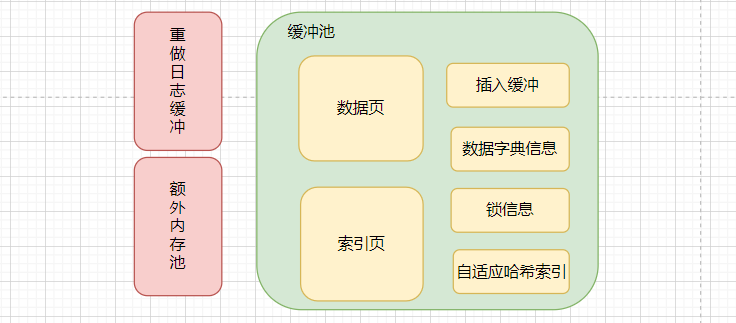
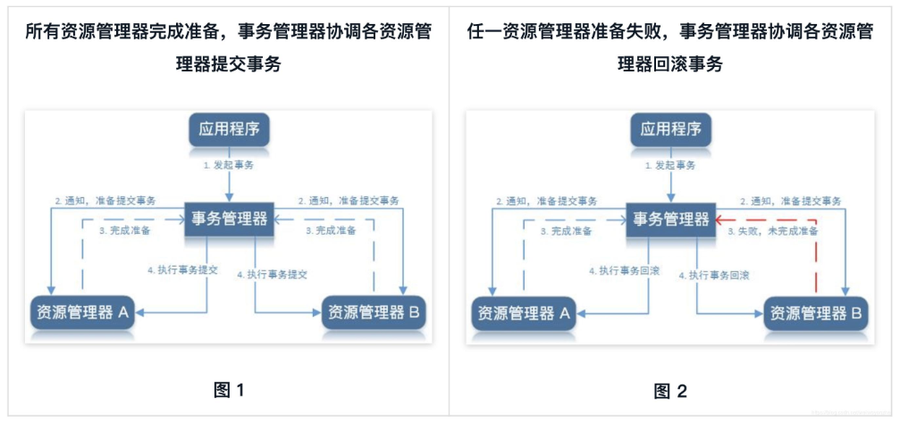

该文整理自《MySQL技术内幕-InnoDB存储引擎》

# InnoDB存储引擎

## InnoDB的体系架构

InnoDB存储引擎的体系架构如下图所示，多个InnoDB存储引擎内存块组成了一个大的内存池主要负责如下工作：

- 维护所有进程/线程需要访问的内部数据结构；
- 缓存磁盘上的数据，对磁盘文件修改之间在这里先缓存，提高读取速度；
- 重做日志（redo log）缓冲；
- 按照策略将缓存的内容刷新到磁盘文件中；


### 后台线程

#### Master Thread

Master Thread是一个非常核心的后台线程，主要负责将缓冲池中的数据异步刷新到磁盘，保证数据的一致性，包括脏页的刷新、合并插入缓冲（INSERT BUFFER）、UNDO页的回收等；（内容太多待整理……）

#### IO Thread

查看mysql的版本如下：

```sql
mysql> show variables like 'innodb_version';
+----------------+--------+
| Variable_name  | Value  |
+----------------+--------+
| innodb_version | 5.7.31 |
+----------------+--------+
```

IO线程分别是：write、read、insert、buffer和log IO thread。下列命令显示IO线程的数量。

```shell
show engine innodb status\G;

I/O thread 0 state: waiting for i/o request (insert buffer thread)
I/O thread 1 state: waiting for i/o request (log thread)
I/O thread 2 state: waiting for i/o request (read thread)
I/O thread 3 state: waiting for i/o request (read thread)
I/O thread 4 state: waiting for i/o request (read thread)
I/O thread 5 state: waiting for i/o request (read thread)
I/O thread 6 state: waiting for i/o request (write thread)
I/O thread 7 state: waiting for i/o request (write thread)
I/O thread 8 state: waiting for i/o request (write thread)
I/O thread 9 state: waiting for i/o request (write thread)
```

#### Purge Thread

事务被提交后，其所使用的 undo log可能不再需要，因此需要 PurgeThread来回收已经使用并分配的undo页。查看Purge Thread命令如下：

```
mysql> show variables like 'innodb_purge_threads';
+----------------------+-------+
| Variable_name        | Value |
+----------------------+-------+
| innodb_purge_threads | 4     |
+----------------------+-------+
```

#### Page Cleaner Thread

Page Cleaner Thread其作用是将之前版本中脏页的刷新操作都放人到单独的线程中来完成。其目的是为了减轻原 Master Thread的工作及对于用户査询线程的阻塞，进一步提高 InnoDB存储引擎的性能。

### 内存

#### 缓冲池

缓冲池是用来弥补磁盘速度较慢对数据库性能的影响。在数据库中进行读取页的操作，首先将从磁盘读到的页存放在缓冲池中，这个过程称为将页“FIX”在缓冲池中。下一次再读相同的页时，首先判断该页是否在缓冲池中。若在缓冲池中，称该页在缓冲池中被命中，直接读取该页。否则，读取磁盘上的页。

对于数据库中页的修改操作，则首先修改在缓冲池中的页，然后再以一定的频率刷新到磁盘上。这里需要注意的是，页从缓冲池刷新回磁盘的操作并不是在每次页发生更新时触发，而是通过一种称为 Checkpoint的机制刷新回磁盘。

查看缓冲池的大小命令如下：

```
mysql> show variables like 'innodb_buffer_pool_size';
+-------------------------+-----------+
| Variable_name           | Value     |
+-------------------------+-----------+
| innodb_buffer_pool_size | 134217728 |
+-------------------------+-----------+
```

缓冲池中缓存的数据页类型有：索引页、数据页、undo页、插入缓冲（insert buffer）、自适应哈希索引（adaptive hash index）、InnoDB存储的锁信息（lock info）、数据字典信息（data dictionary）等。不能简单地认为，缓冲池只是缓存索引页和数据页，它们只是占缓冲池很大的一部分而已。

缓冲池结构如下所示：



#### 缓冲池的管理

数据库中的缓冲池是通过LRU（Latest recent used，最近最少使用）算法来进行管理的。即最频繁使用的页在LRU列表的前端，而最少使用的页在LRU列表的尾端。当缓冲池不能存放新读取到的页时，将首先释放LRU列表中尾端的页。

而InnoDB存储引擎对传统的LRU进行了优化。InnoDB的存储引擎中，LRU列表中还加人了 midpoint位置。新读取到的页，虽然是最新访问的页，但并不是直接放入到LRU列表的首部，而是放入到LRU列表的 midpoint位置。在默认配置下，该位置在LRU列表长度的5/8处。midpoint位置可由参数indb_old blocks pct控制，如：

```sql
mysql> show variables like 'innodb_old_blocks_pct';
+-----------------------+-------+
| Variable_name         | Value |
+-----------------------+-------+
| innodb_old_blocks_pct | 37    |
+-----------------------+-------+
```

参数 innodb_old_blocks_pct默认值为37，表示新读取的页插入到LRU列表尾端的37%的位置（差不多38的位置）。在 InnoDB存储引擎中，把midpoint之后的列表称为old列表，之前的列表称为new列表。可以简单地理解为new列表中的页都是最为活跃的热点数据。

InnoDB存储引擎还引入了另一个参数来进一步管理LRU列表，这个参数是 innodb_old_blocks_time，用于表示页读取到mid位置后需要等待多久才会被加入到LRU列表的热端。可以通过下面的方法尽可能使LRU列表中热点数据不被刷出。

```sql
mysql> set global innodb_old_blocks_time=1000;
```

LRU列表用来管理已经读取的页，但当数据库刚启动时，LRU列表是空的，即没有任何的页。这时页都存放在**Free List**中，当需要从缓冲池中分页时，首先从Free列表中查找是否有可用的空闲页，若有则将该页从Free列表中删除，放入到LRU列表中。

在LRU列表中的页被修改后，称该页为脏页（dirty page），即缓冲池中的页和磁盘上的页的数据产生了不一致。这时数据库会通过 CHECKPOINT机制将脏页刷新回磁盘，而 **Flush List**中的页即为脏页列表。

#### 重做日志缓冲（redo log buffer）

InnoDB存储引擎首先将重做日志信息先放人到重做日志缓冲区，然后按一定频率将其刷新到重做日志文件。重做日志缓冲一般不需要设置得很大，因为一般情况下每一秒钟会将重做日志缓冲刷新到日志文件，因此用户只需要保证每秒产生的事务量在这个缓冲大小之内即可。

```sql
mysql> show variables like 'innodb_log_buffer_size';
+------------------------+---------+
| Variable_name          | Value   |
+------------------------+---------+
| innodb_log_buffer_size | 1048576 |
+------------------------+---------+
```

下列三种情况下会将重做日志缓冲中的内容刷新到外部磁盘的重做日志文件中

- Master Thread每一秒将重做日志缓冲刷新到重做日志文件；
- 每个事务提交时会将重做日志缓冲刷新到重做日志文件；
- 当重做日志缓冲池剩余空间小于1/2时，重做日志缓冲刷新到重做日志文件；

#### 额外的内存池

在 InnoDB存储引擎中，对内存的管理是通过一种称为内存堆（heap）的方式进行的。

在对一些数据结构本身的内存进行分配时，需要从额外的内存池中进行申请，当该区域的内存不够时，会从缓冲池中进行申请。例如，分配了缓冲池（innodb_buffer_pool），但是每个缓冲池中的帧缓冲（frame buffer）还有对应的缓冲控制对象（buffer control block），这些对象记录了一些诸如LRU、锁、等待等信息，而这个对象的内存需要从额外内存池中申请。因此，在申请了很大的 InnoDB缓冲池时，也应考虑相增加额外内存池的容量。

## Checkpoint技术

如果从缓冲池将页的新数据刷新到磁盘宕机时，事务型数据库通常做法：采用 Write Ahead Log策略，即当事务提交时先写重做日志的缓存（redo log），再修改缓冲池中的页。因此，即使发生宕机的情况，也可以通过redo log来恢复数据，这就是事务ACID中的D（Durability持久性）。

当重做日志不断增加，难免会让数据恢复时间增加，而Checkpoint技术就是记录哪些redo log是需要进行恢复的。Checkpoint（检查点）技术的目的是解决以下几个问题：

- 缩短数据库的恢复时间；
- 缓冲池不够用时，将脏页刷新到磁盘
- 重做日志不可用时，刷新脏页。

当数据库发生宕机时，数据库不需要重做所有的日志，因为 Checkpoint之前的页都已经刷新回磁盘。故数据库只需对 Checkpoint后的重做日志进行恢复。

## InnoDB的关键特性

### 插入缓冲

#### Insert Buffer

 Insert Buffer针对非聚集索引（二级索引或辅助索引）的插入或更新操作，不是每一次直接插入到索引页中，而是先判断插入的非聚集索引页是否在缓冲池中，若在，则直接插入；若不在，则先放人到一个 Insert Buffer对象中，好似欺骗数据库这个非聚集的索引已经插到叶子节点，而实际并没有，只是存放在另一个位置。然后再以一定的频率和情况进行 Insert Buffer和辅助索引页子节点的 merge（合并）操作，这时通常能将多个插入合并到一个操作中（因为在一个索引页中），这就大大提高了对于非聚集索引插入的性能。

Insert Buffer的使用需要同时满足以下两个条件：

- 索引是辅助索引（secondary index）；
- 索引不是唯一（unique）的；

#### Change Buffer

Change Buffer，可将其视为 Insert Buffer的升级。
InnoDB存储引擎可以对INSERT、DELETE、UPDATE都进行缓冲，他们分别是：Insert Buffer、Delete Buffer、Purge buffer，和之前 Insert Buffer一样，Change Buffer适用的对象依然是非唯一的辅助索引对一条记录进行 UPDATE操作可能分为两个过程：

- 将记录标记为已删除；
- 真正将记录删除；

因此 Delete Buffer对应 UPDATE操作的第一个过程，即将记录标记为删除。Purg Buffer对应 UPDATE操作的第二个过程，即将记录真正的删除。

### Merge Insert Buffer

Insert/Change Buffer是一棵B+树。若需要实现插入记录的辅助索引页不在缓冲池中，那么需要将辅助索引记录首先插入到这棵B+树中。但是 Insert Buffer中的记录何时合并（merge）到真正的辅助索引中呢？
概括地说，Merge Insert Buffer的操作可能发生在以下几种情况下

- 辅助索引页被读取到缓冲池时；
- Insert Buffer Bitmap页追踪到该辅助索引页已无可用空间时；
- Master Thread主动刷新；

第一种情况：当辅助索引页被读取到缓冲池中时，例如这在执行正常的 SELECT查询操作，这时需要检查 Insert Buffer Bitmap页，然后确认该辅助索引页是否有记录存放于 Insert Buffer B+树中。若有，则将 Insert Buffer B+树中该页的记录插入到该辅助索引页中。

第二种情况：Insert Buffer Bitmap页用来迫踪每个辅助索引页的可用空间，并至少有1/32页的空间。若插入辅助索引记录时检测到插入记录后可用空间会小于1/32页，则会强制进行个合并操作，即强制读取辅助索引页，将 Insert Buffer B+树中该页的记录及待插入的记录插入到辅助索引页中。

第三种情况：在 Master Thread线程中每秒或每10秒会进行一次 Merge Insert Buffer的操作，不同之处在于每次进行mere操作的页的数量不同。

### 两次写（Double Write）

如果说 Insert Buffer带给 InnoDB存储引擎的是性能上的提升，那么 doublewrite（两次写）带给 InnoDB存储引擎的是数据页的可靠性。

当发生数据库宕机时，可能 InnoDB存储引擎正在写入某个页到表中，而这个页只写了一部分，比如16KB的页，只写了前4KB，之后就发生了宕机，这种情况被称为部分写失效（partial page write）。

有经验的DBA也许会想，如果发生写失效，可以通过重做日志进行恢复。这是个办法。但是必须清楚地认识到，重做日志中记录的是对页的物理操作，如偏移量800，写"aa'记录。如果这个页本身已经发生了损坏，再对其进行重做是没有意义的。

这就是说，在应用（apply）重做日志前，用户需要一个页的副本，当写入失效发生时，先通过页的副本来还原该页，再进行重做，这就是 doublewrite。在 InnoDB存储引擎中doublewrite的体系架构如图：


doublewrite由两部分组成，一部分是内存中的 doublewrite buffer，大小为2MB，另部分是物理磁盘上共享表空间中连续的128个页，即2个区（extent），大小同样为2MB。在对缓冲池的脏页进行刷新时，并不直接写磁盘，而是会通过 memcpy函数将脏页先复制到内存中的 doublewrite buffer，之后通过 doublewrite buffer再分两次，每次1MB顺序地写入共享表空间的物理磁盘上，待写入磁盘后将doublewrite buffer中的脏页数据写入实际的各个数据库表空间文件(离散写)；

如果操作系统在将页写入磁盘的过程中发生了崩溃，在恢复过程中，InnoDB存储引擎可以从共享表空向中的 doublewrite中找到该页的一个副本，将其复制到表空间文件，再应用重做日志。

### 自适应哈希索引

InnoDB存储引擎会监控对表上各索引页的查询。如果观察到建立哈希索引可以带来速度提升，则建立哈希索引，称之为自适应哈希索引（Adaptive Hash Index，AHI）。

AHI是通过缓冲池的B+树页构遣而来，因此建立的速度很快，而且不需要对整张表构建哈希索引。InnoDB存储引擎会自动根据访问的频率和模式来自动地为某些热点页建立哈希索引。

### 异步IO

与AIO对应的是 Sync IO，即每进行一次Io操作，需要等待此次操作结束才能继续接下来的操作。但是如果用户发出的是一条索引扫描的查询，那么这条SQL查询语句可能需要扫描多个索引页，也就是需要进行多次的IO操作。在每扫描一个页并等待其完成后再进行下一次的扫描，这是没有必要的。用户可以在发出一个IO请求后立即再发出另一个IO请求，当全部IO请求发送完毕后，等待所有IO操作的完成，这就是AIO。

在 InnoDB存储引擎中，read ahead方式的读取都是通过AIO完成，脏页的刷新，即磁盘的写入操作则全部由AIO完成。222

### 刷新邻接表

InnoDB存储引擎还提供了 Flush Neighbor Page（刷新邻接页）的特性。

其工作原理为：当刷新一个脏页时，InnoDe存储引擎会检测该页所在区（extent）的所有页，如果是脏页，那么一起进行刷新。这样做的好处显而易见，通过AIO可以将多个1O写入操作合并为一个IO操作，故该工作机制在传统机械磁盘下有着显著的优势。

但是需要考虑到下面两个问题：

- 是不是可能将不怎么脏的页进行了写人，而该页之后又会很快变成脏页？

- 固态硬盘有着较高的IOPS，是否还需要这个特性？

为此，InnoDB存储引擎从1.2.x版本开始提供了参数 innodb_flush_neighbors，用来控制是否启用该特性。对于传统机械硬盘建议启用该特性，而对于固态硬盘有着超高IOPS性能的磁盘，则建议将该参数设置为0，即关闭此特性。

# 文件

## 参数文件

参数文件主要包含数据库启动时会加载参数文件的配置信息来实现数据库的初始化工作，例如 InnoDB 缓冲池大小：innodb_buffer_pool_size = 1G。参数的信息通过Key/Value的形式存储在文件中，参数的类型可分为：

- 静态参数：在整个数据库运行时的生命周期内都不允许改变；
- 动态参数：可以通过命令行动态的修改参数；

## 日志文件

日志文件记录了影响 MySQL数据库的各种类型活动。MySQL数据库中常见的日志文件有：

- 错误日志（error log）；
- 二进制日志（binlog）；
- 慢查询日志（slow query log）；
- 查询日志（log）；

### 错误日志

**错误日志文件对 MySQL的启动、运行、关闭过程进行了记录。**该文件不仅记录了所有的错误信息，也记录一些警告信息或正确的信息。可通过下列命令查看错误日志所在位置：

```mysql
# 查看mysql数据存储位置
mysql> show variables like 'datadir';
+---------------+---------------------------------------------+
| Variable_name | Value                                       |
+---------------+---------------------------------------------+
| datadir       | C:\ProgramData\MySQL\MySQL Server 5.7\Data\ |
+---------------+---------------------------------------------+

# 查看错误日志存储的相对位置
mysql> show variables like 'log_error';
+---------------+----------------------+
| Variable_name | Value                |
+---------------+----------------------+
| log_error     | .\JASON-YOGA-14S.err |
+---------------+----------------------+
```

上述信息可见，错误日志的名称（通常为主机的名称.err）与存放的相对路径地址，查看具体内容如下：


### 慢查询日志

**慢查询日志（slow log）**可帮助DBA定位可能存在问题的SQL语句，从而进行SQL语句层面的优化。例如，可以在 MySQL启动时设一个阈值，将运行时间超过该值的所有SQL语句都记录到慢查询日志文件中。该阈值可以通过参数 `long_query_time`来设置，默认值为10，代表10秒。

```sql
mysql> show variables like 'long_query_time';
+-----------------+-----------+
| Variable_name   | Value     |
+-----------------+-----------+
| long_query_time | 10.000000 |
+-----------------+-----------+
```

`log_queries_not_using_indexes`变量的作用是：如果没有SQL语句没有使用索引，则MySQL会将该条SQL存储到慢查询日志文件。使用时需要手动开启（在mysql配置文件中添加参数）。

```sql
mysql> show variables like 'log_queries_not_using_indexes';
+-------------------------------+-------+
| Variable_name                 | Value |
+-------------------------------+-------+
| log_queries_not_using_indexes | OFF   |
+-------------------------------+-------+
```

查看慢日志文件名称及所在位置：

```sql
mysql> show variables like 'slow_query_log_file'\G;
+---------------------+-------------------------+
| Variable_name       | Value                   |
+---------------------+-------------------------+
| slow_query_log_file | JASON-YOGA-14S-slow.log |
+---------------------+-------------------------+
```

### 查询日志

**查询日志记录了所有对 MySQL数据库请求的信息，无论这些请求是否得到了正确的执行。**默认文件名为：主机名.log。如查看一个查询日志是否开启以及查询日志的文件名称：

```sql
mysql> show variables like '%general_log%';
+------------------+--------------------+
| Variable_name    | Value              |
+------------------+--------------------+
| general_log      | OFF                |
| general_log_file | JASON-YOGA-14S.log |
+------------------+--------------------+
```

`general_log=OFF`表示没有开启记录查询日志的功能，需手动开启，而JASON-YOGA-14S.log为查询日志的名称。启动查询日志需要添加mysql配置文件信息。

### 二进制日志

**二进制日志（binary log）记录了对 MySQL数据库执行更改的所有操作**，**但是不包括 SELECT和SHOW这类操作**，因为这类操作对数据本身并没有修改。**如果用户想记录 SELECT和SHOW操作，那只能使用查询日志，而不是二进制日志。**二进制日志主要作用如下：

- 恢复（recovery）：某些数据的恢复需要二进制日志，例如，在一个数据库全备文件恢复后，用户可以通过二进制日志进行 point-in-time的恢复。
- 复制（replication）：其原理与恢复类似，通过复制和执行二进制日志使一台远程的MySL数据库（一般称为 slave或 standby）与一台 MySQL数据库（一般称为 master或 primary）进行实时同步。
- 审计（audit）：用户可以通过二进制日志中的信息来进行审计，判断是否有对数据库进行注入的攻击。

通过修改mysql的配置文件添加配置参数`log-bin=name`来启动二进制日志，若不指定name，则默认为主机名，

```mysql
# 未启动
mysql> show variables like 'log_bin';
+---------------+-------+
| Variable_name | Value |
+---------------+-------+
| log_bin       | OFF   |
+---------------+-------+

# 已启动，启动后日志默认存放路径为mysql data的根路径
mysql> show variables like 'log_bin';
+---------------+-------+
| Variable_name | Value |
+---------------+-------+
| log_bin       | ON    |
+---------------+-------+
```

## 表结构定义文件

因为 MySQL插件式存储引擎的体系结构的关系，**MySQL数据的存储是根据表进行的**，不论表采用何种存储引擎，只要创建一张表（或视图）MySQL就在磁盘生一个以`.frm`为后缀名的文件，**这个文件记录了该表的表结构定义。**

## InnoDB存储引擎文件

### 表空间文件

**InnoDB采用将存储的数据按表空间（tablespace）进行存放的设计。**在默认配置下会有一个初始大小为10MB，名为 `ibdata1`的文件。该文件就是默认的表空间文件（tablespace file），InnoDB存储引擎的表的数据都会记录到该共享表空间中。

除了默认的表空间文件外，用户还可以为每个InnoDB表配置生成独立表空间，独立表的命名规则：.ibd，这些单独的表空间文件仅存储该表的数据、索引、和插入缓冲BITMAP等信息，其余信息还是存放在默认表空间中。

```mysql
# 默认表空间的配置方式: 修改mysql配置文件
# 下列配置参数为 用两个文件夹组成表空间，文件大小为2000MB，用完了2000MB后可以自动增长
innodb_data_file_path = /xx/ibdata1:2000M;/yy/ibdata2:2000M:autoextend

# 开启独立表空间
mysql> set @@global.innodb_file_per_table=on; 
```

### 重做日志文件

在默认情况下，在 InnoDB存储引擎的数据目录下会有两个名为 `ib_logfile0`和`ib_logfile1`的文件。这两个文件就是重做日志文件（redo log file）。

每个 InnoDB存储引擎至少有1个重做日志文件组（group），每个文件组下至少有2个重做日志文件，如默认的 ib_logfile0和 ib_logfile1。在日志组中每个重做日志文件的大小一致，并以循环写的方式运行。（为了得到更高的可靠性，用户可以设置多个的镜像日志组（mirrored log groups），将不同的文件组放在不同的磁盘上，以此提高重做日志的高可用性。）


InnoDB存储引擎先写重做日志文件1，当达到文件的最后时会切换至重做日志文件2，再当重做日志文件2也被写满时，会再切换到重做日志文件1中。

当实例或介质失败（media failure）时，重做日志文件就能派上用场。例如，数据库由于所在主机掉电导致实例失败，InnoDB存储引擎会使用重做日志恢复到掉电前的时刻，以此来保证数据的完整性。

**重做日志文件和二进制文件的区别：**

- 二进制日志会记录所有与 MySQL数据库有关的日志记录，包括 InnoDB、MyISAM、Heap等其他存储引擎的日志。而 **InnodB存储引擎的重做日志**只记录有关该存储引擎本身的**事务日志**。
- 记录的内容不同。无论用户将二进制日志文件记录的都是关于一个事务的具体操作内容，即该日志是逻辑日志。而InDB存储引擎的重做日志文件记录的是关于每个页（Page）的更改的物理情况。
- 写入的时间不同。二进制日志文件仅在事务提交前进行提交，即只写磁盘一次，不论这时该事务多大。而在事务进行的过程中，却不断有重做日志条目（redo entry）被写入到重做日志文件中。

# 表

## 索引组织表

在 InnoDB存储引擎中，表都是根据主键顺序组织存放的，这种存储方式的表称为索引组织表（index organized table）。**在 InnoDB存储引擎表中，每张表都有个主键（Primary Key）**，**如果在创建表时没有显式地定义主键，则 InnoDB存储引擎会按如下方式选择或创建主键：**

- 首先判断表中是否有非空的唯一索引（Unique NOT NULL），如果有，则该列即为主键。

- 如果不符合上述条件，InnoDB存储引擎自动创建一个6字节大小的指针。

当表中有多个非空唯一索引时，InnoDB存储引擎将选择建表时第一个定义的非空唯一索引为主键。

## InnoDB逻辑存储结构

从 InnoDB存储引擎的逻辑存储结构看，**所有数据都被逻辑地存放在表空间（tablespace）**。

表空间（table space）由段（segment）、区（extent）、页（page）组成。页在一些文档中有时也称为块（block），InnoDB存储引擎的逻辑存储结构图如下所示：


上图引自https://www.cnblogs.com/ilifeilong/p/7347920.html

### 表空间

**表空间**可以看做是 InnoDB存储引擎逻辑结构的最高层，**默认情况下InnoDB存储引擎有一个共享表空间 ibdata1，即所有数据都存放在这个表空间内。**

如果用户启用了参数 `innodb_file_per_table`，**则每张表内的数据可以单独放到一个表空间（xx.ibd文件）内**。需要注意的是每个单独的表空间内存放的只是数据、索引和插人缓冲 Bitmap页，其他类的数据，如回滚（undo）信息，插人缓冲索引页、系统事务信息，二次写缓冲（Double write buffer）等还是存放在原来的共享表空间内。

### 段

**表空间是由各个段组成的，常见的段有数据段、索引段、回滚段等。**

InnoDB存储引擎表是索引组织的（index organized），因此数据即索引，索引即数据。那么**数据段即为B+树的叶子节点**（上图中的Leaf node segment），**索引段即为B+树的非索引节点**（图41的Non-leaf node segment）。回滚段较为特殊。在InnoDB存储引擎中，对段的管理都是由引擎自身所完成。

### 区

区是由连续页组成的空间，在任何情况下**每个区的大小都为1MB**。为了保证区中页的连续性，InnoDB存储引擎一次从磁盘申请4~5个区。在默认情况下，InnoDB存储引擎**页的大小为16KB**，即一个区中一共有64个连续的页。

### 页

**页是 InnoDB磁盘管理的最小单位。**在 InnoDe存储引擎中，默认每个页的大小为16KB。而从InnoDB1.2.x版本开始，可以通过参数 innodb_page_size将页的大小设置为4K、8kK、16K。若设置完成，则所有表中页的大小都为 innodb_page_size，不可以对其再次进行修改。除非通过 mysqldump导入和导出操作来产生新的库。

在 InnodB存储引擎中，常见的页类型有：

- 数据页（B-tree Node）；
- undo页（undo Log Page）；
- 系统页（System Page）；
- 事务数据页（Transaction system Page）；
- 插入缓冲位图页（Insert Buffer Bitmap）；
- 插入缓冲空闲列表页（Insert Buffer Free List）；
- 未压缩的二进制大对象页（Uncompressed BLOB Page）；
- 压缩的二进制大对象页（compressed BLOB Page）；

### 行

InnoDB存储引擎是面向行的（row-oriented），也就说数据是按行进行存放的，即页中保存表中一行一行的数据。每个页存放的行记录也是有硬性定义的，最多允许存放16KB/2-200行的记录，即7992行记录。除了面向行存储的数据库还有column-oriented的数据库。

## InnoDB数据页结构

**页是 InnoDB存储引擎管理数据库的最小磁盘单位。**B-ree Node类型的页存放的即是表中行的实际数据。


InnodB数据页由以下7个部分组成：

- File header：表示页的一些通用信息，占固定的38字节。
- Page Header：表示数据页专有的一些信息，占固定的56个字节。
- Infimum和 Supremum Records：两个虚拟的伪记录，分别表示页中的最小和最大记录，占固定的26个字节。
- User Records：存储用户数据（即插入数据库的数据），大小不固定。
- Free Space：页中尚未使用的部分，大小不确定。
- Page Directory：页中某些记录的相对位置，也就是各个槽在页面中的地址偏移量，大小不固定，插入的记录越多，这个部分占用的空间越多。
- File trailer：用于检验页是否完整的部分，占用固定的8个字节。

其中 File header、Page Header、File trailer的大小是固定的，分别为38、56、8字节，这些空间用来标记该页的一些信息，如 Checksum，数据页所在B+树索引的层数等。User Records、Free Space、Page Directory这些部分为实际的行记录存储空间，因此大小是动态的。

InnoDB会把页中的记录划分为若干个组，每个组的最后一个记录的地址偏移量作为一个槽，存放在Page Directory中，所以在一个页中根据主键查找记录是非常快的，分为两步：

- 通过二分法确定该记录所在的槽。

- 通过记录的next_record属性遍历该槽所在的组中的各个记录。

每个数据页的File Header部分都有上一个和下一个页的编号，因此所有的数据页会组成一个双链表。

为了保证从内存中同步到磁盘的页的完整性，在页的首部和尾部都会存储页中数据的校验和和页面最后修改时对应的LSN值，如果首部和尾部的校验和和LSN值校验不成功的话，就说明同步过程出现了问题。

上述总结 引自https://blog.csdn.net/qq_43561507/article/details/108975856

# 索引与算法

## InnoDB索引概述

InnoDB存储引擎支持以下几种常见的索引：

- B+树索引
- 全文索引
- 哈希索

InnoDB存储引擎支持的哈希索引是自适应的，InnoDB存储引擎会根据表的使用情况自动为表生成哈希索引，不能人为干预是否在一张表中生成哈希索引。

B+树索引是目前关系型数据库系统中查找最为有效的索引。B+树索引的构造类似于二叉树，根据键值（Key value）快速找到数据。

**常见的误区是：**B+树索引并不能找到一个给定键值的具体行。B+树索引能找到的只是被查找数据行所在的页。然后数据库通过把页读入到内存，再在内存中进行查找具体行，最后得到要查找的数据。

## B+树索引

**B树与B+树的区别：**

- B 树的所有节点既存放键(key) 也存放数据(data)；**B+树叶子节点存放 key 和 data，其他内节点只存放 key。**
- **B 树的叶子节点都是独立的，叶子节点之间无法顺序访问；**B+树所有的叶子节点数据构成了一个有序链表，可以进行顺序访问（双向链表）；
- B 树的检索的过程相当于对范围内的每个节点的关键字做二分查找，可能还没有到达叶子节点，检索就结束了。而 B+树的检索效率就很稳定，任何查找都是从根节点到叶子节点的过程；

下图为B+数索引的数据结构：（引自https://blog.csdn.net/weixin_43155866/article/details/108791358）


**数据库中的B+树索引可以分为：**

- 聚集索引（clustered inex）：主键索引（Primary Key）；
- 辅助索引（secondary index）（亦或称为：非聚集索引/二级索引）：普通索引、唯一索引、组合索引

B+树索引详述文章：https://www.jianshu.com/p/486a514b0ded

### 聚集索引

**聚集索引（clustered index）就是以每张表的主键构造一棵B+树，同时叶子节点中存放整张表的行记录数据，也将聚集索引的叶子节点称为数据页（数据结构如上图所示）。**聚集索引的这个特性决定了索引组织表中数据也是索引的一部分。同B+树数据结构一样，每个数据页都通过一个双向链表来进行链接。此外聚集索引的存储并不是物理连续的，而是逻辑连续的，这样可以提高维护效率以及提高存储空间利用率。下图摘自网络（@Draveness）


聚集索引的一个好处是，它对于主键的排序查找和范围查找速度非常快。叶子节点的数据就是用户所要查询的数据。如用户需要查询一张注册用户的表，查询最后注册的10位用户，由于B+树索引是双向链表的，用户可以快速找到最后一个数据页，并取出10条记录。

### 辅助索引

**辅助索引（Secondary Index，也称非聚集索引），叶子节点并不包含行记录的全部数据。**叶子节点除了包含键值以外，**每个叶子节点中的索引行中还包含了一个书签（bookmark）**。该书签用来告诉 InnodB存储引擎哪里可以找到与索引相对应的行数据。InnoDB存储引擎的辅助索引的书签就是相应行数据的聚集索引键。

下图（摘自@Draveness）显示了InnoDB存储引擎中辅助索引与聚集索引的关系：其辅助索引为 first_name 与 age 的组合索引，叶子节点存储辅助索引信息与主键索引的主键，然后通过主键索引来查到具体的数据行信息，因此如果辅助索引树和聚集索引树的高度一致，辅助索引遍历3次，则聚集索引同样遍历3次才可以获取最终数据页。


#### 组合索引

如上图所示的组合索引数据结构，组合索引是将一张表中的多个列组合起来进行索引，在建立索引时可以选择字段的长度进行建立，如：

```mysql
CREATE TABLE t3
(
    id  INT NOT NULL,
    username VARCHAR(30) 　NOT NULL,
    age  INT NOT　 NULL,
    info VARCHAR(255),
    INDEX MultiIdx(id, username, info(50)) # 选则info的前50个字符建立索引
);
```

组合索引在索引时，须遵守最左前缀原则，即：

```mysql
# 该查询语句走索引id和username的组合索引
SELECT * FROM t3 WHERE id=1 AND username='zs';

# 该查询语句由于info无法匹配左前缀username字段，因此只对id进行索引
SELECT * FROM t3 WHERE id=1 AND info='man';

# 由于最左前缀id不存在，因此不走索引MultiIdx组合索引
SELECT * FROM t3 WHERE username='zs' AND info='man';

# 即使字段之间乱序组合，只要存在最左前缀，InnoDB优化器就会对索引语句进行优化
SELECT * FROM t3 WHERE username='zs' AND id=1 AND info='man'; 
```

#### 覆盖索引

InnoDB存储引擎支持覆盖索引（covering index，或称索引覆盖），即从辅助索引中就可以得到查询的记录，而不需要查询聚集索引中的记录。使用覆盖索引的一个好处是辅助索引不包含整行记录的所有信息，故其大小要远小于聚集索引，因此可以减少大量的IO操作。

## 全文索引

全文检索（Full-Text Search）是将存储于数据库中的整本书或整篇文章中的任意内容信息查找出来的技术。它可以根据需要获得全文中有关章、节、段、句、词等信息，也可以进行各种统计和分析。

## Hash算法

**InnoDB存储引擎使用哈希算法来对字典进行查找，其冲突机制采用链表方式，哈希函数采用除法散列方式。**

对于缓冲池页的哈希表来说，在缓冲池中的Page页都有令个chain指针，它指向相同哈希函数值的页。而对于除法散列，m的取值为略大于2倍的缓冲池页数量的质数。例如：当前参数 innodb_buffer_pool_size的大小为10M，则共有640个16KB的页。对于缓冲池页内存的哈希表来说，需要分配640×2=1280个槽，但是由于1280不是质数，需要取比1280略大的一个质数，应该是1399，所以在启动时会分配1399个槽的哈希表，用来哈希查询所在缓冲池中的页。

那么 InnoDB存储引擎的缓冲池对于其中的页是怎么进行查找的呢？上面只是给出了一般的算法，怎么将要查找的页转换成自然数呢？

其实也很简单，InnoDB存储引擎的表空间都有一个 space_id，用户所要查询的应该是某个表空间的某个连续16KB的页，即偏移量 offset。InnoDB存储引擎将 space_id左移20位，然后加上这个 space_id和offset，即关键字K=space_id<<20+-space_id+ offset，然后通过除法散列到各个槽中去。

# 锁

## Lock与Latch

**latch一般称为闩锁（轻量级的锁）**，因为其要求锁定的时间必须非常短。若持续的时间长，则应用的性能会非常差。在 InnoDB存储引擎中，**latch又可以分为 mutex（互斥量）和 rwlock（读写锁）**。其目的是用来保证并发线程操作临界资源的正确性，并且通常没有死锁检测的机制。

**lock的对象是事务**，用来锁定的是数据库中的对象，如表、页、行。并且一般lock的对象仅在事务 commit或 rollback后进行释放（不同事务隔离级别释放的时间可能不同）。此外，lock，正如在大多数数据库中一样，是有死锁机制的。下表为lock与latch的不同：

|          |                            lock                             | latch                                                        |
| :------: | :---------------------------------------------------------: | ------------------------------------------------------------ |
|   对象   |                            事务                             | 线程                                                         |
|   保护   |                         数据库内容                          | 内存数据结构                                                 |
| 持续时间 |                        整个事务过程                         | 临界资源                                                     |
|   模式   |                     行锁、表锁、意向锁                      | 读写锁、互斥量                                               |
|   死锁   | 通过waits-forgraph、timeout等机制进行无死锁检测与处理机制。 | 无死锁检测与处理机制。仅通过应用程序加锁的顺序(lockleveling)保证无死锁的情况发生 |
|  存在于  |                    LockManager的哈希表中                    | 每个数据结构的对象中                                         |

## InnoDB存储引擎中的锁

### 锁的基本概念

锁的种类一般分为乐观锁和悲观锁两种，InnoDB 存储引擎中使用的就是悲观锁，而按照锁的粒度划分，也可以分成行锁和表锁，InnDB使用行锁设计锁，而MyISAM使用的是表锁设计。

**乐观锁与悲观锁**

- **乐观锁：**是一种思想，它其实并不是一种真正的锁，它会先尝试对资源进行修改，在写数据时判断资源是否进行了改变，如果没有发生改变就会写回，否则就会进行重试，在整个的执行过程中其实都没有对数据库进行加锁；
- **悲观锁：**是真正的锁，它会在获取资源前对资源进行加锁，确保同一时刻只有有限的线程能够访问该资源，其他想要尝试获取资源的操作都会进入等待状态，直到该线程完成了对资源的操作并且释放了锁后，其他线程才能重新操作资源;

### InnodDB锁的类型

InnoDB存引擎实现如下两种标准的**行级锁**：

- **共享锁（S Lock）**：允许事务读一行数据；

- **排他锁（X LoCK）**：允许事务删除或更新一行数据；

如果一个事务T1已经获得了行 r 的共享锁，那么另外的事务T2可以立即获得行 r 的共享锁，因为读取并没有改变行 r 的数据，称这种情况为锁兼容（Lock Compatible）。

但若有其他的事务T3想获得行 r 的排他锁，则其必须等待事务T1、T2释放行 r 上的共享锁——这种情况称为锁不兼容。下表显示了共享锁和排他锁的兼容性：

|        | X Lock | S Lock |
| ------ | ------ | ------ |
| X Lock | 不兼容 | 不兼容 |
| S Lock | 不兼容 | 兼容   |

**意向锁（Intention lock）**：InnoDB存储引擎支持多粒度（granular）锁定，这种锁定允许事务在行级上的锁和表级上的锁同时存在。为了支持在不同粒度上进行加锁操作，InnoDB存储引擎支持种额外的锁方式，称之为意向锁。意向锁是将锁定的对象分为多个层次，意向锁意味着事务希望在更细粒度（fine granularity）上进行加锁，如下图所示：（引自https://blog.csdn.net/baolingye/article/details/102506072）


若将上锁的对象看成一棵树，那么对最下层的对象上锁，也就是对最细粒度的对象进行上锁，首先需要对粗粒度的对象上锁。如果需要对页上的记录 r 进行上X锁，那么分别需要对数据库A、表、页上意向锁IX，最后对记录 r 上X锁。

若其中任何一个部分导致等待，那么该操作需要等待粗粒度锁的完成。举例来说，在对记录 r 加X锁之前，已经有事务对表1进行了S表锁，那么表1上已存在S锁，之后事务需要对记录 r 在表1上加上IX，由于不兼容，所以该事务需要等待S表锁操作的完成。

**意向锁即为表级别的锁。**设计目的主要是为了在一个事务中揭示下一行将被请求的锁类型。其支持两种意向锁：

- **意向共享锁（IS Lock）：**事务想要获得一张表中某几行的共享锁；

- **意向排他锁（IX Lock）：**事务想要获得一张表中某几行的排他锁；

由于 InnoDB存储引擎支持的是行级别的锁，因此意向锁其实不会阻塞除全表扫以外的任何请求。故表级意向锁与行级锁的兼容性如下表所示：（下图引自@Draveness）


### 一致性非锁定读

**一致性的非锁定读（consistent nonlocking read）**：InnoDB存储引擎通过行多版本控制（multi versioning）的方式来读取当前执行时间数据库中行的数据。如果读取的行正在执行 DELETE或UPDATE操作，**这时读取操作不会因此去等待行上锁的释放。相反地，InnoDB存储引擎会去读取行的一个快照数据。**如下图所示：（引自https://blog.csdn.net/qqqqq1993qqqqq/article/details/75449094）


**快照数据（Snapshot Data）**是指该行的之前版本的数据，该实现是通过undo段来完成。而undo用来在事务中回滚数据，因此快照数据本身是没有额外的开销。此外，读取快照数据是不需要上锁的，因为没有事务需要对历史的数据进行修改操作。

上图可知，快照数据其实就是当前行数据之前的历史版本，每行记录可能有多个版本。一个行记录可能有不止一个快照数据，一般称这种技术为行多版本技术。由此带来的并发控制，称之为**多版本并发控制（Multi version Concurrency Control，MVCC）**。
在事务隔离级别 READ COMMITTED和 REPEATABLE READ（InnoDB存储引擎的默认事务隔离级别）下，InnoDB存储引擎使用非锁定的一致性读。然而，对于快照数据的定义却不相同。**在 READ COMMITTED事务隔离级别下，对于快照数据，非一致性读总是读取被锁定行的最新一份快照数据。而在 REPEATABLE READ事务隔离级别下，对于快照数据，非一致性读总是读取事务开始时的行数据版本。**

### 一致性锁定读

在事务的默认隔离级别 REPEATABLE READ模式下，InnoDB存储引擎的 SELECT操作使用一致性非锁定读。但是在某些情况下，用户需要显式地对数据库读取操作进行加锁以保证数据逻辑的一致性。而这要求数据库支持加锁语句，即使是对于 SELECT的只读操作。

InnoDB存储引擎对于 SELECT语句支持两种一致性的锁定读（locking read）操作：

- **SELECT ……  FOR UPDATE：**对读取的行记录加一个X锁，其他事务不能对已锁定的行加上任何锁；
- **SELECT …… LOCK IN SHARE MODE：**对读取的行记录加一个S锁，其他事务可以向被锁定的行加S锁，但是如果加Ⅹ锁，则会被阻塞；

SELECT …… FOR UPDATE，SELECT …… LOCK IN SHARE MODE必须在一个事务中，当事务提交了，锁也就释放了。因此在使用上述两句 SELECT锁定语句时，务必加上 BEGIN，START TRANSACTION或者SET AUTOCOMMIT=0。

### 自增长与锁

在 InnoDB存储引擎的内存结构中，对每个含有自增长值的表都有一个自增长计数器（auto-increment counter）。当对含有自增长的计数器的表进行插入操作时，这个计数器会被初始化，执行如下的语句来得到计数器的值：

SELECT MAX（auto inc col）FROM t FOR UPDATE；

插入操作会依据这个自增长的计数器值加1赋予自增长列。这个实现方式称做AUTO-INC Locking。这种锁其实是采用一种特殊的表锁机制，为了提高插入的性能，锁不是在一个事务完成后才释放，而是在完成对自增长值插入的SQL语句后立即释放。
虽然 AUTO-INC Locking从一定程度上提高了并发插入的效率，但还是存在一些性能上的问题。首先，对于有自增长值的列的并发插入性能较差，事务必须等待前一个插入的完成（虽然不用等待事务的完成）。其次，对于 INSERT …… SELECT的大数据量的插人会影响插入的性能，因为另一个事务中的插入会被阻塞。

从 MySQL5.1.22版本开始，InnoDB存储引擎中提供了一种轻量级互斥量的自增长实现机制，这种机制大大提高了自增长值插入的性能。并且从该版本开始，InnoDB存储引擎提供了一个参数 innodb autoinc lock mode来控制自增长的模式，该参数的默认值为1。（后续待补充）

另外，在 InnoDB存储引擎中，自增长值的列必须是索引，同时必须是索引的第个列。如果不是第一个列，则 MySQL数据库会抛出异常。

## 锁的算法

行锁的三种算法，InnoDB存储引擎有3种行锁的算法，其分别是：

- Record Lock：单个行记录上的锁；

- Gap lock：间隙锁，锁定一个范围，但不包含记录本身；

-  Next-Key Lock：Gap Lock + Record lock，锁定一个范围，并且锁定记录本身

### Record Lock

 Record Lock 总是会去锁住索引记录，如果 InnodB存储引擎表在建立的时候没有设置任何一个索引，那么这时 InnoDB存储引擎会使用隐式的主键来进行锁定。

```mysql
CREATE TABLE t3
(
    id  INT NOT NULL,
    username VARCHAR(30) 　NOT NULL,
    age  INT NOT　 NULL,
    info VARCHAR(255),
    PRIMARY KEY(id),
    KEY(age)
);
```

如果我们使用 id 或者 name 作为 SQL 中 WHERE 语句的过滤条件，那么 InnoDB 就可以通过索引建立的 B+ 树找到行记录并添加索引，但是如果使用 name 作为过滤条件时，由于 InnoDB 不知道待修改的记录具体存放的位置，也无法对将要修改哪条记录提前做出判断就会锁定整个表。

### Gap Lock

除了常见的记录锁之外，InnoDB 中还存在间隙锁(Gap Lock)，间隙锁是对索引记录中的一段连续区域的锁；当使用类似 SELECT * FROM t3 WHERE id BETWEEN 10 AND 20 FOR UPDATE; 的 SQL 语句时，就会阻止其他事务向表中插入 id = 15 的记录，因为整个范围都被间隙锁锁定了。

间隙锁是存储引擎对于性能和并发做出的权衡，并且只用于某些事务隔离级别。

虽然间隙锁中也分为共享锁和互斥锁，不过它们之间并不是互斥的，也就是不同的事务可以同时持有一段相同范围的共享锁和互斥锁，它唯一阻止的就是其他事务向这个范围中添加新的记录。

### Next-Key Lock

Next-Key Lock 是结合了 Gap Lock和 Record Lock的一种锁定算法，在 Next-Key Lock算法下，InnoDB对于行的查询都是采用这种锁定算法。例如一个索引有10，11，20这三个值的话，被Next-Key Lock锁住的区间为：

（- ∞，10]，（10，11]，（11，20]，（20，+ ∞）

若事务T已经通过 next-key locking锁定了如下范围：
（10，11]、（11，20]当插入新的记录12时，则锁定的范围会变成：（10，11]、（11，12]、（12，20]

**当查询的索引含有唯一属性时，InnoDB存储引擎会对 Next-Key Lock进行优化，将其降级为 Record Lock，即仅锁住索引本身，而不是范围。**

# 事务

## 事务概述

**事务会把数据库从一种一致状态转换为另种一致状态。在数据库提交工作时，可以确保要么所有修改都已经保存了，要么所有修改都不保存。**

事务可由一条非常简单的SQL语句组成，也可以由一组复杂的SQL语句组成。事务是访问并更新数据库中各种数据项的一个程序执行单元。在事务中的操作，要么都做修改，要么都不做，这就是事务的目的。

InnoDB存储引擎中的事务完全符合ACID的特性。ACID是以下4个词的缩写：

- **原子性（atomicity）：指整个数据库事务是不可分割的工作单位。**只有使事务中所有的数据库操作都执行成功，才算整个事务成功。事务中任何一个SQL语句执行失败，已经执行成功的SQL语句也必须撤销。
- **一致性（consistency）：指事务将数据库从一种状态转变为下一种一致的状态。**在事务开始之前和事务结束以后**，数据库的完整性约束没有被破坏。如转账操作，A、B账户分别存有1000元，那么A账户转出500元给B账户，无论转账操作成功与否，两人的账户总额不变。
- **隔离性（isolation）：指每个读写事务的对象对其他事务的操作对象能相互分离，即该事务提交前对其他事务都不可见，通常这使用锁来实现。**当前数据库系统中都提供了一种粒度锁（granular lock）的策略，允许事务仅锁住一个实体对象的子集，以此来提高事务之间的并发度。
- **持久性（durability）：事务一旦提交，其结果就是永久性的。即使发生宕机等故障，数据库也能将数据恢复**。

## 事务的实现

- **事务隔离性**由锁（Record Lock、Gap Lock、Next-key Lock）来实现；

- **redo log（重做日志）：用来恢复提交事务修改的页** ，保证**事务的原子性和持久性**。redo通常是物理日志，记录的是页的物理修改操作。

- **undo log（回滚日志）：回滚行记录到某个特定版本**，是一种逻辑日志，用来保证**事务的一致性**；

### redo

**重做日志用来记录InnoDB存储引擎的事务，实现事务的持久性，**即事务ACID中的D。其由两部分组成：

- **重做日志缓冲（redo log buffer）**，在内存中缓存数据，其是易失的；
- **重做日志文件（redo log file）**，在磁盘中保存数据，其是持久的。

InnodB是事务的存储引擎，其通过 Force Log At Commit机制实现事务的持久性，即当事务提交（COMMIT）时，必须先将该事务的所有日志写入到重做日志文件进行持久化，待事务的 COMMIT操作完成才算完成。

在InnodB存储引擎中，上述的重做日志文件包含 redo log 和 undo log。**redo log用来保证事务的持久性，undo log用来帮助事务回滚及MVCC的功能。**redo log基本上都是顺序写的，在数据库运行时不需要对 redo log的文件进行读取操作。而 undo log是需要进行随机读写的。

**重做日志的写入操作：**为确保每次日志都写入重做日志文件，在每次将重做日志缓冲写入重做日志文件后，InnoDB存储引擎都需要调用一次 fsync操作（将缓冲数据持久化到磁盘）。


参数 innodb_flush_log_at_trx commit用来控制重做日志刷新到磁盘的策略。

- 该参数的默认值为1，表示事务提交时必须调用一次 fsync操作。
- 0：表示事务提交时不进行写人重做日志操作，这个操作仅在 master thread中完成，而在 master thread中每1秒会进行一次重做日志文件的 fsync操作。
- 2：表示事务提交时将重做日志写入重做日志文件，但仅写入文件系统的缓存中，不进行 fsync操作。在这个设置下，当 MySQL数据库发生宕机而操作系统不发生宕机时，并不会导致事务的丢失。

**重做日志的存放形式：**

**log block：**在 InnoDB存储引擎中，重做日志都是以512字节进行存储的。这意味着重做日志缓存、重做日志文件都是以块（block）的方式进行保存的，称之为重做日志块（redo log block），每块的大小为512字节。

若一个页中产生的重做日志数量大于512字节，那么需要分割为多个重做日志块进行存储。此外，由于重做日志块的大小和磁盘扇区（磁盘物理最小存储单位）大小一样，都是512字节，因此重做日志的写入可以保证原子性。

**log group：**它一个逻辑上的概念，并没有一个实际存储的物理文件来表示 log group信息。log group由多个重做日志文件组成，每组至少存在两个重做日志文件，其文件的大小一致，并以循环写的方式运行。

**二进制日志与重做日志的对比：**

- 类别

   二进制日志：记录了**所有对 MySQL数据库执行更改的所有操作**，但是不包括 SELECT和SHOW这类操作。包括InnoDB，MyISAM等其它存储引擎的日志。

   重做日志：只记录InnoDB存储引擎**本身的事务日志**。

- 内容

   二进制日志：记录事务的具体操作内容，**是逻辑日志**。

   重做日志：记录每个页的更改的**物理情况**。

- 时间

   二进制日志：只在事务提交完成后进行写入，**只写磁盘一次**，不论这时事务量多大。

   重做日志：在事务进行中，就**不断有重做日志条目(redo entry)**写入重做日志文件。

### undo

**undo log**（回滚日志）保存了事务发生之前的数据的一个版本，用户执行的事务或语句由于某种原因失败了，又或者用户用一条 ROLLBACK语句请求回滚，就可以利用这些undo信息将数据回滚到修改之前的样子。

**undo log 的存放位置：**存放在数据库内部的一个特殊段（segment）中，这个段称为undo段（undo segment），位于共享表空间内。

用户通常对undo有这样的误解：undo用于将数据库物理地恢复到执行语句或事务之前的样子，但事实并非如此。undo是逻辑日志，因此只是将数据库逻辑地恢复到原来的样子。所有修改都被逻辑地取消了，但是数据结构和页本身在回滚之后可能大不相同。

例如，用户执行了一个 INSERT 10W 条记录的事务，这个事务会导致分配 x 个新的段，即表空间会增大。在用户执行 ROLLBACK时，会将插入的事务进行回滚，但是表空间的大小并不会因此而收缩。因此，当 InnoDB存储引擎回滚时，它实际上做的是与先前相反的工作。对于每个 INSERT，InnoDB存储引擎会完成一个 DELETE；对于每个DELETE，InnoDB存储引擎会执行一个 INSERT；对于每个 UPDATE，InnoDB存储引擎会执行一个相反的 UPDATE，将修改前的行放回去。

**除了回滚操作，undo的另一个作用是MVCC，即在 InnoDB存储引擎中MVCC的实现是通过undo来完成。**当用户读取一行记录时，若该记录已经被其他事务占用，当前事务可以通过undo读取之前的行版本信息，以此实现非锁定读取。
最后也是最为重要的一点是，undo log会产生 redo log，也就是 undo log的产生会伴随着 redo log的产生，这是因为 undo log也需要持久性的保护。

### purge

**delete 和 update 操作可能并不直接删除原有的数据。**例如：DELETE FROM t where a=1；

**表 t 上列 a 有聚集索引，列 b上有辅助索引。**对于上述的 delete 操作仅将主键列等于1的记录 delete flag设置为1，记录并没有被删除，即记录还是存在于B+树中。其次，对辅助索引上a等于1，b等于1的记录同样没有做任何处理，甚至没有产生 undo log。而真正删除这行记录的操作其实被“延时”了，最终在 purge 操作中完成。

purge 用于最终完成 delete和 update操作。这样设计是因为 InnoDB存储引擎支持MvCC，所以记录不能在事务提交时立即进行处理。这时其他事物可能正在引用这行，故 InnoDB存储引擎需要保存记录之前的版本。而是否可以删除该条记录通过 purge来进行判断。若该行记录已不被任何其他事务引用，那么就可以进行真正的 delete操作。

**因此 purge 操作是清理之前的 delete和 update操作，并实现真正的删除更新操作。**

### group commit

若事务为非只读事务，则每次事务提交时需要进行一次 fsync操作，以此保证重做日志都已经写人磁盘。当数据库发生宕机时，可以通过重做日志进行恢复。虽然固态硬盘的出现提高了磁盘的性能，然而磁盘的 fsync性能是有限的。为了提高磁盘 fsync的效率，当前数据库都提供了 group commit的功能，即一次 fsync可以刷新确保多个事务日志被写入文件。

对于 InnoDB存储引擎来说，事务提交时会进行两个阶段的操作：

- 修改内存中事务对应的信息，并且将日志写入重做日志缓冲。
- 调用 fsync将确保日志都从重做日志缓冲写入磁盘。

## 并发事务产生的问题

### 脏读

在理解脏读（Dirty Read）之前，需要理解脏数据的概念。但是脏数据和之前所介绍的脏页完全是两种不同的概念。脏页指的是在缓冲池中已经被修改的页，但是还没有刷新到磁盘中，即数据库实例内存中的页和磁盘中的页的数据是不一致的，当然在刷新到磁盘之前，日志都已经被写入到了重做日志文件中。而所谓**脏数据是指事务对缓冲池中行记录的修改，并且还没有被提交（commit）。**
对于脏页的读取，是非常正常的。脏页是因为数据库实例内存和磁盘的异步造成的，这并不影响数据的一致性（或者说两者最终会达到一致性，即当脏页都刷回到磁盘）。并且因为脏页的刷新是异步的，不影响数据库的可用性，因此可以带来性能的提高。脏数据却截然不同，脏数据是指未提交的数据，如果读到了脏数据，即一个事务可以读到另外一个事务中未提交的数据，则显然违反了数据库的隔离性。

**脏读指的就是在不同的事务下，当前事务可以读到另外事务未提交的数据，即当事务的隔离级别为 READ UNCOMMITED 时会产生脏读现象。**可以通过下图（@Draveness）来观察脏读的情况：


### 不可重复读

不可重复读是指在事务（T1）多次读取同一数据集合，在 T1 还没有结束时，另外事务（T2）也访问该同一数据集合，并做了一些DML操作，**导致事务（T1）的两次读数据不一致。**可以通过下图（@Draveness）来观察不可重复读的情况：


### 幻读

在事务（T1）中我们查询全表的信息，没有得到任何记录；在事务（T2）中向表中插入一条数据并提交；由于 REPEATABLE READ 的原因，再次查询全表的数据时，我们获得到的仍然是空集，但是在向表中插入同样的数据却出现了错误。

这种现象在数据库中就被称作幻读，虽然我们使用查询语句得到了一个空的集合，但是插入数据时却得到了错误，好像之前的查询是幻觉一样。可以通过下图（@Draveness）来观察幻读的情况：


**幻读和不可重复读有些相似之处 ，但是不可重复读的重点是修改（上述示例图使用的是新增操作，其实算是幻读现象），幻读的重点在于新增或者删除。**

### 丢失更新

一个事务的更新操作会被另一个事务的更新操作所覆盖，从而导致数据的不一致。例如：

1. 事务T1将行记录r更新为v1，但是事务T1并未提交

2. 与此同时，事务T2将行记录r更新为v2，事务T2未提交。

3. 事务T1提交。

4. 事务T2提交。


但是，在当前数据库的任何隔离级别下，都不会导致数据库理论意义上的丢失更新问题。这是因为，即使是 READ UNCOMMITTED的事务隔离级别，对于行的DML操作，需要对行或其他粗粒度级别的对象加锁。因此在上述步骤2）中，事务T2并不能对行记录r进行更新操作，其会被阻塞，直到事务Tl提交。

## 事务的隔离级别

SQL 标准定义了四个隔离级别：

- **Read uncommitted（读未提交）：**一个事务可以读取另一个未提交事务的数据。 **可能会导致脏读、不可重复读、幻读**
- **Read committed（读已提交）：** 一个事务要等另一个事务提交后才能读取数据。**可以阻止脏读，但是不可重复读或幻读仍有可能发生**
- **Repeatable read（重复读）：**同一字段的多次读取结果都是一致的，除非数据是被本身事务自己所修改。 **可以阻止脏读和不可重复读，但幻读仍有可能发生。**
- **Serializable（串行化）：**最高的事务隔离级别，在该级别下，事务串行化顺序执行，**可以避免脏读、不可重复读与幻读。**但是这种事务隔离级别效率低下，比较耗数据库性能，一般不使用。


大多数数据库默认的事务隔离级别是Read committed，比如Sql Server , Oracle。**而Mysql 的 InnoDB 存储引擎的默认隔离级别是Repeatable read。**

在标准的事务隔离级别中，幻读是由更高的隔离级别 SERIALIZABLE 解决的，**但是MySQL InnoDB存储引擎提供Next-Key Lock 锁解决幻读。在Next Key lock算法下，对于索引的扫描，不仅是锁住扫描到的索引，而且还锁住这些索引覆盖的范围（gap）因此在这个范围内的插入都是不允许的。因此InnoDB存储引擎在Repeatable Read隔离级别下就阻止了幻读的出现，**如下图（@Draveness）所示：


## 分布式事务

InnoDB存储引擎提供了对XA事务的支持，并通过XA事务来支持分布式事务的实现。分布式事务指的是允许多个独立的事务资源（transactional resource）参与到一个全局的事务中。事务资源通常是关系型数据库系统，但也可以是其他类型的资源。全局事务要求在其中的所有参与的事务要么都提交，要么都回滚。另外，在使用分布式事务时，InnoDB存储引擎的事务隔离级别必须设置为 SERIALIZABLE。

XA事务允许不同数据库之间的分布式事务，如一台服务器是 MySQL数据库的，另一台是 Oracle数据库的，又可能还有一台服务器是 SQL Server数据库的，只要参与在全局事务中的每个节点都支持XA事务。	

XA事务由一个或多个资源管理器（Resource Managers）、一个事务管理器（Transaction Manager）以及一个应用程序（Application Program）组成。

- 资源管理器：提供访问事务资源的方法。通常一个数据库就是一个资源管理器。
- 事务管理器：协调参与全局事务中的各个事务。需要和参与全局事务的所有资源管理器进行通信。
- 应用程序：定义事务的边界，指定全局事务中的操作。



**分布式事务使用两段式提交（two-phase commit）的方式。**

在第一阶段，所有参与全局事务的节点都开始准备（PREPARE），告诉事务管理器它们准备好提交了。

在第二阶段，事务管理器告诉资源管理器执行 ROLLBACK还是 COMMIT。

如果任何一个节点显示不能提交，则所有的节点都被告知需要回滚。可见与本地事务不同的是，分布式事务需要多一次的 PREPARE操作，待收到所有节点的同意信息后，再进行 COMMIT或是ROLLBACK操作。