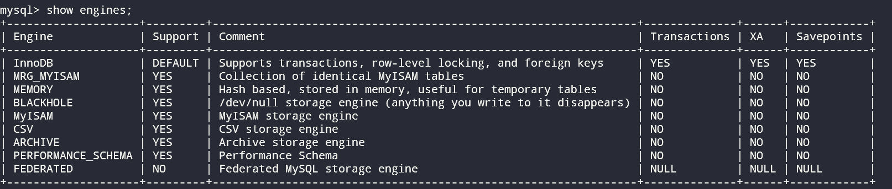

# MySQL支持的存储引擎

- **InnoDB**：具备**外键支持功能的事务处理引擎**
- **MyISAM**：主要的**非事务处理存储引擎**
- **MEMORY**：置于**内存**的表

- ARCHIVE：用于数据存档的引擎（行被插入后就不能再修改了）
- BLACKHOLE：这种存储引擎会丢弃写操作，读操作会返回空内容
- CSV：这种存储引擎在存储数据时，会以逗号作为数据项之间的分隔符
- FEDERATED：用来访问远程表的存储引擎
- MERGE：用来管理由多个 MyISAM表构成的表集合
- NDB：MySQL集群专用存储引擎

**查看mysql支持的存储引擎：**

# 表的磁盘存储方式

每次创建表时，MySQL都会创一个`xxx(表名).frm`的磁盘文件，用来保存该表的格式（表的定义），无论是那种存储引擎都会统一创建该磁盘文件，用来管理表的信息。除了.frm文件外，各个存储引擎还会创建其他文件来保存表数据，如：

- **InnoDB**：.ibd（存放数据和索引）
- **MyISAM**：.MYD（存放数据）、.MYI（存放索引）
- **CSV**：.CSV（存放数据）、.CSM（存放元数据）

**MEMORY**存储引擎会把表的数据和索引存储在内存中！

# InnoDB存储引擎

InnoDB是5.5.8版本后MySQL默认的存储引擎，其主要功能如下：

- 支持事务；
- 支持行锁；
- 支持外键；
- 默认读操作不会产生锁；
- 通过多版本并发控制（MMVC）获得高并发性，并且实现了SQL标准的四种隔离级别，默认为REPEATBLE级别；
- InnoDB存储引擎采用聚集（clustered）的方式存储表中的数据，因此表都是按主键的顺序存放。如果没有显式的定义主键，则InnoDB会为每一行生成一个6字节的ROWID作为该表的主键。
- 从 MySQL5.6开始，InnoDB支持**全文搜索**和**FULLTEXT索引**；

InnoDB存储引擎详解

# MyISAM存储引擎

MyISAM存储引擎的主要功能如下：

- 不支持事务；（并非所有的数据都需要事务，业务的主要功能为查询，就不需要事务）
- 支持表锁；
- MyISAM缓存池仅缓存索引文件，不缓存数据文件；
- MyISAM存储引擎表有MYD和MYI组成，MYD存放数据文件，MYI存放索引文件，其索引文件通常会被进行压缩处理；
- 每个 MyISAM表都有一个标志，它会在执行表检查操作时被设置。MyISAM表还有个标志，用于表明该表在上次使用后是否被正常关闭。如果服务器意外宕机或机器崩溃，那么可用这个标志来判断表是否需要检查和修复；
- 支持全文检索和 FULLTEXT素引。支持空间数据类型和 SPATIAL索引；

# MEMORY存储引擎

MEMORY存储引擎会把表储存在内存里，并且这些表的行长度固定不变。这两个特性使得它的相关操作非常快。

- 因为数据全都在内存中，只要内存断电，则数据就会消失；
- 支持表锁，并发性能差；
- 不支持TEXT和BLOB类型。若包含此类型，则会转为MyISAM存储引擎表，数据将会存放到磁盘中；

- 默认情况下，MEMORY表使用的是散列索引——这种索引对于“相等比较”非常快，但是对于范围比较（<、>、等）不适合（散列的特性使然）同样也不适合`ORDER BY`；
- 存储在MEMORY表里的行使用长度固定不变的格式。因此不能使用长度可变的数据类型BLOB和TEXT。`PS`：VARCHAR是一种长度可变的类型，但由于在MySQL内部，它被当作是一种长度固定不变的CHAR类型；

PS：MySql 最常用存储引擎 InnoDB 和 MyISAM 都不支持 Hash 索引，它们默认的索引都是 B-Tree。但是如果你在创建索引的时候定义其类型为 Hash，MySql 并不会报错，而且你通过 SHOW CREATE TABLE 查看该索引也是 Hash，只不过该索引实际上还是 B-Tree。

# Archive存储引擎

- Archive存储引擎只支持 INSERT和 SELECT操作。

- 从 MySQL5.1开始支持索引。
- Archive存储引擎使用zib算法将数据行（row）进行压缩后存储，压缩比一般可达1：10。非常适合存储归档数据，如日志信息。
- Archive存储引擎使用行锁来实现高并发的插入操作，但是其本身并不是事务安全的存储引擎，其设计目标主要是提供高速的插入和压缩功能。

# NDB存储引擎

NDB存储引擎是一个集群存储引擎，其特点为：

- 数据全部存放在内存中（MySQL5.1开始非索引数据存放于磁盘中）；
- 可通过添加数据存储节点提高数据库的性能；

# Federated存储引擎

Federated存储引擎表并不存放数据，它只是指向一台远程 MySQL数据库服务器上的表。

当前Federated存储引擎只支持 My SQL数据库表，不支持异构数据库表；

# Maria存储引擎

Maria存储引擎是新开发的引擎，设计目标主要是用来取代原有的 MyISAM存储引擎。

- 支持缓存数据和索引文件；
- 应用了行锁设计；
- 提供了MVCC功能；
- 支持事务和非事务安全的选项；
- 更好的BLOB字符类型的处理性能。