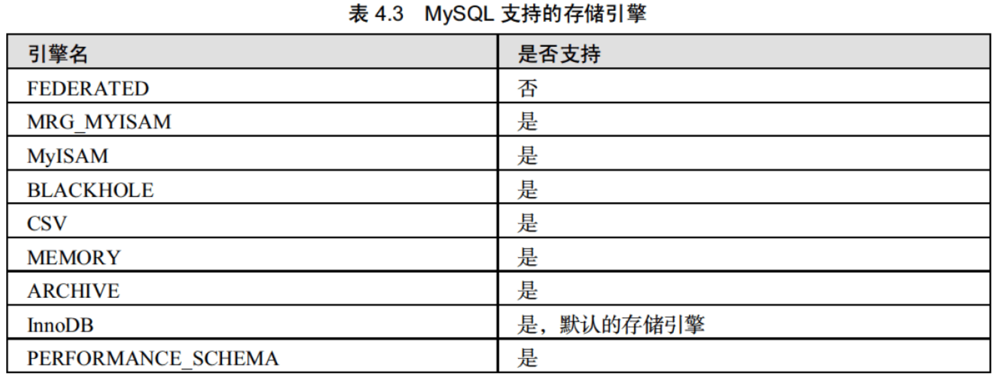

## 0.MySQL中的字段

### 0.1 整型数据


以TINYINT为例（其他整型数据类似）：

创建字段类型为`TINYINT(1)`，则该字段可以取到的有符号整型`最小值：-128`，`最大值：127`。-129和128都是越界值，插入时会报错。

创建`TINYINT(2)`的字段，进行测试同样取最小值：-128，最大值：127。由于**TINYINT只占用1个字节**，所以即使声明为2个字节大小，也只能存储一个字节的值。

PS：一个字节（bytes） = 八位（bits）。八位可以表示无符号整数：2^8 - 1 = 256 - 1 = 255，即表示 0-255 范围的数字大小。

### 0.2 浮点和定点数据类型

浮点数分为两种：单精度浮点类型（FLOAT）和双精度浮点类型（DOUBLE）。

定点数类型为：DECIMAL

浮点数类型和定点数类型都可以用（M，N）来表示。其中，`M称为精度`，表示总共的位数；`N称为标度`，表示小数的位数。	


以`FLOAT(5,3)`为例：其值在数据库中为55.0001，则在查询时因为M精度的设置，只能显示5位数字，因此该值会被`四舍五入`为：55.000，同理若为55.0006，则会四舍五入为55.001。

此外：**FLOAT和DOUBLE存储的是近似值，而DECIMAL存储的是字符串**，所以会不对数值进行四舍五入，因此精确度更高（例如：DECIMAL(5,3)，其值设置为55.0001和55.0009都会显示55.000）。

在定义商品价格之类的类型时，使用FLOAT足以。

### 0.3 日期与时间类型


……

### 0.4 字符串类型

`CHAR（M）`和`VARCHAR（M）`表示在创建表时指定的存储字符串的最大长度为M。

`CHAR类型`是固定长度的。取值范围为：0-255之间的任意值，设置成功后长度不变（即占用存储空间大小被固定）

`VARCHAR类型`是变长的。取值范围为：0-65535之间的任意值，设置最大值之后，其存储空间根据字符串长度进行变化。**例如：VARCHAR（10），但是只占用了5个字节的大小，因此该字段的空间只占用5+1个字节，最后一个字节位结束标识符。**

对CHAR和VARCHAR的取值范围进行测试，定义CHAR（5）和 VARCHAR（5）只能存储一个字节大小的数据。

| CHAR（5）      | 占用字节     | VARCHAR（5）   | 占用字节     |
| -------------- | ------------ | -------------- | ------------ |
| ""（空字符串） | 5            | ""（空字符串） | 1            |
| "ab1"          | 5            | "数字1"        | 4            |
| "12345"        | 5            | "12345"        | 6            |
| "插入六个汉字" | 越界禁止插入 | "插入1234"     | 越界禁止插入 |

### 0.5 TEXT类型

TEXT类型是一种特殊的字符串类型，其中汉字占用3字节，数字字母占用1字节。包括：TINYTEXT，TEXT，MEDIUMTEXT，LONGTEXT

| 类型       | 允许的长度                      | 存储空间         |
| ---------- | ------------------------------- | ---------------- |
| TINYTEXT   | 0-255字节                       | 值的长度+2个字节 |
| TEXT       | 0-65535字节                     | 值的长度+2个字节 |
| MEDIUMTEXT | 0-16772150字节                  | 值的长度+3个字节 |
| LONGTEXT   | 0-4294967295字节（2^32-1 = 4G） | 值的长度+4个字节 |

PS：UTF-8对字符串编码，一个汉字占用3个字节，一个字母和数字占用1个字节（mysql配置启用UTF-8编码）

TINYTEXT默认取值255不可更改大小，因此TINTEXT可以存储255个英文字母，85个汉字。

其余类型可以取固定存储长度。

### 0.6 ENUM类型

ENUM是一个字符串对象，其值为表创建时在列规定中枚举的一列值。语法格式如下：

```
字段名 ENUM ('值1’，'值2'，…… '值n'）
```

其中，“字段名”指将要定义的字段，“值n”指枚举列表中的第n个值。ENUM类型的字段在取值时，只能在指定的枚举列表中取，而且一次只能取一个。创建的成员中有空格时，其尾部的空格将自动被删除。ENUM值在内部用整数表示，并且每个枚举值均有一个索引值：列表值所允许的成员值从1开始编号，MySQL存储的就是这个索引编号。枚举最多可以有65535个元素。
例如，定义ENUM类型的列（' first'，'second'，'third'）该列可以取的值和每个值的索引如表5.7所示。


### 0.7 SET类型

SET是一个字符串对象，可以有零或多个值。SET列最多可以有64个成员，其值为表创建时规定的一列值。指定包括多个SET成员的SET列值时，各成员之间用逗号（）间隔开。语法格式如

```
SET ('值1','值2',……,'值n')
```

与ENUM类型相同，SET值在内部用整数表示，列表中每一个值都有一个索引编号。当创建表时，SET成员值的尾部空格将自动被删除。

与ENUM类型不同的是，ENUM类型的字段只能从定义的列值中选择一个值插入，而SET类型的列可从定义的列值中选择多个字符的联合。
如果插入SET字段中列值有重复，则 MySQL自动删除重复的值；插入SET字段的值的顺序并不重要，MySQL会在存入数据库时按照定义的顺序显示；如果插入了不正确的值，默认情况下，MySQL将忽视这些值，并给出警告


### 0.8 二进制数据类型


#### 0.8.1 BIT类型

BIT类型是位字段类型。M表示每个值的位数，范围为1~64。如果M被省略，默认为1。如果为BIT（M）列分配的值的长度小于M位，就在值的左边用0填充。例如，为BIT（6列分配一个值b'l01’，其效果与分配b'000101相同。BIT数据类型用来保存位字段值。例如，以二进制的形式保存数据13（13的二进制形式为1101），在这里需要位数至少为4位的BIT类型，即可以定义列类型为BIT（4），大于二进制1111的数据是不能插入BIT（4）类型的字段中的。

#### 0.8.2 BINARY和 VARBINARY类型类

BINARY和 VARBINARY类型类似于CHAR和 VARCHAR，不同的是它们包含二进制字节字符串。其使用的语法格式如下：列名称 BINARY（M）或者 VARBINARY（M）
BINARY类型的长度是固定的，指定长度之后，不足最大长度的，将在它们右边填充“0’补齐以达到指定长度。例如：指定列数据类型为 BINARY（3），当插入a’时，存储的内容实际为“a00”，当插入“ab”时，实际存储的内容为“ab0”，不管存储的内容是否达到指定的长度，其存储空间均为指定的值M VARBINARY类型的长度是可变的，指定好长度之后，其长度可以在0到最大值之间。例如：指定列数据类型为 VARBINARY（20），如果插入的值的长度只有10，则实际存储空间为10加1，即实际占用的空间为字符串的实际长度加1。

#### 0.8.3 BLOB类型

BLOB列存储的是二进制字符串（字节字符串），TEXT列存储的是非二进制字符串（字符字符串）。BLOB列没有字符集，并且排序和比较基于列值字节的数值；TEXT列有一个字符集，并且根据字符集对值进行排序和比较。


BLOB列存储的是二进制字符串（字节字符串），TEXT列存储的是非二进制字符串（字符字符串）。BLOB列没有字符集，并且排序和比较基于列值字节的数值；TEXT列有一个字符集，并且根据字符集对值进行排序和比较。

## 1. 数据库操作

### 1.1 创建数据库

```mysql
# 创建数据库
mysql> create database db_test; 

# 查看创建好的数据库
mysql> show create database db_test\G
*************************** 1. row ***************************
       Database: db_test
Create Database: CREATE DATABASE `db_test` /*!40100 DEFAULT CHARACTER SET utf8 */

# 使用db_test数据库
mysql> use db_test;
```

### 1.2 删除数据库

```mysql
mysql> drop database db_test;
```

### 1.3 显示数据库信息

```mysql
mysql> show databases;
+--------------------+
| Database           |
+--------------------+
| information_schema |
| mysql              |
| performance_schema |
| sys                |
| test_msyql8        |
+--------------------+
6 rows in set (0.01 sec)
```


## 2. 数据库表操作

### 2.1 创建数据库表

创建数据库表的基本语法规则如下：


#### 2.1.1 表的基本创建

```mysql
# 基本创建tb_emp1表
mysql> create table tb_emp1
(
 	id int(11),
	name varchar(25),
 	deptId int(11),
	salary float
 );
 Query OK, 0 rows affected (0.34 sec)
 
 # 查看所有的表
 mysql> show tables;
+-------------------+
| Tables_in_db_test |
+-------------------+
| tb_emp1           |
+-------------------+
1 row in set (0.01 sec)
```

#### 2.1.2 对表字段进行约束

方式一：

```mysql
CREATE TABLE tb_emp2
(
	id INT(11) PRIMARY KEY AUTO_INCREMENT, 	# 主键，自增约束（自增字段必须为整数）
	name VARCHAR(25) NOT NULL,				# 不为空约束
	deptId INT(11) UNIQUE,					# 唯一性约束
	salary FLOAT DEFAULT 0.0				# 默认值约束
 );
```

方式二：

```mysql
CREATE TABLE tb_emp3
(
	id INT(11) AUTO_INCREMENT,
	NAME VARCHAR(25) NOT NULL,
	deptId INT(11),
	salary FLOAT DEFAULT 0.0,
	PRIMARY KEY(id),# 主键约束
	CONSTRAINT costum_name_for_unique UNIQUE(deptId),# 唯一性约束
	CONSTRAINT costum_name_for_foreign_key FOREIGN KEY (deptId) REFERENCES tb_emp2(id) 
    # 外键约束：定义名称为costum_name_for_foreign_key外键，tb_emp3的deptId作为外键关联到tb_emp2表的主	   键id
 );
```

#### 2.1.3 查看表的结构

```mysql
# 查看表的基本结构：desc 表名; 或 describe 表名; 
mysql> describe tb_emp3; 
+--------+-------------+------+-----+---------+----------------+
| Field  | Type        | Null | Key | Default | Extra          |
+--------+-------------+------+-----+---------+----------------+
| id     | int(11)     | NO   | PRI | NULL    | auto_increment |
| name   | varchar(25) | NO   |     | NULL    |                |
| deptId | int(11)     | YES  | UNI | NULL    |                |
| salary | float       | YES  |     | 0       |                |
+--------+-------------+------+-----+---------+----------------+
4 rows in set (0.01 sec)

# 查看表详细结构: 末尾+\G目的是清晰直观的显示结果
mysql> show  create table tb_emp3\G
*************************** 1. row ***************************
       Table: tb_emp3
Create Table: CREATE TABLE `tb_emp3` (
  `id` int(11) NOT NULL AUTO_INCREMENT,
  `name` varchar(25) NOT NULL,
  `deptId` int(11) DEFAULT NULL,
  `salary` float DEFAULT '0',
  PRIMARY KEY (`id`),
  UNIQUE KEY `costum_name_for_unique` (`deptId`),
  CONSTRAINT `costum_name_for_foreign_key` FOREIGN KEY (`deptId`) REFERENCES `tb_emp2` (`id`)
) ENGINE=InnoDB DEFAULT CHARSET=utf8
1 row in set (0.00 sec)
```

### 2.2 修改数据表

#### 2.2.1 修改表名

`ALTER TABLE <旧表名> RENAME [TO] <新表名>；`TO为可选参数，选不选无所谓

```mysql
mysql> alter table tb_emp2 rename tb_emp4;
```

#### 2.2.2 修改字段信息

`ALTER TABLE <表名> MODIFY <字段名> <数据类型>`

`ALTER TABLE <表名> CHANGE <旧字段名> <新字段名> <新数据类型>；`

```mysql
# 修改字段name的大小为100字符
mysql> alter table tb_emp4 modify name varchar(100);
Query OK, 0 rows affected (0.92 sec)

# 修改字段名称：将name修改为emp_name并重新指定大小为varchar(50)
mysql> alter table tb_emp4 change name emp_name varchar(50);
Query OK, 0 rows affected (0.75 sec)
```

#### 2.2.3 添加字段

`ALTER TABLE <表名> ADD <新字段名> <数据类型> [约束条件] [FIRST| AFTER已存在字段名]；`

新字段名为需要添加的字段的名称；“FIRST”为可选参数，其作用是将新添加的字段设置为表的第一个字段；“AFTER”为可选参数，其作用是将新添加的字段添加到指定的“已存在字段名”的后面。

```mysql
# 添加字段managerId
mysql> alter table tb_emp4 add managerId int(10);
Query OK, 0 rows affected (0.61 sec)

# 查看添加结果
mysql> desc tb_emp4;
+-----------+-------------+------+-----+---------+----------------+
| Field     | Type        | Null | Key | Default | Extra          |
+-----------+-------------+------+-----+---------+----------------+
| id        | int(11)     | NO   | PRI | NULL    | auto_increment |
| emp_name  | varchar(50) | YES  |     | NULL    |                |
| deptId    | int(11)     | YES  | UNI | NULL    |                |
| salary    | float       | YES  |     | 0       |                |
| managerId | int(10)     | YES  |     | NULL    |                |
+-----------+-------------+------+-----+---------+----------------+
5 rows in set (0.00 sec)
```

#### 2.2.4 修改字段的排列位置

`ALTER TABLE <表名> MODIFY <字段1> <数据类型> FIRST| AFTER <字段2>；`

#### 2.2.5 删除字段

`ALTER TABLE <表名> DROP <字段名>；`

```mysql
alter table tb_emp4 drop managerId;
```

#### 2.2.6 修改存储引擎



`ALTER TABLE <表名> ENGINE=<更改后的存储引擎名>；`

```mysql
# mysql8默认使用InnoDB存储引擎
mysql> alter table tb_emp1 engine=MyISAM;

# 查看表的信息
mysql> show create table tb_emp1\G
*************************** 1. row ***************************
       Table: tb_emp1
Create Table: CREATE TABLE `tb_emp1` (
  `id` int(11) DEFAULT NULL,
  `name` varchar(25) DEFAULT NULL,
  `deptId` int(11) DEFAULT NULL,
  `salary` float DEFAULT NULL
) ENGINE=MyISAM DEFAULT CHARSET=utf8
1 row in set (0.00 sec)
```

#### 2.2.7 删除表的外键约束

`ALTER TABLE <表名> DROP FOREIGN KEY <外键约束名>;`

```mysql
mysql> alter table tb_emp3 drop foreign key costum_name_for_foreign_key;
```

### 2.3 删除数据库表

#### 2.3.1 删除没有被关联的表

`DROP TABLE [IF EXISTS] 表1，表2，…表n；`

```
mysql> drop table if exists tb_emp1;  
```

#### 2.3.2 删除被关联的表

```markdown
# 相关联的两个表为主表和子表，删除的情况有
# 1.先删除子表，后删除主表
# 2.删除主表，保留子表：可以先删除两个表之间的外键关系，后执行删除操作。
```

## 3. 查询数据

### 3.1 查询语句的基本格式

```mysql
SELECT
	{ * | <字段列表> }
	[ FROM<表1>，<表2>……
        [WHERE<表达式>
        [GROUP BY <group by definition>]
        [HAVING <expression>[（<operator> <expression>）]
        [ORDER BY <order by definition>]
        [LIMIT[<offset>，]<row count>]
     ]

SELECT[字段1，字段2，…，字段n]
FROM[表或视图]
WHERE[查询条件];
```

- `{*丨<字段列表}`包含星号通配符和字段列表，表示查询的字段。其中，字段列表至少包含一个字段名称，如果要查询多个字段，多个字段之间用逗号隔开，最后一个字段后不加逗号
- `FROM<表1>，<表2>…`，表1和表2表示查询数据的来源，可以是单个或者多个。
- `WHERE`子句是可选项，如果选择该项，将限定查询行必须满足的查询条件`GROUP BY<字段>`，该子句告诉 My SQL如何显示查询出来的数据，并按照指定的字段分组。
- `[ORDER BY<字段>]`，该子句告诉 MySQL按什么样的顺序显示查询出来的数据，可以进行的排序有升序（ASC）、降序（DESC）
- `LIMIT[<offset>,]< row count>]`，该子句告诉 MySQL每次显示查询出来的数据条数

### 3.2 基本的查询

#### 3.2.1 查询字段

```mysql
# 查询所有字段
SELECT * FROM  fruits;

# 查询指定字段
SELECT f_id, f_name FROM fruits;
```

#### 3.2.2 指定条件查询

##### 1.范围查询
```mysql
SELECT * FROM fruits WHERE f_price>=10 and f_price<=20;
```

##### 2.BETWEEN AND 查询
```mysql
SELECT * FROM fruits WHERE f_price BETWEEN 10 AND 20;
```

##### 3.IN查询

返回满足指定信息的数据

```mysql
mysql> SELECT * FROM fruits WHERE s_id IN (101,102);
+------+------+------------+---------+
| f_id | s_id | f_name     | f_price |
+------+------+------------+---------+
| a1   |  101 | apple      |    5.20 |
| b1   |  101 | blackberry |   10.20 |
| bs1  |  102 | orange     |   11.20 |
| c0   |  101 | cherry     |    3.20 |
| t1   |  102 | banana     |   10.30 |
| t2   |  102 | grape      |    5.30 |
+------+------+------------+---------+
```

##### 4.NOT IN  查询

返回不包含101 和 102 的数据

```msyql
mysql> SELECT * FROM fruits WHERE s_id NOT IN (101,102);
```

##### 5.LIKE 字符匹配查询

 返回 首字母为b名称的数据

```mysql
mysql> SELECT * FROM fruits WHERE f_name LIKE 'b%';
+------+------+------------+---------+
| f_id | s_id | f_name     | f_price |
+------+------+------------+---------+
| b1   |  101 | blackberry |   10.20 |
| b2   |  104 | berry      |    7.60 |
| t1   |  102 | banana     |   10.30 |
+------+------+------------+---------+
```

##### 6. _ 下划线通配符

一次只能匹配任意一个字符

```mysql
mysql> SELECT * FROM fruits WHERE f_name LIKE '_b%';
+------+------+---------+---------+
| f_id | s_id | f_name  | f_price |
+------+------+---------+---------+
| m2   |  105 | xbabay  |    2.60 |
| t4   |  107 | xbababa |    3.60 |
+------+------+---------+---------+
```

##### 7.空值查询ISNULL
```mysql
SELECT * FROM fruits WHERE ISNULL(f_name);
```

##### 8.非空值查询
```mysql
SELECT * FROM fruits WHERE f_name IS NOT NULL;
```

##### 9.多AND查询

```mysql
SELECT * FROM fruits WHERE s_id=101 AND f_price>2;
+------+------+------------+---------+
| f_id | s_id | f_name     | f_price |
+------+------+------------+---------+
| a1   |  101 | apple      |    5.20 |
| b1   |  101 | blackberry |   10.20 |
| c0   |  101 | cherry     |    3.20 |
+------+------+------------+---------+

SELECT * FROM fruits WHERE s_id=101 AND f_price>2 AND f_name=apple;
```

##### 10.OR查询

```mysql
SELECT * FROM fruits WHERE s_id=101 OR s_id=102;
+------+------+------------+---------+
| f_id | s_id | f_name     | f_price |
+------+------+------------+---------+
| a1   |  101 | apple      |    5.20 |
| b1   |  101 | blackberry |   10.20 |
| bs1  |  102 | NULL       |   11.20 |
| c0   |  101 | cherry     |    3.20 |
| t1   |  102 | banana     |   10.30 |
| t2   |  102 | grape      |    5.30 |
+------+------+------------+---------+
```

##### 11.查询结果不重复

```mysql
# 仅返回不同的s_id
mysql> SELECT DISTINCT s_id FROM fruits;
+------+
| s_id |
+------+
|  101 |
|  103 |
|  104 |
|  107 |
|  102 |
|  105 |
|  106 |
+------+
```

##### 12.查询结果排序

```mysql
mysql> SELECT f_price FROM fruits ORDER BY f_price;
+---------+
| f_price |
+---------+
|    2.20 |
|    2.60 |
|    3.20 |
|    3.60 |
|    3.60 |
|    5.20 |
|    5.30 |
|    6.40 |
|    7.60 |
|    8.20 |
|    9.20 |
|   10.20 |
|   10.30 |
|   11.20 |
|   11.60 |
|   15.60 |
+---------+
```

##### 13.多列排序

```mysql
mysql> SELECT f_name, f_price FROM fruits ORDER BY f_name,f_price;
+------------+---------+
| f_name     | f_price |
+------------+---------+
| apple      |    5.20 |
| apricot    |    2.20 |
| banana     |   10.30 |
| berry      |    7.60 |
| blackberry |   10.20 |
| cherry     |    3.20 |
| grape      |    5.30 |
| lemon      |    6.40 |
| mango      |   15.60 |
| melon      |    8.20 |
| xbababa    |    3.60 |
| xbabay     |    2.60 |
| xxtt       |   11.60 |
| xxxx       |    3.60 |
+------------+---------+
```

##### 14.指定排序方向

```mysql
# DESC 降序， ASC 升序
mysql> SELECT f_price FROM fruits ORDER BY f_price DESC;
+---------+
| f_price |
+---------+
|   15.60 |
|   11.60 |
|   11.20 |
|   10.30 |
|   10.20 |
|    9.20 |
|    8.20 |
|    7.60 |
|    6.40 |
|    5.30 |
|    5.20 |
|    3.60 |
|    3.60 |
|    3.20 |
|    2.60 |
|    2.20 |
+---------+
```

##### 15.分组查询

```mysql
# GROUP BY 通常与聚集函数搭配使用
SELECT s_id, COUNT(*) FROM fruits GROUP BY s_id;
+------+----------+
| s_id | COUNT(*) |
+------+----------+
|  101 |        3 |
|  103 |        2 |
|  104 |        2 |
|  107 |        2 |
|  102 |        3 |
|  105 |        3 |
|  106 |        1 |
+------+----------+

# GROUP_CONCAT函数 可以将想要聚集的字段值进行汇总
mysql> SELECT s_id, GROUP_CONCAT(f_name) FROM fruits GROUP BY s_id;      
+------+-------------------------+
| s_id | GROUP_CONCAT(f_name)    |
+------+-------------------------+
|  101 | apple,blackberry,cherry |
|  102 | banana,grape            |
|  103 | apricot,                |
|  104 | berry,lemon             |
|  105 | melon,xbabay,xxtt       |
|  106 | mango                   |
|  107 | xxxx,xbababa            |
+------+-------------------------+

# GROUP BY 通常与 HAVING 一起限定显示记录所满足的条件
SELECT s_id, GROUP_CONCAT(f_name) FROM fruits 
GROUP BY s_id HAVING COUNT(f_name) > 1;  

+------+-------------------------+
| s_id | GROUP_CONCAT(f_name)    |
+------+-------------------------+
|  101 | apple,blackberry,cherry |
|  102 | banana,grape            |
|  103 | apricot,                |
|  104 | berry,lemon             |
|  105 | melon,xbabay,xxtt       |
|  107 | xxxx,xbababa            |
+------+-------------------------+

# GROUP BY 与 WITH ROLLUP的使用会在查询记录中增加记录数据总数
mysql> SELECT s_id, COUNT(*) AS total FROM fruits GROUP BY s_id WITH ROLLUP;
+------+-------+
| s_id | total |
+------+-------+
|  101 |     3 |
|  102 |     3 |
|  103 |     2 |
|  104 |     2 |
|  105 |     3 |
|  106 |     1 |
|  107 |     2 |
| NULL |    16 |
+------+-------+
```

`HAVING与WHERE的区别`

HAVING在数据分组之后进行过滤来选择分组，而 WHERE在分组之前来选择记录。另外，WHERE排除的记录不再包括在分组中

##### 16.LIMIT查询

```mysql
# 通常用于分页查询
mysql> SELECT * FROM fruits LIMIT 4,3;
+------+------+--------+---------+
| f_id | s_id | f_name | f_price |
+------+------+--------+---------+
| b5   |  107 | xxxx   |    3.60 |
| bs1  |  102 | NULL   |   11.20 |
| bs2  |  105 | melon  |    8.20 |
+------+------+--------+---------+
```

### 3.3 聚合函数

#### 3.3.1 COUNT()

#### 3.3.2 SUM()

#### 3.3.3 AVG()

#### 3.3.4 MAX()

#### 3.3.5 MIN()

### 3.4 连接查询

#### 3.4.1 内连接查询

内连接查询使用INNER JOIN 对若干表进行连接查询。查询结果为：返回查询结果集合中仅是符合查询条件和连接条件的行，相当于使用where条件连接若干表指定的行进行查询，如下：

```mysql
# 使用where连接两张表进行查询
SELECT suppliers.s_id, s_name,f_name, f_price
FROM fruits ,suppliers
WHERE fruits.s_id = suppliers.s_id;	
 
 +------+----------------+------------+---------+
| s_id | s_name         | f_name     | f_price |
+------+----------------+------------+---------+
|  101 | FastFruit Inc. | apple      |    5.20 |
|  103 | ACME           | apricot    |    2.20 |
|  101 | FastFruit Inc. | blackberry |   10.20 |
|  104 | FNK Inc.       | berry      |    7.60 |

# 使用INNER JOIN连接两张表
SELECT suppliers.s_id, s_name,f_name, f_price
FROM fruits INNER JOIN suppliers
ON fruits.s_id = suppliers.s_id;

 +------+----------------+------------+---------+
| s_id | s_name         | f_name     | f_price |
+------+----------------+------------+---------+
|  101 | FastFruit Inc. | apple      |    5.20 |
|  103 | ACME           | apricot    |    2.20 |
|  101 | FastFruit Inc. | blackberry |   10.20 |
|  104 | FNK Inc.       | berry      |    7.60 |
```

`使用INNER JOIN内连接查询的性能优于where条件查询`

#### 3.4.2 外连接查询

- `LEFT JOIN`（左连接）：返回包括左表中的所有记录和右表中连接字段相等的记录。
- `RIGHT JOIN`（右连接）：返回包括右表中的所有记录和左表中连接字段相等的记录。

```mysql
# 左连接查询保存左表的所有数据
SELECT customers.c_id, orders.o_num
FROM customers LEFT OUTER JOIN orders
ON customers.c_id = orders.c_id;

+-------+-------+
| c_id  | o_num |
+-------+-------+
| 10001 | 30001 |
| 10003 | 30002 |
| 10004 | 30003 |
| 10001 | 30005 |
| 10002 |  NULL |
+-------+-------+

# 右连接查询保存右表的所有数据
SELECT customers.c_id, orders.o_num
FROM customers RIGHT OUTER JOIN orders
ON customers.c_id = orders.c_id;

+-------+-------+
| c_id  | o_num |
+-------+-------+
| 10001 | 30001 |
| 10003 | 30002 |
| 10004 | 30003 |
|  NULL | 30004 |
| 10001 | 30005 |
+-------+-------+
```

#### 3.4.3 复合条件连接查询

### 3.5 子查询

#### 3.5.1 ANY、SOME子查询

#### 3.5.2 ALL子查询

#### 3.5.3  EXIST子查询

#### 3.5.4  IN子查询

#### 3.5.5  大小比较子查询

### 3.6 合并查询结果

### 3.7 正则表达式查询	

## 4.插入更新删除

### 4.1 插入数据

```mysql
# 向表中插入所有列数据
INSERT INTO person (name, age,info) VALUES('Willam', 20, 'sports man');

# 向表中指定列插入数据
INSERT INTO person (name, age ) VALUES ('Laura', 25);

# 插入多条 数据
INSERT INTO person_old
     VALUES (11,'Harry',20, 'student'), (12,'Beckham',31, 'police');
```

### 4.2 更新

```mysql
# 更新person表中 id = 11 的数据
UPDATE person SET age = 15, name='LiMing' WHERE id = 11;

UPDATE person SET info='student'  WHERE id  BETWEEN 19 AND 22;
```

### 4.3 删除

```mysql
# 删除表中记录
DELETE FROM person WHERE age BETWEEN 19 AND 22;

# 删除表中所有记录
DELETE FROM person;

# 删除表
DROP TABLE person;
```


## 5.索引

### 5.1 索引的基本概念

**索引的特点：**MySQL中索引的存储类型有两种，即 `BTREE`和`HASH`，具体和表的存储引擎相关；`MyISAM`和`InnoDB`存储引擎只支持 `BTREE索引`；`MEMORY/HEAP存储引擎`可以支持`HASH和 BTREE索引`。
索引的优点主要有以下几条：

- 通过创建唯一索引，可以保证数据库表中每一行数据的唯一性。
- 可以大大加快数据的查询速度。
- 在实现数据的参考完整性方面，可以加速表和表之间的连接。
- 在使用分组和排序子句进行数据查询时，也可以显著减少查询中分组和排序的时间。

缺点为：

- 创建索引和维护索引要耗费时间，并且随着数据量的增加所耗费的时间也会增加
- 索引需要占磁盘空间，除了数据表占数据空间之外，每一个索引还要占一定的物理空间，如果有大量的索引，索引文件可能比数据文件更快达到最大文件尺寸。
- 当对表中的数据进行增加、删除和修改的时候，索引也要动态地维护，这样就降低了数据的维护速度。

**索引的分类：**

- **普通索引和唯一索引**
  普通索引是 MySQL中的基本索引类型，允许在定义索引的列中插入重复值和空值唯一索引要求索引列的值必须唯一，但允许有空值；主键索引是一种特殊的唯一索引，不允许有空值。

- **单列索引和组合索引**
  单列索引即一个索引只包含单个列，一个表可以有多个单列索引。
  组合索引是指在表的多个字段组合上创建的索引，只有在查询条件中使用了这些字段的左边字段时，索引才会被使用。使用组合索引时遵循最左前缀集合（如果最左前缀的组合是乱序的，MySQL在执行时会对该组合进行优化达到最左前缀的效果）。

- **全文索引**

  全文索引类型为 FULLTEXT，在定义索引的列上支持值的全文查找，允许在这些索引列中插入重复值和空值。全文索引可以在CHAR、VARCHAR或者TEXT类型的列上创建。

  从 MySQL5.6开始，InnoDB支持**全文搜索**和**FULLTEXT索引**。

- **空间索引**

  空间索引是对空间数据类型的字段建立的索引，MySQL中的空间数据类型有4种，分别是GEOMETRY、POINT、LINESTRING和 POLYGON。MySQL使用 SPATIAL关键字进行扩展，使得能够用创建正规索引类似的语法创建空间索引。创建空间索引的列，必须将其声明为NOT NUL，空间索引只能在存储引擎为 MyISAM的表中创建。

**索引的设计原则：**

- 索引并非越多越好，一个表中如有大量的索引，不仅占用磁盘空间，还会影响 INSERT、DELETE、UPDATE等语句的性能。
- 避免对经常更新的表进行过多的索引，并且索引中的列要尽可能少。应该经常用于查询的字段创建索引。
- 数据量小的表最好不要使用索引。
- 在条件表达式中经常用到的不同值较多的列上建立索引，在不同值很少的列上不要建立索引。
- 当唯一性是某种数据本身的特征时，指定唯一索引。使用唯一索引需能确保定义的列的数据完整性，以提高査询速度。
- 在频繁进行排序或分组（即进行 group by或 order by操作）的列上建立索引，如果待排序的列有多个，可以在这些列上建立组合索引。

### 5.2  创建表时创建索引

创建表时创建索引的语法：

`CREATE TABLE 表名 [col name data type]`
`[UNIQUE I FULLTEXT I SPATIAL] [INDEX I KEY] [index_name] (col_name [length])  [ASC | DESC]`

**UNIQUE、FULLTEXT和 SPATIAL**为可选参数，分别表示唯一索引、全文索引和空间索引；

**INDEX与KEY**为同义词，两者作用相同，用来指定创建索引；

**col_name**为需要创建索引的字段列，该列必须从数据表中定义的多个列中选择；

**index_name**指定索引的名称，为可选参数，如果不指定，MySQL默认 col_name为索引值；length为可选参数，表示索引的长度，只有字符串类型的字段才能指定索引长度；

**ASC或DESC**指定升序或者降序的索引值存储。

```mysql
# 创建普通索引
CREATE TABLE book
(
    bookid            	INT NOT NULL,
    bookname          	VARCHAR(255) NOT NULL,
    authors            	VARCHAR(255) NOT NULL,
    info               	VARCHAR(255) NULL,
    comment           	VARCHAR(255) NULL,
    year_publication   	YEAR NOT NULL,
	INDEX(year_publication) # 在字段year_publication上建立普通索引
);

# 查看索引是否创建成功
explain select * from book where year_publication=1990 \G
*************************** 1. row ***************************
           id: 1
  select_type: SIMPLE				# SELECT查询类型
        table: book
   partitions: NULL
         type: ref
possible_keys: year_publication		# 可用的索引
          key: year_publication		# 实际使用的索引
      key_len: 1					# 索引按字节计算的长度，key len数值越小，表示越快。
          ref: const
         rows: 1
     filtered: 100.00
        Extra: Using index condition
1 row in set, 1 warning (0.00 sec)

# 创建唯一索引
CREATE TABLE t1
(
    id    INT NOT NULL,
    name CHAR(30) NOT NULL,
    UNIQUE INDEX UniqIdx(id) # 在字段id上创建名为UniqIdx的唯一索引
);

# 创建单列索引
CREATE TABLE t2
(
    id   INT NOT NULL,
    name CHAR(50) NULL,
    INDEX SingleIdx(name(20))
);

# 建立组合索引
CREATE TABLE t3
(
    id    INT NOT NULL,
    username CHAR(30) NOT NULL,
    age  INT NOT NULL,
    info VARCHAR(255),
    INDEX MultiIdx(id, username, info(100)) # 组合索引遵循最左前缀原则
);

# 走索引id和username的组合索引
EXPLAIN SELECT * FROM t3 WHERE id=1 AND username='zs'\G;

*************************** 1. row ***************************
           id: 1
  select_type: SIMPLE
        table: t3
   partitions: NULL
         type: ref
possible_keys: MultiIdx
          key: MultiIdx
      key_len: 94
          ref: const,const
         rows: 1
     filtered: 100.00
        Extra: NULL
1 row in set, 1 warning (0.01 sec)

# 由于不存在username，因此只对id进行索引
EXPLAIN SELECT * FROM t3 WHERE id=1 AND info='man'\G; 
*************************** 1. row ***************************
           id: 1
  select_type: SIMPLE
        table: t3
   partitions: NULL
         type: ref
possible_keys: MultiIdx
          key: MultiIdx
      key_len: 4
          ref: const
         rows: 1
     filtered: 50.00
        Extra: Using where
1 row in set, 1 warning (0.01 sec)

# 由于最左前缀id不存在，因此不走索引MultiIdx
EXPLAIN SELECT * FROM t3 WHERE username='zs' AND info='man'; 
*************************** 1. row ***************************
           id: 1
  select_type: SIMPLE
        table: t3
   partitions: NULL
         type: ALL
possible_keys: NULL
          key: NULL
      key_len: NULL
          ref: NULL
         rows: 2
     filtered: 50.00
        Extra: Using where
1 row in set, 1 warning (0.01 sec)

# 即使是乱序，只要存在最左前缀MySQL就会对其进行索引组合优化
EXPLAIN SELECT * FROM t3 WHERE username='zs' AND id=1 AND info='man'; 
*************************** 1. row ***************************
           id: 1
  select_type: SIMPLE
        table: t3
   partitions: NULL
         type: ref
possible_keys: MultiIdx
          key: MultiIdx
      key_len: 397
          ref: const,const,const
         rows: 1
     filtered: 100.00
        Extra: Using where
1 row in set, 1 warning (0.01 sec)

# 创建全文索引
CREATE TABLE t4
(
    id    INT NOT NULL,
    name CHAR(30) NOT NULL,
    age  INT NOT NULL,
    info VARCHAR(255),
    FULLTEXT INDEX FullTxtIdx(info)
) ENGINE=MyISAM;	

# 创建空间索引
CREATE TABLE t5
( 
    g GEOMETRY NOT NULL, # 仅GEOMETRY空间类型可以创建空间索引
    SPATIAL INDEX spatIdx(g) 
)ENGINE=MyISAM;
```

### 5.3 在已有表中创建索引

#### 5.3.1 ALTER TABLE语句创建索引

```mysql
# 查看表的索引
SHOW INDEX FROM book \G
*************************** 1. row ***************************
        Table: book					# 创建索引的表
   Non_unique: 1					# 索引非唯一：0表示唯一索引，1表示非唯一
     Key_name: year_publication		# 索引名称
 Seq_in_index: 1					# 该字段在索引中的位置：主要针对组合索引
  Column_name: year_publication		# 定义索引的列字段
    Collation: A			
  Cardinality: 0
     Sub_part: NULL					# 索引长度
       Packed: NULL
         Null: 						# 表示索引是否能为空
   Index_type: BTREE				# 索引类型
      Comment: 
Index_comment: 	
      Visible: YES
1 row in set (0.06 sec)
```

在已存在的表中添加索引的基本语法结构：

`ALTER TABLE 表名 ADD [ UNIQUE I FULLTEXT I SPATIAL [ INDEX I KEY ]`
`[ index name] (col name [ length],……) [ ASC DESC]`

```mysql
# 添加普通索引
ALTER TABLE book ADD INDEX BkNameIdx ( bookname(30) );

# 查看索引
SHOW INDEX FROM book \G
*************************** 1. row ***************************
        Table: book
   Non_unique: 1
     Key_name: year_publication
 Seq_in_index: 1
  Column_name: year_publication
    Collation: A
  Cardinality: 0
     Sub_part: NULL
       Packed: NULL
         Null: 
   Index_type: BTREE
      Comment: 
Index_comment: 
      Visible: YES
*************************** 2. row ***************************
        Table: book
   Non_unique: 1
     Key_name: BkNameIdx
 Seq_in_index: 1
  Column_name: bookname
    Collation: A
  Cardinality: 0
     Sub_part: 30
       Packed: NULL
         Null: 
   Index_type: BTREE
      Comment: 
Index_comment: 
      Visible: YES
2 rows in set (0.11 sec)

# 在bookId字段上添加唯一索引 UniqidIdx
ALTER TABLE book ADD UNIQUE INDEX UniqidIdx ( bookId );

# 在comment字段添加单列索引，其长度为50
ALTER TABLE book ADD INDEX BkcmtIdx ( comment(50) );

# 添加组合索引
ALTER TABLE book ADD INDEX BkAuAndInfoIdx ( authors(20),info(50) );

# 添加全文索引：其表的存储引擎必须为MyISAM
ALTER TABLE t6 ADD FULLTEXT INDEX infoFTIdx ( info );

# 添加空间索引：其字段必须为GEOMETRY类型
ALTER TABLE t7 ADD SPATIAL INDEX spatIdx(g);
```


#### 5.3.2 使用CREATE INDEX创建索引

基本语法为：`CREATE [UNIQUE | FULLTEXT | SPATIAL] INDEX index_name ON table_name (col_name [length],……) [ASC | DESC]`

```mysql
# 在已存在的表中创建普通索引
CREATE INDEX BkNameIdx ON book(bookname);

# 创建唯一索引
CREATE UNIQUE INDEX UniqidIdx  ON book ( bookId );

# 创建单列索引
CREATE INDEX BkcmtIdx ON book(comment(50) );

# 创建组合索引
CREATE INDEX BkAuAndInfoIdx ON book ( authors(20),info(50) );

# 创建全文索引：其表的存储引擎必须为MyISAM
CREATE FULLTEXT INDEX ON t6(info);

# 创建空间索引：其字段必须为GEOMETRY类型
CREATE SPATIAL INDEX spatIdx ON t7 (g);
```

### 5.4 删除索引

使用`ALTER TABLE`删除索引

```mysql
ALTER TABLE 表名 DROP INDEX index_name;
```

使用`DROP INDEX`删除索引：**DROP INDEX操作最终是映射到 ALTER TABLE操作上进行索引删除的**

```mysql
DROP INDEX index_name ON 表名;
```

单列索引、普通索引或者组合索引等，当包含的字段被完全删除时，索引也会自动删除

## 6. 存储过程和函数

### 6.1 创建存储过程

创建存储过程的基本语法：

`CREATE PROCEDURE sp_name( [ proc_parameter] ) [ characteristics .. ] routine body`

**sp_name:** 存储过程名称

**proc_parameter：**存储过程的参数列表，列表的内容如下

`[IN | OUT | INOUT] param_name type`

可以选择的参数有 IN（输入参数）、OUT（输出参数）、INOUT（输入输出都可以），param_name 为参数名称、type为参数的类型（mysql数据库任意一数据类型）。


```mysql
# 创建简单的存储过程
DELIMITER //					# 修改结束符为 // 

CREATE PROCEDURE Proc()

	BEGIN
		SELECT * FROM fruits;
	END
//
DELIMITER ;						# 修改结束符为 ;

# 带参创建存储过程
CREATE PROCEDURE CountProc(OUT param1 INT)			# 输出参数param1

	BEGIN
		SELECT COUNT(*) INTO param1 FROM fruits;	# 将求得总价格写入Parma1中
	END
//
DELIMITER ;

# 调用测试
CALL CountProc(@totalPrice);
SELECT @totalPrice;
+-------------+
| @totalPrice |
+-------------+
|          16 |
+-------------+
```


### 6.2 创建储存函数

基本语法：

`CREATE FUNCTIoN func_name func_parameter RETURNS type [characteristic …]  routine body`

RETURNS type语句表示函数返回数据的类型；其余的参数与存储过程相同。

```mysql
# 创建存储函数

```

### 6.3 变量的使用

基本语法：`DECLARE var_name[, varname]…… date_type [ DEFAULT value];`

```mysql
# 定义变量
DECLARE @param INT DEFAULT 100;

# 为变量赋值
DECLARE @a, @b, @c INT;
SET @a = 1;
SET @b = 1;
SET @c = @a + @b;

# 使用 SELECT …… INTO 为变量赋值
SELECT a, b INTO @a, @b FROM table_name WHERE id=1;
```

### 6.4 定义条件和处理程序

### 6.5 光标的使用

査询语句可能返回多条记录，如果数据量非常大，需要在存储过程和储存函数中使用光标来逐条读取査询结果集中的记录。应用程序可以根据需要滚动或浏览其中的数据。

光标必须在声明处理程序之前被声明，并且变量和条件还必须在声明光标或处理程序之前被声明。

**创建光标的基本语法：**`DECLARE cursor_name CURSOR FOR select_statement`

```mysql
# 声明光标
DECLARE cursor_fruit CURSOR FOR SELECT f_name, f_price FROM fruits ;

# 打开光标
OPEN cursor_fruit

# 使用光标
FETCH  cursor_fruit INTO fruit_name, fruit_price ; # fruit_name, fruit_price 变量需要提前创建

# 关闭光标
CLOSE  cursor_fruit; 
```

### 6.6 流程控制的使用

#### 6.6.1 IF条件语句

```mysql
IF val IS NULL						# 如果 val == NULL 则打印 val is NULL
  THEN SELECT 'val is NULL';
  ELSE SELECT 'val is not NULL';	# 否则打印 val is not NULL
END IF;								# 结束条件判断
```

#### 6.6.2 CASE条件语句

```mysql
CASE val							# val == 1 则 打印 val is 1
  WHEN 1 THEN SELECT 'val is 1';
  WHEN 2 THEN SELECT 'val is 2';	# val == 2 打印 val is 2
  ELSE SELECT 'val is not 1 or 2';	# val !=1 && val != 2 打印 val is not 1 or 2
END CASE;							# 结束条件判断

# 直接判断
CASE
  WHEN val IS NULL THEN SELECT 'val is NULL';
  WHEN val < 0 THEN SELECT 'val is less than 0';
  WHEN val > 0 THEN SELECT 'val is greater than 0';
  ELSE SELECT 'val is 0';
END CASE;
```

#### 6.6.3 LOOP循环操作

```mysql
# id值小于等于10之前，将重复执行循环过程
DECLARE id INT DEFAULT 0;
add_loop: LOOP  					# add_loop为LOOP语句的标注名称，该参数可忽略
    SET id = id + 1;
      IF id >= 10 THEN  LEAVE add_loop;
      END IF;
END LOOP add_loop; 
```

#### 6.6.4 LEAVE退出循环

```mysql
# 执行count加1的操作。当count的值等于50时，使用LEAVE语句跳出循环
add_num: LOOP  
    SET @count=@count+1;
    IF @count=50 THEN LEAVE add_num ;
END LOOP add_num ; 
```

#### 6.6.5 ITERATE跳转语句

```mysql
# 将执行顺序转到语句开头
CREATE PROCEDURE doiterate()
BEGIN
    DECLARE p1 INT DEFAULT 0;
        my_loop: LOOP
          SET p1= p1 + 1;
          IF p1 < 10 THEN ITERATE my_loop;
          ELSEIF p1 > 20 THEN LEAVE my_loop;
          END IF;
          SELECT 'p1 is between 10 and 20';
    END LOOP my_loop;
END
```

#### 6.6.6 REPEAT 循环语句

```mysql
# 相当于  do { …… } while (id <= 10)
# id值小于等于10之前，将重复执行循环过程
DECLARE id INT DEFAULT 0;
REPEAT
    SET id = id + 1;
    UNTIL  id >= 10
END REPEAT; 
```

#### 6.6.7 WHILE循环语句

```mysql
DECLARE i INT DEFAULT 0;
lab_while: WHILE i < 10 
DO
    SET i = i + 1;
END WHILE lab_while;
```


### 6.7 存储过程和函数的调用

```mysql
 # 创建 存储过程
DELIMITER //
CREATE PROCEDURE CountProc1 (IN sid INT, OUT num INT)
    BEGIN
    	SELECT COUNT(*) INTO num FROM fruits WHERE s_id = sid;
    END //
DELIMITER ;

# 调用
CALL CountProc1 (101, @num);

# 查看返回结果
 select @num;
 
# 创建存储函数
DELIMITER //
CREATE FUNCTION  CountProc2 (sid INT)
RETURNS INT
BEGIN
     RETURN (SELECT COUNT(*) FROM fruits WHERE s_id = sid);
END //
DELIMITER ;

# 调用存储函数
SELECT CountProc2(101);
```

### 6.8 查看存储过程和函数

```mysql
# 查看以C开头的所有存储过程
SHOW PROCEDURE STATUS LIKE 'C%'\G

# 查看存储函数
SHOW CREATE FUNCTION test.CountProc \G
```


### 6.9 修改存储过程和函数

一旦存储过程和函数创建成功后，就不能修改其中的sql语句，如果需要修改需要删除并重新创建

```mysql
# 修改存储过程CountProc的定义。将读写权限改为MODIFIES SQL DATA，并指明调用者可以执行
ALTER  PROCEDURE  CountProc  
MODIFIES SQL DATA
SQL SECURITY INVOKER ; 

# 将函数CountProc的 读写权限改为READS SQL DATA，并加上注释信息“FIND NAME”
ALTER  FUNCTION  CountProc
READS SQL DATA  
COMMENT 'FIND NAME' ; 
```

### 6.10 删除存储过程和函数

```mysql
DROP PROCEDURE CountProc;
DROP FUNCTION CountProc;
```

## 7. 触发器

MySQL的触发器和存储过程一样，都是嵌入到 MySQL的一段程序。触发器是由事件来触发某个操作，这些事件包括 INSERT、UPDATAE和 DELETE语句。

### 7.1 创建触发器

基本语法：`CREATE TRIGGER trigger_name trigger_time trigger_event on tbl_name FOR EACH ROW trigger_stmt`

trigger_name表示触发器名称，用户自行指定；

trigger_time表示触发时机，可以指定为before或 after；

trigger_event表示触发事件，包括 INSERT、UPDATE和 DELETE；

tbl_name表示建立触发器的表名，即在哪张表上建立触发器；

trigger_stmt是触发器执行语句。

```mysql
# 创建触发器: 每次向表account插入数据之前计算 amount 
CREATE TABLE account (acct_num INT, amount DECIMAL(10,2));

CREATE TRIGGER ins_sum BEFORE INSERT ON account FOR EACH ROW SET @sum = @sum + NEW.amount;

INSERT INTO account VALUES (1,1.00), (2,200);

SELECT @sum;
```

### 7.1 查看触发器

```mysql
SHOW TRIGGERS \G;
```

### 7.3 触发器的使用

### 7.4 删除触发器

```mysql
DROP TRIGGER table_name.trigger_name;
```

## 8. 视图

## 9. MySQL日志

## 15. MySQL存储引擎

### 行级锁

行级锁最大的特点是锁定的对象颗粒度很小，发生锁竞争的概率也很小，能够大大提高程序的并发能力。但是缺点也是很明显的就是：由于行级锁的颗粒度比较小，每次获取锁的释放锁的消耗比较大，因此加锁比较慢，容易发生死锁。

InnoDB实现了两种类型的行级锁：共享锁和排他锁。而在锁定机制的实现过程中为了让行级锁定和表级锁定共存，InnoDB使用了两种内部使用的意向锁，也就是意向共享锁和意向排他锁。各个锁的含义如下：

- 共享锁（S）：允许一个事务读一行数据时阻止其他的事务读取相同数据的排他锁。
- 排他锁（X）：允许获得排他锁的事务更新数据，阻止其他事务取得相同数据的共享锁和排他锁
- 意向共享锁（IS）：事务打算给数据行加行共享锁。事务在给一个数据行加共享锁前必须先取得该表的IS锁。

- 意向排他锁（IX）：事务打算给数据行加行排他锁。事务在给一个数据行加排他锁前必须先取得该表的IX锁


如果一个事务请求的锁模式与当前的锁模式兼容，InnoDB就将请求的锁授予该事务；如果两者不兼容，那么该事务要等待锁释放。

意向锁是 InnoDB存储引擎自动加的。对于普通 SELECT语句，InnoDB不会加任何锁，对于INSERT、UPDATE、DELETE语句，InnoDB会自动给涉及的数据加排他锁。

### 表级锁

表级锁的锁定机制的颗粒度最大，该锁定机制的最大特点是系统开销比较小。由于表级锁一次性将整个表锁定，因此可以很好地避免死锁的问题。表级锁的缺点也很明显：由于表级锁的锁定机制颗粒很大，所以发生锁冲突的概率最高，并发度最低。

MySQL数据库的表级锁定主要分为两种类型：一种是读锁定，另一种是写锁定。MySQL数据库提供了以下4种队列来维护这两种锁，间接地说明了数据库表级锁的4种状态：

- Current read lock queue(lock-> read)				  存放当前持有读锁的所有线程
- Padding read lock queue(lock ->read wait)      存放正在等待资源的信息
- Current write lock queue(lock-> write)             存放当前持有写锁的所有线程
- Padding write lock queue(lock -> write wait)   存放正在等待对资源写操作的信息

### InnoDB存储引擎

InnoDB是事务性数据的首选引擎，支持事务安全表（ACID），支持行锁和外键。MySQL5.5.5之后默认使用InnoDB作为存储引擎。

#### 事务的四大特性

InnoDB存储引擎支持行级锁，支持事务处理。事务是由一组SQL语句组成的逻辑处理单元，它的ACID特性如下：

1. **原子性（Atomicity）：** 事务中所有操作是不可再分割的原子单位。事务中所有操作要么全部执行成功，要么全部执行失败。
2. **一致性（Consistency）：** 在事务开始和事务结束时，数据都保持一致状态。如转账业务，无论事务执行成功与否，参与转账的两个账号余额之和应该是不变的。
3. **隔离性（Isolation）：** 隔离性是指在并发操作中，不同事务之间应该隔离开来，使每个并发中的事务不会相互干扰。
4. **持久性（Durability）：**一旦事务提交成功，事务中所有的数据操作都必须被持久化到数据库中，即使提交事务后，数据库马上崩溃，在数据库重启时，也必须能保证通过某种机制恢复数据。

#### 并发事务产生的问题

InnoDB存储引擎并发事务处理能力大大增加了数据库资源的利用率，提高了数据库系统的事务吞吐量，但并发事务同时也存在一些问题，主要包括一下内容：

- **脏读：**（读取未提交的事务，然后该事物回滚了）事务A读取了事务B中尚未提交的数据。如果事务B回滚，则A读取使用了错误的数据。
- **不可重复读：**（读取已提交的新事物，针对更新操作）不可重复读是指在对于数据库中的某个数据，一个事务范围内多次査询却返回了不同的数据值，这是由于在查询间隔，该数据被另一个事务修改并提交了。
- **幻读：**（读取已提交的新事物，针对增删操作）它发生在一个A事务读取了几行数据，接着另一个并发B事务插入（删除）了一些数据时。在随后的查询中，A事务就会发现多了一些原本不存在的记录，就好像发生了幻觉一样，所以称为幻读。
- **第一类事务丢失：**（又称回滚丢失）对于第一类事物丢失，就是比如A和B同时在处理一个数据，然后B事物已经提交了，然后A事物回滚了，这样B事物的操作就因A事物回滚而丢失了。
- **第二类事务丢失：**（又称覆盖丢失）对于第二类事物丟失，就是A和B一起执行一个数据，两个同时取到一个数据，然后B事物首先提交，但是A事物加下来又提交，这样就覆盖了B事物。

#### 事务的隔离级别

**SQL 标准定义了四个隔离级别：**

- **Read uncommitted：**读未提交，顾名思义，就是一个事务可以读取另一个未提交事务的数据。 **可能会导致脏读、幻读或不可重复读**
- **Read committed：** 读提交，顾名思义，就是一个事务要等另一个事务提交后才能读取数据。**可以阻止脏读，但是幻读或不可重复读仍有可能发生**
- **Repeatable read：**重复读，就是在开始读取数据（事务开启）时，不再允许修改操作。 **可以阻止脏读和不可重复读，但幻读仍有可能发生。**
- **Serializable：**串行化是最高的事务隔离级别，在该级别下，事务串行化顺序执行，**可以避免脏读、不可重复读与幻读。**但是这种事务隔离级别效率低下，比较耗数据库性能，一般不使用。

| 隔离级别         | 脏读 | 不可重复读 | 幻读 |
| ---------------- | ---- | ---------- | ---- |
| READ-UNCOMMITTED | √    | √          | √    |
| READ-COMMITTED   | ×    | √          | √    |
| REPEATABLE-READ  | ×    | ×          | √    |
| SERIALIZABLE     | ×    | ×          | ×    |

在标准的事务隔离级别中，幻读是由更高的隔离级别 SERIALIZABLE 解决的，**但是MySQL InnoDB存储引擎提供Next-Key Lock 锁解决幻读。在Next Key lock算法下，对于索引的扫描，不仅是锁住扫描到的索引，而且还锁住这些索引覆盖的范围（gap）因此在这个范围内的插入都是不允许的。因此InnoDB存储引擎在Repeatable Read隔离级别下就阻止了幻读的出现。**

### MyISAM存储引擎

MyISAM拥有较高的插入，查询速度，但是不支持事务。

**InnoDB和MyISAM的对比：**

1. **是否支持行级锁** : MyISAM 只有表级锁，而InnoDB 支持行级锁和表级锁，默认为行级锁。

2. **是否支持事务和崩溃后的安全恢复： MyISAM** 强调的是性能，每次查询具有原子性,，其执行速度比InnoDB类型更快，但是不提供事务支持。但是**InnoDB** 提供事务支持，外部键等高级数据库功能。 具有事务(commit)、回滚和崩溃修复能力的事务安全型表。

3. **是否支持外键：** MyISAM不支持，而InnoDB支持。

4. **是否支持MVCC** ：仅 InnoDB 支持。应对高并发事务, MVCC比单纯的加锁更高效；

MVCC只在 `READ COMMITTED` 和 `REPEATABLE READ` 两个隔离级别下工作；MVCC可以使用乐观(optimistic)锁 和 悲观(pessimistic)锁来实现；各数据库中MVCC实现并不统一。推荐阅读：[MySQL-InnoDB-MVCC多版本并发控制](https://segmentfault.com/a/1190000012650596)

