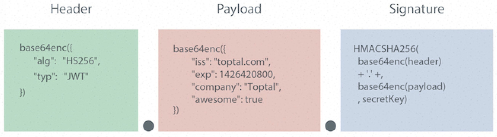

# JWT入门基础概念

## 1.什么是JWT

[JWT官方地址](https://jwt.io/introduction/)

json web token（JWT）是一个开放标准（rfc7519），它定义了一种紧凑的、自包含的方式，用于在各方之间以JSON对象安全地传输信息。它是以JSON形式作为Web应用中的令牌,用于在各方之间安全地将信息作为JSON对象传输。在数据传输过程中还可以完成数据加密、签名等相关处理。

## 2.JWT能做什么

**授权**

这是使用JWT的最常见方案。**一旦用户登录，每个后续请求将包括JWT**，从而允许用户访问该令牌允许的路由，服务和资源。单点登录是当今广泛使用JWT的一项功能，因为它的开销很小并且可以在不同的域中轻松使用。

**信息交换**

JSON Web Token是在各方之间安全地传输信息的好方法。因为可以对JWT进行签名（例如，使用公钥/私钥对），所以您可以确保发件人是他们所说的人。此外，由于签名是使用标头和有效负载计算的，因此您还可验证内容是否遭到篡改。

## 3.Session认证与JWT认证的区别

### 基于传统的Session认证策略

#### 1.认证方式

`http协议本身是一种无状态的协议`，而这就意味着如果用户向我们的应用提供了用户名和密码来进行用户认证，那么下一次请求时，用户还要再一次进行用户认证才行。

因为根据http协议，我们并不能知道是哪个用户发出的请求，所以为了让我们的应用能识别是哪个用户发出的请求，我们只能在服务器存储一份用户登录的信息，**这份登录信息（sessionId）会在响应时传递给浏览器**，告诉其保存为cookie,以便下次请求时发送给我们的应用，这样我们的应用就能识别请求来自哪个用户了,这就是传统的基于session认证。

#### 2.认证流程


#### 3.Session认证的问题

- 每个用户经过我们的应用认证之后，我们的应用都要在服务端做一次记录，以方便用户下次请求的鉴别，通常而言session都是保存在内存中，而随着认证用户的增多，服务端的开销会明显增大

- 用户认证之后，服务端做认证记录，如果认证的记录被保存在内存中的话，这意味着用户下次请求还必须要请求在这台服务器上,这样才能拿到授权的资源，这样在分布式的应用上，相应的限制了负载均衡器的能力。这也意味着限制了应用的扩展能力。

- 因为是基于cookie来进行用户识别的, cookie如果被截获，用户就会很容易受到跨站请求伪造的攻击。

- 在前后端分离系统中就更加痛苦！也就是说前后端分离在应用解耦后增加了部署的复杂性。
  - **通常用户一次请求就要转发多次。如果用session 每次携带sessionid 到服务器，服务器还要查询用户信息。**同时如果用户很多。这些信息存储在服务器内存中，给服务器增加负担。
  - CSRF（跨站伪造请求攻击）攻击，session是基于cookie进行用户识别的, cookie如果被截获，用户就会很容易受到跨站请求伪造的攻击。
  - sessionid 就是一个特征值，表达的信息不够丰富。不容易扩展。而且如果你后端应用是多节点部署。那么就需要实现session共享机制。	不方便集群应用。

### 基于JWT认证的策略

#### 1.认证流程

- 首先，前端通过Web表单将自己的用户名和密码发送到后端的接口。这一过程一般是一个HTTP POST请求。建议的方式是通过SSL加密的传输（https协议），从而避免敏感信息被嗅探。

- 后端核对用户名和密码成功后，**将用户的id等其他信息作为JWT Payload（负载），将其与头部分别进行Base64编码拼接后签名，形成一个JWT(Token)。形成的JWT就是一个形同xxx.yyy.zzz的字符串**。 

  `即token =  head.payload.singurater`

- **后端将JWT字符串作为登录成功的返回结果返回给前端**。前端可以将返回的结果保存在localStorage或sessionStorage上，退出登录时前端删除保存的JWT即可。

- **前端在每次请求时将JWT放入HTTP Header中的Authorization位**。(解决XSS和XSRF问题) HEADER

- **后端检查是否存在，如存在验证JWT的有效性**。例如，检查签名是否正确；检查Token是否过期；检查Token的接收方是否是自己（可选）。

- 验证通过后后端使用JWT中包含的用户信息进行其他逻辑操作，返回相应结果。


#### 2.jwt优势

- 简洁(Compact): 可以通过URL，POST参数或者在HTTP header发送，因为数据量小，传输速度也很快

- 自包含(Self-contained)：负载中包含了所有用户所需要的信息，避免了多次查询数据库

- 因为Token是以JSON加密的形式保存在客户端的，所以JWT是跨语言的，原则上任何web形式都支持。

- 不需要在服务端保存会话信息，特别适用于分布式微服务。

## 4.JWT的结构

### 令牌组成

- 1.标头(Header)
- 2.有效载荷(Payload)
- 3.签名(Signature)
> 因此，JWT通常如下所示:xxxxx.yyyyy.zzzzz 也就是 Header.Payload.Signature

### Header的组成信息

- **标头通常由两部分组成：**`令牌的类型（即JWT）和所使用的签名算法`，例如HMAC SHA256或RSA。它会使用 Base64 编码组成 JWT 结构的第一部分。

- 注意:Base64是一种编码，也就是说，它是可以被翻译回原来的样子来的。它并不是一种加密过程。

```json
# header的组成信息
{
  "alg": "HS256",
  "typ": "JWT"
}
```

### Payload组成信息

令牌的第二部分是有效负载，其中包含声明。声明是有关实体（通常是用户信息）和其他数据的声明。同样的，它会使用 Base64 编码组成 JWT 结构的第二部分

```json
# payload组成信息
{
  "id": "823",
  "name": "Code Duck",
  "role": "admin"
}
```

### Signature的组成信息

`header和payload`都是使用 Base64 进行编码的，即前端可以解开知道里面的信息。**Signature 需要使用编码后的 header 和 payload 以及`我们自己的一个密钥`，然后使用 header 中指定的签名算法（HS256）进行签名。**签名的作用是保证 JWT 没有被篡改过。

> **例如：HMACSHA256( base64UrlEncode(header) + "." + base64UrlEncode(payload), secret );**

**签名目的**

- 最后一步签名的过程，实际上是对头部以及负载内容进行签名，防止内容被窜改。如果有人对头部以及负载的内容解码之后进行修改，再进行编码，最后加上之前的签名组合形成新的JWT的话，那么服务器端会判断出新的头部和负载形成的签名和JWT附带上的签名是不一样的。如果要对新的头部和负载进行签名，在不知道服务器加密时用的密钥的话，得出来的签名也是不一样的。

**信息安全问题**

- 在这里大家一定会问一个问题：Base64是一种编码，是可逆的，那么我的信息不就被暴露了吗？

- 是的。所以，在JWT中，不应该在负载里面加入任何敏感的数据。在上面的例子中，我们传输的是用户的User ID。这个值实际上不是什么敏感内容，一般情况下被知道也是安全的。但是像密码这样的内容就不能被放在JWT中了。如果将用户的密码放在了JWT中，那么怀有恶意的第三方通过Base64解码就能很快地知道你的密码了。因此JWT适合用于向Web应用传递一些非敏感信息。JWT还经常用于设计用户认证和授权系统，甚至实现Web应用的单点登录。

### 以上三部分进行整合

**JWT的真实面目：**

`(Header)`eyJ0eXAiOiJKV1QiLCJhbGciOiJIUzI1NiJ9.

`(payLoad)`eyJyb2xlIjoiZW1wbG95ZWUiLCJpZCI6IjQiLCJleHAiOjE1OTcxMjc3NjUsInVzZXJuYW1lIjoiamFzb24ifQ.

`(Signature)`WxIiTf7V4UaboMONu0UpPu-uQSuDQFZqepKKxLstnaU

**:point_down:形象解释**



- JWT令牌是三个由点分隔的Base64-URL字符串，可以在HTML和HTTP环境中轻松传递这些字符串，与基于XML的标准（例如SAML）相比，它更紧凑。
- 简洁(Compact)，可以通过URL, POST 参数或者在 HTTP header 发送，因为数据量小，传输速度快
- 自包含(Self-contained)，负载中包含了所有用户所需要的信息，避免了多次查询数据库

# Springboot整合JWT

### 1.创建Springboot项目

### 2.配置pom信息

```xml
<?xml version="1.0" encoding="UTF-8"?>
<project xmlns="http://maven.apache.org/POM/4.0.0"
         xmlns:xsi="http://www.w3.org/2001/XMLSchema-instance"
         xsi:schemaLocation="http://maven.apache.org/POM/4.0.0 http://maven.apache.org/xsd/maven-4.0.0.xsd">
    <modelVersion>4.0.0</modelVersion>

    <parent>
        <groupId>org.springframework.boot</groupId>
        <artifactId>spring-boot-starter-parent</artifactId>
        <version>2.3.1.RELEASE</version>
        <relativePath/>
    </parent>

    <groupId>com.duck.code</groupId>
    <artifactId>Springboot-JWT</artifactId>
    <version>1.0-SNAPSHOT</version>
    
    <dependencies>

        <dependency>
            <groupId>org.springframework.boot</groupId>
            <artifactId>spring-boot-starter-web</artifactId>
        </dependency>

        <dependency>
            <groupId>org.springframework.boot</groupId>
            <artifactId>spring-boot-starter-test</artifactId>
            <scope>test</scope>
        </dependency>

        <!--引入jwt-->
        <dependency>
            <groupId>com.auth0</groupId>
            <artifactId>java-jwt</artifactId>
            <version>3.4.0</version>
        </dependency>

        <dependency>
            <groupId>org.projectlombok</groupId>
            <artifactId>lombok</artifactId>
            <optional>true</optional>
        </dependency>

        <!--mybatis plus-->
        <dependency>
            <groupId>com.baomidou</groupId>
            <artifactId>mybatis-plus-boot-starter</artifactId>
            <version>3.3.2</version>
        </dependency>

        <!--代码生成器-->
        <dependency>
            <groupId>com.baomidou</groupId>
            <artifactId>mybatis-plus-generator</artifactId>
            <version>3.3.2</version>
        </dependency>

        <!--逆向工程需要模板引擎-->
        <dependency>
            <groupId>org.freemarker</groupId>
            <artifactId>freemarker</artifactId>
            <version>2.3.30</version>
        </dependency>

        <!--mysql依赖-->
        <dependency>
            <groupId>mysql</groupId>
            <artifactId>mysql-connector-java</artifactId>
            <scope>runtime</scope>
        </dependency>

        <!--连接池-->
        <dependency>
            <groupId>com.alibaba</groupId>
            <artifactId>druid</artifactId>
            <version>1.1.20</version>
        </dependency>
    </dependencies>
</project>
```

### 3.配置application配置文件信息

```yml
server:
  port: 8081
spring:
  datasource:
    username: root
    password: 123456
    driver-class-name: com.mysql.cj.jdbc.Driver
    url: jdbc:mysql://localhost:3306/db_jwt?useUnicode=true&useSSL=false&characterEncoding=utf8&serverTimezone=Asia/Shanghai
    type: com.alibaba.druid.pool.DruidDataSource

mybatis-plus:
  global-config:
    db-config:
      table-prefix: tb_   # 表明前缀
  type-aliases-package: com.code.duck.entity  # 实体类所在包
  mapper-locations: classpath*:/mapper/**Mapper.xml   # xml文件所在位置
```

### 5.Springboot主启动类配置

```java
@SpringBootApplication
@MapperScan("com.duck.code.mapper")
public class JWTApplication {
    public static void main(String[] args) {
        SpringApplication.run(JWTApplication.class,args);
    }
}
```

### 4.Springboot整合MybatisPlus

​	使用MybatisPlus代码生成器，生成entity、controller、service，service.impl、mapper、xml文件

​	代码生成器参考本人：Springboot整合MybatisPlus的文章https://www.cnblogs.com/code-duck/p/13481550.html

### 6.封装JWT工具类

> JWTUtil工具类主要用于生成JWT令牌（token）、核实token信息、对token进行解密

#### JWT抽象类

**JWT抽象类中的三个方法，对应于上述三个功能**

```java
public abstract class JWT {

    /**
     * Decode a given Json Web Token.
     *
     * @param token with jwt format as string.
     * @return a decoded JWT.
     */
    public static DecodedJWT decode(String token) throws JWTDecodeException {
        return new JWTDecoder(token);
    }

    /**
     * Returns a {@link JWTVerifier} builder with the algorithm to be used to validate token signature.
     *
     * @param algorithm that will be used to verify the token's signature.
     * @return {@link JWTVerifier} builder
     * @throws IllegalArgumentException if the provided algorithm is null.
     */
    public static Verification require(Algorithm algorithm) {
        return JWTVerifier.init(algorithm);
    }

    /**
     * Returns a Json Web Token builder used to create and sign tokens
     *
     * @return a token builder.
     */
    public static JWTCreator.Builder create() {
        return JWTCreator.init();
    }
}
```

#### JWTUtil工具类

```java
public class JWTUtil {

    // 用于JWT进行签名加密的秘钥
    private static String SECRET = "code-duck-*%#@*!&";

    /**
     * @Param: 传入需要设置的payload信息
     * @return: 返回token
     */
    public static String generateToken(Map<String, String> map) {
        JWTCreator.Builder builder = JWT.create();

        // 将map内的信息传入JWT的payload中
        map.forEach((k, v) -> {
            builder.withClaim(k, v);
        });

        // 设置JWT令牌的过期时间为60
        Calendar instance = Calendar.getInstance();
        instance.add(Calendar.SECOND, 60);
        builder.withExpiresAt(instance.getTime());

        // 设置签名并返回token
        return builder.sign(Algorithm.HMAC256(SECRET)).toString();
    }

    /**
     * @Param: 传入token
     * @return:
     */
    public static void verify(String token) {
        JWT.require(Algorithm.HMAC256(SECRET)).build().verify(token);
    }

    /**
     * @Param: 传入token
     * @return: 解密的token信息
     */
    public static DecodedJWT getTokenInfo(String token) {
        return JWT.require(Algorithm.HMAC256(SECRET)).build().verify(token);
    }
}
```

### 7.UserController控制器中声明登录接口

```java
@RestController
@Slf4j
public class UserController {

    @Resource
    private UserService userService;

    @PostMapping(value = "/user/login")
    public Map<String, String> userLogin(@RequestBody User user) {
        log.info(user.getUsername());
        log.info(user.getPassword());

        QueryWrapper<User> wrapper = new QueryWrapper<>();

        wrapper.eq("username", user.getUsername());
        wrapper.eq("password",user.getPassword());
        // 数据库中查询用户信息
        User one = userService.getOne(wrapper);

        HashMap<String, String> result = new HashMap<>(); // 返回结果信息给前端

        if (one == null){
            result.put("code","401");
            result.put("msg","用户名或密码错误");
        }

        Map<String, String> map = new HashMap<>(); //用来存放payload信息

        map.put("id",one.getId().toString());
        map.put("username",one.getUsername());
        map.put("role",one.getRole());

        // 生成token令牌
        String token = JWTUtil.generateToken(map);

        // 返回前端token
        result.put("code","200");
        result.put("msg","登录成功");
        result.put("token",token);
        return result;
    }
}
```

### 8.启动Springboot

使用postman进行接口测试，查看是否返回了正确响应，并生成了token令牌


# 为Springboot配置拦截器

- 当用户登录成功时，服务端为该用户生成了一个时长为60的token令牌，`"token":xxx.xxx.xx`的形式 以返回给前端系统
- 当前端在每次请求时，我们选择将token令牌放至放入HTTP Header中的Authorization位
- 服务器对所有的请求进行拦截并校验token（除登录接口外）。如果token 信息不正确或过时，则向前端返回错误代码，校验正确则放行。

### 创建JWT拦截器

> 在此处进行token校验，如果校验成功则放行，否则返回异常信息给前端系统

```java
public class JWTInterceptor implements HandlerInterceptor {

    @Override
    public boolean preHandle(HttpServletRequest request, HttpServletResponse response, Object handler) throws Exception {

        Map<String, String> map = new HashMap<>();

        //获取请求头中的token令牌
        String token = request.getHeader("token");
        try {
            JWTUtil.verify(token);//验证令牌
            return true;//放行请求
        } catch (SignatureVerificationException e) {
            e.printStackTrace();
            map.put("msg", "无效签名!");
        } catch (TokenExpiredException e) {
            e.printStackTrace();
            map.put("msg", "token过期!");
        } catch (AlgorithmMismatchException e) {
            e.printStackTrace();
            map.put("msg", "token算法不一致!");
        } catch (Exception e) {
            e.printStackTrace();
            map.put("msg", "token无效!!");
        }
        map.put("code", "403");//设置状态
        //将 map 转为json  jackson
        String json = new ObjectMapper().writeValueAsString(map);
        response.setContentType("application/json;charset=UTF-8");
        response.getWriter().println(json);
        return false;
    }
}
```

### 配置WebMvcConfigurer拦截器

> 在此处配置过滤规则：即添加JWTInterceptor token校验拦截器、拦截非登录接口外的一切/user接口

```java
@Configuration
public class MyWebMvcConfigurer implements WebMvcConfigurer {

    @Override
    public void addInterceptors(InterceptorRegistry registry) {
        registry.addInterceptor(new JWTInterceptor())
                .excludePathPatterns("/user/login") // 登录接口不用于token验证
                .addPathPatterns("/user/**"); // 其他非登录接口都需要进行token验证
    }
}
```


### 在控制器中添加测试接口

```java
@GetMapping(value = "/user/test")
public Map<String,String> test(HttpServletRequest request){
    
    Map<String, String> map = new HashMap<>();
    //处理自己业务逻辑
    String token = request.getHeader("token");
    DecodedJWT claims = JWTUtil.getTokenInfo(token);
    log.info("用户id: [{}]",claims.getClaim("id").asString());
    log.info("用户name: [{}]",claims.getClaim("username").asString());
    log.info("用户role: [{}]",claims.getClaim("role").asString());
    map.put("code","200");
    map.put("msg","请求成功!");
    return map;
}
```


### 启动Springboot进行测试

1. 访问http://localhost:8081/user/login进行登录测试，获取服务器端返回的token信息
2. 测试http://localhost:8081/user/test，在其请求头配置token信息

