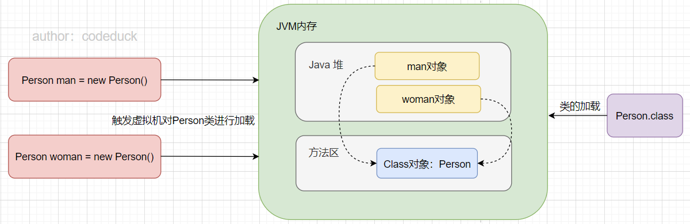

# Java反射机制

## 1. 反射机制概述

反射机制允许程序在运行期间借助反射获取任何类的内部信息，并且能直接操作任意对象的内部属性和方法。

具体来说：当JVM完成类加载后（[可参考](https://codeduck97.github.io/codeduck-notes/#/docs/java/jvm/6.%E8%99%9A%E6%8B%9F%E6%9C%BA%E7%B1%BB%E7%9A%84%E5%8A%A0%E8%BD%BD%E6%9C%BA%E5%88%B6)），方法区中就会产生类的Class对象（一个类对应一个Class对象），该Class对象包含该类的全部信息。而实例化后的对象存在于Java堆中，每个实例化对象都会存储Class对象的内存地址（[可参考](https://codeduck97.github.io/codeduck-notes/#/docs/java/jvm/2.Java%E5%AF%B9%E8%B1%A1%E7%9A%84%E8%A7%A3%E6%9E%84)），如下图所示:point_down:



**反射的具体操作为：**通过实例化后的对象（man或women）获取对应的Class全部信息（Person信息），进而获取到类的全限定名。

**反射可实现的功能如下：**

- 在运行时判断任意一个对象所属的类；
- 在运行时构造任意一个类的对象；
- 在运行时判断任意一个类所具有的成员变量和方法；
- 在运行时获取泛型信息；
- 在运行时调用任意一个对象的成员变量和方法；
- 在运行时处理注解；
- 生成动态代理；

## 2. 反射常用的类

- Java.lang.Class；

- Java.lang.reflect.Constructor；

- Java.lang.reflect.Field；

- Java.lang.reflect.Method；

- Java.lang.reflect.Modifier；

## 3. 反射的基本使用

### 反射——Classes	

### 反射——构造器

### 反射——变量

### 反射——方法

### 反射——注解

### 反射——泛型

### 反射——数组

### 反射——私有变量、方法

### 反射——动态代理

### 反射——动态类加载和重载

### 反射——Getter Setter


通过反射来调用类的构造器、属性、方法。

- 创建Person类；

```java
public class Person {

    // 私有属性
    private String name;

    public Integer age;

    public Person() {
    }
    
    // 私有构造器
    private Person(String name) {
        this.name = name;
    }

    public Person(String name, Integer age) {
        this.name = name;
        this.age = age;
    }

	// 省略set和get方法……

    public void say() {
        System.out.println("hello, nice to meet you!");
    }

    private void sayHobby(String hobby) {
        System.out.println("my hobbies are " + hobby);
    }

    @Override
    public String toString() {
        return "Person[" +
                "name='" + name + '\'' +
                ", age=" + age +
                ']';
    }
}
```

- 通过反射调用Person类中的`public`构造器，属性，方法；

```java
public void test01() throws Exception{
    Class clazz = Person.class;

    // 创建 Person 对象
    Constructor cons = clazz.getConstructor(String.class, Integer.class);
    Object obj = cons.newInstance("zs", 11);
    System.out.println(obj);    // Person[name='zs', age=11]

    // 调用对象指定的属性
    Field age = clazz.getField("age");
    age.set(obj, 22);
    System.out.println(obj);    // Person[name='zs', age=22]

    // 调用对象指定的方法
    Method say = clazz.getMethod("say" );
    say.invoke(obj);            // hello, nice to meet you!
}
```

- 通过反射调用Person类中的`private`构造器，属性，方法；

```java
@Test
public void test02() throws Exception {
    Class clazz = Person.class;

    // 调用私有构造器
    Constructor cons = clazz.getDeclaredConstructor(String.class);
    // 对所有属性设置访问权限  当类中的成员变量为private时 必须设置此项
    cons.setAccessible(true);

    // 创建实例对象
    Object codeduck = cons.newInstance("codeduck");
    System.out.println(codeduck);       // Person[name='codeduck', age=null]

    // 调用私有属性
    Field name = clazz.getDeclaredField("name");
    name.setAccessible(true);
    name.set(codeduck, "jason");
    System.out.println(codeduck);       // Person[name='jason', age=null]

    // 调用私有方法
    Method sayHobby = clazz.getDeclaredMethod("sayHobby", String.class);
    sayHobby.setAccessible(true);
    sayHobby.invoke(codeduck, "sing-jump-rap-ball");   // my hobbies are sing-jump-rap-ball
}
```

通过上述代码可以发现，反射的使用打破了Java代码的封装性。

## 4. java.lang.Class 类

Class对象的实例其实就是将Class对应的静态字节流存储结构加载到方法区内，而生成的一个运行时数据结构。可以通过以下几种方式来获取方法区的Class对象。**PS**：有关类的加载[可参考](https://codeduck97.github.io/codeduck-notes/#/docs/java/jvm/6.%E8%99%9A%E6%8B%9F%E6%9C%BA%E7%B1%BB%E7%9A%84%E5%8A%A0%E8%BD%BD%E6%9C%BA%E5%88%B6)

```java
@Test
public void test03() throws ClassNotFoundException {
    // 1. 调用运行时类的属性: .class
    Class<Person> clazz1 = Person.class;
    System.out.println(clazz1);     // class com.jason.javabase.reflection.Person

    // 2. 通过运行时类的对象调用 getClass()方法
    Person person = new Person();
    Class<? extends Person> clazz2 = person.getClass();
    System.out.println(clazz2);     // class com.jason.javabase.reflection.Person

    // 3. 调用 Class 的静态方法: forName(String classPath) 
    Class<?> clazz3 = Class.forName("com.jason.javabase.reflection.Person");
    System.out.println(clazz3);     // class com.jason.javabase.reflection.Person
    
    // 4. 使用类加载器ClassLoader
    ClassLoader classLoader = TestReflection.class.getClassLoader();
    Class<?> clazz4 = classLoader.loadClass("com.jason.javabase.reflection.Person");
    System.out.println(clazz4);     // class com.jason.javabase.reflection.Person
    
    // 判断四个Class引用是否指向同一个Class对象
    System.out.println(clazz1 == clazz2); // true
    System.out.println(clazz2 == clazz3); // true
    System.out.println(clazz3 == clazz4); // true
}
```

其中第三种方式的获取使用较多，众多开发框架中使用此方法获取Class实例对象。

**Class类的其他方法：**

- getFields（）：获取当前运行时类及其父类中声明为public访问权限的属性；
- getDeclareFields（）：获取当前运行时类中声明的所有属性（不包含父类中声明的属性）；
- getMethods（）：获取当前运行时类及其所有父类中声明为public权限的方法；
- getDeclareMethods（）：获取当前运行时类中声明的所有方法（不包含父类中声明的方法）；
- getConstructor（）：获取当前运行时类中声明的public权限的构造器；
- getDeclareConstructor（）：获取当前运行时类中声明的所有构造器；
- getSuperclass（）：获取运行时类的父类；
- getGenericSuperclass（）：获取运行时类的带泛型的父类；
- getInterfaces（）：获取运行时类实现的接口；
- getPackage（）：获取运行时类所在的包；
- getAnnotations（）：获取运行时类声明的注解；

**Class实例可以是哪些数据结构？**

```java
Class c1 = Object.class;
Class c2 = Comparable.class;
Class c3 = String[].class;
Class c4 = int[][].class;
Class c5 = ElementType.class;
Class c6 = Override.class;
Class c7 = int.class;
Class c8 = void.class;
Class c9 = Class.class;
```

**使用ClassLoader加载配置文件：**

- 在src目录下创建配置文件jdbc.properties

```
name=codeduck
password=123123
```

- 测试加载

```java
@Test
public void test01() throws Exception{
    Properties properties = new Properties();

    // 1. 使用IO流读取配置文件信息
    FileInputStream in = new FileInputStream("src//jdbc.properties");
    // properties.load(in);

    // 2. 通过类加载器获取
    ClassLoader classLoader = TestClassLoader.class.getClassLoader();
    InputStream is = classLoader.getResourceAsStream("jdbc.properties");

    properties.load(is);
    String name = properties.getProperty("name");
    String pw = properties.getProperty("password");
    System.out.println(name + "," + pw);        // codeduck,123123
}
```

## 5. 通过反射创建运行时类的对象

```java
@Test
public void test01() throws Exception {
    Class<Person> clazz = Class.forName("com.jason.javabase.reflection.Person");

    /**
         * 使用此方法创建对应的运行时类的对象，内部调用了运行时类的空参构造方法
         * 因此
         *   1. 运行时类必须提供空参的构造器，
         *   2. 空参的构造器的访问权限能够对外暴露（public）
         * 下列方法使用较多！而调用有参构造器创建对象使用较少
         */
    Person person = clazz.newInstance();
    System.out.println(person);		// Person[name='null', age=null]
}
```

## 6. 反射应用——动态代理

### 6.1 代理的基本概念

**代理模式的定义：**由于某些原因需要给某对象提供一个代理以控制对该对象的访问。这时，访问对象不适合或者不能直接引用目标对象，代理对象作为访问对象和目标对象之间的中介。

**动态代理：**指客户通过代理类来调用其它对象的方法，并且是在程序运行时根据需要动态创建目标类的代理对象。

**代理模式的主要优点有：**

- 代理模式在客户端与目标对象之间起到一个中介作用和保护目标对象的作用；
- 代理对象可以扩展目标对象的功能；
- 代理模式能将客户端与目标对象分离，在一定程度上降低了系统的耦合度，增加了程序的可扩展性

### 6.2 代理模式的结构

1. 抽象主题（Subject）类：通过接口或抽象类声明真实主题和代理对象实现的业务方法。
2. 真实主题（Real Subject）类：实现了抽象主题中的具体业务，是代理对象所代表的真实对象，是最终要引用的对象。
3. 代理（Proxy）类：提供了与真实主题相同的接口，其内部含有对真实主题的引用，它可以访问、控制或扩展真实主题的功能。

根据代理的创建时期，代理模式分为静态代理和动态代理。

- 静态：由程序员创建代理类或特定工具自动生成源代码再对其编译，在程序运行前代理类的 .class 文件就已经存在了；
- 动态：在程序运行时，运用反射机制动态创建而成；

### 6.3 动态代理的实现

```java
// 抽象主题
interface Human{

    void getGender(String gender);

    void saySomething(String talk);
}

// 真实主题: 被代理类
class Liming implements Human{

    @Override
    public void getGender(String gender) {
        System.out.println("I am " + gender);
    }

    @Override
    public void saySomething(String talk) {
        System.out.println(talk);
    }
}

/**
 * 代理类——实现动态代理:
 *      1. 如何根据加载到内存的被代理类，动态的创建一个代理类及其对象
 *      2. 通过代理类对象调用方法时，如何动态的去调用被代理类中的同名方法
 */

class ProxyFactory{

    // 调用此方法，返回一个代理类的对象，解决问题一
    public static Object getProxyInstance(Object obj) {
        MyInvocationHandler handler = new MyInvocationHandler();

        // InvocationHandler绑定代理对象
        handler.bind(obj);

        // 返回代理对象实例
        return Proxy.newProxyInstance(obj.getClass().getClassLoader(), obj.getClass().getInterfaces(), handler);
    }
}

class MyInvocationHandler implements InvocationHandler {

    private Object obj;

    public void bind(Object obj) {
        this.obj = obj;
    }

    /**
     * desc: 通过代理类的对象，调用方法 xxx() 时，就会自动的调用如下方法 invoke()
     * <p>
     *
     * @param proxy 代理对象
     * @param method 代理对象 的 xxx() 方法
     * @param args xxx() 方法 的参数
     */
    @Override
    public Object invoke(Object proxy, Method method, Object[] args) throws Throwable {

        // method: 即为代理类对象调用的方法，此方法作为被代理类对象要调用的方法
        Object returnValue = method.invoke(obj, args);

        // 返回上述方法的返回值
        return returnValue;
    }
}

public class TestProxy {
    public static void main(String[] args) {
        Liming liming = new Liming();
        Human proxyInstance = (Human) ProxyFactory.getProxyInstance(liming);
        proxyInstance.saySomething("I am Liming`s proxyInstance");  // I am Liming`s proxyInstance
        proxyInstance.getGender("male");    // I am male
    }
}
```

