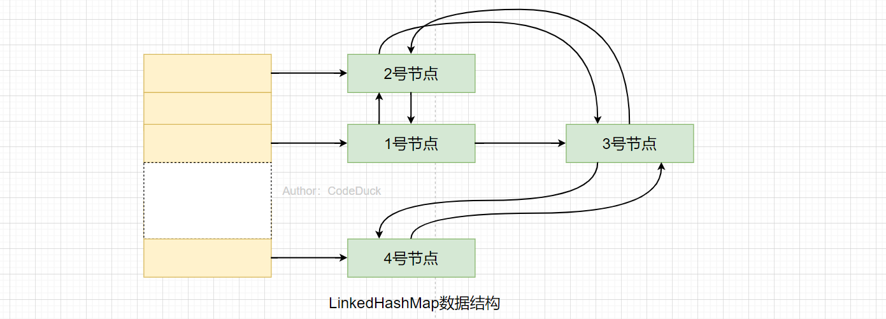
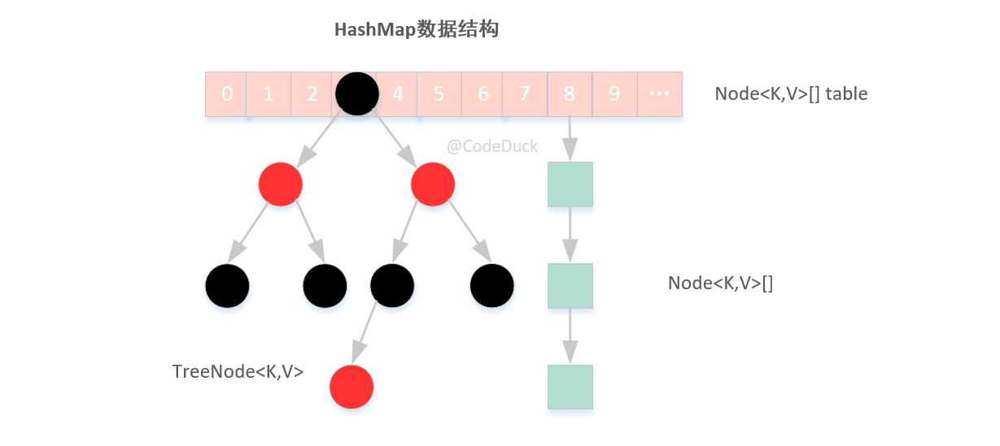
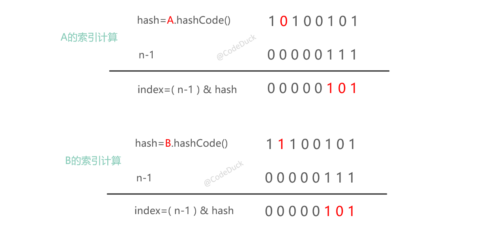
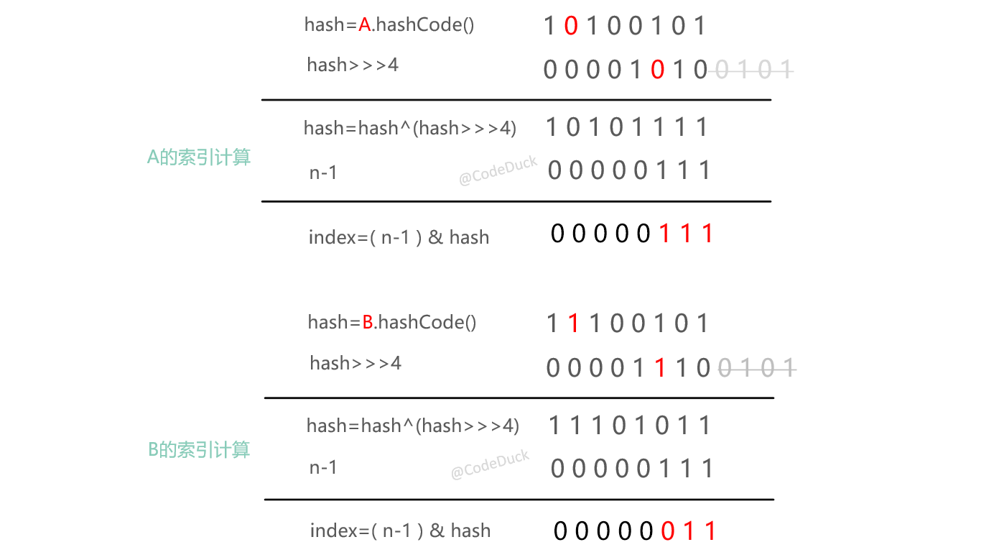
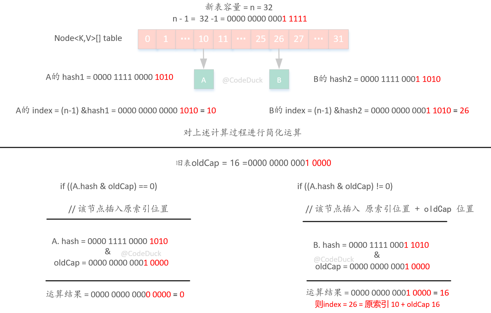
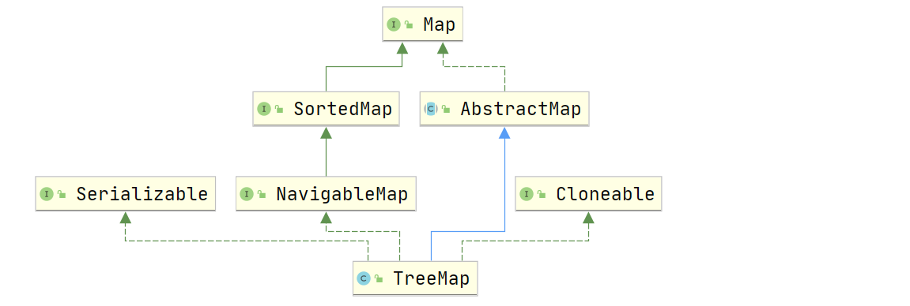
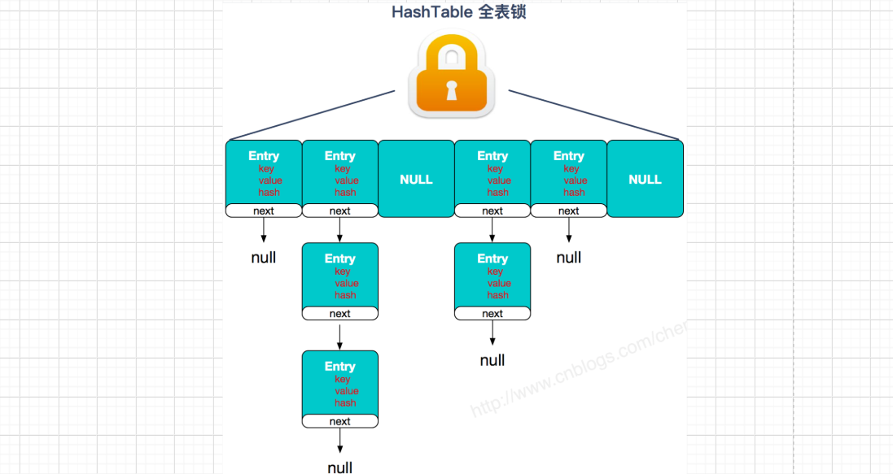
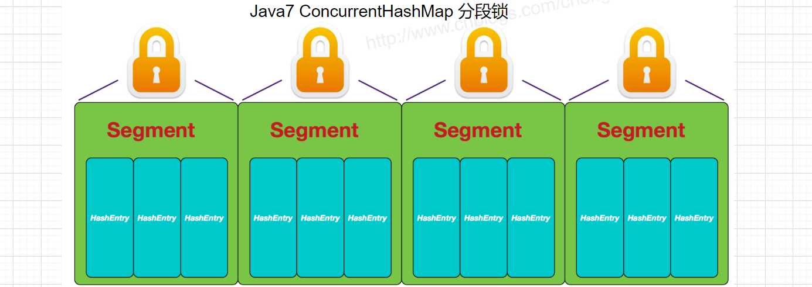
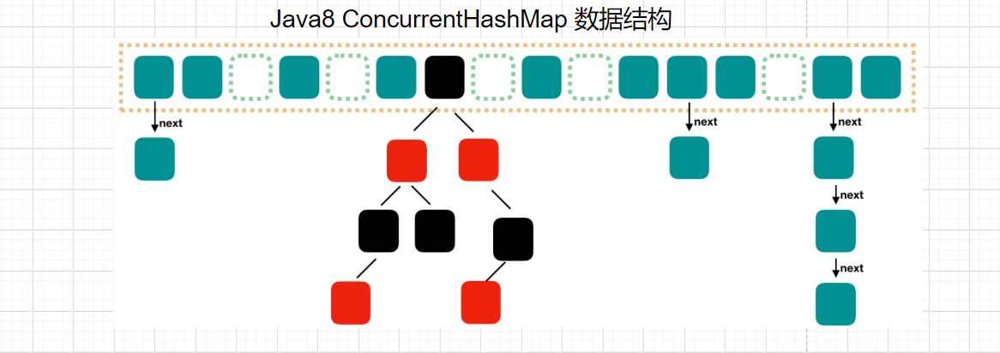

# Java集合概述

## Java集合概览


## Iterable接口

```java
public interface Iterable<T> {
    /**
     * 顺序遍历集合元素的迭代器
     */
    Iterator<T> iterator();

    /**
     * 顺序遍历集合中的所有元素，直到所有元素被遍历或触发异常
     * @since 1.8
     */
    default void forEach(Consumer<? super T> action) {
    }

    /**
     * Java为了并行遍历集合中的元素而设计的迭代器
     * @since 1.8
     */
    default Spliterator<T> spliterator() {
    }
}

```

```java
public interface Iterator<E>
{
    E next();
    boolean hasNext();
    void remove();		
    default void forEachRemaining(Consumer<? super E> action);	// 
}
```

- **next ()** ：可以逐个访问集合中的每个元素，如果到达集合末尾，则会抛出NoSuchElementException异常，应配合hasNext方法使用。
- **hasNext()** ：如果迭代器对象还有多个供访问的元素， 这个方法就返回true。
- **remove()** ：删除上次调用next 方法时返回的元素。
- **forEachRemaining()** ：提供一个Lambda表达给该方法，迭代器中的元素会调用Lambda表达。

PS：迭代器位于两个元素之间，当调用next 时， 迭代器就越过下一个元素，并返回刚刚越过的那个元素的引用，remove就是删除刚被越过的元素。

## Collection的子接口与Map接口

- `List`： 存储的元素是有序的、可重复的。
- `Set`：存储的元素是无序的、不可重复的。
- `Queue`：队列接口，可以在队列的尾部添加元素，在队列的头部删除元素。
- `Deque`：双端队列接口，继承了`Queue接口`，可在队列头部和尾部同时添加或删除元素。
- `Map`：使用键值对（key-value）存储，key是无序的，不重复的，value是无序的，可重复的。

## RandomAccess 接口

```java
 /**
  * @since 1.4
  */
public interface RandomAccess {
	// 空接口
}
```

查看源码我们发现实际上 `RandomAccess` 接口中什么都没有定义。所以，可以认为 `RandomAccess` 接口不过是一个标识罢了。标识什么？ 标识实现这个接口的类具有随机访问功能。

比如：`ArrayList` 实现了 `RandomAccess` 接口，就表明了他具有快速随机访问功能。 `RandomAccess` 接口只是标识，并不是说 `ArrayList` 实现 `RandomAccess` 接口才具有快速随机访问功能的！ 而 `LinkedList` 没有实现 `RandomAccess` 接口，由于底层数据结构为双向链表，并不具备随机访问功能。

## 集合框架的底层数据结构总结

### List

- `Arraylist`： `Object[]`数组。
- `Vector`：`Object[]`数组。
- `LinkedList`： 双向链表(JDK1.6 之前为循环链表，JDK1.7 取消了循环)。

### Set

- `HashSet`：（无序，唯一）: 基于 `HashMap` 实现的，底层采用 `HashMap` 来保存元素。
- `LinkedHashSet`：`LinkedHashSet` 是 `HashSet` 的子类，并且其内部是通过 `LinkedHashMap` 来实现的。
- `TreeSet`（有序，唯一）： 红黑树(自平衡的排序二叉树)。

### Map

- `HashMap`： JDK1.8 之前 `HashMap` **由数组 + 链表组成的**，数组是 `HashMap` 的主体，链表则是主要为了解决哈希冲突而存在的（“拉链法”解决冲突）。JDK1.8 以后在解决哈希冲突时有了较大的变化，当链表长度大于阈值（默认为 8）（将链表转换成红黑树前会判断，如果当前数组的长度小于 64，那么会选择先进行数组扩容，而不是转换为红黑树）时，将链表转化为红黑树，以减少搜索时间。

- `LinkedHashMap`： `LinkedHashMap` 继承自 `HashMap`，所以它的底层仍然是**基于拉链式散列结构**即由数组和链表或红黑树组成。另外，`LinkedHashMap` 在上面结构的基础上，**增加了一条双向链表**，使得集合中的元素可以被顺序访问（不是顺序插入），数据结构如下图所示:point_down: 。详细可以查看：[《LinkedHashMap 源码详细分析（JDK1.8）》](https://www.imooc.com/article/22931)

  

- `Hashtable`： **数组 + 链表组成的**，数组是 `HashMap` 的主体，链表则是主要为了解决哈希冲突而存在的。

- `TreeMap`： **红黑树**（自平衡的排序二叉树）

### Queue

- `PriorityQueue`：（有序）是基于优先堆的一个无界队列，优先队列中的元素可以默认自然排序或者通过提供的Comparator（比较器）在队列实例化的时排序。

  ```java
  Queue<Integer> q = new PriorityQueue<>();
  q.offer(7);
  q.offer(11);
  q.offer(10);
  while (!q.isEmpty()){
      System.out.println(q.poll());	// 输出 7 10 11
  }
  ```

  

### Deque

- `ArrayDeque`：使用**可变容量数组**实现双端队列，是非线程安全的。

## 选择适当的集合

如果需要根据**键值**获取到元素值时就选用 `Map` 接口下的集合，需要排序时选择 `TreeMap`,不需要排序时就选择 `HashMap`,需要保证线程安全就选用 `ConcurrentHashMap`。

如果只需要存放元素值时，就选择实现`Collection` 接口的集合，需要保证**元素唯一**时选择实现 `Set` 接口的集合比如 `TreeSet` 或 `HashSet`，不需要就选择实现 `List` 接口的比如 `ArrayList` 或 `LinkedList`，然后再根据实现这些接口的集合的特点来选用。


# List 接口的实现类

## ArrayList 与 Vector 的区别

- `ArrayList`是List的主要实现类，底层使用 **Object[]** 存储 ，适用于频繁的查找工作，线程不安全。
- `Vector`是List的古老实现类，底层使用 **Object[]** 存储，线程安全。

## ArrayList 与 LinkedList 的区别

|                    | ArrayList                                                    | LinkedList                                                   |
| ------------------ | ------------------------------------------------------------ | ------------------------------------------------------------ |
| **线程安全**       | 线程不安全                                                   | 线程不安全                                                   |
| **底层数据结构**   | Object数组                                                   | 双向链表(1.6及以前为双向循环链表)                            |
| **快速随机访问**   | 支持                                                         | 不支持                                                       |
| **内存占用**       | 列表结尾会预留一定的容量空间<br/>给新添加的元素使用（避免多次开辟内存空间） | 每个节点的前驱和后驱占用空间                                 |
| **增删改查复杂度** | 增：尾部直接添加O(1)，指定位置添加O(n-i)<br/>删：删除后需要移动元素O(n)<br/>改：直接修改O(1)<br/>查：根据下标直接查询O(1) | 增：尾部直接添加O(1)，指定位置添加O(n)<br/>删：最好O(1)，最坏O(n)<br/>改：O(n)<br/>查：O(n) |

**快速随机访问：**通过元素的序号快速获取元素对象(对应于`get(int index)`方法)。

**插入和删除是否受元素位置的影响：**

1. **`ArrayList` 采用数组存储，所以插入和删除元素的时间复杂度受元素位置的影响。** 比如：执行`add(E e)`方法的时候， `ArrayList` 会默认在将指定的元素追加到此列表的末尾，这种情况时间复杂度就是 O(1)。但是如果要在指定位置 i 插入和删除元素的话（`add(int index, E element)`）时间复杂度就为 **O(n-i)**。因为在进行上述操作的时候集合中第 i 和第 i 个元素之后的(n-i)个元素都要执行向后位/向前移一位的操作。
2.  **`LinkedList` 采用链表存储，所以对于`add(E e)`方法的插入，删除元素时间复杂度不受元素位置的影响，近似 O(1)，如果是要在指定位置`i`插入和删除元素的话（`(add(int index, E element)`） 时间复杂度近似为`o(n))`因为需要先移动到指定位置再插入。**

# Map 接口的实现类

## HashMap源码分析

### HashMap的数据结构

JDK1.8 以后的 `HashMap` 在解决哈希冲突时有了较大的变化，**当链表长度大于阈值（默认为 8）**（将链表转换成红黑树前会判断，**如果当前数组的长度小于 64，那么会选择先进行数组扩容，而不是转换为红黑树**）时，将链表转化为红黑树。



红黑树是一种自平衡二叉查找树，是特殊化的平衡二叉树，它可以在O(log n)时间内做查找，插入和删除，其特点如下：

- 根节点是 **黑色**。

- 每个节点要么是 **黑色**，要么是 `红色`。
- 所有的叶结点都是空结点，并且是 `黑色` 的。
- 如果一个结点是 `红色`的，那么它的子结点都是 **黑色** 的 。（从每个叶子到根的所有路径上不能有两个连续的红色节点）
- 从任意一个结点触发，到其子孙结点的每条简单路径都包含相同数目的 **黑色** 结点 

### HashMapde 的基本属性值

```java
// 默认初始化容量为16
static final int DEFAULT_INITIAL_CAPACITY = 1 << 4;

// 最大容量为2^30
static final int MAXIMUM_CAPACITY = 1 << 30;

// 默认负载因子0.75
static final float DEFAULT_LOAD_FACTOR = 0.75f;

// 链表节点转换红黑树节点的阈值, 链表中有9个节点以及table数组长度大于64时触发转换
static final int TREEIFY_THRESHOLD = 8;

// 红黑树节点转换链表节点的阈值, 树中有6个节点触发转换
static final int UNTREEIFY_THRESHOLD = 6;

// 转红黑树时, table的最小长度
static final int MIN_TREEIFY_CAPACITY = 64;

// table数组表
transient Node<K,V>[] table;

// HashMap已存储的节点个数
transient int size;

// 扩容阈值 = 数组容量 * 负载因子。当存储的节点个数超过扩容阈值时，触发扩容
int threshold;

// 负载因子 = 扩容阈值 / 数组容量
final float loadFactor;

// 链表节点
static class Node<K,V> implements Map.Entry<K,V> {
    final int hash;
    final K key;
    V value;
    Node<K,V> next;
    
	//……
}

// 红黑树节点
static final class TreeNode<K,V> extends LinkedHashMap.Entry<K,V> {
    TreeNode<K,V> parent;  // red-black tree links
    TreeNode<K,V> left;
    TreeNode<K,V> right;
    TreeNode<K,V> prev;    // needed to unlink next upon deletion
    boolean red;
   
    // ...
}

```

### HashMap 存储容量

> HashMap的默认初始化存储容量是 16。其容量必须是2的N次方。

HashMap 会根据我们传入的容量大小计算一个大于等于该容量值的最小2^N，例如输入9，返回容量大小为16。

```java
static final int tableSizeFor(int cap) {
    int n = cap - 1;
    n |= n >>> 1; 	// 即 n = n | (n >>> 1)
    n |= n >>> 2;
    n |= n >>> 4;
    n |= n >>> 8;
    n |= n >>> 16;
    return (n < 0) ? 1 : (n >= MAXIMUM_CAPACITY) ? MAXIMUM_CAPACITY : n + 1;
}
```

**源码分析：**

```java
cap = 9;
n = 9 - 1 = 8 = 1000;	// 此处减一的目的是处理cap = 2^n

// 计算 n |= n >>> 1
n = 1000 | (1000 >>> 1) = 1100

// 计算 n |= n >>> 2  
n = 1100 | (1100 >>> 1) = 1111
    
// ……

// 计算 n |= n >>> 16
n = 1111 | (1111 >>> 16) = 1111 = 15
    
//  计算返回值。MAXIMUM_CAPACITY = 1 << 30
(n < 0) ? 1 : (n >= MAXIMUM_CAPACITY) ? MAXIMUM_CAPACITY : n + 1 = 16
```

### HashMap 的长度是 2 ^n 原因

为了能让 HashMap 存取高效，尽量较少碰撞，也就是要尽量把数据分配均匀。**Hash 值的范围值-2147483648 到 2147483647**，前后加起来大概 40 亿的映射空间，只要哈希函数映射得比较均匀松散，一般应用是很难出现碰撞的。但问题是一个 40 亿长度的数组，内存是放不下的。所以这个散列值是不能直接拿来用的。用之前还要先做对数组的长度取模运算，得到的余数才能用来要存放的位置也就是对应的数组下标。这个数组下标的计算方法是“ `(n - 1) & hash`”。（n 代表数组长度）。这也就解释了 HashMap 的长度为什么是 2 的幂次方。

**这个算法应该如何设计呢？**

我们首先可能会想到采用%取余的操作来实现。但是，重点来了：**“取余(%)操作中如果除数是 2 的幂次则等价于与其除数减一的与(&)操作（也就是说 hash%length==hash&(length-1)的前提是 length 是 2 的 n 次方；）。”** 并且 **采用二进制位操作 &，相对于%能够提高运算效率，这就解释了 HashMap 的长度为什么是 2 的幂次方。**


### 根据Key计算hash值并求table索引

```java
// 计算key的hash值
static final int hash(Object key) { 
    int h;
    // 1.获取key的hashCode值; 
    // 2.将hashCode与hashCode的高16位进行异或运算
    return (key == null) ? 0 : (h = key.hashCode()) ^ (h >>> 16);
}

// 获取table数组长度
int n = tab.length;

// 下列运算 (n - 1) & hash = hash % n;
int index = (n - 1) & hash;
```

1. 对`(n - 1) & hash`运算的解释

> `(n - 1) & hash`运算其实就是取代了`hash % n`的取余运算。由于位运算对计算机来说是最高效的运算方式。**之所以table的容量要取2^N，就是为了满足`(n - 1) & hash = hash % n`运算的快捷。**

验证上述运算方式：

```java
// 取余运算
n = 8;
hash = 14;
index = hash % n = 6

// 位运算
n = 8 = 1000;
n-1 = 7 = 0111;
hash = 14 = 1110;
index = (n - 1) & hash = 0111 & 1110 = 0110 = 6
```

类似的判断一个数是否为偶数也可以使用位运算代替mod运算，例如：

```java
(13 & 1 == 0) ? true : false //判断是否为偶数
(14 & 1 == 1) ? true : false //判断是否为奇数
```

2. 对hash值`key.hashCode() ^ (h >>> 16)`运算的解释

> 在 table 的长度较小的时候，让hash值的高位也参与运算（不会有太大的开销）。可以减小散列冲突

**获取hash值不进行高位运算的情况：**在table长度较小的时候，如果hash值的高位不参与运算，将会增加散列冲突。以下示例显示了当多个实例的hash值低位相同，而高位不同，在小容量table中容易产生散列冲突。



**获取hash值对高位进行运算处理的情况：**从计算结果来看，明显降低了散列冲突



### HashMap 的扩容过程

这里使用**旧表其容量为16**向**新表其容量为32**扩容过程中，展示节点A和节点B的索引的重新计算过程：

根据table表索引计算公式`index = (n - 1) & hash`计算旧表中节点在新表中的索引值。

**旧表中节点A和节点B所在的索引位置：**


**扩容后节点A和节点B所在新表中的索引位置：**

HashMap对扩容后重新索引元素位置方法如下：

- 如果A的hash值与旧表的容量进行与运算为0，则扩容后的索引位置跟旧表的索引位置一样。

- 如果B的hash值与旧表的容量进行与运算不为0，则扩容后的索引位置为:旧表的索引位置＋oldCap

下图为两种重新索引的方式：图一为常规计算方式，图二为HashMap重新索引算法。



### HashMap多线程操作会导致死循环

主要原因在于并发下的 Rehash 会造成元素之间会形成一个循环链表。不过，jdk 1.8 后解决了这个问题，但是还是不建议在多线程下使用 HashMap,因为多线程下使用 HashMap 还是会存在其他问题比如数据丢失。并发环境下推荐使用 ConcurrentHashMap 。

详情请查看：https://coolshell.cn/articles/9606.html

### HashMap的几种遍历方式

[HashMap 的 7 种遍历方式与性能分析！](https://mp.weixin.qq.com/s/Zz6mofCtmYpABDL1ap04ow)

## HashMap 与 Hashtable 的区别

1. **线程是否安全：** `HashMap` 是非线程安全的，`HashTable` 是线程安全的，因为 `HashTable` 内部的方法基本都经过`synchronized` 修饰。（如果你要保证线程安全的话就使用 `ConcurrentHashMap` 吧！）。

2. **效率：** 因为线程安全的问题，`HashMap` 要比 `HashTable` 效率高一点。另外，`HashTable` 基本被淘汰，不要在代码中使用它。

3. **对 Null key 和 Null value 的支持：** `HashMap` 可以存储 null 的 key 和 value，但 null 作为键只能有一个，null 作为值可以有多个；`HashTable` 不允许有 null 键和 null 值，否则会抛出 `NullPointerException`。

4. **初始容量大小和每次扩充容量大小的不同 ：**

   - 创建时如果不指定容量初始值，`Hashtable` 默认的初始大小为 11，之后每次扩充，容量变为原来的 2n+1。`HashMap` 默认的初始化大小为 16。之后每次扩充，容量变为原来的 2 倍。

   - 创建时如果给定了容量初始值，那么 Hashtable 会直接使用你给定的大小，而 `HashMap` 会将其扩充为 2 的幂次方大小（`HashMap` 中的`tableSizeFor()`方法保证，下面给出了源代码）。也就是说 `HashMap` 总是使用 2 的幂作为哈希表的大小。

5. **底层数据结构：** JDK1.8 以后的 `HashMap` 在解决哈希冲突时有了较大的变化，当链表长度大于阈值（默认为 8）（将链表转换成红黑树前会判断，如果当前数组的长度小于 64，那么会选择先进行数组扩容，而不是转换为红黑树）时，将链表转化为红黑树，以减少搜索时间。Hashtable 没有这样的机制。

## HashMap 与 HashSet 的区别

如果你看过 `HashSet` 源码的话就应该知道：`HashSet` 底层就是基于 `HashMap` 实现的。（`HashSet` 的源码非常非常少，因为除了 `clone()`、`writeObject()`、`readObject()`是 `HashSet` 自己不得不实现之外，其他方法都是直接调用 `HashMap` 中的方法。

| `HashMap`                              | `HashSet`                                                    |
| -------------------------------------- | ------------------------------------------------------------ |
| 实现了 `Map` 接口                      | 实现 `Set` 接口                                              |
| 存储键值对                             | 仅存储对象                                                   |
| 调用 `put()`向 map 中添加元素          | 调用 `add()`方法向 `Set` 中添加元素                          |
| `HashMap` 使用键（Key）计算 `hashcode` | `HashSet` 使用成员对象来计算 `hashcode` 值，对于两个对象来说 `hashcode` 可能相同，所以` equals()`方法用来判断对象的相等性 |

## HashMap 与 TreeMap 的区别

`TreeMap` 和`HashMap` 都继承自`AbstractMap` ，但是需要注意的是`TreeMap`它还实现了`NavigableMap`接口和`SortedMap` 接口。



实现 `NavigableMap` 接口让 `TreeMap` 有了对集合内元素的搜索的能力。

实现`SortMap`接口让 `TreeMap` 有了对集合中的元素根据键排序的能力。默认是按 key 的升序排序，不过我们也可以指定排序的比较器。

## ConcurrentHashMap 和 Hashtable 的区别

`ConcurrentHashMap` 和 `Hashtable` 的区别主要体现在实现线程安全的方式上不同。

- **底层数据结构：** JDK1.7 的 `ConcurrentHashMap` 底层采用 **分段的数组+链表** 实现，JDK1.8 采用的数据结构跟 `HashMap1.8` 的结构一样，数组+链表/红黑二叉树。`Hashtable` 和 JDK1.8 之前的 `HashMap` 的底层数据结构类似都是采用 **数组+链表** 的形式，数组是 HashMap 的主体，链表则是主要为了解决哈希冲突而存在的；
- **实现线程安全的方式（重要）：** 
  - **在 JDK1.7 的时候，`ConcurrentHashMap`（分段锁）** 对整个桶数组进行了分割分段(`Segment`)，每一把锁只锁容器其中一部分数据，多线程访问容器里不同数据段的数据，就不会存在锁竞争，提高并发访问率。 **到了 JDK1.8 的时候已经摒弃了 `Segment` 的概念，而是直接用 `Node` 数组+链表+红黑树的数据结构来实现，并发控制使用 `synchronized` 和 CAS 来操作。（JDK1.6 以后 对 `synchronized` 锁做了很多优化）** 整个看起来就像是优化过且线程安全的 `HashMap`，虽然在 JDK1.8 中还能看到 `Segment` 的数据结构，但是已经简化了属性，只是为了兼容旧版本；
  -  **`Hashtable`(同一把锁)** ：使用 `synchronized` 来保证线程安全，效率非常低下。当一个线程访问同步方法时，其他线程也访问同步方法，可能会进入阻塞或轮询状态，如使用 put 添加元素，另一个线程不能使用 put 添加元素，也不能使用 get，竞争会越来越激烈效率越低。
- 下方为 Hashtable 与 ConcurrentHashMap 的数据结构示意图



引自：http://www.cnblogs.com/chengxiao/p/6842045.html



引自：http://www.cnblogs.com/chengxiao/p/6842045.html



JDK8 的 `ConcurrentHashMap` 不在是 **Segment 数组 + HashEntry 数组 + 链表**，而是 **Node 数组 + 链表 / 红黑树**。不过，Node 只能用于链表的情况，红黑树的情况需要使用 **`TreeNode`**。当冲突链表达到一定长度时，链表会转换成红黑树。引自：https://snailclimb.gitee.io/javaguide

主要的区别可以概括为：

- `ConcurrentHashMap` 是一个并发散列映射表，设计模式是非阻塞的，它允许完全并发的读取，并且支持给定数量的并发更新。在更新时会局部锁住某部分数据，但不会把整个表都锁住。同步读取操作则是完全非阻塞的。好处是在保证合理的同步前提下，效率很高。坏处是严格来说读取操作不能保证反映最近的更新。
- `HashTable` 是使用一个全局的锁来同步不同线程间的并发访问，同一时间点，只能有一个线程持有锁，也就是说在同一时间点，只能有一个线程能访问容器，这虽然保证多线程间的安全并发访问，但同时也导致对容器的访问变成串行化的了。

## ConcurrentHashMap 线程安全与底层实现

### Java 7 ConcurrentHashMap 

首先将数据分为一段一段的存储，然后给每一段数据配一把锁，当一个线程占用锁访问其中一个段数据时，其他段的数据也能被其他线程访问。

**`ConcurrentHashMap` 是由 `Segment` 数组结构和 `HashEntry` 数组结构组成**。

Segment 实现了 `ReentrantLock`,所以 `Segment` 是一种可重入锁，扮演锁的角色。`HashEntry` 用于存储键值对数据。

```java
static class Segment<K,V> extends ReentrantLock implements Serializable {
}Copy to clipboardErrorCopied
```

一个 `ConcurrentHashMap` 里包含一个 `Segment` 数组。`Segment` 的结构和 `HashMap` 类似，是一种数组和链表结构，一个 `Segment` 包含一个 `HashEntry` 数组，每个 `HashEntry` 是一个链表结构的元素，每个 `Segment` 守护着一个 `HashEntry` 数组里的元素，当对 `HashEntry` 数组的数据进行修改时，必须首先获得对应的 `Segment` 的锁。

### Java 8 ConcurrentHashMap 

`ConcurrentHashMap` 取消了 `Segment` 分段锁，采用 CAS 和 `synchronized` 来保证并发安全。数据结构跟 HashMap1.8 的结构类似，数组+链表/红黑二叉树。Java 8 在链表长度超过一定阈值（8）时将链表（寻址时间复杂度为 O(N)）转换为红黑树（寻址时间复杂度为 O(log(N))）

`synchronized` 只锁定当前链表或红黑二叉树的首节点，这样只要 hash 不冲突，就不会产生并发，效率又提升 N 倍。

# Set 接口的实现类

`HashSet` 是 `Set` 接口的主要实现类 ，`HashSet` 的底层是 `HashMap`，线程不安全的，可以存储 null 值。

`LinkedHashSet` 是 `HashSet` 的子类，添加到`LinkedHashSet`集合中的元素可以被顺序访问。

`TreeSet` 底层使用红黑树，能够按照添加元素的顺序进行遍历，排序的方式有自然排序和定制排序。

## HashSet 如何检查重复元素

当你把对象加入`HashSet`时，`HashSet` 会先计算对象的`hashcode`值来判断对象加入的位置，同时也会与其他加入的对象的 `hashcode` 值作比较，如果没有相符的 `hashcode`，`HashSet` 会假设对象没有重复出现。但是如果发现有相同 `hashcode` 值的对象，这时会调用`equals()`方法来检查 `hashcode` 相等的对象是否真的相同。如果两者相同，`HashSet` 就不会让加入操作成功。

**`hashCode()`与 `equals()` 的相关规定：**

1. 如果两个对象相等，则 `hashcode` 一定也是相同的
2. 两个对象相等，对两个 `equals()` 方法返回 true
3. 两个对象有相同的 `hashcode` 值，它们也不一定是相等的
4. 综上，`equals()` 方法被覆盖过，则 `hashCode()` 方法也必须被覆盖
5. `hashCode() `的默认行为是对堆上的对象产生独特值。如果没有重写 `hashCode()`，则该 class 的两个对象无论如何都不会相等（即使这两个对象指向相同的数据）。

**==与 equals 的区别**

对于基本类型来说，== 比较的是值是否相等；

对于引用类型来说，== 比较的是两个引用是否指向同一个对象地址（两者在内存中存放的地址（堆内存地址）是否指向同一个地方）；

对于引用类型（包括包装类型）来说，equals 如果没有被重写，对比它们的地址是否相等；如果 equals()方法被重写（例如 String），则比较的是地址里的内容。

# Collections 工具类

Collections 工具类常用方法:

1. 排序
2. 查找,替换操作
3. 同步控制(不推荐，需要线程安全的集合类型时请考虑使用 JUC 包下的并发集合)

## 排序操作

```java
void reverse(List list)//反转
void shuffle(List list)//随机排序
void sort(List list)//按自然排序的升序排序
void sort(List list, Comparator c)//定制排序，由Comparator控制排序逻辑
void swap(List list, int i , int j)//交换两个索引位置的元素
void rotate(List list, int distance)//旋转。当distance为正数时，将list后distance个元素整体移到前面。当distance为负数时，将 list的前distance个元素整体移到后面Copy to clipboardErrorCopied
```

##  查找,替换操作

```java
int binarySearch(List list, Object key)//对List进行二分查找，返回索引，注意List必须是有序的
int max(Collection coll)//根据元素的自然顺序，返回最大的元素。 类比int min(Collection coll)
int max(Collection coll, Comparator c)//根据定制排序，返回最大元素，排序规则由Comparatator类控制。类比int min(Collection coll, Comparator c)
void fill(List list, Object obj)//用指定的元素代替指定list中的所有元素。
int frequency(Collection c, Object o)//统计元素出现次数
int indexOfSubList(List list, List target)//统计target在list中第一次出现的索引，找不到则返回-1，类比int lastIndexOfSubList(List source, list target).
boolean replaceAll(List list, Object oldVal, Object newVal), 用新元素替换旧元素Copy to clipboardErrorCopied
```

## 同步控制

`Collections` 提供了多个`synchronizedXxx()`方法·，该方法可以将指定集合包装成线程同步的集合，从而解决多线程并发访问集合时的线程安全问题。

我们知道 `HashSet`，`TreeSet`，`ArrayList`,`LinkedList`,`HashMap`,`TreeMap` 都是线程不安全的。`Collections` 提供了多个静态方法可以把他们包装成线程同步的集合。

**最好不要用下面这些方法，效率非常低，需要线程安全的集合类型时请考虑使用 JUC 包下的并发集合。**

方法如下：

```java
synchronizedCollection(Collection<T>  c) //返回指定 collection 支持的同步（线程安全的）collection。
synchronizedList(List<T> list)//返回指定列表支持的同步（线程安全的）List。
synchronizedMap(Map<K,V> m) //返回由指定映射支持的同步（线程安全的）Map。
synchronizedSet(Set<T> s) //返回指定 set 支持的同步（线程安全的）set。
```