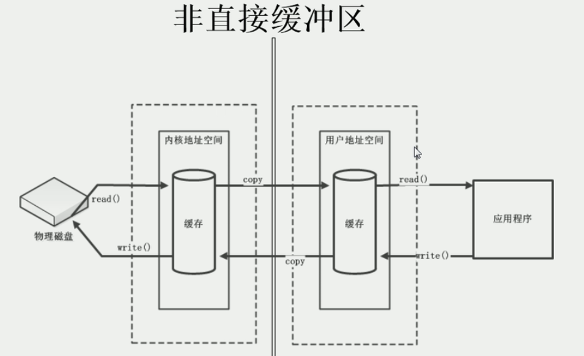

Java NIO（New IO或 Non Blocking IO）是从Java 1.4版本开始引入的一个新的IO API，可以替代标准的Java IO API。NIO支持面向缓冲区的、基于通道的IO操作。NIO将以更加高效的方式进行文件的读写操作。

# 1. Java IO 与 Java NIO 的区别

- IO 是面向流的，即在传输数据时建立传输通道，该传输通道类比为水管，数据流在传输通道中进行单向数据传输（可以理解为水流从高到低单向传输）。NIO 是面向缓冲区的，即在数据传输时建立传输通道，该传输通道类比为河流，而河流中有小船（缓冲区）负责双向运输数据。
- IO 是阻塞 IO，NIO 是非阻塞IO；
- NIO 有选择器；

Java NIO系统的核心在于：通道（Channel）和缓冲区（Buffer）。通道表示打开到 IO 设备（例如：文件、套接字）的连接。若需要使用 NIO 系统，需要获取用于连接 IO 设备的通道以及用于容纳数据的缓冲区。然后操作缓冲区，对数据进行处理，**因此 Channel 负责传输，Buffer负责存储。**

# 2. NIO 缓冲区

## 2.1 Buffer的类型

缓冲区（Buffer）：在java NIO 中负者数据的存储。缓冲区就是数组。用于存储不同类型的数据。

根据数据类型的不同(boolean 除外)，有以下 Buffer 常用子类：

- ByteBuffer
- CharBuffer
- ShortBuffer
- IntBuffer
- LongBuffer
- FloatBuffer
- DoubleBuffer

## 2.2 缓冲区存取数据的两个核心方法

put方法 —— 存入数据到缓冲区中

- put（byte b）：将给定单个字节写入缓冲区的当前位置；
- put（byte[] src）：将 src 中的字节写入缓冲区的当前位置；
- put（int index, byte b）：将指定字节写入缓冲区的索引位置(不会移动 position)；

get方法 —— 获取缓存区中的数据

 *       get（） ：读取单个字节；
 *       get（byte[] dst）：批量读取多个字节到 dst 中；
 *       get（int index）：读取指定索引位置的字节（不会移动 position）；

## 2.3 缓冲区中的四个核心属性

**capacity：**容量，表示缓冲区中最大存储数据的容量，一旦声明不能改变；

**limit：**界限，表示缓冲区中可以操作数据的大小。（limit后数据不能进行读写）

**position：**位置，表示缓冲区中正在操作数据的位置。

**mark：**标记，表示记录当前position位置。可以通过reset（）恢复到mark的位置。

`PS：0 <= mark <= position <= limit <= capacity`


**测试代码**

```java
ByteBuffer buf = ByteBuffer.allocate(1024);

// 初始化状态
System.out.println("position：" + buf.position());   // 0
System.out.println("limit：" + buf.limit());         // 1024
System.out.println("capacity：" + buf.capacity());   // 1024

// 写入数据到缓冲区
String s = "12345";
buf.put(s.getBytes());
System.out.println("position：" + buf.position());   // 5
System.out.println("limit：" + buf.limit());         // 1024
System.out.println("capacity：" + buf.capacity());   // 1024

// 切换到读取数据模式
buf.flip();
System.out.println("position：" + buf.position());   // 0
System.out.println("limit：" + buf.limit());         // 5
System.out.println("capacity：" + buf.capacity());   // 1024

// 读取数据后
byte[] dst = new byte[buf.limit()];
buf.get(dst);
System.out.println(new String(dst, 0, dst.length));
System.out.println("position：" + buf.position());   // 5
System.out.println("limit：" + buf.limit());         // 5
System.out.println("capacity：" + buf.capacity());   // 1024

// rewind(): 表示重复读，该操作会叫position重新索引到数据开始位置，可以继续进行读数据。
buf.rewind();
System.out.println("position：" + buf.position());   // 0
System.out.println("limit：" + buf.limit());         // 5
System.out.println("capacity：" + buf.capacity());   // 1024

// clear(): 清空缓冲区，但是缓冲区中的数据仍然存储，但是处于被遗忘状态
buf.clear();
System.out.println("position：" + buf.position());   // 0
System.out.println("limit：" + buf.limit());         // 1024
System.out.println("capacity：" + buf.capacity());   // 1024

// 清空缓冲区后继续读取数据
byte[] out = new byte[buf.limit()];                  // 此时的limit = 1024
buf.get(out);
System.out.println(new String(out, 0, out.length));  // 12345

// flip源码
public final Buffer flip() {
    limit = position;
    position = 0;
    mark = -1;
    return this;
}
```

## 2.4 直接缓冲区与非直接缓冲区

非直接缓冲区：通过allocate（）方法分配缓冲区，将缓冲区建立在 JVM 的内存中。

直接缓冲区：通过allocateDirect（）方法分配直接缓冲区，将缓冲区建立在物理内存中。可以提高效率
 *          此方法返回的缓冲区进行分配和取消分配所需成本通常高于非直接缓冲区 ；
 *          直接缓冲区的内容可以驻留在常规的垃圾回收堆之外；
 *          将直接缓冲区主要分配给那些易受基础系统的本机 I/O 操作影响的大型、持久的缓冲区；
 *          最好仅在直接缓冲区能在程序性能方面带来明显好处时分配它们；
 *          直接字节缓冲区还可以过 通过FileChannel 的 map（） 方法将文件区域直接映射到内存中来创建 。该方法返回MappedByteBuffe；




**代码**

```java
// 申请缓冲区空间
ByteBuffer directBuffer = ByteBuffer.allocateDirect(1024);
ByteBuffer buffer = ByteBuffer.allocate(1024);

// 判断是否为直接缓冲区
System.out.println(directBuffer.isDirect());    // true
System.out.println(buffer.isDirect());          // false
```

# 3. NIO 通道

## 3.1 通道基本概念

Channel 表示 IO 源与目标打开的连接。
Channel 类似于传统的“流”。但其自身不能直接访问数据，Channel只能与Buffer进行交互。


操作系统中：通道是一种通过执行通道程序管理I/O操作的控制器，它使主机（CPU和内存）与I/O操作之间达到更高的并行程度。需要进行I/O操作时，CPU只需启动通道，然后可以继续执行自身程序，通道则执行通道程序，管理与实现I/O操作。

## 3.2 通道的主要实现类

- FileChannel：文件通道
- SocketChannel：套接字通道
- ServerSocketChannel：套接字通道
- DatagramChannel：用于网络

## 3.3 获取通道的方式

Java 针对支持通道的类，提供了一个getChannel() 方法

- 本地IO
  - FileInputStream
  - FileOutputStream
  - RandomAccessFile
- 网络IO
  - Socket
  - ServerSocket
  - DatagramSocket

在JDK 1.7 中NIO.2 针对各通道提供了静态方法：`open()`

在JDK 1.7 中NIO.2 的Files工具类提供了一个静态方法：`newByteChannel()`

## 3.4 使用通道完成文件复制

- 使用非直接缓冲区完成文件复制

```java
public static void main(String[] args) {
    
    FileInputStream fis = null;
    FileOutputStream fos = null;
    FileChannel inChannel =  null;
    FileChannel outChannel = null;

    try {
        fis = new FileInputStream("duck.jpg");
        fos = new FileOutputStream("dup.jpg");

        // 获取通道
        inChannel =  fis.getChannel();
        outChannel = fos.getChannel();

        // 分配指定大小的缓冲区
        ByteBuffer buf = ByteBuffer.allocate(1024);

        // 将通道中的数据存入缓冲区
        while (inChannel.read(buf) != -1) {

            // 切换到读数据模式
            buf.flip();

            outChannel.write(buf);
            buf.clear();
        }
    } catch (Exception e) {
        e.printStackTrace();
    } finally {
        try {
            // 关闭流
            if(fis != null) {
                fis.close();
            }
            if(fos != null) {
                fos.close();
            }

            // // 关闭通道
            if(outChannel != null) {
                outChannel.close();
            }
            if(inChannel != null) {
                inChannel.close();
            }
        } catch (Exception e) {
            e.printStackTrace();
        } finally {

        }
    }
}

```

- 利用直接缓冲区复制文件：传输速度很快

```java
// 1. 利用内存映射文件传输数据。
public static void main(String[] args) throws IOException {
    // 获取通道
    FileChannel inChannel = FileChannel.open(Paths.get("E:/","duck.jpg"), StandardOpenOption.READ);
    FileChannel outChannel = FileChannel.open(Paths.get("dup.jpg"), StandardOpenOption.WRITE,StandardOpenOption.READ,StandardOpenOption.CREATE_NEW);

    // 得到的一个内存映射文件, 直接将文件存储在内存中了
    MappedByteBuffer inMappedBuf = inChannel.map(FileChannel.MapMode.READ_ONLY, 0, inChannel.size());
    MappedByteBuffer outMappedBuf = outChannel.map(FileChannel.MapMode.READ_WRITE, 0, inChannel.size());

    // 直接堆顶缓冲区进行数据的读写
    byte[] dst = new byte[inMappedBuf.limit()];

    inMappedBuf.get(dst);
    outMappedBuf.put(dst);

    inChannel.close();
    outChannel.close();
}

// 2. 利用通道直接传输
public static void main(String[] args) throws IOException {

    // 获取通道
    FileChannel inChannel = FileChannel.open(Paths.get("E:/","duck.jpg"), StandardOpenOption.READ);
    FileChannel outChannel = FileChannel.open(Paths.get("dup.jpg"), StandardOpenOption.WRITE,StandardOpenOption.READ,StandardOpenOption.CREATE_NEW);

    // 从 inChannel通道到outChannel通道
    inChannel.transferTo(0, inChannel.size(), outChannel);
    // outChannel.transferFrom(0, inChannel.size(), inChannel);

    inChannel.close();
    outChannel.close();
}

```

## 3.5 分散与聚集

- 分散读取（Scatter Reads）：将通道中的数据分散到多个缓冲区中（按顺序分散）；
- 聚集写入（Gather Writes）：将多个缓冲区中的数据都聚集到通道中（按顺序分散）；

```java
public static void main(String[] args) throws IOException {
    RandomAccessFile raf = new RandomAccessFile("test.txt", "rw");

    // 获取通道
    FileChannel channel = raf.getChannel();

    // 分配指定大小的缓冲区
    ByteBuffer buf1 = ByteBuffer.allocate(9);
    ByteBuffer buf2 = ByteBuffer.allocate(1024);

    // 分散读取
    ByteBuffer[] bufs = {buf1, buf2};
    channel.read(bufs);

    // 切换成读模式
    for (ByteBuffer buf: bufs) {
        buf.flip();
    }
    // System.out.println(new String(bufs[0].array(), 0, bufs[0].limit()));
    // System.out.println(new String(bufs[1].array(), 0, bufs[1].limit()));

    // 将bufs中的数据聚集写入到另一个文件中
    RandomAccessFile raf1 = new RandomAccessFile("dup.txt", "rw");

    FileChannel channel1 = raf1.getChannel();

    channel1.write(bufs);

    channel.close();
    channel1.close();
}
```

## 3.6 字符集

- 编码：字符串转换成字节数组
- 解码：字节数组转换成字符串

```java
public static void main(String[] args) throws CharacterCodingException {

    Charset cs1 = Charset.forName("GBK");

    // 获取编码器
    CharsetEncoder ce = cs1.newEncoder();

    // 获取解码器
    CharsetDecoder cd = cs1.newDecoder();

    CharBuffer cBuf = CharBuffer.allocate(1024);
    cBuf.put("闪电五连鞭！");
    cBuf.flip();

    //编码
    ByteBuffer bBuf = ce.encode(cBuf);

    for(int i=0; i< 12; i++) {
        System.out.println(bBuf.get());	// 将汉字编译为GBK编码
    }

    // 解码
    bBuf.flip();
    CharBuffer cBuf2 = cd.decode(bBuf);
    System.out.println(cBuf2.toString());
}
```

# 4. NIO 非阻塞式网络通信

## 4.1 NIO 网络编程基本概念

传统的阻塞式 IO（BIO）必须等待内容获取完毕后，才能够继续往下执行。在 NIO 中，引入了`选择器`的概念，它会把每个通道都注册到选择器中，选择器的作用就是监控通道上的 IO状态，如果某个通道上，IO请求已经准备就绪时，那么选择器才会将该客户端的通道分配到服务端的一个或多个线程上。


- **通道（Channel）：**负责连接；
  - java.nio.channels.Channel；
    - SelectableChannel；
      - SocketChannel；
      - ServerSocketChannel：TCP；
      - DatagramChannel：UDP；
    - Pipe.SinkChannel；
    - Pipe.SourceChannel；
- **缓冲区（Buffer）：**负责数据的存取；
- **选择器（Selector）：**SelectableChannel 的多路复用器，用于监控 SelectorableChannel 的 IO 状况；

## 4.2 阻塞与非阻塞

**定义：**阻塞和非阻塞指的是调用者（程序）在等待返回结果（或输入）时的状态。

- 阻塞时，在调用结果返回前，当前线程会被挂起，并在得到结果之后返回。
- 非阻塞时，如果不能立刻得到结果，则该调用者不会阻塞当前线程。

阻塞与非阻塞关注的是线程的运行。

讲到阻塞与非阻塞就会牵扯到同步与异步的问题！

**同步和异步**关注的是**消息通信机制**。

- 同步：调用方发起一个调用，需要等待这个调用返回结果才能执行后续操作。（买票时在窗口前一直排队，在没有买到票之前，你不能去处理其他事情）
- 异步：调用方发起一个调用，不会立即得到调用结果，此时调用方可以去处理其他事情（买票时，获得一个排队号码，在没有轮到该排队号码之前，你可以去做任何事情——买杯奶茶，打把游戏）

## 4.3 阻塞式通信

- 客户端

```java
/**
 * 客户端
 */
public static void client() throws IOException {
    // 获取 网络通信通道 与 传输文件的通道
    SocketChannel sChannel = SocketChannel.open(new InetSocketAddress("127.0.0.1", 8888));
    FileChannel inChannel = FileChannel.open(Paths.get("duck.jpg"), StandardOpenOption.READ);

    // 分配缓冲区大小
    ByteBuffer buffer = ByteBuffer.allocate(1024);

    // 读取文件信息，通过网络通道发送到服务端
    while (inChannel.read(buffer) != -1) {
        buffer.flip();

        // 将缓冲区信息写入网络传输管道
        sChannel.write(buffer);

        // 清空缓冲区
        buffer.clear();
    }

    // 客户端通知服务端数据发送完毕，之后会接收服务端的数据
    sChannel.shutdownOutput();

    // 接收服务端的信息
    int len = 0;
    while ((len = sChannel.read(buffer)) != -1) {
        buffer.flip();
        System.out.println(new String(buffer.array(), 0, len));
        buffer.clear();
    }

    // 关闭通道
    inChannel.close();
    sChannel.close();
}
```

- 服务端

```java
/**
 * 服务端
 */
public static void server() throws IOException {
    // 获取 网络通信通道 与 传输文件的通道
    ServerSocketChannel ssChannel = ServerSocketChannel.open();
    FileChannel outChannel = FileChannel.open(Paths.get("dup.jpg"), StandardOpenOption.WRITE, StandardOpenOption.CREATE);

    // 绑定端口号
    ssChannel.bind(new InetSocketAddress(8888));

    // 获取客户端连接的通道
    SocketChannel socketChannel = ssChannel.accept();

    // 分配指定大小的缓冲区
    ByteBuffer buffer = ByteBuffer.allocate(1024);

    // 读取网络通道中的数据，写入本地文件
    while (socketChannel.read(buffer) != -1) {
        buffer.flip();
        outChannel.write(buffer);
        buffer.clear();
    }

    // 服务端向客服端发送数据
    buffer.put("服务端数据接收完毕".getBytes());
    buffer.flip();
    socketChannel.write(buffer);

    // 关闭通道
    ssChannel.close();
    socketChannel.close();
    outChannel.close();
}
```

- 运行两个方法

```java
public static void main(String[] args) throws InterruptedException {
    new Thread(() -> {
        try {
            server();
        } catch (IOException e) {
            e.printStackTrace();
        }
    }).start();

    TimeUnit.SECONDS.sleep(1);

    new Thread(() -> {
        try {
            client();
        } catch (IOException e) {
            e.printStackTrace();
        }
    }).start();

    System.out.println("main方法运行完毕！");
}
```

## 4.4 非阻塞式通信

- 客户端

```java
/**
 * 客户端
 */
public static void client() throws IOException {

    // 获取网络通信通道
    SocketChannel sChannel = SocketChannel.open(new InetSocketAddress("127.0.0.1", 8888));

    // 切换非阻塞模式
    sChannel.configureBlocking(false);

    // 分配指定大小的缓冲区
    ByteBuffer buffer = ByteBuffer.allocate(1024);

    // 通过网络通道发送数据
    buffer.put("服务器你能听到我说话吗？".getBytes());
    buffer.flip();
    sChannel.write(buffer);
    buffer.clear();

    // 关闭通道
    sChannel.close();
}
```

- 服务端

```java
/**
 * 服务端
 */
public static void server() throws IOException {
    
    // 获取网络通信通道
    ServerSocketChannel ssChannel = ServerSocketChannel.open();

    // 切换到非阻塞模式
    ssChannel.configureBlocking(false);

    // 绑定端口
    ssChannel.bind(new InetSocketAddress(8888));

    // 获取选择器
    Selector selector = Selector.open();

    // 将通道注册到选择器上，并且监听指定的通道状态
    // 选择监听 接收状态，当客户端发送信息时，服务端开始获取连接
    ssChannel.register(selector, SelectionKey.OP_ACCEPT);

    // 轮询式获取选择器上已准备就绪的事件
    while (selector.select() > 0) {
        // 获取当前选择器中 所有注册的 已就绪 的事件
        Iterator<SelectionKey> it = selector.selectedKeys().iterator();

        while (it.hasNext()) {
            // 获取准备就绪的事件
            SelectionKey sk = it.next();

            // 判断就绪事件的状态

            // 接收事件 就绪
            if (sk.isAcceptable()) {

                // 接收事件表明，客户端已发送数据，想要进行通信，则服务端开始与客户端连接
                SocketChannel sChannel = ssChannel.accept();

                // 切换非阻塞模式
                sChannel.configureBlocking(false);

                // 将该通道注册到选择器上，并监听读就绪状态
                sChannel.register(selector, SelectionKey.OP_READ);

            } else if(sk.isReadable()) {    // 读就绪状态就绪

                // 获取当前选择器上 读就绪 状态的通道
                SocketChannel sChannel = (SocketChannel) sk.channel();

                // 读取数据
                ByteBuffer buffer = ByteBuffer.allocate(1024);
                while (sChannel.read(buffer) != -1) {
                    buffer.flip();
                    System.out.println(Thread.currentThread().getName() + "\t" + new String(buffer.array(), 0, buffer.limit()));
                    buffer.clear();
                }
            }
        }
        // 操作执行完成后，需要将 选择键给取消 SelectionKey
        it.remove();
    }
}
```

## 4.5 非阻塞式聊天室

- 客户端

```java
public static void main(String[] args) throws IOException {
    client("李华");
}

public static void client(String name) throws IOException {
    // 获取通道
    SocketChannel sChannel = SocketChannel.open(new InetSocketAddress("127.0.0.1", 8888));

    // 切换成非阻塞模式
    sChannel.configureBlocking(false);

    // 分配指定大小的缓冲区
    ByteBuffer buf = ByteBuffer.allocate(1024);

    // 使用输入流
    Scanner sc = new Scanner(System.in);

    while(sc.hasNext()) {
        String input = sc.next();
        String msg = LocalDateTime.now().format(DateTimeFormatter.ofPattern("HH:mm")) + " —— " + name + ": \t" + input;
        // 获取输入内容
        buf.put(msg.getBytes());
        // 切换成写模式
        buf.flip();
        // 将缓冲区中的内容写入通道
        sChannel.write(buf);
        // 清空缓冲区
        buf.clear();
    }
    // 关闭通道
    sChannel.close();
}
```

- 服务端

```java
/**
 * 服务端
 */
public static void server() throws IOException {

    // 获取通道
    ServerSocketChannel ssChannel = ServerSocketChannel.open();

    // 切换成非阻塞模式
    ssChannel.configureBlocking(false);

    // 绑定连接
    ssChannel.bind(new InetSocketAddress(8888));

    // 获取选择器
    Selector selector = Selector.open();

    // 将通道注册到选择器上，第二个参数代表选择器监控通道的什么状态
    // 用选择器监听 接收状态，也就是说客户端什么时候发送了，我才会开始获取连接
    ssChannel.register(selector, SelectionKey.OP_ACCEPT);

    // 轮询式的获取选择器上已经准备就绪的事件
    while(selector.select() > 0) {

        // 获取当前选择器中 所有注册的选择键（已就绪的监听事件）
        Iterator<SelectionKey> it = selector.selectedKeys().iterator();

        while(it.hasNext()) {
            // 获取准备就绪的事件
            SelectionKey sk = it.next();

            // 判断是具体什么事件准备就绪

            // 接收事件就绪
            if(sk.isAcceptable()) {
                // 若 接收就绪，获取客户端连接
                SocketChannel sChannel = ssChannel.accept();

                // 切换非阻塞模式
                sChannel.configureBlocking(false);

                // 将该通道注册到选择器上，并监听读就绪状态
                sChannel.register(selector, SelectionKey.OP_READ);

            } else if(sk.isReadable()) {
                // 读就绪状态就绪

                // 获取当前选择器上 读就绪 状态的通道
                SocketChannel sChannel = (SocketChannel) sk.channel();

                // 读取数据
                ByteBuffer buf = ByteBuffer.allocate(1024);

                int len = 0;
                while((len = sChannel.read(buf)) > 0) {
                    // 切换成读取模式
                    buf.flip();
                    // 打印客户端的发送
                    System.out.println( new String(buf.array(), 0, len));
                    // 清空缓存
                    buf.clear();
                }
            }
        }

        // 操作执行完成后，需要将 选择键给取消 SelectionKey
        it.remove();
    }
}

public static void main(String[] args) throws IOException {
    server();
}
```

- 运行结果


## 4.6 DatagramChannel通信

- 客户端

```java
public static void client() throws IOException {
    DatagramChannel dc = DatagramChannel.open();

    dc.configureBlocking(false);

    ByteBuffer buffer = ByteBuffer.allocate(1024);

    Scanner scanner = new Scanner(System.in);
    while (scanner.hasNext()) {
        String input = scanner.next();
        String msg = LocalDateTime.now().format(DateTimeFormatter.ofPattern("HH:mm")) + "\t" + input;
        buffer.put(msg.getBytes());
        buffer.flip();
        dc.send(buffer, new InetSocketAddress("127.0.0.1",8888));
        buffer.clear();
    }
    dc.close();
}
```

- 服务端

```java
public static void server() throws IOException {
    
    DatagramChannel dc = DatagramChannel.open();
    
    dc.configureBlocking(false);
    dc.bind(new InetSocketAddress(8888));

    Selector selector = Selector.open();
    dc.register(selector, SelectionKey.OP_READ);

    while (selector.select() > 0) {
        Iterator<SelectionKey> it = selector.selectedKeys().iterator();

        while (it.hasNext()) {
            SelectionKey sk = it.next();
            if (sk.isReadable()) {
                ByteBuffer buffer = ByteBuffer.allocate(1024);
                dc.receive(buffer);
                buffer.flip();
                System.out.println(new String(buffer.array(),0,buffer.limit()));
                buffer.clear();
            }
        }
        it.remove();
    }
}
```

## 4.7 管道（Pipe）

Java NIO管道是两个线程之间的单向数据连接。Pipe有一个source通道和一个sink通道，数据会被写入到sink通道，从source通道读取。


```java
public static void main(String[] args) throws IOException {
    Pipe pipe = Pipe.open();
    new Thread(() -> {
        try {
            send(pipe);
        } catch (IOException e) {
            e.printStackTrace();
        }
    }).start();
    
    new Thread(() -> {
        try {
            receive(pipe);
        } catch (IOException e) {
            e.printStackTrace();
        }
    }).start();

}

public static void send(Pipe pipe) throws IOException {
    ByteBuffer buf = ByteBuffer.allocate(1024);
    Pipe.SinkChannel sinkChannel = pipe.sink();

    buf.put("闪电五连鞭！".getBytes());
    buf.flip();
    sinkChannel.write(buf);
}

public static void receive(Pipe pipe) throws IOException {
    Pipe.SourceChannel sourceChannel = pipe.source();
    ByteBuffer buf = ByteBuffer.allocate(1024);
    sourceChannel.read(buf);
    buf.flip();
    System.out.println(new String(buf.array(), 0, buf.limit()));
}
```

