> JUC笔记内容引自：https://mrbird.cc/Java-Memory-model.html 感谢！

# Java 内存模型

## JMM 抽象结构

在Java中，所有实例域、静态域和数组元素都存储在堆内存中，堆内存在线程之间共享（共享变量）。局部变量、方法参数不会在线程间共享，也就不受JMM的影响。

Java内存模型即Java Memory Model，简称为JMM。JMM定义了线程和主内存之间的抽象关系：**线程之间的共享变量存储在主内存**（Main Memory）中，每个线程都有一个私有的本地内存（Local Memory，或者也可以称为工作内存 Work Memory），**本地内存中存储了该线程以读/写共享变量的副本**。本地内存是JMM的一个抽象概念，并不真实存在。它涵盖了缓存、写缓冲区、寄存器以及其他的硬件和编译器优化。

JMM的抽象示意图如下所示：

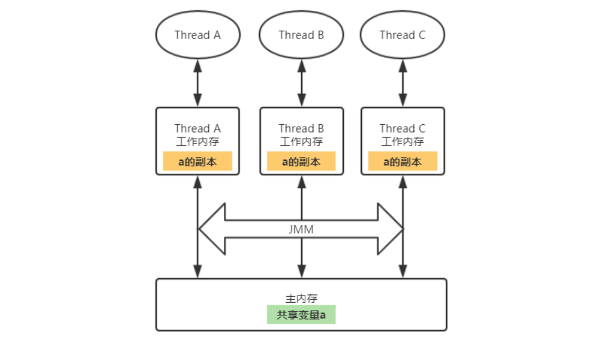

多个线程同时对同一个共享变量进行读写的时候会产生线程安全问题。那为什么CPU不直接操作内存，而要在CPU和内存间加上各种缓存和寄存器等缓冲区呢？因为CPU的运算速度要比内存的读写速度快得多，如果CPU直接操作内存的话势必会花费很长时间等待数据到来，所以缓存的出现主要是为了解决CPU运算速度与内存读写速度不匹配的矛盾。

## 内存间的交互协议

JMM规定了主内存和工作内存间具体的交互协议，即一个变量如何从主内存拷贝到工作内存、如何从工作内存同步到主内存之间的实现细节，这主要包含了下面8个步骤：

图引自：https://blog.csdn.net/u011080472/article/details/51337422

- **lock（锁定）：**作用于`主内存的变量`，把一个变量标识为一条线程独占状态。
- **read（读取）：**作用于`主内存变量`，把一个变量值从主内存传输到线程的工作内存中，以便随后的load动作使用。
- **load（载入）：**作用于`工作内存的变量`，它把 read 操作从主内存中得到的变量值放入工作内存的变量副本中。
- **use（使用）：**作用于`工作内存的变量`，把工作内存中的一个变量值传递给执行引擎，每当虚拟机遇到一个需要使用变量的值的字节码指令时将会执行这个操作。
- **assign（赋值）：**作用于`工作内存的变量`，它把一个从执行引擎接收到的值赋值给工作内存的变量，每当虚拟机遇到一个给变量赋值的字节码指令时执行这个操作。
- **store（存储）：**作用于`工作内存的变量`，把工作内存中的一个变量的值传送到主内存中，以便随后的write的操作。
- **write（写入）：**作用于`主内存的变量`，它把store操作从工作内存中一个变量的值传送到主内存的变量中。
- **unlock（解锁）：**作用于`主内存变量`，把一个处于锁定状态的变量释放出来，释放后的变量才可以被其他线程锁定。

## 内存屏障

通过插入内存屏障（Memory Barrier）可以阻止特定类型的指令重排。JMM将内存屏障划分为四种：

| 屏障类型            | 示例                     | 描述                                                         |
| :------------------ | :----------------------- | :----------------------------------------------------------- |
| LoadLoad Barriers   | Load1-LoadLoad-Load2     | Load1数据装载过程要先于Load2及所有后续的数据装载过程         |
| StoreStore Barriers | Store1-StoreStore-Store2 | Store1刷新数据到内存的过程要先于Strore2及后续所有刷新数据到内存的过程 |
| LoadStore Barriers  | Load1-LoadStore-Store2   | Load1数据装载要先于Strore2及后续所有刷新数据到内存的过程     |
| StoreLoad Barriers  | Store1-StoreLoad-Load2   | Store1刷新数据到内存的过程要先于Load2及所有后续的数据装载过程 |

Java中volatile关键字的实现就是通过内存屏障来完成的。

## 指令重排

在执行程序时，为了提高性能，编译器和处理器常常会对指令做重排序。从Java源代码到最终实际执行的指令序列，会分别经历下面3种重排序：

1. **编译器优化的重排序。**编译器在不改变单线程程序语义的前提下，可以重新安排语句的执行顺序。
2. **指令级并行的重排序。**现代处理器采用了指令级并行技术（Instruction-LevelParallelism，ILP）来将多条指令重叠执行。如果**不存在数据依赖性**，处理器可以改变语句对应机器指令的执行顺序。
3. **内存系统的重排序。**由于处理器使用缓存和读/写缓冲区，这使得加载和存储操作看上去可能是在乱序执行。

如果两个操作访问同一个变量，其中一个为写操作，此时这两个操作之间存在数据依赖性。 编译器和处理器不会改变存在数据依赖性关系的两个操作的执行顺序，即不会重排序。不管怎么重排序，单线程下的执行结果不能被改变，编译器、runtime和处理器都必须遵守as-if-serial语义。


## happens-before

从jdk5开始，java使用新的JSR-133内存模型，**基于happens-before的概念来阐述操作之间的内存可见性。**

在JMM中，如果一个操作的执行结果需要对另一个操作可见，那么这两个操作之间必须要存在happens-before关系，这个的两个操作既可以在同一个线程，也可以在不同的两个线程中。简单来说就是：**前一个操作的结果对后续操作时可见的**。

与程序员密切相关的happens-before规则如下：

- **程序顺序规则：**一个线程中的每个操作，happens-before于该线程中任意的后续操作。
- **监视器锁规则：**对一个锁的解锁操作，happens-before于随后对这个锁的加锁操作。
- **volatile域规则：**对一个volatile域的写操作，happens-before于任意线程后续对这个volatile域的读。
- **传递性规则：**如果 A happens-before B，且 B happens-before C，那么A happens-before C。

注意：两个操作之间具有happens-before关系，并不意味前一个操作必须要在后一个操作之前执行！仅仅要求前一个操作的执行结果，对于后一个操作是可见的，且前一个操作按顺序排在后一个操作之前。

# volatile 关键字详解

volatile关键字修饰的成员变量具有两大特性：

1. 可见性：对一个volatile变量的读，任意线程总能看到对这个volatile变量最后的写入。
2. 有序性：volatile关键字可以禁止代码重排序，保证其有序性。
3. 原子性：对任意单个volatile变量的读/写具有原子性，但类似于volatile++这种复合操作不具有原子性。

## 可见性

线程对主内存中共享变量的修改过程

1. 从主内存获取值的拷贝，然后保存到线程的工作内存中。
2. 在工作内存中对值进行修改。
3. 将工作内存中修改的值刷新回主内存。

由于不同线程拥有各自的工作内存，所以它们对某个共享变量值的修改在没有刷回主内存的时候只对自己可见。

```java
public class Demo11 {

    private static int COUNT = 0;
    private final static int MAX_VALUE = 4;

    public static void main(String[] args) {
        // 读线程
        new Thread(() -> {
            int value = COUNT;
            while (value < MAX_VALUE) {
                if (value != COUNT) {
                    System.out.println("获取更新后的值：" + COUNT);
                    value = COUNT;
                }
            }
        }).start();

        // 写线程
        new Thread(() -> {
            int value = COUNT;
            while (value < MAX_VALUE) {
                System.out.println("将COUNT更新为：" + ++value);
                COUNT = value;
                try {
                    TimeUnit.MILLISECONDS.sleep(500);
                } catch (InterruptedException e) {
                    e.printStackTrace();
                }
            }
        }).start();
    }
}
```

写线程每个0.5秒对COUNT递增，直到COUNT>=4。而读线程则是不停的嗅探COUNT的值，直到COUNT>=4。

```
将COUNT更新为：1
获取更新后的值：1
将COUNT更新为：2
将COUNT更新为：3
将COUNT更新为：4
```

运行结果分析：从上述结果可以看出 写线程 对 COUNT 的修改读线程并不能感知到，为什么呢？

因为 writer 线程在工作内存中修改了COUNT 的值，即使它刷回主内存了，但是 reader 线程在此之前已经从主内存获取了COUNT 的值（因为线程获取CPU时间片不确定性，这个值可能是0，也可能是被 writer 修改后的值，但 writer 线程是每隔 0.5 毫秒才会去修改值，所以 reader 获取到的 COUNT 的值一般不会是 writer 修改的最终值5），并保存到了 reader 线程的工作内存中。reader 线程通过 while不断的轮询判断 value 和 COUNT 的值是否相等，但是由于 reader线程工作内存中已经有 COUNT 的值的拷贝了，所以 reader 线程并不会重新从主内存中获取被 writer 修改后的 COUNT的值，reader 线程里 while 条件一直成立，这就是为什么 reader 线程不会正常停止并且没有输出修改后的值的原因。

修改上面的例子，**将COUNT成员变量使用volatile关键字修饰**，运行结果如下：

```
将COUNT更新为：1
获取更新后的值：1
将COUNT更新为：2
获取更新后的值：2
将COUNT更新为：3
获取更新后的值：3
将COUNT更新为：4
获取更新后的值：4
```

可以发现reader线程可以感知到write线程对COUNT的修改。为什么volatile修饰的成员变量在线程间具有可见性呢？**因为通过volatile修饰，对此变量进行写操作时，汇编指令中会有一个LOCK前缀指令，加了这个指令后，会引发两件事情：**

1. 将当前处理器缓存行的内容写回到系统内存，也就是强制将工作内存中的值刷回主内存；
2. 这个写回到内存的操作会使得在其他CPU里缓存了该内存地址的数据失效。其他CPU缓存数据失效，则会重新去内存中读取值，也就是被修改的数据。

通过上面这两个特性，我们可以确定的是，writer对值进行修改并刷回主内存后，reader里COUNT值的拷贝就失效了，所以reader线程会再次从主内存中获取INIT_VALUE的值，这时候这个值已经是被writer线程修改刷新后的值了。

## 有序性

**volatile关键字可以禁止代码重排序，保证其有序性。**

来看一个线程不安全的单例实现：

```java
public class SingletonTest {
    
    // 私有化构造函数，让外部没办法直接通过new来创建
    private SingletonTest() {
    }
    
    // 单例对象
    private static SingletonTest instance = null;
    
    // 静态工厂方法
    public static SingletonTest getInstance() {
        
        if (instance == null) { // 双重检测
            synchronized (SingletonTest.class) { // 同步锁
                if (instance == null) {
                    instance = new SingletonTest();
                }
            }
        }
        return instance;
    }
}
```

上面的例子虽然加了同步锁，但是在多线程下并不是线程安全的。第12行`instance = new SingletonTest()`在实际执行的时候会被拆分为以下三个步骤:

1. 分配存储SingletonTest对象的内存空间。
2. 初始化SingletonTest对象。
3. 将instance指向刚刚分配的内存空间。

为了提高性能，编译器和处理器常常会对指令做重排序，因为第2步和第3步并没有依赖关系，所以可能发生重排序，排序后的步骤为：

1. 分配存储SingletonTest对象的内存空间；
2. 将instance指向刚刚分配的内存空间；
3. 初始化SingletonTest对象。

经过重排序后，上面的例子在多线程下就会出现问题。假如现在有两个线程A和B同时调用`SingletonTest.getInstance`，线程A执行到了代码的第12行`instance = new SingletonTest()`，已经完成了对象内存空间的分配并将instance指向了该内存空间，线程B执行到了第9行，发现instance并不是null（因为已经指向了内存空间），所以就直接返回instance了。但是线程A并还没有执行初始化SingletonTest操作，所以实际线程B拿到的SingletonTest实例是空的，那么线程B后续对SingletonTest操控将抛出空指针异常。

**使用volatile修饰单例对象即可实现线程安全：**因为通过volatile修饰的成员变量会添加内存屏障来阻止JVM进行指令重排优化。

```java
public class SingletonTest {
    
    // 私有化构造函数，让外部没办法直接通过new来创建
    private SingletonTest() {
    }
    
    // 单例对象
    private volatile static SingletonTest instance = null;
    
    // 静态工厂方法
    public static SingletonTest getInstance() {
        if (instance == null) { // 双重检测
            synchronized (SingletonTest.class) { // 同步锁
                if (instance == null) {
                    instance = new SingletonTest();
                }
            }
        }
        return instance;
    }
}
```

## 线程不安全

volatile关键字对任意单个volatile变量的读/写具有原子性，但类似于volatile++这种复合操作不具有原子性。

```java
public class VolatileTest2 {
    private volatile static int value;

    public static void main(String[] args) throws InterruptedException {
        Thread thread1 = new Thread(() -> IntStream.range(0, 500).forEach(i -> value += 1));
        Thread thread2 = new Thread(() -> IntStream.range(0, 500).forEach(i -> value += 1));

        thread1.start();
        thread2.start();
        thread1.join();
        thread2.join();
        System.out.println(value);
    }
}
```

运行结果：

```
第一次输出: 996
第二次输出: 998
……
```

volatile可以保证修改的值能够马上更新到主内存，其他线程也会捕捉到被修改后的值，那么为什么不能保证原子性呢？

**因为在Java中，只有对基本类型的赋值和修改才是原子性的，而对共享变量的修改并不是原子性的**。通过内存交互协议我们可以知道，一个线程修改共享变量的值需要经过下面这些步骤：

1. 线程从主内存中读取（read）共享变量的值，然后载入（load）到线程的工作内存中的变量；
2. 使用（use）工作内存变量的值，执行加减操作，然后将修改后的值赋值（assign）给工作内存中的变量；
3. 将工作内存中修改后的变量的值存储（store）到主内存中，并执行写入（write）操作。

所以上面的例子中，可能出现下面这种情况：

thread1 和 thread2 同时获取了 value 的值，比如为 100。thread1 执行了+1 操作，然后写回主内存，这个时候 thread2 刚好执行完use操作（+1），准备执行assign（将+1后的值写回工作内存对应的变量中）操作。虽然这时候thread2工作内存中 value 值的拷贝无效了（因为volatile的特性），但是 thread2 已经执行完 +1 操作了，它并不需要再从主内存中获取 value 的值，所以 thread2 可以顺利地将 +1 后的值赋值给工作内存中的变量，然后刷回主存。这就是为什么上面的累加结果可能会小于1000的原因。

# Java 并发容器

JUC包中提供以下并发容器：

- **ConcurrentHashMap:**  线程安全的 HashMap
- **CopyOnWriteArrayList:**  线程安全的 List，在读多写少的场合性能非常好，远远好于 Vector.
- **ConcurrentLinkedQueue:**  高效的并发队列，使用链表实现。可以看做一个线程安全的 LinkedList，这是一个非阻塞队列。
- **BlockingQueue:**  这是一个接口，JDK 内部通过链表、数组等方式实现了这个接口。表示阻塞队列，非常适合用于作为数据共享的通道。
- **ConcurrentSkipListMap:**  跳表的实现。这是一个 Map，使用跳表的数据结构进行快速查找。

## Map 线程安全问题

`HashMap` 不是线程安全的，在并发场景下使用 `Collections.synchronizedMap()` 方法来包装我们的 HashMap来保证线程安全。但这是通过使用一个全局的锁来同步不同线程间的并发访问，因此会带来不可忽视的性能问题。

`ConcurrentHashMap` 中，无论是读操作还是写操作都能保证很高的性能：在进行读操作时(几乎)不需要加锁，而在写操作时通过锁分段技术只对所操作的段加锁而不影响客户端对其它段的访问。

## List 线程安全问题

解决List线程安全可以使用一下 三种方法：

1. 使用 `Vector`：Vector所有操作集合元素的方法都使用了synchronized修饰方法。

   ```java
   public class CollectionTest {
   
       public static void main(String[] args) {
           List<String> data = new Vector<>();
           IntStream.range(0, 30).forEach(
                   i -> new Thread(
                       () -> data.add(String.valueOf(i)), String.valueOf(i)).start()
           );
           System.out.println(data);
       }
   }
   ```

2. 使用`Collections`工具类的`synchronizedList`方法：所有操作集合元素的方法也是使用了synchronized修饰方法。

   ```java
   public class CollectionTest {
   
       public static void main(String[] args) {
           
           List<String> data = Collections.synchronizedList(new ArrayList<>());
           
           IntStream.range(0, 30).forEach(
                   i -> new Thread(
                       () -> data.add(String.valueOf(i)), String.valueOf(i)).start()
           );
           System.out.println(data);
       }
   }
   ```

3. 使用`CopyOnWriteArrayList`：

   ```java
   public class CollectionTest {
   
       public static void main(String[] args) {
           List<String> data = new CopyOnWriteArrayList<>();
           IntStream.range(0, 30).forEach(
                   i -> new Thread(
                       () -> data.add(String.valueOf(i)), String.valueOf(i)).start()
           );
           System.out.println(data);
       }
   }
   ```

   查看底层源码：其中add（）方法使用的是**可重入锁**解决线程安全问题的。

   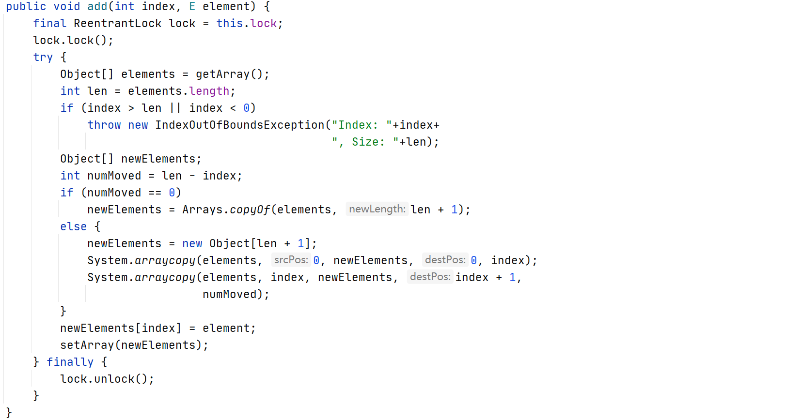

上面方法的源码使用了写时复制的思想（`CopyOnWrite`）：往一个容器添加元素的时候，不直接往当前容器`Object[]`添加，而是先将当前容器`Object[]`进行复制，复制出一个新的容器`Object[] newElements`，然后往新的容器`Object[] newElements`里添加新的元素。添加完后，再将原容器的引用指向新的容器（即源码中的`setArray(newElements)`）。

这种做法的好处是可以对`CopyOnWrite`的容器进行并发的读，而不需要加锁，因为当前容器不会添加任何元素。所以这也是一种读写分离的思想，即读和写的容器是不同的容器。

上面这三种解决办法中，更推荐使用`CopyOnWriteArrayList`。

## Set 线程安全问题

HashSet在并发下修改也会出现线程安全问题。解决办法同样可以通过`Collections.synchronizedSet`和`CopyOnWriteArraySet`解决。

## Java 中的阻塞队列

**BlockingQueue即阻塞队列**，一个阻塞队列在数据结构中起到的作用大致如下图所示：

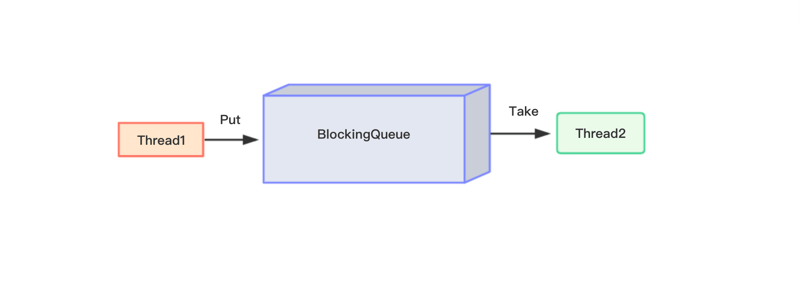

上图中，线程1往阻塞队列中添加元素，线程2从阻塞队列中移出元素。当阻塞队列是空的时候，从队列中获取元素的操作将会被阻塞；当阻塞队列是满的时候，往队列中添加元素的操作将会被阻塞。

使用BlockingQueue的好处是，我们不需要关心什么时候需要阻塞线程，什么时候需要唤醒线程，这些都由BlockingQueue自定完成。

### 阻塞队列的七大实现类

BlockingQueue是一个接口类，主要有7种实现类型，UML类图如下所示：

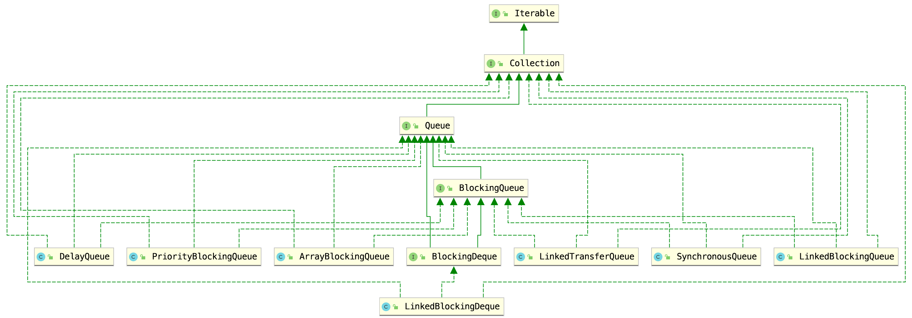

1. ArrayBlockingQueue：由数组机构组成的**有界**阻塞队列；
2. LinkedBlockingQueue：由链表结构组成的**有界**（默认大小非常大，为Integer.MAX_VALUE）阻塞队列；
3. PriorityBlockingQueue：一个支持优先级排序的**无界**阻塞队列；
4. DelayQueue：一个使用优先级队列实现的**无界**阻塞队列；
5. SynchronousQueue：一个不存储元素的阻塞队列；
6. LinkedTransferQueue：一个由链表结构组成的**无界**阻塞队列；
7. LinkedBlockingDeque：一个由链表结构组成的双向阻塞队列。

前六种都是单向队列，实现的是`BlockingQueue`接口，`LinkedBlockingDeque`是一个双向队列，实现的是`BlockingDeque`接口，该接口继承了`BlockingQueue`接口。

### ArrayBlockingQueue

`ArrayBlockingQueue`是一个用数组实现的**有界**阻塞队列。此队列按照**先进先出（FIFO）**的原则对元素进行排序。**默认情况下不保证访问者公平的访问队列**，所谓公平访问队列是指阻塞的线程，可以按照阻塞的先后顺序访问队列，即先阻塞的线程先访问队列。非公平性是对先等待的线程是非公平的，当队列可用时，阻塞的线程可以争夺访问队列的资格，有可能先阻塞的线程最后才访问队列。通常情况下为了保证公平性会降低吞吐量。

我们可以使用以下代码创建一个**公平的阻塞队列：**

```
ArrayBlockingQueue<String> fairArrayBlockingQueue = new ArrayBlockingQueue<>(5, true);
```

上面代码指定了一个初始大小为5的公平的`ArrayBlockingQueue`。访问者的公平性是使用可重入锁实现的，构造器源码如下：


### LinkedBlockingQueue

`LinkedBlockingQueue`是一个用链表实现的**有界**阻塞队列。此队列按照先进先出的原则对元素进行排序。此队列的默认最大长度为`Integer.MAX_VALUE`：


所以推荐的做法是不要使用无参构造器，而是通过有参构造器指定容器的初始大小。

### PriorityBlockingQueue

`PriorityBlockingQueue`是一个支持优先级的无界队列。默认情况下元素采取自然顺序排列，也可以通过比较器comparator来指定元素的排序规则。元素按照升序排列。

### DelayQueue

`DelayQueue`也是一个无界阻塞队列，**只有在延迟期满时才能从中提取元素。**`DelayQueue`的所有方法只能操作“到期的元素“，例如，`poll()`、`remove()`、`size()`等方法，都会忽略掉未到期的元素。 我们可以将`DelayQueue`运用在以下应用场景：

1. 缓存系统的设计：可以用DelayQueue保存缓存元素的有效期，使用一个线程循环查询`DelayQueue`，一旦能从`DelayQueue`中获取元素时，表示缓存有效期到了；
2. 定时任务调度。使用`DelayQueue`保存当天将会执行的任务和执行时间，一旦`从DelayQueue`中获取到任务就开始执行。

`DelayQueue`的实现是基于`PriorityQueue`，是一个优先级队列，是以延时时间的长短进行排序的。所以，`DelayQueue`需要知道每个元素的延时时间，而这个延时时间是由`Delayed`接口的`getDelay()`方法获取的。所以，`DelayQueue`的元素必须实现`Delayed`接口。

### SynchronousQueue

`SynchronousQueue`是一个不存储元素的阻塞队列。**每一个put操作必须等待一个take操作**，否则不能继续添加元素。`SynchronousQueue`可以看成是一个传球手，负责把生产者线程处理的数据直接传递给消费者线程。队列本身并不存储任何元素，非常适合于传递性场景，比如在一个线程中使用的数据，传递给另外一个线程使用。

### LinkedTransferQueue

`LinkedTransferQueue`是一个由链表结构组成的无界阻塞`TransferQueue`队列。相对于其他阻塞队列`LinkedTransferQueue`多了`tryTransfer`和`transfer`方法。

1. `transfer`方法：如果当前有消费者正在等待接收元素（消费者使用`take()`方法或带时间限制的`poll()`方法时），`transfer`方法可以把生产者传入的元素立刻`transfer`（传输）给消费者。如果没有消费者在等待接收元素，`transfer`方法会将元素存放在队列的`tail`节点，并等到该元素被消费者消费了才返回。
2. `tryTransfer`方法。则是用来试探下生产者传入的元素是否能直接传给消费者。如果没有消费者等待接收元素，则返回`false`。和`transfer`方法的区别是`tryTransfer`方法无论消费者是否接收，方法立即返回。而`transfer`方法是必须等到消费者消费了才返回。我们也可以使用重载方法`tryTransfer(E e, long timeout, TimeUnit unit)`指定超时时间。

### LinkedBlockingDeque

`LinkedBlockingDeque`是一个由链表结构组成的双向阻塞队列。所谓双向队列指的你可以从队列的两端插入和移出元素。双端队列因为多了一个操作队列的入口，在多线程同时入队时，也就减少了一半的竞争。相比其他的阻塞队列，`LinkedBlockingDeque`多了一些首尾元素的操作方法。在初始化LinkedBlockingDeque 时可以设置容量防止其过度膨胀。

### 阻塞队列的常用方法

`BlockingQueue`的相关方法大致可以分为以下四种类型：

| 方法描述             | 抛出异常  | 返回特殊的值 | 一直阻塞 | 超时退出           |
| :------------------- | :-------- | :----------- | :------- | :----------------- |
| 插入数据             | add(e)    | offer(e)     | put(e)   | offer(e,time,unit) |
| 获取并移除队列的头   | remove()  | poll()       | take()   | poll(time,unit)    |
| 获取但不移除队列的头 | element() | peek()       | 不可用   | 不可用             |

1. 抛出异常：当阻塞队列满时，再往队列里add插入元素就会抛出IllegalStateException: Queue full；当阻塞队列空时，再往队列里remove移出元素就会抛出NoSuchElementException；
2. 返回特殊值：插入方法，成功时返回true，失败时返回false；移出方法，成功时候返回移出队列的元素，没有元素就返回null；
3. 一直阻塞：当阻塞队列满时，如果生产者线程往队列里put元素，队列会一直阻塞生产者线程，直到拿到数据，或者响应中断退出。当队列空时，消费者线程试图从队列里take元素，队列也会阻塞消费者线程，直到队列可用；
4. 超时退出：当阻塞队列满时，队列会阻塞生产者线程一段时间，如果超过一定的时间，生产者线程就会退出。

`BlockDeque`也提供了这四种类型对应的方法，不过由于是双向队列，所以这些方法可以分为头部操作和尾部操作：

**头部操作：**

| 方法描述             | 抛出异常     | 返回特殊的值 | 一直阻塞   | 超时退出                 |
| :------------------- | :----------- | :----------- | :--------- | :----------------------- |
| 插入数据             | addLast(e)   | offerLast(e) | putLast(e) | offerLast(e, time, unit) |
| 获取并移除队列的头   | removeLast() | pollLast()   | takeLast() | pollLast(time, unit)     |
| 获取但不移除队列的头 | getLast()    | peekLast()   | 不适用     | 不适用                   |

**尾部操作：**

| 方法描述             | 抛出异常     | 返回特殊的值 | 一直阻塞   | 超时退出                 |
| :------------------- | :----------- | :----------- | :--------- | :----------------------- |
| 插入数据             | addLast(e)   | offerLast(e) | putLast(e) | offerLast(e, time, unit) |
| 获取并移除队列的头   | removeLast() | pollLast()   | takeLast() | pollLast(time, unit)     |
| 获取但不移除队列的头 | getLast()    | peekLast()   | 不适用     | 不适用                   |

# ThreadLocal

**ThreadLocal字面上的意思是局部线程变量，每个线程通过ThreadLocal的`get`和`set`方法来访问和修改线程自己独有的变量。**简单地说，ThreadLocal的作用就是为每一个线程提供了一个独立的变量副本，每一个线程都可以独立地改变自己的副本，而不会影响其它线程所对应的副本。

**基本使用：**ThreadLocal是一个泛型类，在创建的时候需要指定变量的类型：

```java
private static ThreadLocal<String> threadLocal = new ThreadLocal<>();
```

ThreadLocal提供了`set`方法来设置变量的值，`get`方法获取变量的值，`remove`方法移除变量：

```java
public class ThreadLocalTest {

    private static ThreadLocal<String> threadLocal = new ThreadLocal<>();

    public static void main(String[] args) throws InterruptedException {
        threadLocal.set("codeduck");
        System.out.println(threadLocal.get());	// codeduck
        threadLocal.remove();
        System.out.println(threadLocal.get());	// null
    }
}
```

在ThreadLocal类中有一个静态内部类`ThreadLocalMap`(概念上类似于Map)，用键值对的形式存储每一个线程的变量副本，ThreadLocalMap中元素的key为当前ThreadLocal对象，而value对应线程的变量副本。

# CAS 深入学习

## CAS 基本概念

CAS是Compare-And-Swap的缩写，意思为比较并交换。以`AtomicInteger`为例，其提供了`compareAndSet(int expect, int update)`方法，`expect`为期望值（被修改的值在主内存中的期望值），`update`为修改后的值。`compareAndSet`方法返回值类型为布尔类型，修改成功则返回true，修改失败返回false。

举个`compareAndSet`方法的例子：

```java
public class AtomticIntegerTest {
    public static void main(String[] args) {
        AtomicInteger atomicInteger = new AtomicInteger(0);

        boolean result = atomicInteger.compareAndSet(0, 1);
        System.out.println(result);					// true
        System.out.println(atomicInteger.get());	// 1
    }
}
```

上面例子中，通过`AtomicInteger(int initialValue)`构造方法指定了`AtomicInteger`类成员变量`value`的初始值为0：

```java
public class AtomicInteger extends Number implements java.io.Serializable {
    ......

    private volatile int value;					// value 是 volatile 变量

    public AtomicInteger(int initialValue) {
        value = initialValue;
    }
    ......
}
```

接着执行`compareAndSet`方法，main线程从主内存中拷贝了`value`的副本到工作线程，值为0，并将这个值修改为 1。如果此时主内存中value的值还是为 0 的话（言外之意就是没有被其他线程修改过），则将修改后的副本值刷回主内存更新value的值。所以上面的例子运行结果应该是true和1。

## CAS 底层源码

查看`compareAndSet`底层代码：

```java
/**
 * Atomically sets the value to the given updated value
 * if the current value {@code ==} the expected value.
 *
 * @param expect the expected value
 * @param update the new value
 * @return {@code true} if successful. False return indicates that
 * the actual value was not equal to the expected value.
 */
public final boolean compareAndSet(int expect, int update) {
	return unsafe.compareAndSwapInt(this, valueOffset, expect, update);
}
```

该方法通过调用`unsafe`类的`compareAndSwapInt`方法实现相关功能。`compareAndSwapInt`方法包含四个参数：

1. `this`，当前对象。

2. `valueOffset`，`value`成员变量的内存偏移量（也就是内存地址）：

   ```java
   private static final long valueOffset;
   
   static {
       try {
           valueOffset = unsafe.objectFieldOffset
               (AtomicInteger.class.getDeclaredField("value")); 
       } catch (Exception ex) { throw new Error(ex); }
   }
   ```

3. `expect`，期待值。

4. `update`，更新值。

**所以这个方法的含义为：**获取当前对象`value`成员变量在主内存中的值，和传入的期待值相比，如果相等则说明这个值没有被别的线程修改过，然后将其修改为更新值。

那么`unsafe`又是什么？它的`compareAndSwapInt`方法是原子性的么？查看该方法的源码：

```java
public final native boolean compareAndSwapInt(Object var1, long var2, int var4, int var5);
```

该方法并没有具体Java代码实现，方法通过`native`关键字修饰。由于Java方法无法直接访问底层系统，`Unsafe`类相当于一个后门，可以通过该类的方法直接操作特定内存的数据。`Unsafe`类存在于`sun.msic`包中，JVM会帮我们实现出相应的**汇编指令**。`Unsafe`类中的CAS方法是一条CPU并发原语，由若干条指令组成，用于完成某个功能的一个过程。**原语的执行必须是连续的，在执行过程中不允许被中断，不会存在数据不一致的问题**。

## 解析 getAndIncrement()

查看源码：

```java
/**
 * Atomically increments by one the current value.
 *
 * @return the previous value
 */
public final int getAndIncrement() {
    return unsafe.getAndAddInt(this, valueOffset, 1);
}

// getAndAddInt() 方法
public final int getAndAddInt(Object var1, long var2, int var4) {
    int var5;
    do {
        var5 = this.getIntVolatile(var1, var2);
    } while(!this.compareAndSwapInt(var1, var2, var5, var5 + var4));

    return var5;
}

// getIntVolatile() 方法
public native int getIntVolatile(Object var1, long var2);
```

`getAndIncrement`方法通过调用 Unsafe 类的 `getAndAddInt()` 方法实现，而`getAndAddInt()`通过调用 Unsafe 的 `compareAndSwapInt()`实现相关功能。由于 compareAndSwapInt 方法是线程安全的，因此 getAndIncrement 线程安全。

上述源码变量注释：

1. `var1` 是`AtomicInteger`对象本身。
2. `var2` 是`AtomicInteger`对象的成员变量`value`的内存地址。
3. `var4` 是需要更新的值，在 getAndIncrement 方法中，该值默认为 1。
4. `var5`是通过`unsafe`的`getIntVolatile`方法获得`AtomicInteger`对象的成员变量`value`在主内存中的值。

do while 循环中的逻辑为：用当前对象的值和`var5`比较，如果相同，说明该值没有被别的线程修改过，更新为`var5 + var4`，并返回true（CAS）；否则继续获取值并比较，直到更新完成。

## CAS 的缺点

CAS 并不是完美的，其存在以下这些缺点：

1. 如果刚好while里的CAS操作一直不成功，那么对CPU的开销大；
2. 只能确保一个共享变量的原子操作；
3. 存在ABA问题。

**ABA问题：**假如 thread1 线程从主内存中取出了变量 a 的值为 A，thread2 也从主内存中取出了变量 a 的值为 A。由于线程调度的不确定性，这时候 thread1可能被短暂挂起了，thread2 进行了一些操作将值修改为了 B，然后又进行了一些操作将值修改回了A，这时候当thread1 重新获取 CPU 时间片重新执行 CAS 操作时，会发现变量 a 在主内存中的值任然是A，所以CAS操作成功。例如：

```java
public class AtomticIntegerTest {
    public static void main(String[] args) {

        AtomicReference<String> atomicReference = new AtomicReference<>("A");

        new Thread(() -> {
            // 模拟一次ABA操作
            atomicReference.compareAndSet("A", "B");
            atomicReference.compareAndSet("B", "A");
            System.out.println(Thread.currentThread().getName() 
                               + "线程完成了一次ABA操作");
        }, "thread1").start();

        new Thread(() -> {
            // 让thread2先睡眠2秒钟，确保thread1的ABA操作完成
            try {
                TimeUnit.SECONDS.sleep(2);
            } catch (InterruptedException e) {
                e.printStackTrace();
            }
            boolean result = atomicReference.compareAndSet("A", "B");
            if (result) {
                System.out.println(Thread.currentThread().getName() 
                                   + "线程修改值成功，当前值为：" + atomicReference.get());
            }
        }, "thread2").start();
    }
}
```

运行结果：

```
thread1线程完成了一次ABA操作
thread2线程修改值成功，当前值为：B
```

## ABA 问题的解决

可以通过版本号机制解决ABA问题，其运行机制为：为数据添加一个版本号 version 字段，表示数据被修改的次数，当数据被修改时，version 值会 +1。当线程 A 要更新数据值时，在读取数据的同时也会读取 version 值，在提交更新时，若刚才读取到的 version 值与现在的 version值相等时执行更新，否则重试更新操作，直到更新成功。

JUC为我们提供了一个`AtomicStampedReference`类，通过查看它的构造方法就可以看出，除了指定初始值外，还需指定一个版本号（戳）：

```java
public AtomicStampedReference(V initialRef, int initialStamp) {
    pair = Pair.of(initialRef, initialStamp);
}
```

具体实现：

```java
public class AtomticIntegerTest {
    public static void main(String[] args) {

        // 初始值为A，版本号为1
        AtomicStampedReference<String> reference = new AtomicStampedReference<>("A", 1);

        new Thread(() -> {
            int stamp = reference.getStamp();
            System.out.println(Thread.currentThread().getName() + "当前版本号为：" + stamp);
            // 休眠1秒，让thread2也拿到初始的版本号
            try {
                TimeUnit.SECONDS.sleep(1);
            } catch (InterruptedException e) {
                e.printStackTrace();
            }
            // 模拟一次ABA操作
            reference.compareAndSet("A", "B", reference.getStamp(), reference.getStamp() + 1);
            reference.compareAndSet("B", "A", reference.getStamp(), reference.getStamp() + 1);
            System.out.println(Thread.currentThread().getName() + "线程完成了一次ABA操作");
        }, "thread1").start();

        new Thread(() -> {
            int stamp = reference.getStamp();
            System.out.println(Thread.currentThread().getName() + "当前版本号为：" + stamp);
            // 让thread2先睡眠2秒钟，确保thread1的ABA操作完成
            try {
                TimeUnit.SECONDS.sleep(2);
            } catch (InterruptedException e) {
                e.printStackTrace();
            }
            boolean result = reference.compareAndSet("A", "B", stamp, stamp + 1);
            if (result) {
                System.out.println(Thread.currentThread().getName() + "线程修改值成功，当前值为：" + reference.getReference());
            } else {
                System.out.println(Thread.currentThread().getName() + "线程修改值失败，当前值为：" + reference.getReference() + "，版本号为：" + reference.getStamp());
            }
        }, "thread2").start();
    }
}
```

运行结果：

```
thread1当前版本号为：1
thread2当前版本号为：1
thread1线程完成了一次ABA操作
thread2线程修改值失败，当前值为：A，版本号为：3
```

# 线程池

使用线程池的优点：

- **降低资源消耗**。通过重复利用已创建的线程降低线程创建和销毁造成的消耗。
- **提高响应速度**。当任务到达时，任务可以不需要的等到线程创建就能立即执行。
- **提高线程的可管理性**。线程是稀缺资源，如果无限制的创建，不仅会消耗系统资源，还会降低系统的稳定性，使用线程池可以进行统一的分配，调优和监控。

## 线程池的实现原理

1. 线程池判断核心线程池内的线程是否都在执行任务，是！则跳2步骤，否则创建新的线程来处理任务。
2. 线程池判断等待队列是否已满，是！则跳3步骤，否则将该任务加入等待队列。
3. 线程池判断线程池里的线程是否都处于工作状态（线程池已满，核心线程与非核心线程都在运行，满足线程池最大线程数），是！交给饱和策略处理，否则创建新线程执行任务。


## 线程池的状态

线程池包含以下几个状态：


**Running**：线程池一旦被创建就处于运行状态，这是线程池的初始状态，用于处理任务。

**Shutdown**：不接受新的任务提交，但是会继续处理等待队列中的任务。

**Stop**：不接受新的任务提交，不再处理等待队列中的任务，中断正在执行任务的线程。

**Tidying**：所有的线程运行完毕，并且等待队列中也没有任务时，线程池会变为Tidying状态。变为Tidying状态时，会执行钩子函数terminated()。

**Terminated**：线程池彻底终止。

当线程池中所有任务都处理完毕后，线程并不会自己关闭。我们可以通过调用`shutdown`和`shutdownNow`方法来关闭线程池。两者的区别在于：

1. `shutdown`方法将线程池置为shutdown状态，拒绝新的任务提交，但线程池并不会马上关闭，而是等待所有正在执行的和线程队列里的任务都执行完毕后，线程池才会被关闭。所以这个方法是平滑的关闭线程池。
2. `shutdownNow`方法将线程池置为stop状态，拒绝新的任务提交，中断正在执行的那些任务，并且清除线程队列里的任务并返回。所以这个方法是比较“暴力”的。

## 线程池的使用

### ThreadPoolExecutor创建线程池

阿里巴巴推荐的使用 `ThreadPoolExecutor` 构造函数自定义参数的方式来创建线程池。

```java
// ThreadPoolExecutor 的构造函数
ThreadPoolExecutor(int corePoolSize,
                              int maximumPoolSize,
                              long keepAliveTime,
                              TimeUnit unit,
                              BlockingQueue<Runnable> workQueue,
                              ThreadFactory threadFactory,
                              RejectedExecutionHandler handler)
```

参数说明：

1. **corePoolSize：** 线程池核心线程数。即线程池中保留的线程个数，即使这些线程是空闲的，也不会被销毁，除非通过ThreadPoolExecutor的`allowCoreThreadTimeOut(true)`方法开启了核心线程的超时策略；
2. **maximumPoolSize：** 线程池中允许的最大线程个数；
3. **keepAliveTime：** 用于设置那些超出核心线程数量的线程的最大等待时间，超过这个时间还没有新任务的话，超出的线程将被销毁；
4. **unit：** 超时时间单位；
5. **workQueue：** 线程队列。用于保存通过execute方法提交的，等待被执行的任务；
6. **threadFactory：** 线程创建工程，即指定怎样创建线程；
7. **handler：** 拒绝策略。即指定当线程提交的数量超出了maximumPoolSize后，该使用什么策略处理超出的线程。

拒绝策略：

如果当前同时运行的线程数量达到最大线程数量并且队列也已经被放满了任时，`ThreadPoolTaskExecutor` 定义一些策略:

- **ThreadPoolExecutor.AbortPolicy：**直接抛出异常。
- **ThreadPoolExecutor.CallerRunsPolicy：**调用执行自己的线程运行任务，也就是直接在调用execute方法的线程中运行(run)被拒绝的任务，如果执行程序已关闭，则会丢弃该任务。
- **ThreadPoolExecutor.DiscardPolicy：** 不处理新任务，直接丢弃掉。
- **ThreadPoolExecutor.DiscardOldestPolicy：** 此策略将丢弃最早的未处理的任务请求。

```java
public class Demo04 {
    private static final int CORE_POOL_SIZE = 5; // 最小可以同时运行的线程数量
    private static final int MAX_POOL_SIZE = 10; // 同时运行的线程数量变为最大线程数
    private static final int QUEUE_CAPACITY = 100; // 接收任务队列的容量
    private static final Long KEEP_ALIVE_TIME = 1L; // 核心线程外的线程超时等待时间，超时将会被销毁

    private static Integer count = 0;

    public static void main(String[] args) {
        ThreadPoolExecutor executor = new ThreadPoolExecutor(
                CORE_POOL_SIZE,
                MAX_POOL_SIZE,
                KEEP_ALIVE_TIME,
                TimeUnit.SECONDS,
                new ArrayBlockingQueue<>(QUEUE_CAPACITY),   // 使用阻塞队列接收新任务
                new ThreadPoolExecutor.CallerRunsPolicy()); // 线程池达到饱和状态时执行的策略

        for (int i = 0; i < 10; i++) {
            executor.execute(new Runnable() {
                @Override
                public void run() {
                    try {
                        System.out.println(Thread.currentThread().getName() + ": 开始执行！");
                        Thread.sleep(1000);
                        System.out.println(Thread.currentThread().getName() + ": 执行完毕！");
                    } catch (InterruptedException e) {
                        e.printStackTrace();
                    }
                }
            });
        }
        //终止线程池
        executor.shutdown();
    }
}
```

执行结果：线程池的最小同时运行的线程数是 5，而总任务量是10，每个任务都需要1秒钟的处理时间，因此在第一秒钟内，5个线程同时处理任务，最后的5个任务进入阻塞队列等待被处理。

```
pool-1-thread-1: 开始执行！
pool-1-thread-3: 开始执行！
pool-1-thread-4: 开始执行！
pool-1-thread-5: 开始执行！
pool-1-thread-2: 开始执行！

pool-1-thread-4: 执行完毕！
pool-1-thread-5: 执行完毕！
pool-1-thread-3: 执行完毕！
pool-1-thread-2: 执行完毕！
pool-1-thread-1: 执行完毕！
pool-1-thread-3: 开始执行！
pool-1-thread-2: 开始执行！
pool-1-thread-5: 开始执行！
pool-1-thread-4: 开始执行！
pool-1-thread-1: 开始执行！

pool-1-thread-5: 执行完毕！
pool-1-thread-1: 执行完毕！
pool-1-thread-4: 执行完毕！
pool-1-thread-2: 执行完毕！
pool-1-thread-3: 执行完毕！
```

ThreadPoolExecutor的execute和submit方法都可以向线程池提交任务，区别是，**submit方法能够返回执行结果，返回值类型为Future**

### Executors创建线程池

#### newFixedThreadPool

**FixedThreadPool** ： 该方法返回一个固定线程数量的线程池。该线程池中的线程数量始终不变。当有一个新的任务提交时，线程池中若有空闲线程，则立即执行。若没有，则新的任务会被暂存在一个任务队列中，待有线程空闲时，便处理在任务队列中的任务。

```java
// newFixedThreadPool 构造方法
public static ExecutorService newFixedThreadPool(int nThreads) {
    return new ThreadPoolExecutor(nThreads, nThreads,
                                  0L, TimeUnit.MILLISECONDS,
                                  new LinkedBlockingQueue<Runnable>());
}
```

```java
public class Demo05 {
    public static void main(String[] args) {
        ExecutorService threadPool = Executors.newFixedThreadPool(3);
        for (int i = 0; i < 5; i++) {
            threadPool.execute(new Runnable() {
                @Override
                public void run() {
                    try {
                        System.out.println(Thread.currentThread().getName() + ": 开始执行！");
                        Thread.sleep(1000);
                        System.out.println(Thread.currentThread().getName() + ": 执行完毕！");
                    } catch (InterruptedException e) {
                        e.printStackTrace();
                    }
                }
            });
        }
        threadPool.shutdown();
    }
}
```

执行结果：

```
pool-1-thread-2: 开始执行！
pool-1-thread-3: 开始执行！
pool-1-thread-1: 开始执行！

pool-1-thread-2: 执行完毕！
pool-1-thread-1: 执行完毕！
pool-1-thread-3: 执行完毕！

pool-1-thread-2: 开始执行！
pool-1-thread-3: 开始执行！

pool-1-thread-2: 执行完毕！
pool-1-thread-3: 执行完毕！
```

#### newSingleThreadExecutor

**SingleThreadExecutor：** 方法返回一个只有一个线程的线程池。若多余一个任务被提交到该线程池，任务会被保存在一个任务队列中，待线程空闲，按先入先出的顺序执行队列中的任务。

```java
// newSingleThreadExecutor 构造方法
public static ExecutorService newSingleThreadExecutor() {
    return new FinalizableDelegatedExecutorService
        (new ThreadPoolExecutor(1, 1,
                                0L, TimeUnit.MILLISECONDS,
                                new LinkedBlockingQueue<Runnable>()));
}
```

```java
public class Demo06 {

    public static void main(String[] args) {
        ExecutorService executor = Executors.newSingleThreadExecutor();
        for (int i = 0; i < 3; i++) {
            executor.execute(new Runnable() {
                @Override
                public void run() {
                    try {
                        System.out.println(Thread.currentThread().getName() + ": 开始执行！");
                        Thread.sleep(1000);
                        System.out.println(Thread.currentThread().getName() + ": 执行完毕！");
                    } catch (InterruptedException e) {
                        e.printStackTrace();
                    }
                }
            });
        }
        executor.shutdown();
    }
}
```

执行结果：

```
pool-1-thread-1: 开始执行！
pool-1-thread-1: 执行完毕！

pool-1-thread-1: 开始执行！
pool-1-thread-1: 执行完毕！

pool-1-thread-1: 开始执行！
pool-1-thread-1: 执行完毕！
```

#### newCachedThreadPool

**CachedThreadPool：** 该方法返回一个可根据实际情况调整线程数量的线程池。线程池的线程数量不确定，但若有空闲线程可以复用，则会优先使用可复用的线程。若所有线程均在工作，又有新的任务提交，则会创建新的线程处理任务。所有线程在当前任务执行完毕后，将返回线程池进行复用。

```java
// newCachedThreadPool 构造方法
public static ExecutorService newCachedThreadPool() {
    return new ThreadPoolExecutor(0, Integer.MAX_VALUE,
                                  60L, TimeUnit.SECONDS,
                                  new SynchronousQueue<Runnable>());
}
```

```java
public class Demo07 {
    public static void main(String[] args) {
        ExecutorService threadPool = Executors.newCachedThreadPool();
        for (int i = 0; i < 10; i++) {
            threadPool.execute(new Runnable() {
                @Override
                public void run() {
                    try {
                        System.out.println(Thread.currentThread().getName() + ": 开始执行！");
                        Thread.sleep(1000);
                        System.out.println(Thread.currentThread().getName() + ": 执行完毕！");
                    } catch (InterruptedException e) {
                        e.printStackTrace();
                    }
                }
            });
        }
        threadPool.shutdown();
    }
}
```

执行结果：

```
pool-1-thread-1: 开始执行！
pool-1-thread-4: 开始执行！
pool-1-thread-3: 开始执行！
pool-1-thread-2: 开始执行！
pool-1-thread-6: 开始执行！
pool-1-thread-5: 开始执行！
pool-1-thread-7: 开始执行！
pool-1-thread-8: 开始执行！
pool-1-thread-9: 开始执行！
pool-1-thread-10: 开始执行！

pool-1-thread-5: 执行完毕！
pool-1-thread-4: 执行完毕！
pool-1-thread-1: 执行完毕！
pool-1-thread-9: 执行完毕！
pool-1-thread-7: 执行完毕！
pool-1-thread-8: 执行完毕！
pool-1-thread-3: 执行完毕！
pool-1-thread-2: 执行完毕！
pool-1-thread-10: 执行完毕！
pool-1-thread-6: 执行完毕！
```

#### newScheduledThreadPool

ScheduledThreadPool是一个能实现**定时、周期性任务**的线程池。

```java
// ScheduledThreadPoolExecutor 构造方法
public ScheduledThreadPoolExecutor(int corePoolSize,
                                   ThreadFactory threadFactory,
                                   RejectedExecutionHandler handler) {
    super(corePoolSize, Integer.MAX_VALUE, 0, NANOSECONDS,
          new DelayedWorkQueue(), threadFactory, handler);
}
```


```java
public class Demo08 {
    public static void main(String[] args) {
        ScheduledExecutorService threadPool = Executors.newScheduledThreadPool(2);
        for (int i = 0; i < 5; i++) {
            threadPool.schedule(new Runnable() {
                @Override
                public void run() {
                    try {
                        System.out.println(Thread.currentThread().getName() + "开始执行！");
                        Thread.sleep(1000);
                        System.out.println(Thread.currentThread().getName() + "执行完毕！");

                    } catch (InterruptedException e) {
                        e.printStackTrace();
                    }
                }
            },3L,TimeUnit.SECONDS); // 设置延迟时间及时间单位
        }
        threadPool.shutdown();
    }
}
```

执行结果：

```java
等待3秒…… 
pool-1-thread-2开始执行！
pool-1-thread-1开始执行！
    
pool-1-thread-2执行完毕！
pool-1-thread-1执行完毕！
    
pool-1-thread-2开始执行！
pool-1-thread-1开始执行！
    
pool-1-thread-2执行完毕！
pool-1-thread-2开始执行！
pool-1-thread-1执行完毕！
    
pool-1-thread-2执行完毕！
```

#### Executos创建线程的弊端

- **FixedThreadPool 和 SingleThreadExecutor** ： 允许请求的队列长度为 Integer.MAX_VALUE ，可能堆积大量的请求，从而导致 OOM。
- **CachedThreadPool 和 ScheduledThreadPool** ： 允许创建的线程数量为 Integer.MAX_VALUE ，可能会创建大量线程，从而导致 OOM。

# 队列同步器（AQS）

## AQS 原理概述

**AQS（Abstract Queued Synchronizer） 核心思想是，如果被请求的共享资源空闲，则将当前请求资源的线程设置为有效的工作线程，并且将共享资源设置为锁定状态。如果被请求的共享资源被占用，那么就需要一套线程阻塞等待以及被唤醒时锁分配的机制，这个机制 AQS 是用 CLH 队列锁实现的，即将暂时获取不到锁的线程加入到队列中。**

> CLH(Craig，Landin，and Hagersten) 队列是一个**虚拟的双向队列**（虚拟的双向队列即不存在队列实例，仅存在结点之间的关联关系）。AQS 是将每条请求共享资源的线程封装成一个 CLH 锁队列的一个结点（Node）来实现锁的分配。

 AQS(AbstractQueuedSynchronizer)原理图：


AQS 使用一个 int 成员变量来表示同步状态，通过内置的 FIFO 队列来完成获取资源线程的排队工作。AQS 使用 CAS 对该同步状态进行原子操作实现对其值的修改。

```java
private volatile int state; // 共享变量，使用volatile修饰保证线程可见性
```

状态信息通过 protected 类型的`getState`，`setState`，`compareAndSetState`进行操作

```java
// 返回同步状态的当前值
protected final int getState() {
        return state;
}
 // 设置同步状态的值
protected final void setState(int newState) {
        state = newState;
}
//  如果当前同步状态的值等于expect（期望值），则原子地（CAS操作）将同步状态值设置为给定值update
protected final boolean compareAndSetState(int expect, int update) {
        return unsafe.compareAndSwapInt(this, stateOffset, expect, update);
}
```

不同的自定义同步器争用共享资源的方式也不同。**自定义同步器在实现时只需要实现共享资源state的获取与释放方式即可**，至于具体线程等待队列的维护（如获取资源失败入队/唤醒出队等），AQS已经在顶层实现好了。自定义同步器实现时主要实现以下几种方法：

- isHeldExclusively()：该线程是否正在独占资源。只有用到 condition才需要去实现它。
- tryAcquire(int)：独占方式。尝试获取资源，成功则返回 true，失败则返回 false。
- tryRelease(int)：独占方式。尝试释放资源，成功则返回 true，失败则返回 false。
- tryAcquireShared(int)：共享方式。尝试获取资源，返回值小于 0 表示获取同步状态失败；大于等于 0 表示获取成功。
- tryReleaseShared(int)：共享方式。尝试释放资源，如果释放后允许唤醒后续等待结点返回true，否则返回false。

## 同步器队列与锁的关系

同步器队列是实现锁的关键，在锁的实现中聚合同步器队列，利用同步器实现锁的语义。

锁是面向使用者的，它定义了使用者与锁交互的接口。

同步器队列面向的是锁的实现者，它简化了锁的实现方式，屏蔽了底层原理。

## 同步器队列的实现分析

同步器是如何完成线程同步的？主要包括：同步队列、独占式同步状态获取与释放、共享式同步状态获取与释放、超时获取同步状态等同步器的核心数据结构与模板方法。

### 同步队列

同步器依赖内部的同步队列（FIFO双向队列）来完成同步状态管理。当前线程获取同步状态失败时，同步器会将当前线程以及等待状态信息构成一个节点，并将其加入到同步队列尾部，同时会阻塞当前线程。当同步状态释放时，会把头节点中的线程唤醒，使其再次尝试获取同步状态。

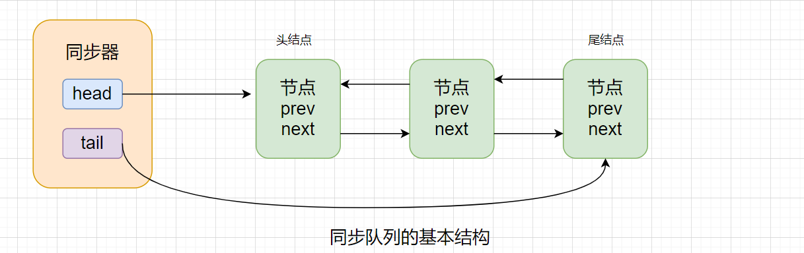

同步器：包含了两个节点的类型的引用，一个指向头节点，一个指向尾结点。

情景一：当一个线程没有获取到同步状态时，则该线程会被构造为节点加入到队列尾部。加入过程必须保证线程安全。因此同步器提供了一个基于CAS的设置尾结点的方法——compareAndSetTail(Node expect，Node update)，只有尾结点和expect节点是同一个节点时，才将update节点设置为尾结点，并更新tail的引用。

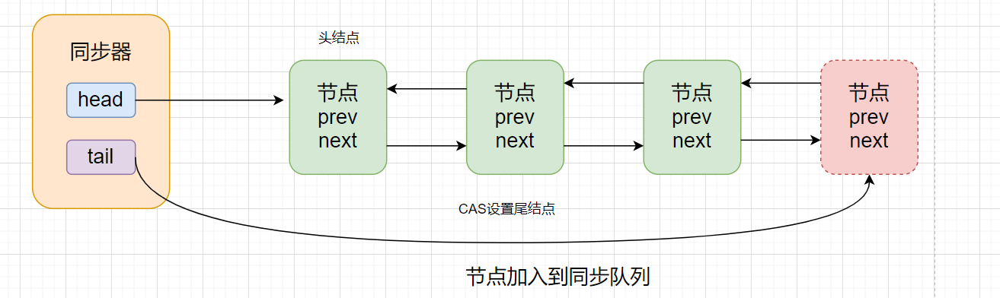


情节二：同步队列遵循FIFO，头节点是获取同步状态成功的节点，当它执行完毕，释放同步状态时，将会唤醒后继节点。后继节点会在获取同步状态成功后，将自己设置为头节点。

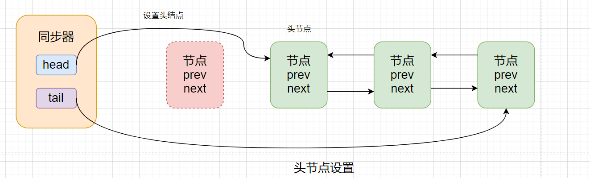

PS：设置头节点是通过获取同步状态成功的线程完成的，由于只有一个线程会成功获取同步状态，因此设置头节点并不需要CAS操作，只需改变head的引用即可。

### 独占式同步状态获取与释放

首先来看一下独占式的情况下，如何将一个节点加入队列，并获取同步状态。

```java
public final void acquire(int arg) {
    if (!tryAcquire(arg) && acquireQueued(addWaiter(Node.EXCLUSIVE), arg))
        selfInterrupt();
}
```

上述代码主要完成了：同步状态获取、独占式节点构造、加入同步队列，在同步队列中自旋。

代码执行逻辑：

1. 通过`tryAcquire()`同步状态，如果没有获取到同步状态，返回false（同一时刻只有一个线程能够获取到同步状态）。
2. 构造独占节点（独占式节点`Node.EXCLUSIVE`）。
3. 通过`addWaiter(Node node)`将独占节点添加到队列尾部。
4. 调用`acquireQueued(Node node，int arg)`使得节点以“死循环”的方式获取同步状态。如果获取不到，则阻塞节点中的线程。被阻塞的线程需要前驱节点的出队或阻塞线程被中断实现。

自旋的节点什么时候可以获取同步状态？

1. 头节点是成功获取同步状态的节点。当头节点释放同步状态后，会唤醒其后继节点，后继节点被唤醒后需要检查自己的前驱节点是否为头节点。
2. 节点自旋的状态如下图所示，自旋节点仅需判断它的前驱节点是否为头节点，如果是，则可以获取同步状态。

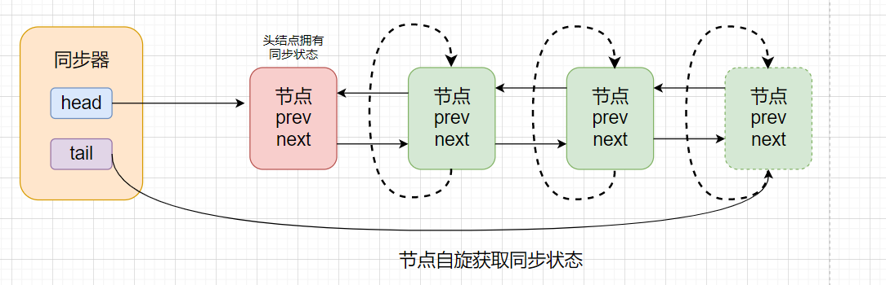

**自旋获取同步状态源码：**

```java
final boolean acquireQueued(final Node node, int arg) {
    boolean failed = true;
    try {
        boolean interrupted = false;
        for (;;) {
            final Node p = node.predecessor();		// 获取前驱节点
            if (p == head && tryAcquire(arg)) {		// 如果前驱节点为头节点 并且 获取到同步状态
                setHead(node);						// 将该节点设置为头节点
                p.next = null; // help GC			// 头节点的后驱引用设置为空，GC自动回收
                failed = false;		
                return interrupted;
            }
            if (shouldParkAfterFailedAcquire(p, node) &&
                parkAndCheckInterrupt())
                interrupted = true;
        }
    } finally {
        if (failed)
            cancelAcquire(node);
    }
}
```

**头节点释放同步状态源码：**

```java
public final boolean release(int arg) {
    if (tryRelease(arg)) {
        Node h = head;
        if (h != null && h.waitStatus != 0)
            unparkSuccessor(h);				// 该方法会唤醒后继节点
        return true;
    }
    return false;
}
```

### 共享式同步状态获取与释放

**共享式获取**与独占式获取最主要的区别在于**同一时刻能否有多个线程同时获取到同步状态。**

共享式与独占式获取资源对比如下图所示：

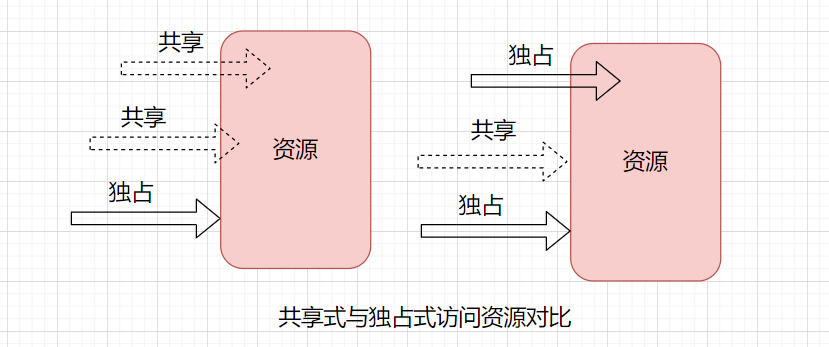

以文件读写为例：

1. 如果一个线程在读取资源，则同时刻写线程均被阻塞，而读线程能够同时进行。
2. 如果写线程对资源独占式访问，则同一时刻其他所有线程将被阻塞。

调用同步器的`acquireShared()`方法可以共享式的获取同步状态，源码如下：

```java
// 共享式的获取同步状态
public final void acquireShared(int arg) {
    if (tryAcquireShared(arg) < 0)		// 返回值小于0 表示获取同步状态失败
        doAcquireShared(arg);			// 自旋获取同步状态
}

// 获取共享状态
private void doAcquireShared(int arg) {
    final Node node = addWaiter(Node.SHARED);
    boolean failed = true;
    try {
        boolean interrupted = false;
        for (;;) {
            final Node p = node.predecessor();		// 获取当前节点的前驱节点
            if (p == head) {						// 如果前驱节点为头结点
                int r = tryAcquireShared(arg);		// 尝试获取同步状态，返回值大于等于0表示获取成功
                if (r >= 0) {						
                    setHeadAndPropagate(node, r);	// 设置头节点
                    p.next = null; // help GC		// 将前驱节点回收
                    if (interrupted)
                        selfInterrupt();
                    failed = false;
                    return;							// 退出自旋
                }
            }
            if (shouldParkAfterFailedAcquire(p, node) &&
                parkAndCheckInterrupt())
                interrupted = true;
        }
    } finally {
        if (failed)
            cancelAcquire(node);
    }
}
```

共享式获取也需要释放同步状态，通过调用`releaseShared(int arg)`方法释放，源码如下：

```java
public final boolean releaseShared(int arg) {
    if (tryReleaseShared(arg)) {
        doReleaseShared();
        return true;
    }
    return false;
}
```

该方法在释放同步状态后会唤醒后续处于等待状态的节点。

## 哪些数据结构使用了AQS

### ReentrantLock

在ReentrantLock中，stste表示获取锁的线程数，假如state=0，表示还没有线程获取锁，1表示有线程获取了锁。大于1表示重入锁的数量

```java
public class ReentrantLock implements Lock, java.io.Serializable {
    private static final long serialVersionUID = 7373984872572414699L;

    private final Sync sync;

    /**
     * Base of synchronization control for this lock. Subclassed
     * into fair and nonfair versions below. Uses AQS state to
     * represent the number of holds on the lock.
     */
    abstract static class Sync extends AbstractQueuedSynchronizer {
        private static final long serialVersionUID = -5179523762034025860L;
        ……
    }
    ……
}
```

### CountDownLatch

### Semaphore

# Semaphore（信号量）

JUC的Semaphore俗称信号量，可用来控制同时访问特定资源的线程数量。通过它的构造函数我们可以指定信号量（称为许可证permits可能更为明确）的数量，线程可以调用Semaphore对象的`acquire`方法获取一个许可证，调用`release`来归还一个许可证。

```java
public class SemaphoreTest {
    public static void main(String[] args) throws InterruptedException {
        // 定义许可证数量
        final Semaphore semaphore = new Semaphore(2);

        IntStream.range(0, 4).forEach(i -> {
            new Thread(() -> {
                System.out.println(Thread.currentThread().getName() + "开始");
                try {
                    semaphore.acquire(); // 一次拿一个许可证
                    System.out.println(Thread.currentThread().getName() + "获取许可证");
                    TimeUnit.SECONDS.sleep(3);
                } catch (InterruptedException e) {
                    e.printStackTrace();
                } finally {
                    System.out.println(Thread.currentThread().getName() + "释放许可证");
                    semaphore.release();
                }
                System.out.println(Thread.currentThread().getName() + "结束");
            }, "thread" + (i + 1)).start();
        });
    }
}
```

运行结果：

```java
thread1开始
thread3开始
thread4开始
thread2开始
thread3获取许可证
thread1获取许可证		// 虽然四个线程同时开始，但是只有 3 和 1 获取到了访问资源
    
thread1释放许可证
thread3释放许可证
thread1结束
thread2获取许可证
thread3结束
thread4获取许可证		// 最后 2 和 4 分别获取到了访问资源
    
thread4释放许可证
thread4结束
thread2释放许可证
thread2结束
```

# CountDownLatch （计数器）

**CountDownLatch允许一个或多个线程等待其他线程完成操作**。定义CountDownLatch的时候，需要传入一个正数来初始化计数器（虽然传入0也可以，但这样的话CountDownLatch没什么实际意义）。其`countDown`方法用于递减计数器，`await`方法会使当前线程阻塞，直到计数器递减为0。所以CountDownLatch常用于多个线程之间的协调工作。

## CountDownLatch 原理

CountDownLatch是共享锁的一种实现,它默认构造 AQS 的 state 值为 count。当线程使用countDown方法时,其实使用了`tryReleaseShared`方法以CAS的操作来减少state，直至state为0就代表所有的线程都调用了countDown方法。当调用await方法的时候，如果state不为0，就代表仍然有线程没有调用countDown方法，那么就把已经调用过countDown的线程都放入阻塞队列Park，并自旋CAS判断state == 0，直至最后一个线程调用了countDown，使得state == 0，于是阻塞的线程便判断成功，全部往下执行。

## CountDownLatch 示例

假设我们现在有这样一个需求：

1. 从数据库获取数据
2. 对这批数据进行处理
3. 保存这批数据

为了让程序执行效率更高，第2步中我们可以使用多线程来并行处理这批数据，大致过程如下所示：

```java
public class CountDownLatchTest {

    public static void main(String[] args) throws InterruptedException {
        // 1. 模拟从数据库获取数据
        int[] data = query();
        System.out.println("获取数据完毕");
        
        // 2. 数据处理
        IntStream.range(0, data.length).forEach(i -> {
            ExecutorService.execute(() -> {
                System.out.println(Thread.currentThread() + "处理第" + (i + 1) + "条数据");
                int value = data[i];
                if (value % 2 == 0) {
                    data[i] = value * 2;
                } else {
                    data[i] = value * 10;
                }
            });
        });

        System.out.println("所有数据都处理完了");
        // 关闭线程池
        ExecutorService.shutdown();
        // 3. 保存数据
        save(data);
    }
    private static int[] query() {
        return new int[]{1, 2, 3, 4, 5, 6, 7, 8, 9, 10};
    }
    private static void save(int[] data) {
        System.out.println("保存数据 - " + Arrays.toString(data));
    }
}
```

由于线程获取CPU时间片的不确定性，所以有可能数据还没有处理完毕，第3步就执行完了：

```
获取数据完毕
所有数据都处理完了
保存数据 - [1, 2, 3, 4, 5, 6, 7, 8, 9, 10]
Thread[pool-1-thread-2,5,main]处理第2条数据
Thread[pool-1-thread-1,5,main]处理第1条数据
Thread[pool-1-thread-2,5,main]处理第3条数据
Thread[pool-1-thread-1,5,main]处理第4条数据
Thread[pool-1-thread-1,5,main]处理第6条数据
Thread[pool-1-thread-2,5,main]处理第5条数据
Thread[pool-1-thread-1,5,main]处理第7条数据
Thread[pool-1-thread-1,5,main]处理第9条数据
Thread[pool-1-thread-2,5,main]处理第8条数据
Thread[pool-1-thread-1,5,main]处理第10条数据
```

我们可以借助CountDownLatch解决这个问题：

```java
public class CountDownLatchTest {
    private static ExecutorService ExecutorService = Executors.newFixedThreadPool(2);
    private static CountDownLatch latch = new CountDownLatch(10);

    public static void main(String[] args) throws InterruptedException {
        // 1. 模拟从数据库获取数据
        int[] data = query();
        System.out.println("获取数据完毕");

        // 2. 数据处理
        IntStream.range(0, data.length).forEach(i -> {
            ExecutorService.execute(() -> {
                System.out.println(Thread.currentThread() + "处理第" + (i + 1) + "条数据");
                int value = data[i];
                if (value % 2 == 0) {
                    data[i] = value * 2;
                } else {
                    data[i] = value * 10;
                }
                latch.countDown(); // 递减计数器
            });
        });

        latch.await();		// 阻塞当前线程
        System.out.println("所有数据都处理完了");
        // 关闭线程池
        ExecutorService.shutdown();
        // 3. 保存数据
        save(data);
    }
    private static int[] query() {
        return new int[]{1, 2, 3, 4, 5, 6, 7, 8, 9, 10};
    }
    private static void save(int[] data) {
        System.out.println("保存数据 - " + Arrays.toString(data));
    }
}
```

我们定义了一个CountDownLatch，计数器值为10，和数据量一致。然后在第2步中，当每个线程执行完毕的时候调用`countDown`方法，让计数器减1。在第3步前调用`await`方法让main线程阻塞等待，直到计数器被减为0。所以这就保证了只有当所有数据加工完毕才执行保存数据操作。

运行结果：

```
获取数据完毕
Thread[pool-1-thread-1,5,main]处理第1条数据
Thread[pool-1-thread-1,5,main]处理第3条数据
Thread[pool-1-thread-1,5,main]处理第4条数据
Thread[pool-1-thread-1,5,main]处理第5条数据
Thread[pool-1-thread-1,5,main]处理第6条数据
Thread[pool-1-thread-1,5,main]处理第7条数据
Thread[pool-1-thread-1,5,main]处理第8条数据
Thread[pool-1-thread-1,5,main]处理第9条数据
Thread[pool-1-thread-1,5,main]处理第10条数据
Thread[pool-1-thread-2,5,main]处理第2条数据
所有数据都处理完了
保存数据 - [10, 4, 30, 8, 50, 12, 70, 16, 90, 20]
```

`await`有重载方法：`await(long timeout, TimeUnit unit)`，设置最大等待时间，超过这个时间程序将继续执行不再被阻塞：

```java
public class CountDownLatchTest {
    public static void main(String[] args) throws InterruptedException {
        final CountDownLatch latch = new CountDownLatch(1);
        new Thread(() -> {
            try {
                TimeUnit.SECONDS.sleep(4);
                System.out.println(Thread.currentThread() + "线程执行完毕");
            } catch (InterruptedException e) {
                e.printStackTrace();
            } finally {
                latch.countDown();
            }
        }, "thread1").start();
 
        latch.await(3, TimeUnit.SECONDS); // 最多等待 3秒
        System.out.println("main线程执行完毕");
    }
}
```

输出如下：

```
main线程执行完毕
Thread[thread1,5,main]线程执行完毕
```

# CyclicBarrier（同步屏障）

CyclicBarrier 和 CountDownLatch 非常类似，它也可以实现线程间的技术等待，但是它的功能比 CountDownLatch 更加复杂和强大。主要应用场景和 CountDownLatch 类似。

> CountDownLatch的实现是基于AQS的，而CycliBarrier是基于 ReentrantLock(ReentrantLock也属于AQS同步器)和 Condition 的.

CyclicBarrier 的字面意思是可循环使用（Cyclic）的屏障（Barrier）。它要做的事情是，让一组线程到达一个屏障（也可以叫同步点）时被阻塞，直到最后一个线程到达屏障时，屏障才会开门，所有被屏障拦截的线程才会继续干活。CyclicBarrier 默认的构造方法是 `CyclicBarrier(int parties)`，其参数表示屏障拦截的线程数量，每个线程调用`await`方法告诉 CyclicBarrier 我已经到达了屏障，然后当前线程被阻塞。

## CyclicBarrier示例

```java
public class CyclicBarrierTest {
    public static void main(String[] args) {
        CyclicBarrier barrier = new CyclicBarrier(2);
        System.out.println("快上车来不及解释了");

        new Thread(() -> {
            try {
                TimeUnit.SECONDS.sleep(5);
                System.out.println(Thread.currentThread() + "已上车");
                barrier.await();
                System.out.println("所有人已上车，发车");
            } catch (InterruptedException | BrokenBarrierException e) {
                e.printStackTrace();
            }
        }, "Jane").start();

        new Thread(() -> {
            try {
                TimeUnit.SECONDS.sleep(3);
                System.out.println(Thread.currentThread() + "已上车");
                barrier.await();
                System.out.println("所有人已上车，发车");
            } catch (InterruptedException | BrokenBarrierException e) {
                e.printStackTrace();
            }
        }, "Mike").start();
    }
}
```

上面例子中我们定义了一个等待2个线程完成的CyclicBarrier，在两个线程内部调用了`await`方法，让其阻塞等待，并告知CyclicBarrier我已经到达屏障了。只有当两个线程都执行到`barrier.await()`这一行时，屏障开启，线程才会继续往下执行。程序输出如下所示：

```
快上车来不及解释了
Thread[Mike,5,main]已上车
Thread[Jane,5,main]已上车
所有人已上车，发车
所有人已上车，发车
```

**CyclicBarrier的构造函数支持传入一个回调方法：**

```java
CyclicBarrier barrier = new CyclicBarrier(n, () -> {
    System.out.println("当所有线程到达屏障时，执行该回调");
});
```

**改造上面的例子：**

```java
public class CyclicBarrierTest {
    public static void main(String[] args) {
        CyclicBarrier barrier = new CyclicBarrier(2, new Thread(() -> {
            System.out.println("发车，嘟嘟嘟");
        }));

        System.out.println("快上车来不及解释了");

        new Thread(() -> {
            try {
                TimeUnit.SECONDS.sleep(5);
                System.out.println(Thread.currentThread() + "已上车");
                barrier.await();
                System.out.println("所有人已上车");
            } catch (InterruptedException | BrokenBarrierException e) {
                e.printStackTrace();
            }
        }, "Jane").start();

        new Thread(() -> {
            try {
                TimeUnit.SECONDS.sleep(3);
                System.out.println(Thread.currentThread() + "已上车");
                barrier.await();
                System.out.println("所有人已上车");
            } catch (InterruptedException | BrokenBarrierException e) {
                e.printStackTrace();
            }
        }, "Mike").start();
    }
}
```

输出如下所示：

```
快上车来不及解释了
Thread[Mike,5,main]已上车
Thread[Jane,5,main]已上车
发车，嘟嘟嘟
所有人已上车，发车
所有人已上车，发车
```

## 设置超时时间

`await`的重载方法：`await(long timeout, TimeUnit unit)`可以设置最大等待时长，超出这个时间屏障还没有开启的话则抛出`TimeoutException`：

```java
public class CyclicBarrierTest2 {
    public static void main(String[] args) throws InterruptedException {
        CyclicBarrier barrier = new CyclicBarrier(2);

        new Thread(() -> {
            try {
                TimeUnit.SECONDS.sleep(3);
                barrier.await();
                System.out.println(Thread.currentThread() + "继续执行");
            } catch (InterruptedException | BrokenBarrierException e) {
                e.printStackTrace();
            }
        }, "thread1").start();

        new Thread(() -> {
            try {
                barrier.await(1, TimeUnit.SECONDS);
                System.out.println(Thread.currentThread() + "继续执行");
            } catch (InterruptedException | BrokenBarrierException e) {
                e.printStackTrace();
            } catch (TimeoutException e) {
                e.printStackTrace();
            }
        }, "thread2").start();
    }
}
```

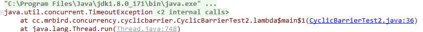

## BrokenBarrierException

抛出`BrokenBarrierException`异常时表示屏障破损，此时标志位broken=true。抛出`BrokenBarrierException`异常的情况主要有：

1. 其他等待的线程被中断，则当前线程抛出`BrokenBarrierException`异常；
2. 其他等待的线程超时，则当前线程抛出`BrokenBarrierException`异常；
3. 当前线程在等待时，其他线程调用CyclicBarrier.reset()方法，则当前线程抛出BrokenBarrierException异常。

## CyclicBarrier 和 CountDownLatch 的区别

CountDownLatch 是计数器，只能使用一次，而 CyclicBarrier 的计数器提供 reset 功能，可以多次使用。但是我不那么认为它们之间的区别仅仅就是这么简单的一点。我们来从 jdk 作者设计的目的来看，javadoc 是这么描述它们的：

> CountDownLatch: A synchronization aid that allows one or more threads to wait until a set of operations being performed in other threads completes.(CountDownLatch: 一个或者多个线程，等待其他多个线程完成某件事情之后才能执行；) CyclicBarrier : A synchronization aid that allows a set of threads to all wait for each other to reach a common barrier point.(CyclicBarrier : 多个线程互相等待，直到到达同一个同步点，再继续一起执行。)

对于 CountDownLatch 来说，重点是“一个线程（多个线程）等待”，而其他的 N 个线程在完成“某件事情”之后，可以终止，也可以等待。而对于 CyclicBarrier，重点是多个线程，在任意一个线程没有完成，所有的线程都必须等待。

CountDownLatch 是计数器，线程完成一个记录一个，只不过计数不是递增而是递减，而 CyclicBarrier 更像是一个阀门，需要所有线程都到达，阀门才能打开，然后继续执行。

# Exchanger

JUC中的Exchanger允许**成对的**线程在指定的同步点上通过`exchange`方法来交换数据。如果第一个线程先执行`exchange`方法，它会一直等待第二个线程也 执行`exchange`方法，当两个线程都到达同步点时，这两个线程就可以交换数据，将当前线程生产 出来的数据传递给对方。

# Fork/Join

JDK7提供了一个将任务“分而治之”的框架 — Fork/Join。它把一个大的任务分割成足够小的子任务，如果子任务比较大的话还要对子任务进行继续分割。分割的子任务分别放到双端队列里，然后启动线程分别从双端队列里获取任务执行。子任务执行完的结果都放在另外一个队列里，启动一个线程从队列里取数据，然后合并这些数据。

Fork/Join的思想如下所示：

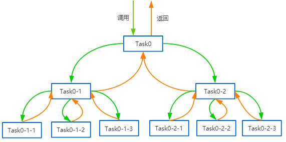