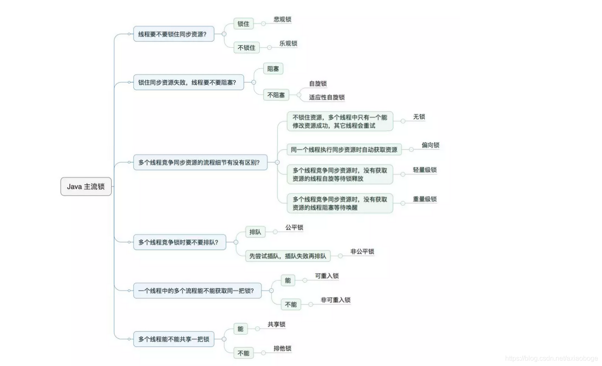
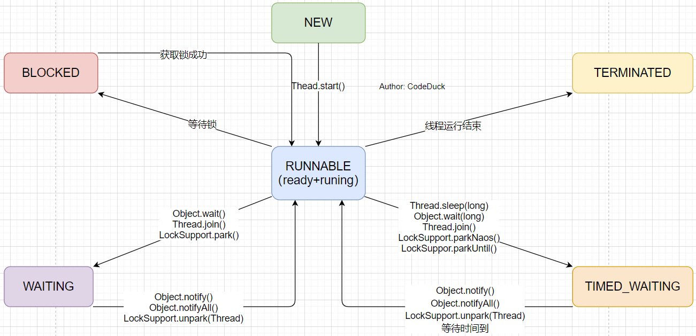

# JVM中的锁

图片来源：https://www.cnblogs.com/jyroy/p/11365935.html

## Java对象头

`synchronized`用的锁是存在于Java对象头中的，JVM基于进入和退出的Monitor对象实现方法同步和代码块同步（两者实现有区别），代码块同步是用monitorenter和monitorexit指令实现的，monitorenter指令在编译后插入到同步代码块的开始位置，而monitorexit是插入到方法结束处和异常处，每个对象都一个monitor与之关联，当且一个monitor被持有后，它将处于锁定状态。获取的对象所属的monitor就是获得了该对象的锁。

**Java对象头中存储的信息：**

| 长度     | 内容                   | 说明                                             |
| -------- | ---------------------- | ------------------------------------------------ |
| 32/64bit | Mark Word              | 存储对象的HashCode或**锁信息**等                 |
| 32/64bit | Class MetaData Address | 存储对象类型数据的指针（指向元空间所属类的地址） |
| 32/64bit | Array length           | 数组的长度（如果当前对象是数据）                 |

**Mark Word存储的信息：**

| 锁状态   | 25bit          | 4bit         | 1bit是否为偏向锁 | 2bit锁标志位 |
| -------- | -------------- | ------------ | ---------------- | ------------ |
| 无锁状态 | 对象的HashCode | 对象分代年龄 | 0                | 01           |

**Mark Word存储信息会根据锁的状态而发生变化：**

| 锁状态 | 存储内容                                            | 标志位 |
| ------ | --------------------------------------------------- | ------ |
| 无锁   | 对象的hashCode、对象分代年龄、是否是偏向锁（0）     | 01     |
| 轻量级 | 指向栈中锁记录的指针                                | 00     |
| 重量级 | 指向互斥量（重量级锁）的指针                        | 10     |
| GC标记 | （空）                                              | 11     |
| 偏向锁 | 线程ID、偏向时间戳、对象分代年龄、是否是偏向锁（1） | 01     |

## 1. 偏向锁

偏向锁会偏向于第一个访问锁的线程，如果在运行过程中，同步锁只有一个线程访问，不存在多线程争用的情况，则线程是不需要触发同步的，这种情况下，就会给线程加一个偏向锁。 
如果在运行过程中，遇到了其他线程抢占锁，则持有偏向锁的线程会被挂起，JVM会消除它身上的偏向锁，将锁恢复到标准的轻量级锁。

### 获取偏向锁

当一个线程第一次访问同步块并获取锁时，会在当前对象的对象头和栈帧（锁的记录中）存储锁偏向的线程ID，以后该线程在进入和退出同步块时不需要CAS操作来加锁和解锁，只需要简单地测试一下对象头中Mark Word里是否存储着指向当前线程的偏向锁。具体过程如下：

1. 访问Mark Word中偏向锁的标识是否设置成1，锁标志位是否为01，确认为可偏向状态。
2. 如果为可偏向状态，则测试线程ID是否指向当前线程，如果是，进入步骤5，否则进入步骤3。
3. 如果线程ID并未指向当前线程，则通过CAS操作竞争锁。如果竞争成功，则将Mark Word中线程ID设置为当前线程ID，然后执行5；如果竞争失败，执行4。
4. 如果CAS获取偏向锁失败，则表示有竞争。当到达全局安全点（safepoint）时获得偏向锁的线程被挂起，偏向锁升级为轻量级锁，然后被阻塞在安全点的线程继续往下执行同步代码。（撤销偏向锁的时候会导致stop the word）
5. 执行同步代码。

### 偏向锁的撤销

偏向锁只有遇到其他线程尝试竞争偏向锁时，持有偏向锁的线程才会释放锁，线程不会主动去释放偏向锁。偏向锁的撤销，需要等待全局安全点（在这个时间点上没有字节码正在执行），它会首先暂停拥有偏向锁的线程，判断锁对象是否处于被锁定状态，撤销偏向锁后恢复到无锁状态（标志位为“01”）或轻量级锁（标志位为“00”）的状态。

### 偏向锁的通俗解释

张飞骑马：

1. 张飞第一次来找刘备要骑马，登记了自己的名字，然后骑马而去。
2. 张飞第二次来发现刘备那里登记的还是自己的名字，于是直接骑马而去。
3. 关羽找刘备要马，关羽准备在刘备的小本本上登记自己的名字，但是发现小本本上登记的是张飞的名字，然后通知刘备，这不行啊，赶紧的，我要用马，让张飞快点回来。（这时偏向于张飞的锁就膨胀为轻量锁）

## 2. 轻量级锁

轻量级锁是由偏向所升级来的，偏向锁运行在一个线程进入同步块的情况下，当第二个线程加入锁争用的时候，偏向锁就会升级为轻量级锁。

### 加锁过程

1. 在代码进入同步块的时候，如果同步对象锁状态为**无锁状态**（锁标志位为“01”状态，是否为偏向锁为“0”），**虚拟机首先将在当前线程的栈帧中建立一个名为锁记录（Lock Record）的空间，用于存储锁对象当前的Mark Word的拷贝，官方称之为 Displaced Mark Word。**

2. 拷贝对象头中的Mark Word复制到锁记录（Lock Record）中。

3. 拷贝成功后，**虚拟机将使用CAS操作尝试将对象的Mark Word替换为指向Lock Record的指针**，并将Lock record里的owner指针指向object mark word。如果更新成功，则执行步骤4，否则执行步骤5。

4. 如果这个更新动作成功了，那么这个线程就拥有了该对象的锁，并且对象Mark Word的锁标志位设置为“00”，即表示此对象处于轻量级锁定状态。 

5. 如果这个更新操作失败了，虚拟机首先会检查对象的Mark Word是否指向当前线程的栈帧，如果是就说明当前线程已经拥有了这个对象的锁，那就可以直接进入同步块继续执行。

   否则说明存在多个线程竞争锁，轻量级锁就要膨胀为重量级锁，锁标志的状态值变为“10”，Mark Word中存储的就是指向重量级锁（互斥量）的指针，后面等待锁的线程也要进入阻塞状态。 而当前线程便尝试使用自旋来获取锁，自旋就是为了不让线程阻塞，而采用循环去获取锁的过程。

### 轻量级锁的释放

**释放锁线程视角：**由轻量锁切换到重量锁，是发生在轻量锁释放锁的期间，之前在获取锁的时候它拷贝了锁对象头的markword，在释放锁的时候如果它发现在它持有锁的期间有其他线程来尝试获取锁了，并且该线程对markword做了修改，两者比对发现不一致，则切换到重量锁。

因为重量级锁被修改了，所有display mark word和原来的markword不一样了。

怎么补救，就是进入mutex前，compare一下obj的markword状态。确认该markword是否被其他线程持有。

此时如果线程已经释放了markword，那么通过CAS后就可以直接进入线程，无需进入mutex，就这个作用。

**尝试获取锁线程视角：**如果线程尝试获取锁的时候，轻量锁正被其他线程占有，那么它就会修改markword，修改重量级锁，表示该进入重量锁了。

还有一个注意点：等待轻量锁的线程不会阻塞，它会一直自旋等待锁，并如上所说修改markword。

这就是自旋锁，尝试获取锁的线程，在没有获得锁的时候，不被挂起，而转而去执行一个空循环，即自旋。在若干个自旋后，如果还没有获得锁，则才被挂起，获得锁，则执行代码。

### 轻量锁的通俗解释

关羽骑马：

1. 关羽在刘备那里转圈圈（自旋获取锁）吐槽张飞先占用了马。等了好久张飞还不来，自己也走累了就睡着了（关羽被阻塞）。刘备一看，嘿，这么急着用马吗，都这种状态了还等，算了我升级一下小本本吧（轻量锁膨胀为重量锁）。
2. 张飞回来啦，把马还给了刘备，并从小本本上抹去了自己名字，然后关羽被吵醒，立马在小本本上登记了自己的名字，骑马而去。

## 3. 重量级锁（Synchronized）

在 Java 早期版本中，`synchronized` 属于 **重量级锁**，效率低下。因为监视器锁（monitor）是依赖于底层的操作系统的 `Mutex Lock` 来实现的，Java 的线程是映射到操作系统的原生线程之上的。如果要挂起或者唤醒一个线程，都需要操作系统帮忙完成，而操作系统实现线程之间的切换时需要从用户态转换到内核态，这个状态之间的转换需要相对比较长的时间，时间成本相对较高。

JDK1.6 对锁的实现引入了大量的优化，如自旋锁、适应性自旋锁、锁消除、锁粗化、偏向锁、轻量级锁等技术来减少锁操作的开销。

**Synchronized的执行过程：**

1. 检测Mark Word里面是不是当前线程的ID，如果是，表示当前线程处于偏向锁 
2.  如果不是，则使用CAS将当前线程的ID替换Mard Word，如果成功则表示当前线程获得偏向锁，置偏向标志位1 
3. 如果失败，则说明发生竞争，撤销偏向锁，进而升级为轻量级锁。 
4. 当前线程使用CAS将对象头的Mark Word替换为锁记录指针，如果成功，当前线程获得锁 
5. 如果失败，表示其他线程竞争锁，当前线程便尝试使用自旋来获取锁。 
6.  如果自旋成功则依然处于轻量级状态。 
7. 如果自旋失败，则升级为重量级锁。

## 4. 自旋锁

线程不停的在循环体内执行尝试获取资源，当循环的条件被其它线程改变时才能进入临界区。

## 5. 阻塞锁

阻塞锁改变了线程的运行状态，让线程进入阻塞状态进行等待，当获得相应的信号（唤醒或者时间）时，才可以进入线程的准备就绪状态，转为就绪状态的所有线程，通过竞争，进入运行状态。

## 6. 悲观锁

悲观锁对数据的修改持有悲观态度的并发控制方式。总是假设最坏的情况，每次读取数据的时候都默认其他线程会更改数据，因此需要进行加锁操作，当其他线程想要访问数据时，都需要阻塞挂起。悲观锁的实现：

## 7. 乐观锁

乐观锁假设数据一般情况下不会造成冲突，所以在数据进行提交更新的时候，才会正式对数据的冲突与否进行检测，如果发现冲突了，则返回给用户错误的信息，让用户决定如何去做。

乐观锁一般有版本号控制或者CAS实现。

# Java中线程的状态

Java 中线程共有六种状态：

- NEW：新建状态，即一个线程只被创建出来并未启动（执行start方法）；
- RUNNABLE：运行状态（包括ready和running），调用start后获得CPU资源的线程状态；
- BLOCKED：阻塞状态，即线程启动后未获得CPU资源而被阻塞；
- WAITING：等待状态，处于运行状态的线程突然被中断进入等待状态；
- TIMED_WAITING：超时等待状态，即等待了具体时间，或在该时间范围内被唤醒继续运行的一种状态；
- TERMINATED：终止状态，当前线程的任务已处理完毕，释放CPU资源，运行结束的状态；

下图为各个线程状态之间的转换图：

