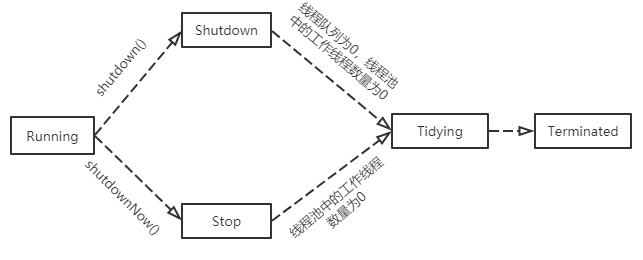

# 1. 继承Thread类创建线程

```java
public class Demo01 extends Thread{

    private Integer count = 0;

    @Override
    public void run() {
        try {
            while (count++ < 10) {
                System.out.println(Thread.currentThread().getName() + ": " + count);
                Thread.sleep(500);
            }
        } catch (InterruptedException e) {
            e.printStackTrace();
        }
    }

    public static void main(String[] args) {
        Thread A = new Thread(new Demo01());
        A.start();
    }
}
```

# 2. 实现Runnable接口创建线程

```java
public class Demo02 implements Runnable{

    private Integer count = 0;

    @Override
    public void run() {
        try {
            while (count++ < 10) {
                System.out.println(Thread.currentThread().getName() + ": " + count);
                Thread.sleep(500);
            }
        } catch (InterruptedException e) {
            e.printStackTrace();
        }
    }

    public static void main(String[] args) {
        Thread A = new Thread(new Demo02());
        A.start();
    }
}
```

# 3. 匿名内部类创建线程

```java
public class Demo03 {

    private static Integer count = 0;

    public static void main(String[] args) {

        // 1. 匿名内部类继承Thread类创建线程的方式
        new Thread() {
            @Override
            public void run() {
                try {
                    while (count++ < 10) {
                        System.out.println(Thread.currentThread().getName() + ": " + count);
                        Thread.sleep(500);
                    }
                } catch (InterruptedException e) {
                    e.printStackTrace();
                }
            }
        }.start();

        // 2. 匿名内部类实现Runnable接口创建线程的方式
        new Thread(new Runnable() {
            @Override
            public void run() {
                try {
                    while (count++ < 10) {
                        System.out.println(Thread.currentThread().getName() + ": " + count++);
                        Thread.sleep(500);
                    }
                } catch (InterruptedException e) {
                    e.printStackTrace();
                }
            }
        }).start();
    }
}
```

# 4. 线程池创建多线程

## 4.1 ThreadPoolExecutor创建线程池

阿里巴巴推荐的使用 `ThreadPoolExecutor` 构造函数自定义参数的方式来创建线程池。

```java
// ThreadPoolExecutor 的构造函数
ThreadPoolExecutor(int corePoolSize,
                              int maximumPoolSize,
                              long keepAliveTime,
                              TimeUnit unit,
                              BlockingQueue<Runnable> workQueue,
                              ThreadFactory threadFactory,
                              RejectedExecutionHandler handler)
```

参数说明：

1. **corePoolSize：** 线程池核心线程数。即线程池中保留的线程个数，即使这些线程是空闲的，也不会被销毁，除非通过ThreadPoolExecutor的`allowCoreThreadTimeOut(true)`方法开启了核心线程的超时策略；
2. **maximumPoolSize：** 线程池中允许的最大线程个数；
3. **keepAliveTime：** 用于设置那些超出核心线程数量的线程的最大等待时间，超过这个时间还没有新任务的话，超出的线程将被销毁；
4. **unit：** 超时时间单位；
5. **workQueue：** 线程队列。用于保存通过execute方法提交的，等待被执行的任务；
6. **threadFactory：** 线程创建工程，即指定怎样创建线程；
7. **handler：** 拒绝策略。即指定当线程提交的数量超出了maximumPoolSize后，该使用什么策略处理超出的线程。

拒绝策略：

如果当前同时运行的线程数量达到最大线程数量并且队列也已经被放满了任时，`ThreadPoolTaskExecutor` 定义一些策略:

- **ThreadPoolExecutor.AbortPolicy：**直接拒绝新任务的处理。
- **ThreadPoolExecutor.CallerRunsPolicy：**调用执行自己的线程运行任务，也就是直接在调用execute方法的线程中运行(run)被拒绝的任务，如果执行程序已关闭，则会丢弃该任务。
- **ThreadPoolExecutor.DiscardPolicy：** 不处理新任务，直接丢弃掉。
- **ThreadPoolExecutor.DiscardOldestPolicy：** 此策略将丢弃最早的未处理的任务请求。

```java
public class Demo04 {
    private static final int CORE_POOL_SIZE = 5; // 最小可以同时运行的线程数量
    private static final int MAX_POOL_SIZE = 10; // 同时运行的线程数量变为最大线程数
    private static final int QUEUE_CAPACITY = 100; // 接收任务队列的容量
    private static final Long KEEP_ALIVE_TIME = 1L; // 核心线程外的线程超时等待时间，超时将会被销毁

    private static Integer count = 0;

    public static void main(String[] args) {
        ThreadPoolExecutor executor = new ThreadPoolExecutor(
                CORE_POOL_SIZE,
                MAX_POOL_SIZE,
                KEEP_ALIVE_TIME,
                TimeUnit.SECONDS,
                new ArrayBlockingQueue<>(QUEUE_CAPACITY),   // 使用阻塞队列接收新任务
                new ThreadPoolExecutor.CallerRunsPolicy()); // 线程池达到饱和状态时执行的策略

        for (int i = 0; i < 10; i++) {
            executor.execute(new Runnable() {
                @Override
                public void run() {
                    try {
                        System.out.println(Thread.currentThread().getName() + ": 开始执行！");
                        Thread.sleep(1000);
                        System.out.println(Thread.currentThread().getName() + ": 执行完毕！");
                    } catch (InterruptedException e) {
                        e.printStackTrace();
                    }
                }
            });
        }
        //终止线程池
        executor.shutdown();
    }
}
```

执行结果：

```
pool-1-thread-1: 开始执行！
pool-1-thread-3: 开始执行！
pool-1-thread-4: 开始执行！
pool-1-thread-5: 开始执行！
pool-1-thread-2: 开始执行！

pool-1-thread-4: 执行完毕！
pool-1-thread-5: 执行完毕！
pool-1-thread-3: 执行完毕！
pool-1-thread-2: 执行完毕！
pool-1-thread-1: 执行完毕！

pool-1-thread-3: 开始执行！
pool-1-thread-2: 开始执行！
pool-1-thread-5: 开始执行！
pool-1-thread-4: 开始执行！
pool-1-thread-1: 开始执行！

pool-1-thread-5: 执行完毕！
pool-1-thread-1: 执行完毕！
pool-1-thread-4: 执行完毕！
pool-1-thread-2: 执行完毕！
pool-1-thread-3: 执行完毕！
```

## 4.2 Executors创建线程池

### 4.2.1 FixedThreadPool

**FixedThreadPool** ： 该方法返回一个固定线程数量的线程池。该线程池中的线程数量始终不变。当有一个新的任务提交时，线程池中若有空闲线程，则立即执行。若没有，则新的任务会被暂存在一个任务队列中，待有线程空闲时，便处理在任务队列中的任务。

```java
// newFixedThreadPool 构造方法
public static ExecutorService newFixedThreadPool(int nThreads) {
    return new ThreadPoolExecutor(nThreads, nThreads,
                                  0L, TimeUnit.MILLISECONDS,
                                  new LinkedBlockingQueue<Runnable>());
}
```

```java
public class Demo05 {
    public static void main(String[] args) {
        ExecutorService threadPool = Executors.newFixedThreadPool(3);
        for (int i = 0; i < 5; i++) {
            threadPool.execute(new Runnable() {
                @Override
                public void run() {
                    try {
                        System.out.println(Thread.currentThread().getName() + ": 开始执行！");
                        Thread.sleep(1000);
                        System.out.println(Thread.currentThread().getName() + ": 执行完毕！");
                    } catch (InterruptedException e) {
                        e.printStackTrace();
                    }
                }
            });
        }
        threadPool.shutdown();
    }
}
```

执行结果：

```
pool-1-thread-2: 开始执行！
pool-1-thread-3: 开始执行！
pool-1-thread-1: 开始执行！

pool-1-thread-2: 执行完毕！
pool-1-thread-1: 执行完毕！
pool-1-thread-3: 执行完毕！

pool-1-thread-2: 开始执行！
pool-1-thread-3: 开始执行！

pool-1-thread-2: 执行完毕！
pool-1-thread-3: 执行完毕！
```

### 4.2.2 SingleThreadExecutor

**SingleThreadExecutor：** 方法返回一个只有一个线程的线程池。若多余一个任务被提交到该线程池，任务会被保存在一个任务队列中，待线程空闲，按先入先出的顺序执行队列中的任务。

```java
// newSingleThreadExecutor 构造方法
public static ExecutorService newSingleThreadExecutor() {
    return new FinalizableDelegatedExecutorService
        (new ThreadPoolExecutor(1, 1,
                                0L, TimeUnit.MILLISECONDS,
                                new LinkedBlockingQueue<Runnable>()));
}
```

```java
public class Demo06 {

    public static void main(String[] args) {
        ExecutorService executor = Executors.newSingleThreadExecutor();
        for (int i = 0; i < 3; i++) {
            executor.execute(new Runnable() {
                @Override
                public void run() {
                    try {
                        System.out.println(Thread.currentThread().getName() + ": 开始执行！");
                        Thread.sleep(1000);
                        System.out.println(Thread.currentThread().getName() + ": 执行完毕！");
                    } catch (InterruptedException e) {
                        e.printStackTrace();
                    }
                }
            });
        }
        executor.shutdown();
    }
}
```

执行结果：

```
pool-1-thread-1: 开始执行！
pool-1-thread-1: 执行完毕！

pool-1-thread-1: 开始执行！
pool-1-thread-1: 执行完毕！

pool-1-thread-1: 开始执行！
pool-1-thread-1: 执行完毕！
```

### 4.2.3 CachedThreadPool

**CachedThreadPool：** 该方法返回一个可根据实际情况调整线程数量的线程池。线程池的线程数量不确定，但若有空闲线程可以复用，则会优先使用可复用的线程。若所有线程均在工作，又有新的任务提交，则会创建新的线程处理任务。所有线程在当前任务执行完毕后，将返回线程池进行复用。

```java
// newCachedThreadPool 构造方法
public static ExecutorService newCachedThreadPool() {
    return new ThreadPoolExecutor(0, Integer.MAX_VALUE,
                                  60L, TimeUnit.SECONDS,
                                  new SynchronousQueue<Runnable>());
}
```

```java
public class Demo07 {
    public static void main(String[] args) {
        ExecutorService threadPool = Executors.newCachedThreadPool();
        for (int i = 0; i < 10; i++) {
            threadPool.execute(new Runnable() {
                @Override
                public void run() {
                    try {
                        System.out.println(Thread.currentThread().getName() + ": 开始执行！");
                        Thread.sleep(1000);
                        System.out.println(Thread.currentThread().getName() + ": 执行完毕！");
                    } catch (InterruptedException e) {
                        e.printStackTrace();
                    }
                }
            });
        }
        threadPool.shutdown();
    }
}
```

执行结果：

```
pool-1-thread-1: 开始执行！
pool-1-thread-4: 开始执行！
pool-1-thread-3: 开始执行！
pool-1-thread-2: 开始执行！
pool-1-thread-6: 开始执行！
pool-1-thread-5: 开始执行！
pool-1-thread-7: 开始执行！
pool-1-thread-8: 开始执行！
pool-1-thread-9: 开始执行！
pool-1-thread-10: 开始执行！

pool-1-thread-5: 执行完毕！
pool-1-thread-4: 执行完毕！
pool-1-thread-1: 执行完毕！
pool-1-thread-9: 执行完毕！
pool-1-thread-7: 执行完毕！
pool-1-thread-8: 执行完毕！
pool-1-thread-3: 执行完毕！
pool-1-thread-2: 执行完毕！
pool-1-thread-10: 执行完毕！
pool-1-thread-6: 执行完毕！
```

### 4.2.4 ScheduledThreadPool

ScheduledThreadPool是一个能实现**定时、周期性任务**的线程池。

```java
// ScheduledThreadPoolExecutor 构造方法
public ScheduledThreadPoolExecutor(int corePoolSize,
                                   ThreadFactory threadFactory,
                                   RejectedExecutionHandler handler) {
    super(corePoolSize, Integer.MAX_VALUE, 0, NANOSECONDS,
          new DelayedWorkQueue(), threadFactory, handler);
}
```


```java
public class Demo08 {
    public static void main(String[] args) {
        ScheduledExecutorService threadPool = Executors.newScheduledThreadPool(2);
        for (int i = 0; i < 5; i++) {
            threadPool.schedule(new Runnable() {
                @Override
                public void run() {
                    try {
                        System.out.println(Thread.currentThread().getName() + "开始执行！");
                        Thread.sleep(1000);
                        System.out.println(Thread.currentThread().getName() + "执行完毕！");

                    } catch (InterruptedException e) {
                        e.printStackTrace();
                    }
                }
            },3L,TimeUnit.SECONDS); // 设置延迟时间及时间单位
        }
        threadPool.shutdown();
    }
}
```

执行结果：

```java
等待3秒…… 
pool-1-thread-2开始执行！
pool-1-thread-1开始执行！
    
pool-1-thread-2执行完毕！
pool-1-thread-1执行完毕！
    
pool-1-thread-2开始执行！
pool-1-thread-1开始执行！
    
pool-1-thread-2执行完毕！
pool-1-thread-2开始执行！
pool-1-thread-1执行完毕！
    
pool-1-thread-2执行完毕！
```


### 4.2.5 Executos创建线程的弊端

- **FixedThreadPool 和 SingleThreadExecutor** ： 允许请求的队列长度为 Integer.MAX_VALUE ，可能堆积大量的请求，从而导致 OOM。
- **CachedThreadPool 和 ScheduledThreadPool** ： 允许创建的线程数量为 Integer.MAX_VALUE ，可能会创建大量线程，从而导致 OOM。

## 4.3 线程池的关闭

线程池包含以下几个状态：



当线程池中所有任务都处理完毕后，线程并不会自己关闭。我们可以通过调用`shutdown`和`shutdownNow`方法来关闭线程池。两者的区别在于：

1. `shutdown`方法将线程池置为shutdown状态，拒绝新的任务提交，但线程池并不会马上关闭，而是等待所有正在执行的和线程队列里的任务都执行完毕后，线程池才会被关闭。所以这个方法是平滑的关闭线程池。
2. `shutdownNow`方法将线程池置为stop状态，拒绝新的任务提交，中断正在执行的那些任务，并且清除线程队列里的任务并返回。所以这个方法是比较“暴力”的。

# 5. 多线程的简单应用

## 5.1 Synchronized 实现双线程打印 1-100

双线程交替打印数字：

```java
public class Demo09 implements Runnable {

    private Integer count = 1;
    private final Integer total = 100;

    @Override
    public void run() {
        while (count <= total) {
            synchronized (this) {
                try {
                    notify();
                    System.out.println(Thread.currentThread().getName() + ": " + count);
                    count++;
                    wait();
                } catch (InterruptedException e) {
                    e.printStackTrace();
                }
            }
        }
    }

    public static void main(String[] args) {
        Demo09 demo09 = new Demo09();
        new Thread(demo09).start();
        new Thread(demo09).start();
    }
}
```

运行结果：

```java
……
Thread-0: 91
Thread-1: 92
Thread-0: 93
Thread-1: 94
Thread-0: 95
Thread-1: 96
Thread-0: 97
Thread-1: 98
Thread-0: 99
Thread-1: 100
```

## 5.2 ReentranLock 实现双线程打印 1-100

 双线程分别打印奇数和偶数

```java
public class Demo10 {

    private static Integer count = 1;
    private final static Integer total = 100;

    public static void main(String[] args) {

        Lock lock = new ReentrantLock();
        Condition condition = lock.newCondition();

        new Thread(new Runnable() {
            @Override
            public void run() {
                while (count <= total) {
                    try {
                        lock.lock();
                        while ((count & 1) == 0) {
                            condition.await();
                        }
                        System.out.println(Thread.currentThread().getName() + ":" + count);
                        count++;
                        condition.signal();
                    } catch (InterruptedException e) {
                        e.printStackTrace();
                    } finally {
                        lock.unlock();
                    }
                }
            }
        }).start();
        
        new Thread(new Runnable() {
            @Override
            public void run() {
                try {
                    while (count <= total) {
                        lock.lock();
                        while ((count & 1) == 1) {
                            condition.await();
                        }
                        System.out.println(Thread.currentThread().getName() + ":" + count);
                        count++;
                        condition.signal();
                    }
                } catch (InterruptedException e) {
                    e.printStackTrace();
                } finally {
                    lock.unlock();
                }
            }
        }).start();
    }
}
```

运行结果：

```
……
Thread-1:94
Thread-0:95
Thread-1:96
Thread-0:97
Thread-1:98
Thread-0:99
Thread-1:100
```

## 5.3 volatile关键实现双线程打印1-100

```java
public class Signal {
    private static volatile int signal = 0;

    static class ThreadA implements Runnable {
        @Override
        public void run() {
            while (signal < 5) {
                if (signal % 2 == 0) {
                    System.out.println("threadA: " + signal);
                    signal++;
                }
            }
        }
    }

    static class ThreadB implements Runnable {
        @Override
        public void run() {
            while (signal < 5) {
                if (signal % 2 == 1) {
                    System.out.println("threadB: " + signal);
                    signal = signal + 1;
                }
            }
        }
    }

    public static void main(String[] args) throws InterruptedException {
        new Thread(new ThreadA()).start();
        Thread.sleep(1000);
        new Thread(new ThreadB()).start();
    }
}
```

