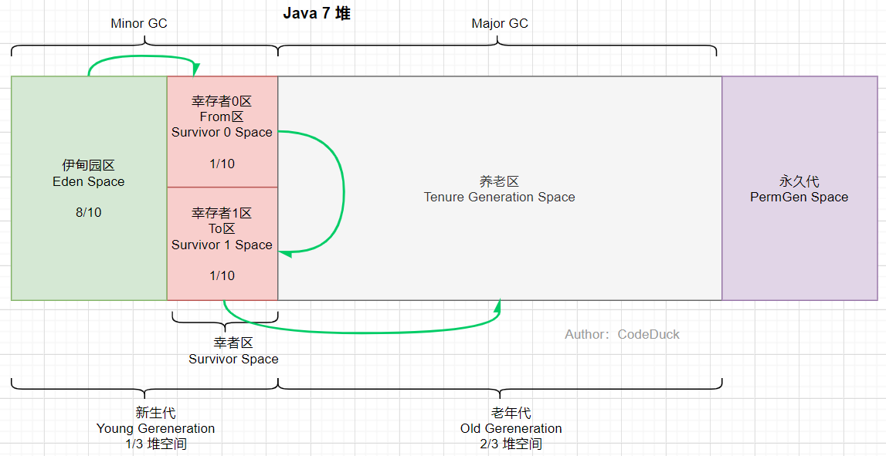

# 1. JVM内存区域划分

jvm在运行java应用程序过程中，会把它所管理的内存划分为若干不同的数据区域。


:point_up: **灰色部分**（Java栈，本地方法栈和程序计数器）是线程私有，不存在线程安全问题，**橙色部分**（方法区和堆）为线程共享区。

**虚拟机详细结构一**（下图引自：https://my.oschina.net/lienson/blog/3026334）


虚拟机详细结构二（）

# 2. 类加载器

**类加载器**(Class Loader)负责加载class文件，class文件在文件开头有特定的文件标识，将class文件字节码内容加载到内存中，并将这些内容转换成**方法区**中的运行时数据结构。ClassLoader只负责class文件的加载，至于它是否可以运行，则由执行引擎Execution Engine决定。类加载示意图：


也就是说，类加载器识别的class文件除了是**.class**格式外，文件的开头还得有特殊的标识，使用文本编辑器打开一个class格式的文件：

```
cafe babe 0000 0034 0010 0a00 0300 0d07
000e 0700 0f01 0006 3c69 6e69 743e 0100
0328 2956 0100 0443 6f64 6501 000f 4c69
6e65 4e75 6d62 6572 5461 626c 6501 0012
4c6f 6361 6c56 6172 6961 626c 6554 6162
6c65 0100 0474 6869 7301 0014 4c63 632f
6d72 6269 7264 2f63 6173 2f54 6573 743b
0100 0a53 6f75 7263 6546 696c 6501 0009
5465 7374 2e6a 6176 610c 0004 0005 0100
1263 632f 6d72 6269 7264 2f63 6173 2f54
6573 7401 0010 6a61 7661 2f6c 616e 672f
4f62 6a65 6374 0021 0002 0003 0000 0000
0001 0001 0004 0005 0001 0006 0000 002f
0001 0001 0000 0005 2ab7 0001 b100 0000
0200 0700 0000 0600 0100 0000 0300 0800
0000 0c00 0100 0000 0500 0900 0a00 0000
0100 0b00 0000 0200 0c
```

这个特定的标识就是十六进制字符**cafe babe**。

# 3. 程序计数器

**:deciduous_tree: 程序计数器**是一块`非常小`的内存空间，它可以看做是当前线程所执行的字节码的行号指示器。**字节码解释器通过改变程序计数器的值来选取下一条需要执行的字节码指令，**从而实现代码的流程控制，如：顺序执行、选择、循环、异常处理。

**:deciduous_tree: JVM 的多线程实现方式是通过CPU时间片轮转**（即线程轮流切换并分配处理器执行时间）算法来实现的。也就是说，某个线程在执行过程中可能会因为时间片耗尽而被挂起，而另一个线程获取到时间片开始执行。当被挂起的线程重新获取到时间片的时候，它要想从被挂起的地方继续执行，就必须知道它上次执行到哪个位置，在JVM中，通过程序计数器来记录某个线程的字节码执行位置。因此，**每个线程工作时都有属于自己的独立计数器。各个线程之间的计数器互不影响，独立存取，这类内存区域为 线程私有内存。**

**注意：**

- **程序计数器是唯一一个不会出现 `OutOfMemoryError` 的内存区域，它的生命周期随着线程的创建而创建，随着线程的结束而死亡。**

- **如果执行的是一个Native方法，那这个计数器的值为undefied。**

通过一段代码，我们来看一下程序计数器所记录的字节码的行号

1. 新建Test.java文件

   ```java
   public class Test {
   
       public static void main(String[] args) {
           int a = 1;
           int b = 1;
           int sum = a + b;
           System.out.println(sum);
       }
   }
   ```

2. 编译Test.java为字节码文件

   ```java
   javac Test.java
   ```

3. 使用javap工具打开字节码文件

   ```shell
   javap -verbose Test.class
   
   # 左侧行号，右侧为指令
   stack=2, locals=4, args_size=1
    0: iconst_1
    1: istore_1
    2: iconst_1
    3: istore_2
    4: iload_1
    5: iload_2
    6: iadd
    7: istore_3
    8: getstatic     #2                  // Field java/lang/System.out:Ljava/io/PrintStream;
    11: iload_3
    12: invokevirtual #3                  // Method java/io/PrintStream.println:(I)V
    15: return
   ```

   假如当前线程的程序计数器存储的指令地址为6，这时候CPU切换到别的线程中处理工作；一段时间后，当前线程重新获取了CPU时间片继续执行时，根据程序计数器存的 6 就知道，当前需要执行iadd（即a+b操作）指令。执行引擎会将这条指令翻译为机器指令，然后CPU执行该运算操作。

# 4. 虚拟机栈（Java栈）

**:deciduous_tree: 虚拟机栈也称为Java栈**，每个方法被执行的时候，Java虚拟机都会同步创建一个栈帧（Stack Frame）。

1. Java虚拟机栈是**线程私有的**，它的生命周期与线程相同（随线程而生，随线程而灭）。
2. **栈帧**包括 局部变量表、操作数栈、动态链接、方法返回地址和一些附加信息。
3. 每一个方法被调用直至执行完毕的过程，就对应这一个栈帧在虚拟机栈中从入栈到出栈的过程。

**局部变量表：主要存放了编译期可知的各种数据类型**（boolean、byte、char、short、int、float、long、double）、**对象引用**（reference 类型，它不同于对象本身，可能是一个指向对象起始地址的引用指针，也可能是指向一个代表对象的句柄或其他与此对象相关的位置）。

**Java 虚拟机栈会出现两种错误：`StackOverFlowError` 和 `OutOfMemoryError`。**

- **`StackOverFlowError`：** 若 Java 虚拟机栈的内存大小不允许动态扩展，那么当线程请求栈的深度超过当前 Java 虚拟机栈的最大深度的时候，就抛出 StackOverFlowError 错误。（例如递归调用过深的情况）
- **`OutOfMemoryError`：** 若 Java 虚拟机堆中没有空闲内存，并且垃圾回收器也无法提供更多内存的话。就会抛出 OutOfMemoryError 错误。

**虚拟机栈示意图如下所示：**


**栈帧结构：**


# 5. 本地方法栈

:deciduous_tree: 本地方法栈（Native Method Stacks）与虚拟机栈发挥的作用的非常相似的。虚拟机栈是为虚拟机执行java方法服务，而**本地方法栈是为虚拟机执行本地方法服务的。**本地方法被执行的时候，在本地方法栈也会创建一个栈帧，用于存放该本地方法的局部变量表、操作数栈、动态链接、出口信息。

**什么是本地方法接口？**

本地方法接口(Native Interface)的作用是融合不同的编程语言为Java所用，它的初衷是融合C/C++程序。Java诞生的时候是 C/C++横行的时候，要想立足，必须有调用 C/C++程序，于是就在内存中专门开辟了一块区域处理标记为native的代码。例如查看java.lang.Thread类中存在许多native方法：

```java
public static native void yield();
public static native void sleep(long millis) throws InterruptedException;
```

`native`方法没有方法体（因为不是Java实现），所以看上去像是“接口”一样，故得名本地方法接口。

# 6. Java堆

## 6.1 堆的作用

**Java 堆是虚拟机所管理的内存中最大的一块，**是被所有线程共享的一块内存区域，在虚拟机启动时创建。

**此内存区域的唯一作用就是存放对象实例，几乎所有的对象实例都是在这里分配的**（不绝对，在虚拟机的优化策略下，也会存在栈上分配、标量替换的情况）。

**Java 堆是 GC 回收的主要区域**，因此很多时候也被称为 GC 堆。

- 从内存回收的角度看，Java 堆还可以被细分为新生代和老年代；再细一点新生代还可以被划分为 Eden Space、From Survivor Space、To Survivor Space。
- 从内存分配的角度看，线程共享的 Java 堆可能划分出多个线程私有的分配缓冲区（Thread Local Allocation Buffer，TLAB）。「**属于线程共享的内存区域**」

## 6.2 堆的结构

**Java 7 及以前版本的堆划分为**：新生代、老年代、永久代。



**Java 8 及以后版本的堆划分为**：新生代、老年代、元空间（元空间使用的是直接内存）。


## 6.3 为什么要将永久代替换为元空间

1. 整个永久代有一个 JVM 本身设置固定大小上限，无法进行调整，而元空间使用的是直接内存，受本机可用内存的限制，虽然元空间仍旧可能溢出，但是比原来出现的几率会更小。

   > 当你元空间溢出时会得到如下错误： `java.lang.OutOfMemoryError: MetaSpace`

你可以使用 `-XX：MaxMetaspaceSize` 标志设置最大元空间大小，默认值为 unlimited，这意味着它只受系统内存的限制。`-XX：MetaspaceSize` 调整标志定义元空间的初始大小如果未指定此标志，则 Metaspace 将根据运行时的应用程序需求动态地重新调整大小。

1. 元空间里面存放的是类的元数据，这样加载多少类的元数据就不由 `MaxPermSize` 控制了, 而由系统的实际可用空间来控制，这样能加载的类就更多了。
2. 在 JDK8，合并 HotSpot 和 JRockit 的代码时, JRockit 从来没有一个叫永久代的东西, 合并之后就没有必要额外的设置这么一个永久代的地方了。

## 6.4 什么是直接内存

**直接内存并不是虚拟机运行时数据区的一部分，也不是虚拟机规范中定义的内存区域，但是这部分内存也被频繁地使用。而且也可能导致 OutOfMemoryError 错误出现。**

JDK1.4 中新加入的 **NIO(New Input/Output) 类**，引入了一种基于**通道（Channel）** 与**缓存区（Buffer）** 的 I/O 方式，它可以直接使用 Native 函数库直接分配堆外内存，然后通过一个存储在 Java 堆中的 DirectByteBuffer 对象作为这块内存的引用进行操作。这样就能在一些场景中显著提高性能，因为**避免了在 Java 堆和 Native 堆之间来回复制数据**。

本机直接内存的分配不会受到 Java 堆的限制，但是，既然是内存就会受到本机总内存大小以及处理器寻址空间的限制。

## 6.5 堆中可能会出现的错误

1. **`OutOfMemoryError: GC Overhead Limit Exceeded`** ： 当JVM花太多时间执行垃圾回收并且只能回收很少的堆空间时，就会发生此错误。
2. **`java.lang.OutOfMemoryError: Java heap space`** ：假如在创建新的对象时, 堆内存中的空间不足以存放新创建的对象, 就会引发`java.lang.OutOfMemoryError: Java heap space` 错误。(和本机物理内存无关，和你配置的内存大小有关！)
3. ......

# 7. 方法区

**🌳方法区（Method Area）**并不是所谓的存储方法的区域，而是供各线程共享的运行时内存区域。**它存储了已被虚拟机加载的类信息、常量、静态变量、即时编译器编译后的代码缓存等。**虽然 **Java 虚拟机规范把方法区描述为堆的一个逻辑部分**，但是它却有一个别名叫做 **Non-Heap（非堆）**，目的应该是与 Java 堆区分开来。

方法区是**一种规范**，在不同虚拟机里实现是不一样的，最典型的实现就是HotSpot虚拟机Java8之前的永久代(PermGen space) 和 Java8及以后的元空间(Metaspace)。

# 8.运行时常量池

**运行时常量池是方法区的一部分**。Class 文件中除了有类的版本、字段、方法、接口等描述信息外，还有**常量池表**（用于存放编译期生成的各种字面量和符号引用）

既然运行时常量池是方法区的一部分，自然受到方法区内存的限制，当常量池无法再申请到内存时就会抛出 OutOfMemoryError 错误。

> 1. JDK1.7之前**运行时常量池逻辑包含字符串常量池**存放在方法区，此时hotspot虚拟机对方法区的实现为永久代
> 2. JDK1.7 **字符串常量池**被从方法区拿到了堆中， 这里没有提到运行时常量池，也就是说字符串常量池被单独拿到堆，**运行时常量池**剩下的东西还在方法区, 也就是hotspot中的**永久代** 。
> 3. JDK1.8 hotspot移除了永久代用元空间(Metaspace)取而代之, 这时候**字符串常量池**还在堆， **运行时常量池**还在方法区,，只不过**方法区的实现从永久代变成了元空间(Metaspace)。**

相关问题：JVM 常量池中存储的是对象还是引用呢？： https://www.zhihu.com/question/57109429/answer/151717241 by RednaxelaFX

# 9. 执行引擎

类加载器加载的字节码并不能够直接运行在操作系统之上，因为字节码指令不是本地机器指令，执行引擎（Execute Engine）的任务就是讲字节码指令解释为对应平台上的本地机器指令。通俗地讲，执行引擎就是将高级语言翻译为本地机器语言的翻译官。

**解释器和JIT编译器**

  - 解释器（Interpreter）：JVM在程序运行时通过解释器逐行将字节码转为本地机器指令执行；
- JIT编译器（Just In Time Compiler，即时编译器）：解释器的优点是程序一启动就可以马上发挥作用，逐行翻译字节码执行程序。而对于一些高频的代码（如循环体内代码和高频调用方法等），如果每次执行都用解释器逐行将字节码翻译为机器指令的话，势必会造成浪费，所以我们可以通过即时编译器将这部分高频代码直接编译为机器指令然后缓存在方法区中（上面介绍方法区内部组成时提到过JIT代码缓存），以此提高执行效率。和解释器相比，即时编译器的缺点就是编译需要耗费一定时间。

正因为JVM在执行Java代码的时候，通常会将解释执行和编译执行二者结合起来进行，所以Java也可以说是一种半编译半解释型语言。

**热点代码**

hotspot通过两种方式来确定当前代码是否为热点代码：

  - 方法调用计数器：统计方法调用的次数；
- 回边计数器：统计循环体执行的循环次数。

当一个方法被调用时，会先检查该方法是否存在被JIT编译器编译过的版本，如果存在，则使用编译后的本地代码执行；如果不存在，则将方法的调用计数器加1，然后判断方法调用计数器和回边计数器之和是否超过方法调用计数器的阈值。如果超过，则会向JIT编译器提交一个该方法的代码编译请求。

上面的阈值可以使用`-XX:CompileThreshold`设定，默认值在Client模式下是1500，在Server模式下是10000。

方法调用计数器统计的并不是方法被调用的绝对次数，而是在一定时间范围内的次数。超过这个时间范围，这个方法计数器就会减少一半，这个过程称为热度衰减，这个时间周期称为半衰周期。可以通过`-XX:CounterHalfLifeTime`设置半衰周期（单位S），`-XX:-UseCounterDecay`来关闭热度衰减。

**模式设置**

默认情况下，hotspot采用混合模式架构（即解释器和JIT编译器并存的架构），我们可以通过下面这些指令来切换模式：

  - `-Xint`：完全采用解释器模式执行程序；
  - `-Xcomp`：完全采用即时编译器模式执行程序，如果即时编译器出现问题，解释器会介入执行；
- `-Xmixed`：混合模式。


**JIT编译器分类**

hotspot内置两种JIT编译器：Client Compiler和Server Compiler，也称为C1编译器和C2编译器。我们可以通过下面这些指令来指定使用哪种JIT编译器：

  - `-client`：指定Java虚拟机运行在Client模式下，并使用C1编译器。C1编译器会对字节码进行简单和可靠的优化，耗时短，已达到更快的编译速度；
  - `-server`：指定Java虚拟机运行在Server模式下，并使用C2编译器。C2编译器进行耗时较长的优化，以及激进优化，虽然编译耗时更长，但代码执行效率更高（64位JDK只支持Server模式）。

本文参考：https://mrbird.cc/JVM-Learn.html

# 10. 虚拟机中的线程

线程是一个程序里的运行单元。JVM允许一个应用有多个线程并行的执行。在 Hotspot JVM中，每个线程都与操作系统的本地线程直接映射。

当一个Java线程准备好执行以后，此时一个操作系统的本地线程也同时创建。Java线程执行终止后，本地线程也会回收。操作系统负责所有线程的安排调度到任何一个可用的CPU上。一旦本地线程初始化成功，它就会调用Java线程中的run（）方法。

Hostspot JVM中主要有以下线程：

1. **虚拟机线程：**这种线程的操作是需要JVM达到安全点才会出现。这种线程的执行类型包括"stop-the-wor1d"的垃圾收集，线程栈收集，线程挂起以及偏向锁撤销。
2. **周期任务线程：**这种线程是时间周期事件的体现（比如中断），他们一般用于周期性操作的调度执行。
3. **GC线程：**这种线程对在JWM里不同种类的垃圾收集行为提供了支持。
4. **编译线程：**这种线程在运行时会将字节码编译成到本地代码。
5. **信号调度线程：**这种线程接收信号并发送给JVM，在它内部通过调用适当的方法进行处理。


