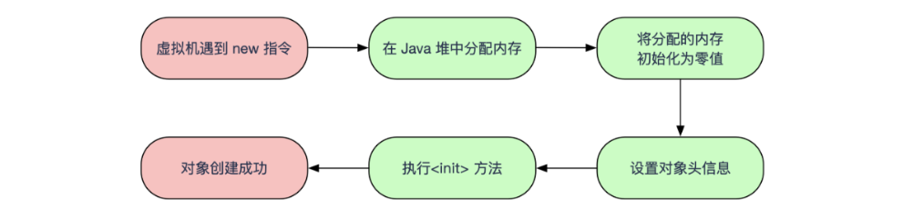
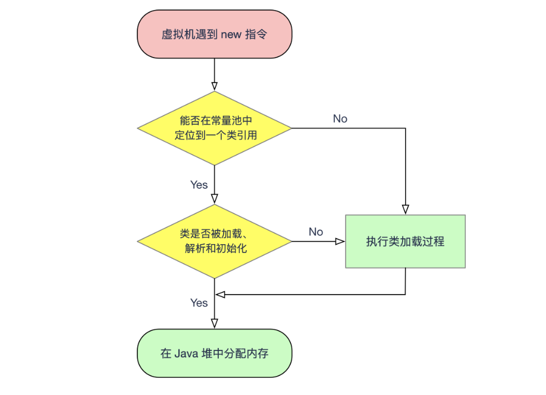
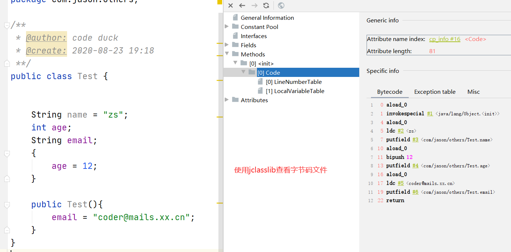
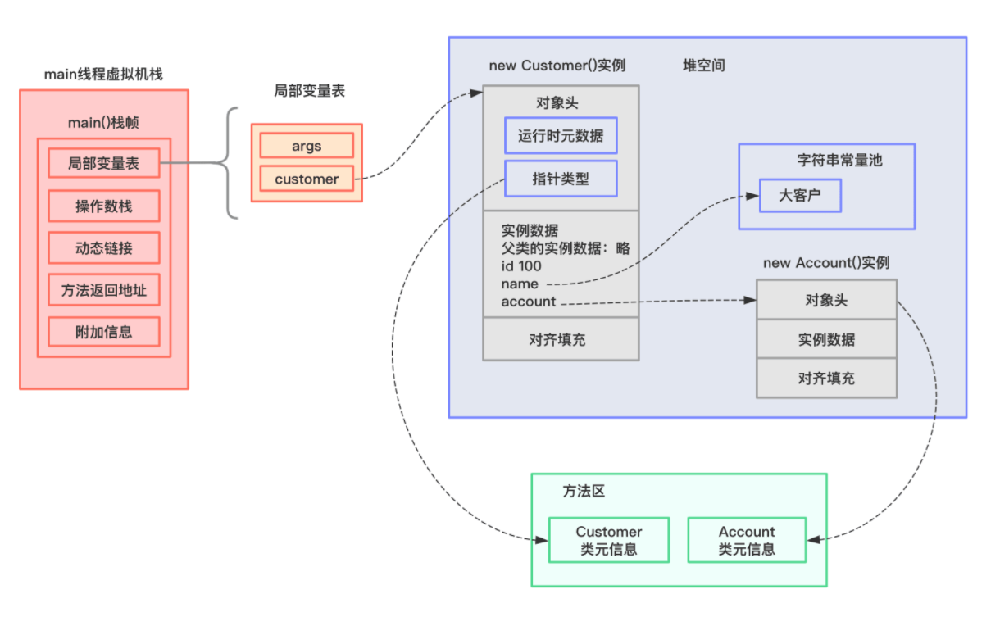
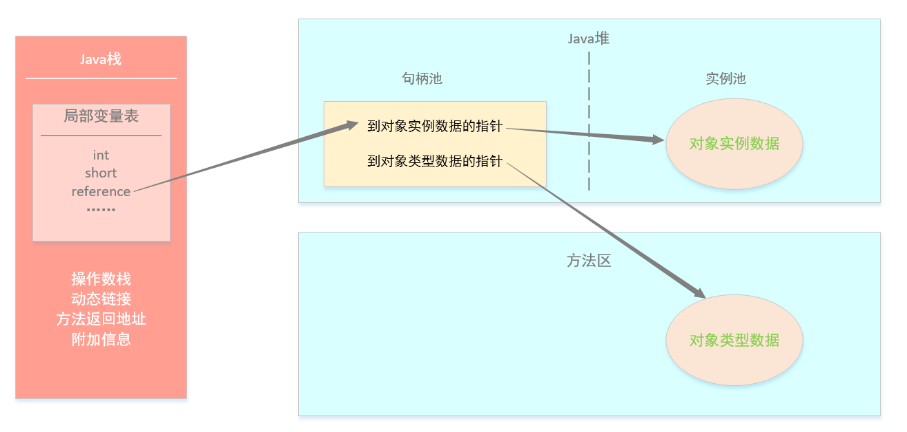

# 1.1 对象的创建



## 1.1 类加载检查

虚拟机遇到一条 `new` 指令时，首先将去检查这个指令的参数是否能在**常量池**中定位到这个**类的符号引用**，并且检查这个符号引用代表的类是否已被加载过、解析和初始化过。如果没有，那必须先执行相应的类加载过程。



## 1.2 新生对象内存分配

内存分配有两种方式：（对象所需的内存大小在类加载的过程中已经确定）

**:deciduous_tree:指针碰撞：**假设Java堆中的内存是规整有序的。已用的内存聚集在一块，空闲的内存聚集在另一块。使用一个指针指向两块区域中间，那么需要分配的内存就仅仅把这个指针向空闲区域移动当前对象大小的距离。

**:deciduous_tree:空闲列表：**如果Java堆内存是已用和空闲交错在一块，并且维护一个列表记录内存的使用情况。当需要分配一定大小的存储时，通过查询列表来获取存储空间。

> 选择哪种分配方式由Java堆内存是否规整决定，而Java堆内存是否规整由取决于垃圾收集器是否带有压缩的功能。

**线程安全问题**

由于对象的创建在虚拟机中是一个频繁的行为，可能会引起非线程安全问题。解决方法有两种：

:palm_tree: 对分配内存空间的动作进行同步处理——采用CAS（比较再交换）配上失败重试的方法保证更新操作的原子性

:palm_tree: 把内存分配的动作按照线程划分在不同的空间进行——每个线程预先分配一块内存（本地线程分配缓冲区TLAB），哪个线程要分配内存就在哪个TLAB中分配。当TLAB用完了，分配新的缓冲区时才需要同步锁定。

## 1.3 内存空间初始化

   内存空间分配完成后，**虚拟机必须对分配好的内存空间**（不包括对象头）都进**初始化为零值**。这一步操作保证了对象的实例字段在Java代码中可以不用赋值直接使用。

## 1.4 设置对象头

  对象头包含两部分信息：

- 第一部分用于**存储对象自身的运行时数据**，比如哈希码（HashCode）、GC 分代年龄、锁状态标志、线程持有的锁、偏向线程 ID、偏向时间戳等。这部分数据称之为 `Mark Word`。
- 另一部分是**类型指针**，即对象指向它的**类元数据指针**，虚拟机通过它来确定对象是哪个类的实例；如果是数组，对象头中还必须有一块用于记录数组长度的数据。

## 1.5 执行`<init>()`方法

   `<init>()`方法包含了初始化成员变量、执行实例化代码块和调用类的构造方法。执行 `<init>` 方法，把对象按照程序员的意愿进行初始化，这样一个真正可用的对象才算完全产生出来。



# 2. 对象的内存布局

对象在堆内存中的存储布局可以划分为三部分：

1. **对象头**（包含两部分数据）

   - **自身运行时数据：**HashCode、对象年龄、锁状态标志、线程持有的锁等信息；
- **类型指针：**指向类元数据，确定对象所属的类型。(并不是所有的对象都要存储类型指针)
  
   如果对象是数组，则还需记录数组的长度。

2. **实例数据**

   即类中定义的各种类型的字段内容信息（包括从父类继承下来的和本身定义的）。实例数据存放具有一定规则：相同宽度的字段总是被分配在一起；父类中定义的变量会出现在子类之前。

3. **对齐填充**：起到占位符的作用。因为 Hotspot 虚拟机的自动内存管理系统**要求对象起始地址必须是 8 字节的整数倍**，换句话说就是对象的大小必须是 8 字节的整数倍。而对象头部分正好是 8 字节的倍数（1 倍或 2 倍），**因此，当对象实例数据部分没有对齐时，就需要通过对齐填充来补全。**

下面通过一个例子来演示对象的内存布局。现有如下代码：

```java
public class Customer {

    int id = 100;
    String name;
    Account account;	

    {
        name = "大客户";
    }

    public Customer() {
        account = new Account();
    }

    public static void main(String[] args) {
        Customer customer = new Customer();
    }

}

class Account {

}
```

`main`方法创建Customer对象后，相关内存布局如下图所示：



# 3. 对象的访问定位

创建对象是为了后续使用该对象。Java程序会通过虚拟机栈上的局部变量表中的reference数据来操作Java堆上的具体对象。

主流虚拟机的访问方式有：

- **句柄访问：**Java堆中将会划分出一块内存来作为句柄池，reference中存储的就是对象的句柄地址，而句柄中包含了**对象实例数据**和**类型数据**各自具体的地址信息:point_down:



- **直接指针访问：**reference中存储的直接就是对象在Java堆中的地址，该对象的内存布局必须考虑放至访问类型数据的相关信息:point_down:


**两种对象的访问方式各有优点：**

:maple_leaf: 对于句柄访问方式，reference存储的是句柄地址，当对象在内存中被移动时，只需要改变句柄中实例数据的指针，而reference本身不需要改变。

:maple_leaf: 直接指针访问的最大优点就是访问速度很快。