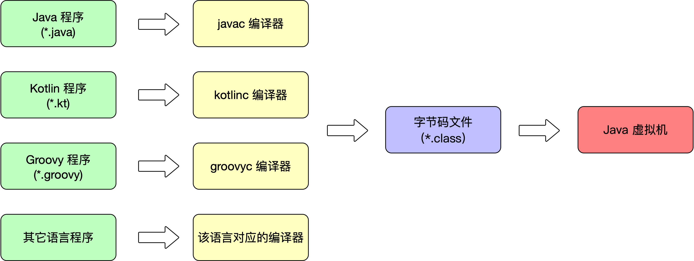
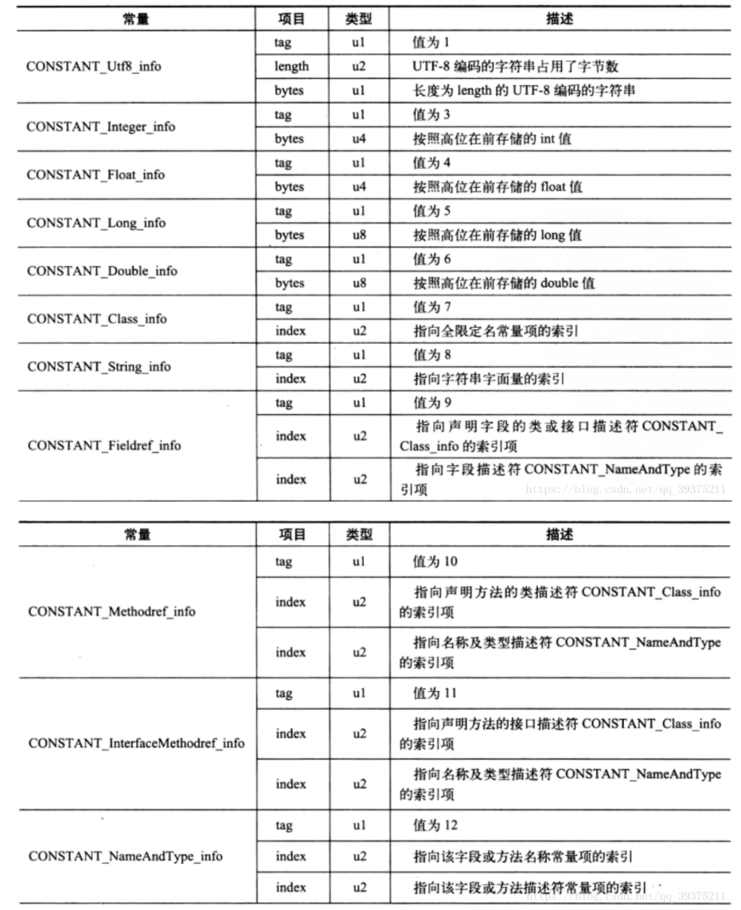

# 1. 语言无关性

Java 虚拟机的设计者在设计之初就考虑并实现了其它语言在 Java 虚拟机上运行的可能性。所以并不是只有 Java 语言能够跑在 Java 虚拟机上，时至今日诸如 Kotlin、Groovy、Jython、JRuby 等一大批 JVM 语言都能够在 Java 虚拟机上运行。它们和 Java 语言一样都会被编译器编译成字节码文件，然后由虚拟机来执行。所以说类文件（字节码文件）具有语言无关性。



# 2. Class 文件结构

**:100: Class 文件**是**一组以 8 位字节为基础单位的二进制流**，各个数据严格按照顺序紧凑的排列在 Class 文件中，中间无任何分隔符，这使得整个 Class 文件中存储的内容几乎全部都是程序运行的必要数据，没有空隙存在。当遇到需要占用 8 位字节以上空间的数据项时，会按照高位在前的方式分割成若干个 8 位字节进行存储。

Java 虚拟机规范规定 Class 文件格式采用一种类似与 C 语言结构体的微结构体来存储数据，这种伪结构体中只有两种数据类型：无符号数和表。

- **无符号数**属于基本的数据类型，以 u1、u2、u4、u8来分别代表 1 个字节、2 个字节、4 个字节和 8 个字节的无符号数，无符号数可以用来描述数字、索引引用、数量值或者按照 UTF-8 编码结构构成的字符串值。
- **表**是由==多个无符号数或者其他表作为数据项构成的复合数据类型==，所有表都习惯性地以「_info」结尾。表用于描述有层次关系的复合结构的数据，整个 Class 文件就是一张表，它由下表中所示的数据项构成。

| 类型           | 名称                | 数量                  |
| -------------- | ------------------- | --------------------- |
| u4             | magic               | 1                     |
| u2             | minor_version       | 1                     |
| u2             | major_version       | 1                     |
| u2             | constant_pool_count | 1                     |
| cp_info        | constant_pool       | constant_pool_count-1 |
| u2             | access_flags        | 1                     |
| u2             | this_class          | 1                     |
| u2             | super_class         | 1                     |
| u2             | interfaces_count    | 1                     |
| u2             | interfaces          | interfaces_count      |
| u2             | fields_count        | 1                     |
| field_info     | fields              | fields_count          |
| u2             | methods_count       | 1                     |
| method_info    | methods             | methods_count         |
| u2             | attributes_count    | 1                     |
| attribute_info | attributes          | attributes_count      |

Class 文件中存储的字节严格按照上表中的顺序紧凑的排列在一起。哪个字节代表什么含义，长度是多少，先后顺序如何都是被严格限制的，不允许有任何改变。

## 2.0 Test类作为Class文件解读参考

```java
public class Test {

    private int m;
	
	public int inc(){
		return m + 1;
	}
}
```

**查看二进制信息：**对Test.java使用javac编译后，使用vim查看Test.class文件，此时显示文件为乱码信息，输入`:%!xxd` 即可显示二进制信息

```java
0000000: cafe babe 0000 0034 0013 0a00 0400 0f09  .......4........                             0000010: 0003 0010 0700 1107 0012 0100 016d 0100  .............m..                             0000020: 0149 0100 063c 696e 6974 3e01 0003 2829  .I...<init>...()                             0000030: 5601 0004 436f 6465 0100 0f4c 696e 654e  V...Code...LineN                             0000040: 756d 6265 7254 6162 6c65 0100 0369 6e63  umberTable...inc                             0000050: 0100 0328 2949 0100 0a53 6f75 7263 6546  ...()I...SourceF                             0000060: 696c 6501 000e 5465 7374 436c 6173 732e  ile...TestClass.                             0000070: 6a61 7661 0c00 0700 080c 0005 0006 0100  java............                             0000080: 0954 6573 7443 6c61 7373 0100 106a 6176  .TestClass...jav                             0000090: 612f 6c61 6e67 2f4f 626a 6563 7400 2100  a/lang/Object.!.                             00000a0: 0300 0400 0000 0100 0200 0500 0600 0000  ................                             00000b0: 0200 0100 0700 0800 0100 0900 0000 1d00  ................                             00000c0: 0100 0100 0000 052a b700 01b1 0000 0001  .......*........                             00000d0: 000a 0000 0006 0001 0000 0001 0001 000b  ................                             00000e0: 000c 0001 0009 0000 001f 0002 0001 0000  ................                             00000f0: 0007 2ab4 0002 0460 ac00 0000 0100 0a00  ..*....`........                             0000100: 0000 0600 0100 0000 0600 0100 0d00 0000  ................                             0000110: 0200 0e0a  
```

**查看字节码信息：**使用javap -verbose工具可以参看当前Class文件的字节码信息

```shell
D:\>javap -verbose Test.class
Classfile /D:/Test.class
  Last modified 2020-8-26; size 265 bytes
  MD5 checksum 0d5efc4b65ae7eb6d64f84136ce58ff9
  Compiled from "Test.java"
public class Test
  minor version: 0
  major version: 52
  flags: ACC_PUBLIC, ACC_SUPER
Constant pool:
   #1 = Methodref          #4.#15         // java/lang/Object."<init>":()V
   #2 = Fieldref           #3.#16         // Test.m:I
   #3 = Class              #17            // Test
   #4 = Class              #18            // java/lang/Object
   #5 = Utf8               m
   #6 = Utf8               I
   #7 = Utf8               <init>
   #8 = Utf8               ()V
   #9 = Utf8               Code
  #10 = Utf8               LineNumberTable
  #11 = Utf8               inc
  #12 = Utf8               ()I
  #13 = Utf8               SourceFile
  #14 = Utf8               Test.java
  #15 = NameAndType        #7:#8          // "<init>":()V
  #16 = NameAndType        #5:#6          // m:I
  #17 = Utf8               Test
  #18 = Utf8               java/lang/Object
{
  public Test();
    descriptor: ()V
    flags: ACC_PUBLIC
    Code:
      stack=1, locals=1, args_size=1
         0: aload_0
         1: invokespecial #1                  // Method java/lang/Object."<init>":()V
         4: return
      LineNumberTable:
        line 1: 0

  public int inc();
    descriptor: ()I
    flags: ACC_PUBLIC
    Code:
      stack=2, locals=1, args_size=1
         0: aload_0
         1: getfield      #2                  // Field m:I
         4: iconst_1
         5: iadd
         6: ireturn
      LineNumberTable:
        line 6: 0
}
SourceFile: "Test.java"
```

## 2.1 魔数与 Class 文件版本

**每个 Class 文件的头 4 个字节称为魔数（Magic Number），它的唯一作用是确定这个文件是否为一个能被虚拟机接收的 Calss 文件。**之所以使用魔数而不是文件后缀名来进行识别主要是基于安全性的考虑，因为文件后缀名是可以随意更改的。Class 文件的魔数值为「0xCAFEBABE」。之所以是CAFEBABE是因为有一位开发者喜欢著名咖啡品牌 Peet`s Coffee，此后出现的Java商标也是一杯咖啡……

**紧接着魔数的 4 个字节存储的是 Class 文件的版本号：第 5 和第 6 两个字节是次版本号（Minor Version），第 7 和第 8 个字节是主版本号（Major Version）。**高版本的 JDK 能够向下兼容低版本的 Class 文件，虚拟机会拒绝执行超过其版本号的 Class 文件。

```shell
#		 魔数        次版本号    主版本号
0000000: cafe babe   0000       0034    0013 0a00 0400 0f09  .......4........                   
```

根据以上信息可以获得主版本号信息 0x0034 的十进制52，52对应的JDK版本是JDK8，可以向下兼容45-51的JDK版本。JDK版本是从45开始的，JDK1.0-1.1 使用了45.0-45.3的版本号。 

次版本号在JDK12之前都没有使用过，全为0。

**字节码文件内容：**

```
public class Test
  minor version: 0
  major version: 52
```

## 2.2 常量池

**主版本号之后是常量池入口，常量池可以理解为 Class 文件之中的资源仓库**，它是 Class 文件结构中与其他项目关联最多的数据类型，也是占用 Class 文件空间最大的数据项目之一，同是它还是 Class 文件中第一个出现的表类型数据项目。

**因为常量池中常量的数量是不固定的，所以在常量池入口需要放置一个 u2 类型的数据来表示常量池的容量「constant_pool_count」**，和计算机科学中计数的方法不一样，这个`容量是从 1 开始而不是从 0 开始计数`。之所以将第 0 项常量空出来是为了满足后面某些指向常量池的索引值的数据在特定情况下需要表达「不引用任何一个常量池项目」的含义，这种情况可以把索引值置为 0 来表示。

> Class 文件结构中只有常量池的容量计数是从 1 开始的，其它集合类型，包括接口索引集合、字段表集合、方法表集合等容量计数都是从 0 开始。

常量池中主要存放两大类常量：**字面量**和**符号引用**。

- **字面量**比较接近 Java 语言层面的常量概念，如字符串、声明为 final 的常量值等。
- **符号引用**属于编译原理方面的概念，包括了以下三类常量：
  - 类和接口的全限定名
  - 字段的名称和描述符
  - 方法的名称和描述符

经过javac编译后的Class文件不会保存方法、字段最终在内存中的布局信息，而是保存其具体地址的符号引用。当虚拟机做类加载时，将会从常量池获得对应的符号引用，再在类创建时或运行时解析翻译到具体的内存地址中。

```shell
#							常量池大小
0000000: cafe babe 0000 0034  0013    0a 00 0400 0f09  .......4........ 
```

根据以上信息可以得出，常量池容量是十六进制0x0013，十进制为19，因此常量池中有18项常量，索引范围在1-18。

### 2.2.1 常量池常量分析

**常量池中17种（缺5种…将就这用…）数据类型的结构表**



常量池容量大小0x0013之后有18个常量，每个常量所占占用的字节大小都不相同，以第一个常量 0x0a(十进制为10)为例，**查常量池项目类型表可知（常量类型表的结构一般为 tag（u1） 和 index（u2））**，**10为类中方法的符号引用CONSTANT_Methodref_info**，该引用 有一个tag  （u1类型占用一个字节 = 0x0a = 10）、两个index（u2类型占用两个字节 0x0004和0x000f）, 第一个`index = 4` 指向声明方法描述符CONSTANT_Class_info的索引项，第二个`index = 15`指向名称及类型描述符CONSTANT_NameAndType的索引项。

```shell
Constant pool:
   #1 = Methodref          #4.#15         // java/lang/Object."<init>":()V
   #4 = Class              #18            // java/lang/Object
   #5 = Utf8               m
   #7 = Utf8               <init>
   #8 = Utf8               ()V
  #15 = NameAndType        #7:#8          // "<init>":()V
  #18 = Utf8               java/lang/Object
```

根据第一个**index索引值0x0004 代表第四个常量**，第四个常量的 tag 是0x07为CONSTANT_Class_info，结构为tag和index（指向全限定名常量项的索引），则**tag = 7(0x07)，index = 18（0x0012）**索引为18表示为最后一个常量，查常量池知，**第18个常量为 0x01是CONSTANT_Utf8_info常量，其长度为0x0010 = 16个字节** ，由上面的`Constant pool`知，**这16个字节表示 java/lang/Object**。依次类推即可查询所有的常量信息

```shell
# 标记常量顺序				      1             2
0000000: cafe babe 0000 0034  0013 0a 0004 000f 09
#                  3       4        5    
0000010: 0003 0010 07 0011 07 0012  01 0001 6d01 00
0000020: 0149 0100 063c 696e 6974 3e01 0003 2829
0000030: 5601 0004 436f 6465 0100 0f4c 696e 654e 
0000040: 756d 6265 7254 6162 6c65 0100 0369 6e63
0000050: 0100 0328 2949 0100 0a53 6f75 7263 6546
0000060: 696c 6501 000e 5465 7374 436c 6173 732e
0000070: 6a61 7661 0c00 0700 080c 0005 0006 0100
#                                 18 length    后面的字符到0x21之前表示java/lang/Object
0000080: 0954 6573 7443 6c61 7373 01  0010      6a61 76
0000090: 612f 6c61 6e67 2f4f 626a 6563 74 0021 00
```

**常量池的所有内容：**

```shell
Constant pool:
   #1 = Methodref          #4.#15         // java/lang/Object."<init>":()V
   #2 = Fieldref           #3.#16         // Test.m:I
   #3 = Class              #17            // Test
   #4 = Class              #18            // java/lang/Object
   #5 = Utf8               m
   #6 = Utf8               I
   #7 = Utf8               <init>
   #8 = Utf8               ()V
   #9 = Utf8               Code
  #10 = Utf8               LineNumberTable
  #11 = Utf8               inc
  #12 = Utf8               ()I
  #13 = Utf8               SourceFile
  #14 = Utf8               Test.java
  #15 = NameAndType        #7:#8          // "<init>":()V
  #16 = NameAndType        #5:#6          // m:I
  #17 = Utf8               Test
  #18 = Utf8               java/lang/Object
```

## 2.3 访问标志

紧接着常量池之后的两个字节代表访问标志（access_flag），这个标志用于识别一些类或者接口层次的访问信息，包括这个 Class 是类还是接口；是否定义为 public 类型；是否定义为 abstract 类型；如果是类的话，是否被申明为 final 等。具体的标志位以及标志的含义见下表：

| 标志名称       | 标志值 | 含义                                                         |
| -------------- | ------ | ------------------------------------------------------------ |
| ACC_PUBLIC     | 0x0001 | 是否为 public 类型                                           |
| ACC_FINAL      | 0x0010 | 是否被声明为 final，只有类可设置                             |
| ACC_SUPER      | 0x0020 | 是否允许使用 invokespecial 字节码指令的新语意，invokespecial 指令的语意在 JKD 1.0.2 中发生过改变，微聊区别这条指令使用哪种语意，JDK 1.0.2 编译出来的类的这个标志都必须为真 |
| ACC_INTERFACE  | 0x0200 | 标识这是一个接口                                             |
| ACC_ABSTRACT   | 0x0400 | 是否为 abstract 类型，对于接口或者抽象类来说，此标志值为真，其它类值为假 |
| ACC_SYNTHETIC  | 0x1000 | 标识这个类并非由用户代码产生                                 |
| ACC_ANNOTATION | 0x2000 | 标识这是一个注解                                             |
| ACC_ENUM       | 0x4000 | 标识这是一个枚举                                             |

access_flags 中一共有 16 个标志位可以使用，当前只定义了其中的 9个，没有使用到的标志位要求一律为 0。

以Test.Class为例，他是一个普通Java类，不是接口、枚举、注解等，被public修饰但没有被声明为final或abstract，使用了JDK1.2之后的编译器进行编译 ，因此他的ACC_SUPER和ACC_PUBLIC为真，其余为假。因此`access_flag的值为：0x0001|0x0020 = 0x0021`

```shell
#                                       访问标志
0000090: 612f 6c61 6e67 2f4f 626a 6563 74 0021 00
```

## 2.4 类索引、父类索引与接口索引集合

**类索引（this_class）和父类索引（super_class）都是一个 u2 类型的数据，而接口索引集合（interfaces）是一组 u2 类型的数据集合，Class 文件中由这三项数据来确定这个类的继承关系**。

- 类索引用于确定这个类的全限定名
- 父类索引用于确定这个类的父类的全限定名
- 接口索引集合用于描述这个类实现了哪些接口

类索引、父类索引、接口索引都排在访问标志之后。由于所有的类都是java.lang.Object类的子类，因此除了Object类之外所有类的父类索引都不为0。

==类索引和父类索引各自指向CONSTANT_Class_info的类描述常量，通过CONSTANT_Class_info的类型常量中的索引可以找到CONSTANT_Utf8_info类型的常量中的全限定名字符串。从而获取到该类的全限定名==

```shell
0000090: 612f 6c61 6e67 2f4f 626a 6563 7400 2100  a/lang/Object.!.    
#     this_class
00000a0: 0300 0400 0000 0100 0200 0500 0600 0000  ................                            
```

根据上述字节码文件：0x0021之后就是**类索引（this_class）0x0003**，即常量池索引为3的第三个常量0x07（CONSTANT_Class_info类型常量），后面的0x0011指向全限定名常量项的索引，即第17个常量，该常量一定是一个CONSTANT_Utf8_info类型的常量，该常量除了tag索引值外，后面的u2为length表示UTF-8编码的字符串长度（以字节为单位），length后面的16进制字节码就是相应的字符串。

```shell
flags: ACC_PUBLIC, ACC_SUPER
Constant pool:
   #3 = Class              #17            // Test
  #17 = Utf8               Test
```

**类索引之后为父类索引（super_class） = 0x0004，十进制表示第4个常量**

```shell
flags: ACC_PUBLIC, ACC_SUPER
Constant pool:
   #4 = Class              #18            // java/lang/Object
  #18 = Utf8               java/lang/Object
```

**父类索引之后为接口索引（interfaces） = 0x0000**，因为没有实现任何接口，因此为全0.

## 2.5 字段表集合

**字段表集合（field_info）用于描述接口或者类中声明的变量。**字段（field）包括`类变量`和`实例变量`，但**不包括方法内部声明的局部变量**。

字段表的结构：

| 类型           | 名称             | 数量             |
| -------------- | ---------------- | ---------------- |
| u2             | access_flag      | 1                |
| u2             | name_index       | 1                |
| u2             | descriptor_index | 1                |
| u2             | attributes_count | 1                |
| attribute_info | attributes       | attributes_count |

字段修饰符放在 access_flags 中可设置的标志符有:point_down: ，它与类中的 access_flag 非常相似，都是一个 u2 的数据类型。

| 标志名称      | 标志值 | 含义                     |
| ------------- | ------ | ------------------------ |
| ACC_PUBLIC    | 0x0001 | 字段是否为 public        |
| ACC_PRIVATE   | 0x0002 | 字段是否为 private       |
| ACC_PROTECTED | 0x0004 | 字段是否为 protected     |
| ACC_STATIC    | 0x0008 | 字段是否为 static        |
| ACC_FINAL     | 0x0010 | 字段是否为 final         |
| ACC_VOLATILE  | 0x0040 | 字段是否为 volatile      |
| ACC_TRANSIENT | 0x0080 | 字段是否为 transient     |
| ACC_SYNTHETIC | 0x1000 | 字段是否由编译器自动生成 |
| ACC_ENUM      | 0x4000 | 字段是否为 enum          |

Test.java类中声明的变量有 `private int m；`查看下列字节码标注和字段修饰符表知`access_flag = 0x0002= ACC_PRIVATE`

```shell
#                     fields_count  access_flag   name_index  descriptor_index attributes_count
00000a0: 03 0004 0000     0001        0002          0005           0006            0000   
```

name_index = 0x0005 = 5 ，查看常量池表第五个常量是CONSTANT_Utf8_info，其值为 m。而 name_index = 0x0006=6，也是CONSTANT_Utf8_info常量，值为 I

**常量池信息：**

```shell
 #5 = Utf8               m
 #6 = Utf8               I
```

`attributes_count`表示属性表计数器为0，也就是没有需要额外描述的信息。但是如果将 字段 m 的声明改为 `private int m = 123`，则会存在一项名称为ConstantVaule的属性，其值指向常量123。

## 2.6 方法表集合

**Class 文件中对方法的描述和对字段的描述是完全一致的，方法表中的结构和字段表的结构一样。**

因为 volatile 关键字和 transient 关键字不能修饰方法，所以方法表的访问标志中没有 ACC_VOLATILE 和 ACC_TRANSIENT。与之相对的，synchronizes、native、strictfp 和 abstract 关键字可以修饰方法，所以方法表的访问标志中增加了 ACC_SYNCHRONIZED、ACC_NATIVE、ACC_STRICTFP 和 ACC_ABSTRACT 标志。

对于方法里的代码，经过编译器编译成字节码指令后，存放在方法属性表中一个名为「Code」的属性里面。

**方法表的结构**

| 类型           | 名称             | 数量             |
| -------------- | ---------------- | ---------------- |
| u2             | access_flag      | 1                |
| u2             | name_index       | 1                |
| u2             | descriptor_index | 1                |
| u2             | attributes_count | 1                |
| attribute_info | attributes       | attributes_count |

**标志符有：**

| 标志名称         | 标志值 | 含义                             |
| ---------------- | ------ | -------------------------------- |
| ACC_PUBLIC       | 0x0001 | 方法是否为 public                |
| ACC_PRIVATE      | 0x0002 | 方法是否为 private               |
| ACC_PROTECTED    | 0x0004 | 方法是否为 protected             |
| ACC_STATIC       | 0x0008 | 方法是否为 static                |
| ACC_FINAL        | 0x0010 | 方法是否为 final                 |
| ACC_SYNCHRONIZED | 0x0020 | 方法是否为synchronized           |
| ACC_BRIDGE       | 0x0040 | 方法是不是有编译器产生的桥接方法 |
| ACC_VARARGS      | 0x0080 | 方法是否接受不定参数             |
| ACC_NATIVE       | 0x0100 | 方法是否为native                 |
| ACC_ABSTRACT     | 0x0400 | 方法是否为 abstract              |
| ACC_STRICT       | 0x0800 | 方法是否为strictfp               |
| ACC_SYNTHETIC    | 0x1000 | 方法是否由编译器自动生成         |

根据`methods_count = 2`知Test.java类中有两个方法，除了inc（）方法外，还有一个编译器添加的实例构造方法<init\>。

第一个方法的访问标志值为access_flag =  0x0001即ACC_PUBLIC方法，name_index = 0x0007 查常量池知名为<init\>()的方法，描述索引值descriptor_index = 0x0008，查字节码常量池知 代表“（）V”的常量。属性表计数器attributes_count = 0x0001表名此方法的属性表集合有1项属性，属性名称的索引值为0x0009，对应的常量为“Code”，说明此属性是方法的字节码描述。

```shell
#     methods_count  access_flag  name_index   descriptor_index attributes_count
00000b0: 0002         0001            0007         0008           0001     
#    attributes_name_index
         0009                00 00 00 1d 00 
```

**常量池信息：**

```bash
Constant pool:
   #7 = Utf8               <init>
   #8 = Utf8               ()V
   #9 = Utf8               Code
```

如果父类方法没有被子类重写，方法表集合中就不会出现来自父类的方法信息。否则编译器会自动添加方法，最常见的添加的方法便是类构造器<clinit\>（）和实例构造器<init\>（）。

## 2.7 属性表集合

在 Class 文件、字段表、方法表中都可以携带自己的属性表（attribute_info）集合，用于描述某些场景专有的信息。

属性表集合不像 Class 文件中的其它数据项要求这么严格，不强制要求各属性表的顺序，并且只要不与已有属性名重复，任何人实现的编译器都可以向属性表中写入自己定义的属性信息，Java 虚拟机在运行时会略掉它不认识的属性。


