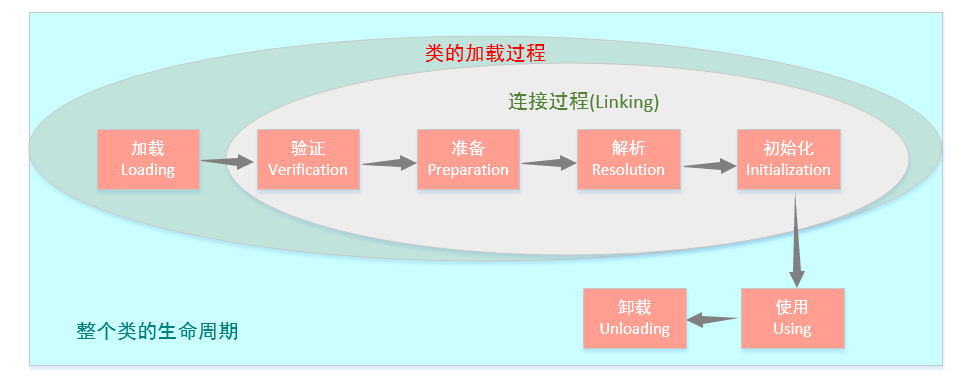
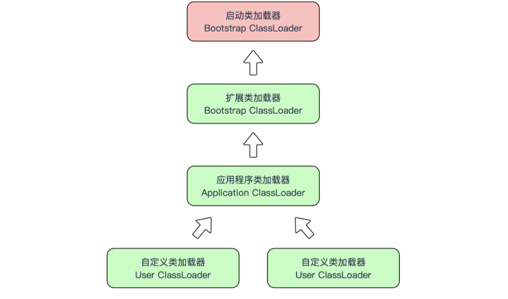

# 1. 类的加载过程

Java虚拟机中类加载的全过程包括以下5个阶段:point_down:



上图中加载、验证、准备、初始化和卸载 5 个阶段的顺序是确定的，类的加载过程必须按照这种顺序按部就班的开始**注意，这里说的是按部就班的开始，并不要求前一阶段执行完才能进入下一阶段**，而解析阶段则不一定：它在某些情况下可以在初始化阶段之后再开始，这是为了支持 Java 的动态绑定。

虚拟机规范中对于什么时候开始类加载过程的第一节点**「加载」**并没有强制约束。但是对于**「初始化」**阶段，虚拟机则是严格规定了有且只有以下 5 种情况，**如果类没有进行初始化，则必须立即对类进行「初始化」**（加载、验证、准备自然需要在此之前开始）：

1. 遇到 new、getstatic、putstatic 或 invokestatic 这 4 条字节码指令；
2. 使用 java.lang.reflect 包的方法对类进行反射调用的时候；
3. 当初始化一个类的时候，发现其父类还没有进行初始化的时候，需要先触发其父类的初始化；
4. 当虚拟机启动时，用户需要指定一个要执行的主类，虚拟机会先初始化这个类；
5. 当使用 JDK 1.7 的动态语言支持时，如果一个 java.lang.invoke.MethodHandle 实例最后的解析结果 REF_getStatic、REF_putStatic、REF_invokeStatic 的方法句柄，并且这个方法句柄所对应的类没有初始化。

**「有且只有」**以上 5 种场景会触发类的初始化，**这 5 种场景中的行为称为对一个类的主动引用。除此之外，所有引用类的方式都不会触发初始化，称为被动引用。**比如如下几种场景就是被动引用：

1. 通过子类引用父类的静态字段，不会导致子类的初始化；
2. 通过数组定义来引用类，不会触发此类的初始化；
3. 常量在编译阶段会存入调用类的常量池中，本质上并没有直接引用到定义常量的类，因此不会触发定义常量的类的初始化；

## 1.1 加载

:four_leaf_clover:加载是类加载过程中的一个阶段，在该阶段主要完成以下三件事：

1. 通过一个类的全限定名来获取定义此类的二进制字节流。

2. 将这个字节流所代表的的静态存储结构转化为方法区的运行时数据结构（此时常量池的信息被加载到方法区就生成了运行时常量池）。
3. 在Java堆中生成一个代表这个类的Class对象，作为方法区这个类的各种数据的访问入口。

**:maple_leaf:对于数组而言，**数组类本身不用过类加载器创建，它是由Java虚拟机直接在内存中动态构造出来的。但数组类的元素类型最终还是需要依靠类加载器来完成加载。一个数组类（以C代之）创建过程遵循下列规则：

1. 如果数组的组件类型是引用型，则使用上述:point_up: 加载规则，递归加载这个组件类型。**数组C将被标识在加载该组件的类加载器的类名空间上**

2. 如果数组的组件类型不是引用型（如int[]数组的组件类型int），**Java虚拟机将会把数组C标记为与引导类加载器关联**
3. 数组类的可访问性与它的组件类型的可访问性一致。如果组件类型不是引用型，则可访问性默认是public

> 加载阶段结束后，Java虚拟机外部的二进制 字节流（即类对应的class文件中的二进制字节码）就以虚拟机设定的格式存储在方法区中，安置完毕后会在Java堆内存中实例化一个java.lang.Class类的对象，这个对象将作为程序访问方法区的类型数据的外部接口。


## 1.2 验证

:fallen_leaf: 验证是连接阶段的第一步，**这一阶段的目的是为了确保 Class 文件的字节流中包含的信息符合当前虚拟机的要求，并且不会危害虚拟机自身的安全。**验证阶段大致上会完成下面 4 个阶段的检验动作：

1. **文件格式验证**：第一阶段要验证字节流是否符合 Class 文件格式的规范，并且能够被当前版本的虚拟机处理。验证点主要包括：是否以魔数 0xCAFEBABE 开头；主、次版本号是否在当前虚拟机处理范围之内；常量池的常量中是否有不被支持的常量类型；Class 文件中各个部分及文件本身是否有被删除的或者附加的其它信息等等。
2. **元数据验证**：第二阶段是对字节码描述的信息进行语义分析，以保证其描述的信息符合 Java 语言规范的要求，这个阶段的验证点包括：这个类是否有父类；这个类的父类是否继承了不允许被继承的类；如果这个类不是抽象类，是否实现了其父类或者接口之中要求实现的所有方法；类中的字段、方法是否与父类产生矛盾等等。
3. **字节码验证**：第三阶段是整个验证过程中最复杂的一个阶段，主要目的是通过数据流和控制流分析，确定程序语义是合法的、符合逻辑的。
4. **符号引用验证**：最后一个阶段的校验发生在虚拟机将符号引用转化为直接引用的时候，这个转化动作将在连接的第三阶段--解析阶段中发生。符号引用验证可以看做是对类自身以外（常量池中的各种符号引用）的形象进行匹配性校验。

## 1.3 准备

:leaves: **准备阶段是正式为类变量分配内存并设置类变量初始值的阶段**，这些变量所使用的内存都将在`方法区`进行分配。这个阶段中有两个容易产生混淆的概念需要强调下：

- 首先，这时候进行内存分配的仅包括类变量（被 static 修饰的变量），而不包括实例变量，实例变量将会在对象实例化时随着对象一起分配在 Java 堆中；:heavy_check_mark:
- 其次这里所说的初始值「通常情况」下是数据类型的零值。假设一个类变量的定义为`public static int value = 123;` 那么变量 `value` 在准备阶段过后的初始值为 0 而不是 123，因为这个时候尚未执行任何 Java 方法，而把 value 赋值为 123 的 putstatic 指令是程序被编译之后，存放于类构造器 () 方法之中，所以把 value 赋值为 123 的动作将在初始化阶段才会执行。

这里提到，在「通常情况」下初始值是零值，那相对的会有一些「特殊情况」：如果类字段的字段属性表中存在 ConstantsValue 属性，那在准备阶段变量 value 就会被初始化为 ConstantValue 属性所指的值。假设上面的类变量 value 的定义变为 `public static final int value = 123;`，编译时 JavaC 将会为 value 生成 ConstantValue 属性，在准备阶段虚拟机就会根据 ConstantValue 的设置将 value 赋值为 123。

## 1.4 解析

**:evergreen_tree: 解析阶段是虚拟机将常量池内的符号引用替换为直接引用的过程。**前面提到过很多次符号引用和直接引用，那么到底什么是符号引用和直接引用呢？

- **符号引用（Symbolic Reference）**：符号引用以一组符号来描述所引用的目标，符号可以上任何形式的字面量，只要使用时能无歧义地定位到目标即可。(符号引用的目标并不一定加载到虚拟机内存中)
- **直接引用（Direct Reference）**：直接引用可以是直接指向目标的指针、相对偏移量或是一个能间接定位到目标的句柄。（直接引用适合虚拟机实现的内存布局直接相关的，其引用的目标一定在虚拟机内存中）

## 1.5 初始化

:tanabata_tree: 类初始化阶段是类加载过程中的最后一步，前面的类加载过程中，除了在加载阶段用户应用程序可以通过自定义类加载器参与之外，其余动作完全是由虚拟机主导和控制的。到了初始化阶段，才真正开始执行类中编写的 Java 程序代码。**初始阶段是执行类构造器\<clinit> () 方法的过程。**

**:point_down: \<clinit> () 方法**

Java 类加载的初始化过程中，编译器**按语句在源文件中出现的顺序**，**依次自动收集类中的所有类变量的赋值动作和静态代码块中的语句合并产生 \<clinit>() 方法。** 如果类中没有静态语句和静态代码块，那可以不生成\<clinit>() 方法。

并且 `<clinit>()` 不需要显式调用父类（接口除外，接口不需要调用父接口的初始化方法，只有使用到父接口中的静态变量时才需要调用）的初始化方法 `<clinit>()`，虚拟机会保证在子类的 `<clinit>()` 方法执行之前，父类的 `<clinit>()` 方法已经执行完毕。因此在Java虚拟机中第一个被执行的`<clinit>()` 方法类型肯定是java.lang.Object。

**:point_down: 与\<clinit> () 方法不同的\<init>()方法**

\<init>()方法是对象构造时用以初始化对象的，构造器以及非静态初始化块中的代码。

```java
// 
public class Test {

    static {
        System.out.println("<clinit>方法开始执行！");
        System.out.println("<clinit>方法执行结束！");
    }

    public Test(){
        System.out.println("<init>方法开始执行！");
        System.out.println("<init>方法执行结束！");
    }

    public static void main(String[] args) {
        new Test();
    }
}
```


# 2. 类加载器

类加载阶段中的**「通过一个类的全限定名来获取描述此类的二进制字节流」**这个动作放到 Java 虚拟机外部去实现，以便让应用程序自己决定如何去获取所需要的类。**实现这个动作的代码模块称为「类加载器」。**

## 2.1 类与类加载器

:heavy_check_mark: 对于任意一个类，都需要有**加载它的类加载器**和这个**类本身**一同确立其**在 Java 虚拟机的唯一性**，每个类加载器都拥有一个独立的类名称空间。

也就是说：比较两个类是否「相等」，只要在这两个类是由同一个类加载器加载的前提下才有意义，否则，即使这两个类来源于同一个 Class 文件，被同一个虚拟机加载，只要加载它们的类加载器不同，那这两个类就必定不相等。

```java
public class Test {
    public static void main(String[] args) throws Exception {

        // 自定义类加载器
        ClassLoader myLoader = new ClassLoader() {
            @Override
            public Class<?> loadClass(String name) throws ClassNotFoundException {
                try {
                    String fileName = name.substring(name.lastIndexOf(".") + 1) + ".class";
                    InputStream is = getClass().getResourceAsStream(fileName);
                    if (is == null) {
                        return super.loadClass(name);
                    }

                    byte[] b = new byte[is.available()];
                    is.read(b);
                    return defineClass(name, b, 0, b.length);
                } catch (IOException e) {
                    throw new ClassNotFoundException(name);
                }
            }
        };

        Object obj = myLoader.loadClass("com.jason.others.Test").newInstance();
        System.out.println(obj.getClass()); // class com.jason.others.Test

        // obj是由自定义的类加载器构建的实例对象，而com.jason.others.Test是由虚拟机的类加载器所加载
        // 同一个class文件被不同的类加载器加载，所构建出来的对象并不相等
        System.out.println(obj instanceof com.jason.others.Test); // false

        Test test = new Test();
        System.out.println(test instanceof com.jason.others.Test); // true

    }
}
```

## 2.2 双亲委派机制

:deciduous_tree: 从 Java 虚拟机的角度来讲，只存在两种不同的类加载器：

- 一种是**启动类加载器**（Bootstrap ClassLoader），这个类加载器使用 C++ 来实现，是虚拟机自身的一部分；
- 另一种就是所有**其他的类加载器**，这些类加载器都由 Java 来实现，独立于虚拟机外部，并且全都继承自抽象类 `java.lang.ClassLoader`。

从 Java 开发者的角度来看，类加载器可以划分为：

- **启动类加载器（Bootstrap ClassLoader）**：这个类加载器负责将存放在 <java_home>\lib 目录中的类库加载到虚拟机内存中。启动类加载器无法被 Java 程序直接引用，用户在编写自定义类加载器时，如果需要把加载请求委派给启动类加载器，那直接使用 null 代替即可；
- **扩展类加载器（Extension ClassLoader）**：这个类加载器由 `sun.misc.Launcher$ExtClassLoader`实现，它负责加载 <java_home>\lib\ext 目录中，或者被 java.ext.dirs 系统变量所指定的路径中的所有类库，开发者可以直接使用扩展类加载器；
- **应用程序类加载器（Application ClassLoader）**：这个类加载器由 `sun.misc.Launcher$App-ClassLoader` 实现。`getSystemClassLoader()` 方法返回的就是这个类加载器，因此也被称为系统类加载器。它负责加载用户类路径（ClassPath）上所指定的类库。开发者可以直接使用这个类加载器，**如果应用程序中没有自定义过类加载器，一般情况下这个就是程序中默认的类加载器。**

我们的应用程序都是由这 3 种类加载器互相配合进行加载的，在必要时还可以自己定义类加载器。它们的关系如下图所示：



:point_up: 上图中所呈现出的这种层次关系，称为**类加载器的双亲委派模型**（Parents Delegation Model）。**双亲委派模型要求除了顶层的启动类加载器以外，其余的类加载器都应当有自己的父类加载器。**

**双亲委派模型的工作过程：**如果一个类加载器收到了类加载的请求，它首先不会自己去尝试加载这个类，而是把这个请求委派给父类加载器去完成，每一个层次的类加载器都是如此，因此所有的加载请求最终都应该传送到顶层的启动类加载器中，只有当父类加载器反馈自己无法完成这个类加载请求（它的搜索范围中没有找到所需的类）时，子加载器才会尝试自己去加载。

:heavy_check_mark: 这样做的好处就是 Java 类随着它的类加载器一起具备了一种带有优先级的层次关系。例如 java.lang.Object，它放在 rt.jar 中，无论哪一个类加载器要加载这个类，最终都是委派给处于模型顶端的启动类加载器来加载，因此 Object 类在程序的各种类加载器环境中都是同一个类。相反，如果没有使用双亲委派模型，由各个类加载器自行去加载的话，如果用户自己编写了一个称为 java.lang.Object 的类，并放在程序的 ClassPath 中，那系统中将会出现多个不同的 Object 类，Java 类型体系中最基本的行为也就无法保证了。

:point_down: ​ **双亲委派模型保证 Java 程序运行的稳定性**，但它的实现很简单，实现双亲委派模型的代码都集中在 java.lang.ClassLoader 的 loadClass() 方法中，逻辑很清晰：**先检查是否已经被加载过，若没有则调用父类加载器的 loadClass() 方法，若父加载器为空则默认使用启动类加载器作为父加载器。如果父类加载失败，抛出 ClassNotFoundException 异常后，再调用自己的 findClass() 方法进行加载。**

```java
protected Class<?> loadClass(String name, boolean resolve) throws ClassNotFoundException {
    
    // 首先，检查请求的类是不是已经被加载过
    Class<?> c = findLoadedClass(name);
    if (c == null) {
        try {
            if (parent != null) {
                c = parent.loadClass(name, false);
            } else {
                c = findBootstrapClassOrNull(name);
            }
        } catch (ClassNotFoundException e) {
            // 如果父类抛出 ClassNotFoundException 说明父类加载器无法完成加载
        }

        if (c == null) {
            // 如果父类加载器无法加载，则调用自己的 findClass 方法来进行类加载
            c = findClass(name);
        }
    }
    if (resolve) {
        resolveClass(c);
    }
    return c;
}
```

