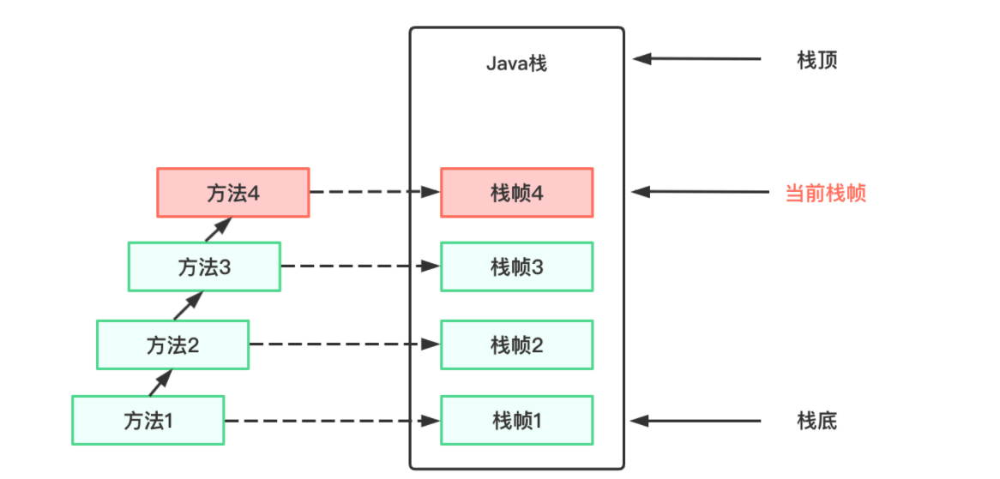
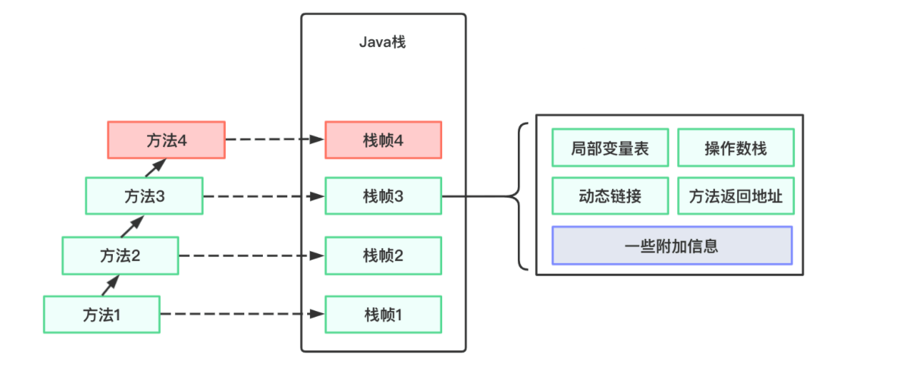

# 1. 虚拟机栈（Java栈）

**:deciduous_tree: 虚拟机栈也称为Java栈**，每个方法被执行的时候，Java虚拟机都会同步创建一个栈帧（Stack Frame）。

1. **Java虚拟机栈是线程私有的**，它的生命周期与线程相同（随线程而生，随线程而灭，每个线程包括独立的程序计数器，**虚拟机栈——由虚拟机栈帧组成**，本方法地栈）。
2. 栈帧包括局部变量表、操作数栈、动态链接、方法返回地址和一些附加信息。
3. 每一个方法被调用直至执行完毕的过程，就对应这一个栈帧在虚拟机栈中从入栈到出栈的过程。

**虚拟机栈示意图如下所示：**



# 2. 虚拟机栈大小的调整

Java虚拟机规范允许虚拟机栈的大小固定不变或者动态扩展。

- 固定情况下：如果线程请求分配的栈容量超过Java虚拟机允许的最大容量，则抛出StackOverflowError异常；
- 可动态扩展情况下：尝试扩展的时候无法申请到足够的内存；或者在创建新的线程的时候没有足够的内存去创建对应的虚拟机栈，则会抛出OutOfMemoryError异常。

可以通过 `java -Xss<size>`  设置 Java 线程堆栈大小，或者在idea中 help -> edit vm option中改变大小

# 3. 运行时栈帧结构

每个栈帧包含5个组成部分：局部变量表、操作数栈（Operand Stack）、动态链接（Dynamic Linking）、方法返回地址（Return Address）和一些附加信息



## 3. 1 局部变量表

局部变量表（Local Variables）是一组变量值的存储空间，用于**存放方法参数和方法内部定义的局部变量**。在Java程序被编译为Class文件时，就在方法的Code属性的max_locals数据项中确定了方法所需的分配的局部变量表的最大容量。

### 3.1.1 局部变量表的容量

**局部变量表的容量以变量槽（Variable Slot）**为最小单位，每个变量槽能存储一个：boolean、byte、char、short、int、float、reference或returnAddress（指向一条字节码指令的地址）共8种类型的数据。

局部变量表中32位以内的数据类型（除long和double外）只占用一个slot，64位类型（long和double）占用两个slot。举个例子：

```java
public class Test {

    public static void hello(String name) {
        Date date = new Date();
        long number = 200L;
        double salary = 6000.0;
        int count = 1;
    }
}
```

查看字节码文件有:point_down: （还可以在idea中使用jclasslib插件来查看局部变量表信息，使用：build project -> view -> show binaryCode with jclasslib）


根据上图可以看出：String和Date引用类型（reference）分别占用一个slot（第0个和第1个）、long类型的变量占用第2个和第3个slot、double类型的变量占用第4个和第5个slot、而int类型的变量则占用第6个slot。

**:maple_leaf: 如果执行没有被static修饰的方法**，那么局部变量表中第0位索引的变量槽，默认是用于传递方法所属对象实例的引用，也就是this(当前实例对象的引用)

```java
public class Test {

    public void halo(String name) {
        Date date = new Date();
        int count = 1;
    }
}
```


**可以看到，非静态方法的局部变量表首位就存放了this对象，这也是静态方法内无法使用this的原因**（因为静态方法的局部变量表中没有this对象）。

### 3.1.2 局部变量表容量的大小

在编译器就可以唯一确定下来，并保存在方法的Code属性的maximum locacl variables数据项中，就拿上面Test类的hello方法来说，其字节码里已经指明了局部变量表的大小：

```java
 public static void hello(java.lang.String);
    descriptor: (Ljava/lang/String;)V
    flags: ACC_PUBLIC, ACC_STATIC
    Code:
      stack=2, locals=7, args_size=1		  // locals = 7 就是局部变量表的大小
         0: new           #2                  // class java/util/Date
         3: dup
         4: invokespecial #3                  // Method java/util/Date."<init>":()V
         7: astore_1
         8: ldc2_w        #4                  // long 200l
        11: lstore_2
        12: ldc2_w        #6                  // double 6000.0d
        15: dstore        4
        17: iconst_1
        18: istore        6
        20: return
```

使用jclasslib插件查看局部变量表信息


**:warning:方法的调用**

 **:white_check_mark:方法调用并不等同于方法中的代码被执行了。**方法调用阶段唯一的任务就是确定被调用方法的版本（即调用哪个方法），暂时未涉及方法内部的执行逻辑（具体运行过程）。

 所有方法调用的目标方法都是一个常量池中的符号引用，而不是方法在实际运行时内存布局中的入口地址（即非直接引用）。

在类加载的解析阶段，会将其中一部分符号引用转化为直接饮用，能够解析的前提就是方法在程序真正运行前就有一个可以确定的调用版本，并且这个方法的调用版本在运行期间是不可改变的。

**也就是说：调用目标在程序代码写好、编译器进行编译那一刻就确定下来了。这类方法的调用被称为解析**

### 3.1.3 查看局部变量的作用范围

```java
public class Test {
    public static void hello(String s){
        int count = 1;
    }
}
```

```java
public static void hello(java.lang.String);
    descriptor: (Ljava/lang/String;)V
    flags: ACC_PUBLIC, ACC_STATIC
    Code:
      stack=1, locals=2, args_size=1
         0: iconst_1
         1: istore_1
         2: return
      LineNumberTable:
        line 10: 0
        line 11: 2
```

参考局表变量表信息：根据字节码PC计数器知，s 的起始指令地址为0，则 s 在方法开始时就生效，查看LineNumberTable -> line 10: 0可知，对应的代码在第10行，s 的作用域长度为 3 ，即字节码指令 0 - 2 范围内有效，也就是整个hello方法内都有效。


### 3.1.4 变量槽的重复使用

当方法体中定义的变量，其作用域并不一定会覆盖整个整个方法体，如果当前字节码PC计数器的值已经超出了某个变量的作用域，那么这个变量对应的变量槽就可以交给其他变量来重用。

## 3. 2 操作数栈

**:four_leaf_clover: 操作数栈（Operand Stack）**也常被成为操作栈，是一个后入先出栈，**用于保存计算过程中的中间结果，同时作为计算过程中变量临时的存储空间。**其最大深度在编译时就被写到了Code属性的max_stacks中。

```java
public class Test {
    public int add() {
        int a = 1;
        int b = 1;
        int c = a + b;
        return c;
    }
}
```

查看.class文件


**:four_leaf_clover: 栈**中的任何一个元素都可以是任意的Java数据类型，32bit的类型占用一个栈深度，64bit的类型占用两个栈单位深度：

```java
// 64bit数据类型有 Long和Double
// 32bit数据类型是除了 Long和Double
public class Test {
    public void test() {
        Long a = 1L;
    }
}
```

查看.class文件


**:four_leaf_clover:操组数栈在方法运行时的具体执行过程**

操作数栈在方法的执行过程中，根据字节码指令往栈中写入数据或提取数据，即入栈和出栈操作。虽然栈是用数组实现的，但根据栈的特性，对栈中数据访问不能通过索引，而是只能通过标准的入栈和出栈操作来完成一次数据访问。

下面通过一个例子来感受PC寄存器，局部变量表和操作数栈是如何相互配合完成一次方法的执行，代码如下所示：

```java
public class Test {
    public void add() {
        int a = 15;
        int b = 1;
        int c = a + b;
    }
}
```

在查看字节码指令之前，先记录下几个入栈出栈的字节码指令含义：

- 当int取值 -1 ~ 5 采用**iconst指令入栈；**
- 取值 -128 ~ 127（byte有效范围）采用**bipush指令入栈；**
- 取值 -32768 ~ 32767（short有效范围）采用sipush指令入栈；
- 取值 -2147483648 ~ 2147483647（int有效范围）采用ldc指令入栈；
- **istore，栈顶元素出栈，保存到局部变量表中；**
- **iload，从局部变量表中加载数据入栈。**


指令执行过程中，PC寄存器，局部变量表和操作数栈状态如下图所示:point_down:


**如果被调用的方法带有返回值的话，其返回值会被压入当前栈帧的操作数栈中。**

## 3. 3 动态链接

每个栈帧都包含一个指向运行时常量池中该栈帧所属方法的引用，持有这个引用是为了支持方法调用过程中的动态链接（Dynamic Linking）。

Class 文件的常量池中存在大量的符号引用，字节码中方法的调用指令就是以运行时常量池中指向方法的符号引用作为参数，这些符号引用一部分会在类加载阶段或第一次使用时转化为直接引用，这种转化成为静态解析。另一部分将在每一次运行期间转化为直接引用，这部分称为动态连接。


## 3. 4 方法返回地址

在方法退出后需要返回到该方法被调用的位置。方法正常退出时，调用者的pc计数器的值作为被调用者的返回地址，即调用该方法的指令的下一条指令的地址作为被调用者的方法返回地址，根据方法返回地址执行调用者的PC寄存器，若被调用者方法存在返回值，则return会将该返回值压入调用者的操作数栈中（个人理解……）。

当一个方法开始执行后，有两种方式可以退出这个方法：

- 一种是执行引擎遇到任意一个方法返回的字节码指令，这时候可能会有返回值传递给上层方法的调用者，是否有返回值和返回值的类型将根据遇到何种方法返回指令来决定，这种退出方法的方式称为**正常完成出口**。

- 另一种退出方式是，在方法执行过程中遇到了异常，并且这个异常没有在方法体内得到处理，无论是 Java 虚拟机内部产生的异常，还是代码中使用 athrow 字节码指令产生的异常，只要在本方法的异常表中没有搜索到匹配的异常处理器，就会导致方法退出。这种称为**异常完成出口**。一个方法使用异常完成出口的方式退出，是不会给上层调用者产生任何返回值的。

无论采用何种退出方式，在方法退出后都需要返回到方法被调用的位置，程序才能继续执行，方法返回时可能需要在栈帧中保存一些信息，用来恢复它的上层方法的执行状态。

一般来说，方法正常退出时，调用者的 PC 计数器的值可以作为返回地址，栈帧中很可能会保存这个计数器值。而方法异常退出时，返回地址是要通过异常处理器表来确定的，栈帧中一般不会保存这部分信息。

方法退出的过程实际上就等同于把当前栈帧出栈，因此退出时可能执行的操作有：恢复上次方法的局部变量表和操作数栈，把返回值（如果有的话）压入调用者栈帧的操作数栈中，调整 PC 计数器的值以指向方法调用指令后面的一条指令等。

## 3.5 附加信息

虚拟机规范允许具体的虚拟机实现增加一些规范里没有描述的信息到栈帧中，例如与调试相关的信息，这部分信息完全取决于具体的虚拟机实现。实际开发中，一般会把动态连接、方法返回地址与其他附加信息全部归为一类，成为栈帧信息。

