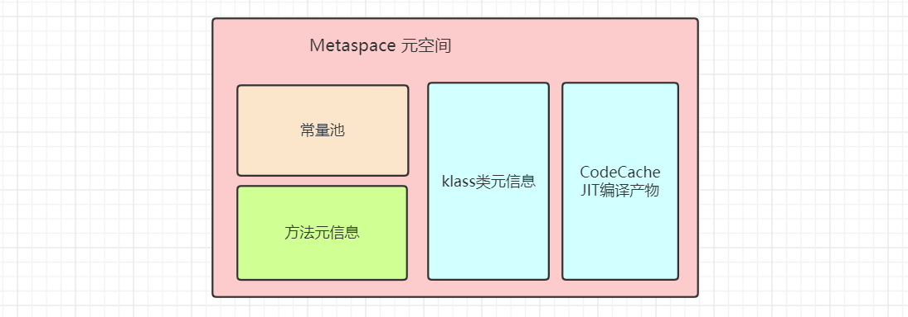
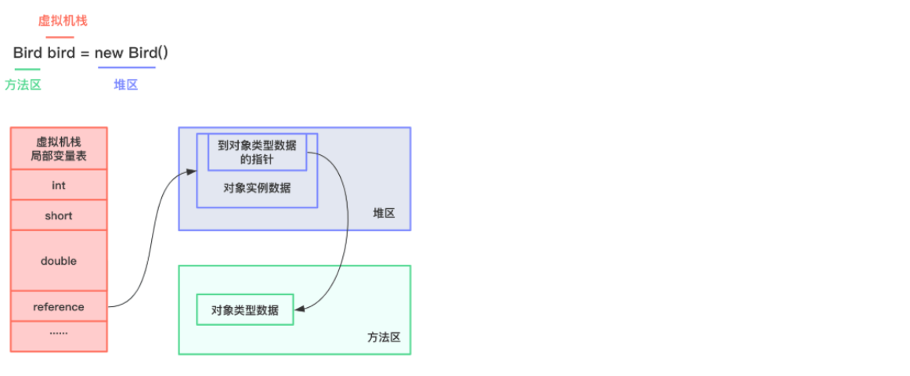
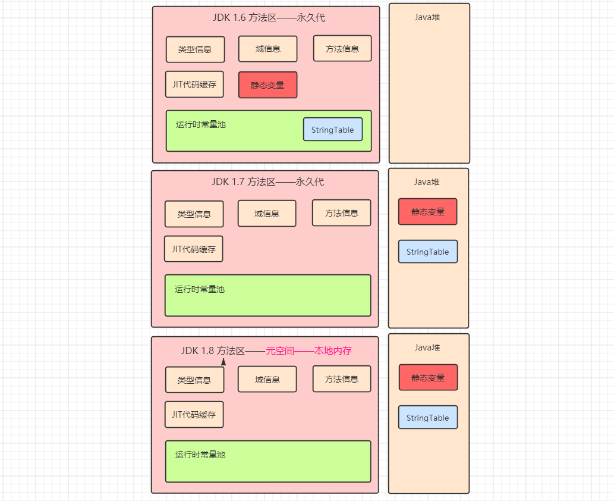

**🌳方法区（Method Area）**并不是所谓的存储方法的区域，而是供各线程共享的运行时内存区域。**它存储了已被虚拟机加载的类型信息、方法信息、常量、域（field）信息、静态变量、即时编译器编译后的代码缓存等。**

方法区也是**一种规范**，在不同虚拟机里头实现是不一样的，最典型的实现就是HotSpot虚拟机Java8之前的永久代(PermGen space)和Java8的元空间(Metaspace)。



# 1. 设置方法区大小

方法区的大小决定了系统可以加载多少个类，如果系统定义了太多的类，导致方法区溢出，虚拟机则会抛出java.lang.OutOfMemoryError: PermGen space（Java 7）或者java.lang.OutOfMemoryError: Metaspace（Java 8）内存溢出错误。

以Java8版本为例，我们可以使用`-XX:MetaspaceSize=size`设置元空间初始大小，`-XX:MaxMetaspaceSize=size`设置元空间最大值。默认情况下，在windows平台上，`-XX:MetaspaceSize`值为21M，`-XX:MaxMetaspaceSize`值为-1，即没有限制，所以极端情况下如果不断地加载类，虚拟机会耗尽所有可用的系统内存。

下面举个元空间OOM的例子：

```java
import com.sun.org.apache.bcel.internal.util.ClassLoader;
import com.sun.xml.internal.ws.org.objectweb.asm.ClassWriter;
import jdk.internal.org.objectweb.asm.Opcodes;

public class Test extends ClassLoader {

    public static void main(String[] args) {
        int count = 0;
        try {
            Test test = new Test();
            for (int i = 0; i < 10000; i++) {
                String className = "Class" + i;
                // 创建ClassWriter对象，用于生成类的二进制字节码
                ClassWriter classWriter = new ClassWriter(0);
                // 指定版本号、修饰符、类名、包名、父类和接口
                classWriter.visit(Opcodes.V1_8, Opcodes.ACC_PUBLIC, className, null, "java/lang/Object", null);
                byte[] bytes = classWriter.toByteArray();
                // 加载类
                test.defineClass(className, bytes, 0, bytes.length);
                count++;
            }
        } finally {
            System.out.println(count);
        }
    }
}
```

上面例子中，我们尝试加载10000个类，通过参数`-XX:MetaspaceSize=10m -XX:MaxMetaspaceSize=10m`将元空间大小设置为固定大小10M，运行上面的程序控制台输出：


# 2. 方法区、堆、栈关系

方法区和堆、栈的关系如下图所示：

```java
public class Bird {

    public static void main(String[] args) {
        Bird bird = new Bird();
    }
}
```



# 3. 方法区内部结构

方法区内部主要存储了以下内容（不同JDK版本内容有所不同，具体参考下面“方法区演进”）：

## 3.1 类型信息

对每个加载的类型（类class、接口 interface、枚举enum、注解 annotation），JVM必须在方法区中存储以下类型信息：

1. 是类还是接口；
2. 这个类的全限定名（包名.类名）；
3. 这个类型直接父类的全限定名（interface和java.lang.Object没有父类）；
4. 这个类的修饰符（public，abstract，final）；
5. 这个类型直接接口的一个有序列表（一个类可以实现多个接口）。

## 3.2 方法信息

方法信息包含了这个类的所有方法信息（包括构造器），这些信息和其声明顺序一致：

1. 方法名称；
2. 方法的返回值类型（没有返回值则是void）；
3. 方法参数的数量和类型（有序）；
4. 方法的修饰符（public，private，protected，static，final，synchronized，native，abstract）；
5. 方法的字节码、操作数栈、局部变量表及其大小（abstract和native方法除外）；
6. 异常表（abstract和native方法除外）。

## 3.3 域信息

域Field我们也常称为属性，字段。域信息包含：

1. 域的声明顺序；
2. 域的相关信息，包括名称、类型、修饰符（public，private，protected，static，final，volatile，transient）。

## 3.4 JIT代码缓存

这部分在👇执行引擎中再做说明。
https://www.cnblogs.com/code-duck/p/13568123.html

## 3.5 运行时常量池

**🌳运行时常量池（Runtime Constant Pool）**，它是方法区的一部分。Class文件中除了有类的版本、字段、方法、接口等描述等信息外，还有一项信息是**常量池（Constant Pool Table）**，用于存放编译期生成的各种字面量和符号引用，这部分内容将在**类加载后存放到运行时常量池**中。

类编译后的Class文件会有一个constant pool的结构，俗称为**常量池**，**所有的变量和方法引用都作为符号引用保存在class文件的常量池里。**虚拟机栈的动态链接就是将符号引用（这些符号引用的集合就是常量池）转换为直接引用（`符号引用对应的具体信息，这些具体信息的集合就是运行时常量池，存在方法区中`）的过程。

**常量池包含的内容有：**

- 直接常量：
      CONSTANT_INGETER_INFO 整型直接常量池   （public final int CONST_INT=0;）
      CONSTANT_STRING_INFO 字符串直接常量池  （public final String CONST_STR="CONST_STR";）
      CONSTANT_DOUBLE_INFO 浮点型直接常量池 （public final int CONST_DOUBLE= 0.0;）
      等等各种基本数据类型基础常量池。
- 方法名
- 方法描述符
- 类名
- 字段名
- 字段描述符的符号引用

## 3.6 静态变量

静态变量就是使用static修饰的域信息。静态变量和类关联在一起，随着类的加载而加载，它们成为类数据在逻辑上的一部分。静态变量也成为类变量，类变量被类的所有实例共享，即使没有类实例时你也可以访问它：

```java
public class Test {

    private static String hello = "hello";

    private static void hello() {
        System.out.println("hello");
    }

    public static void main(String[] args) {
        Test test = null;
        test.hello();
        System.out.println(test.hello);
    }
}
```

上面程序运行并不会报空指针异常。

**通过final修饰的静态变量我们俗称常量**。常量在编译的时候就会被分配具体值：

```java
public class Test {

    private static String hello = "hello";
    private static final String HELLO = "hello";
}
```

通过`javap -v -p Test.class`查看其字节码：


通过上面的学习我们知道，静态变量（类变量）在类加载过程的初始化阶段才会被赋值。

## 3.7 演示方法区内部结构

下面通过字节码内容来查看上面这些信息，现有如下代码：

```java
public class Test extends Object implements Cloneable, Serializable {

    private static String hello = "hello";
    private static final String HELLO = "hello";
    public int a = 0;

    public void method1() {
        System.out.println("method1");
    }

    public static String method2(String name) {
        try {
            int a = 1;
            int b = a / 0;
        } catch (Exception e) {
            e.printStackTrace();
        }
        return name;
    }
}
```

通过`javap -v -p Test.class`查看其字节码：

```java
Classfile /Users/mrbird/idea workspace/JVM-Learn/target/classes/cc/mrbird/jvm/learn/Test.class
  Last modified 2019-4-01; size 1016 bytes
  MD5 checksum ab0309674b0f0b5fbd0766af035efe0a
  Compiled from "Test.java"
// 类型信息
public class cc.mrbird.jvm.learn.Test implements java.lang.Cloneable,java.io.Serializable
  minor version: 0
  major version: 52
  // 类的修饰符
  flags: ACC_PUBLIC, ACC_SUPER
// 常量池
Constant pool:
   #1 = Methodref          #11.#38        // java/lang/Object."<init>":()V
   #2 = Fieldref           #10.#39        // cc/mrbird/jvm/learn/Test.a:I
   #3 = Fieldref           #40.#41        // java/lang/System.out:Ljava/io/PrintStream;
   #4 = String             #27            // method1
   #5 = Methodref          #42.#43        // java/io/PrintStream.println:(Ljava/lang/String;)V
   #6 = Class              #44            // java/lang/Exception
   #7 = Methodref          #6.#45         // java/lang/Exception.printStackTrace:()V
   #8 = String             #14            // hello
   #9 = Fieldref           #10.#46        // cc/mrbird/jvm/learn/Test.hello:Ljava/lang/String;
  #10 = Class              #47            // cc/mrbird/jvm/learn/Test
  #11 = Class              #48            // java/lang/Object
  #12 = Class              #49            // java/lang/Cloneable
  #13 = Class              #50            // java/io/Serializable
  #14 = Utf8               hello
  #15 = Utf8               Ljava/lang/String;
  #16 = Utf8               HELLO
  #17 = Utf8               ConstantValue
  #18 = Utf8               a
  #19 = Utf8               I
  #20 = Utf8               <init>
  #21 = Utf8               ()V
  #22 = Utf8               Code
  #23 = Utf8               LineNumberTable
  #24 = Utf8               LocalVariableTable
  #25 = Utf8               this
  #26 = Utf8               Lcc/mrbird/jvm/learn/Test;
  #27 = Utf8               method1
  #28 = Utf8               method2
  #29 = Utf8               (Ljava/lang/String;)Ljava/lang/String;
  #30 = Utf8               e
  #31 = Utf8               Ljava/lang/Exception;
  #32 = Utf8               name
  #33 = Utf8               StackMapTable
  #34 = Class              #44            // java/lang/Exception
  #35 = Utf8               <clinit>
  #36 = Utf8               SourceFile
  #37 = Utf8               Test.java
  #38 = NameAndType        #20:#21        // "<init>":()V
  #39 = NameAndType        #18:#19        // a:I
  #40 = Class              #51            // java/lang/System
  #41 = NameAndType        #52:#53        // out:Ljava/io/PrintStream;
  #42 = Class              #54            // java/io/PrintStream
  #43 = NameAndType        #55:#56        // println:(Ljava/lang/String;)V
  #44 = Utf8               java/lang/Exception
  #45 = NameAndType        #57:#21        // printStackTrace:()V
  #46 = NameAndType        #14:#15        // hello:Ljava/lang/String;
  #47 = Utf8               cc/mrbird/jvm/learn/Test
  #48 = Utf8               java/lang/Object
  #49 = Utf8               java/lang/Cloneable
  #50 = Utf8               java/io/Serializable
  #51 = Utf8               java/lang/System
  #52 = Utf8               out
  #53 = Utf8               Ljava/io/PrintStream;
  #54 = Utf8               java/io/PrintStream
  #55 = Utf8               println
  #56 = Utf8               (Ljava/lang/String;)V
  #57 = Utf8               printStackTrace
{

  // 域信息
  private static java.lang.String hello;
    descriptor: Ljava/lang/String;
    flags: ACC_PRIVATE, ACC_STATIC
  // 域信息
  private static final java.lang.String HELLO;
    descriptor: Ljava/lang/String;
    flags: ACC_PRIVATE, ACC_STATIC, ACC_FINAL
    ConstantValue: String hello
  // 域信息
  public int a;
    descriptor: I
    flags: ACC_PUBLIC
  // 方法信息
  public cc.mrbird.jvm.learn.Test();
    descriptor: ()V
    flags: ACC_PUBLIC
    Code:
      stack=2, locals=1, args_size=1
         0: aload_0
         1: invokespecial #1                  // Method java/lang/Object."<init>":()V
         4: aload_0
         5: iconst_0
         6: putfield      #2                  // Field a:I
         9: return
      LineNumberTable:
        line 5: 0
        line 9: 4
      LocalVariableTable:
        Start  Length  Slot  Name   Signature
            0      10     0  this   Lcc/mrbird/jvm/learn/Test;
  // 方法信息
  public void method1();
    descriptor: ()V
    flags: ACC_PUBLIC
    Code:
      // 操作数栈大小，局部变量表大小，参数个数
      stack=2, locals=1, args_size=1
         0: getstatic     #3                  // Field java/lang/System.out:Ljava/io/PrintStream;
         3: ldc           #4                  // String method1
         5: invokevirtual #5                  // Method java/io/PrintStream.println:(Ljava/lang/String;)V
         8: return
      LineNumberTable:
        line 12: 0
        line 13: 8
      LocalVariableTable:
        Start  Length  Slot  Name   Signature
            0       9     0  this   Lcc/mrbird/jvm/learn/Test;
  // 方法信息
  public static java.lang.String method2(java.lang.String);
    descriptor: (Ljava/lang/String;)Ljava/lang/String;
    flags: ACC_PUBLIC, ACC_STATIC
    Code:
      stack=2, locals=3, args_size=1
         0: iconst_1
         1: istore_1
         2: iload_1
         3: iconst_0
         4: idiv
         5: istore_2
         6: goto          14
         9: astore_1
        10: aload_1
        11: invokevirtual #7                  // Method java/lang/Exception.printStackTrace:()V
        14: aload_0
        15: areturn
      // 异常表
      Exception table:
         from    to  target type
             0     6     9   Class java/lang/Exception
      LineNumberTable:
        line 17: 0
        line 18: 2
        line 21: 6
        line 19: 9
        line 20: 10
        line 22: 14
      // 局部变量表
      LocalVariableTable:
        Start  Length  Slot  Name   Signature
            2       4     1     a   I
           10       4     1     e   Ljava/lang/Exception;
            0      16     0  name   Ljava/lang/String;
      StackMapTable: number_of_entries = 2
        frame_type = 73 /* same_locals_1_stack_item */
          stack = [ class java/lang/Exception ]
        frame_type = 4 /* same */

  static {};
    descriptor: ()V
    flags: ACC_STATIC
    Code:
      stack=1, locals=0, args_size=0
         0: ldc           #8                  // String hello
         2: putstatic     #9                  // Field hello:Ljava/lang/String;
         5: return
      LineNumberTable:
        line 7: 0
}
SourceFile: "Test.java"
```

# 4. 方法区的演进

随着JDK的迭代升级，Hotspot中方法区的存储的内容发生了如下变化（上面介绍的方法区的内部结构是经典情况下的，具体还是需要看JDK是什么版本）：

| 版本         | 描述                                                         |
| :----------- | :----------------------------------------------------------- |
| jdk1.6及之前 | 有永久代（permanent generation），**静态变量存放在永久代上** |
| jdk1.7       | 有永久代，但已经逐步“去永久代”，**字符串常量池、静态变量移除，保存在堆中** |
| jdk1.8及之后 | 无永久代，类型信息、字段、方法、**常量**保存在**本地内存的元空间**，但**字符串常量池、静态变量仍然保存在堆中** |



上面说的静态变量在JDK1.6之前存放在永久代，JDK1.7后移动到堆空间指的是变量本身，变量对应的对象实例一直都是在堆空间分配的。举个例子：

```java
public class StaticObjTest {

    static class Test {
        static ObjectHolder staticObj = new ObjectHolder();
        ObjectHolder instanceObj = new ObjectHolder();

        void foo() {
            ObjectHolder localObj = new ObjectHolder();
        }
    }

    private static class ObjectHolder {

    }
}
```

这个例子中，三个new ObjectHolder()的创建，都是在堆中分配的，localObj是方法foo内的局部变量，存放在虚拟机栈的局部变量表中；instanceObj为成员变量，随着对象实例的创建也分配在堆中；静态变量staticObj根据JDK版本的不同存放位置也不同，JDK1.6及之前，存放在永久代中，JDK1.7及之后存放到堆中。

## 永久代与元空间

**永久代为什么会被元空间替代？**因为永久代的大小是很难确定的，如果一个程序动态加载的类过多就很容易触发永久代的Full GC（Full GC代价大，耗时长，影响程序性能）甚至OOM，程序直接奔溃；

而元空间和永久代之间最大的区别在于：**元空间并不在虚拟机中，而是使用本地内存，**这样元空间就基本不会触发Full GC和OOM了。

**字符串常量池（StringTable）为什么要放到堆中？**因为如果将StringTable放在永久代的话回收效率很低，在Full GC的时候才会触发。而Full GC是老年代的空间不足、永久代不足时才会触发。这就导致 StringTable回收效率不高。而我们开发中会有大量的字符串被创建，回收效率低，导致永久代内存不足。放到堆里，能及时回收内存。

# 5.方法区垃圾回收

方法区也存在垃圾回收，方法区的垃圾收集主要回收两部分内容：常量池中废弃的常量和不再使用的类型。