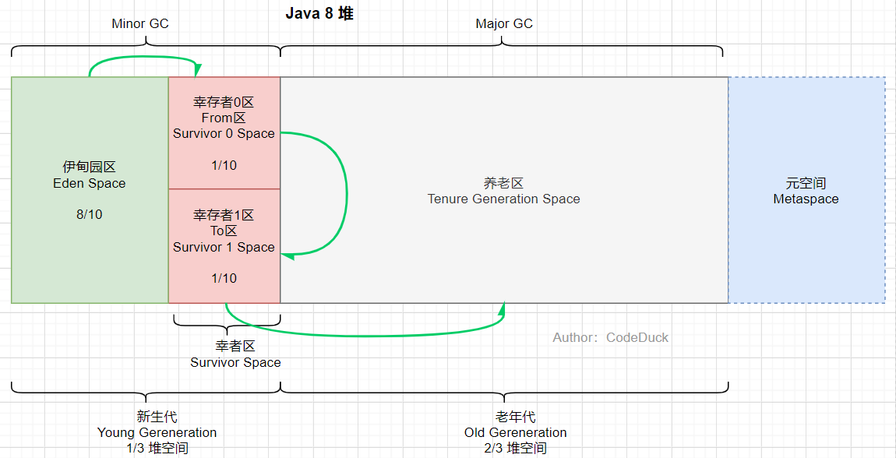
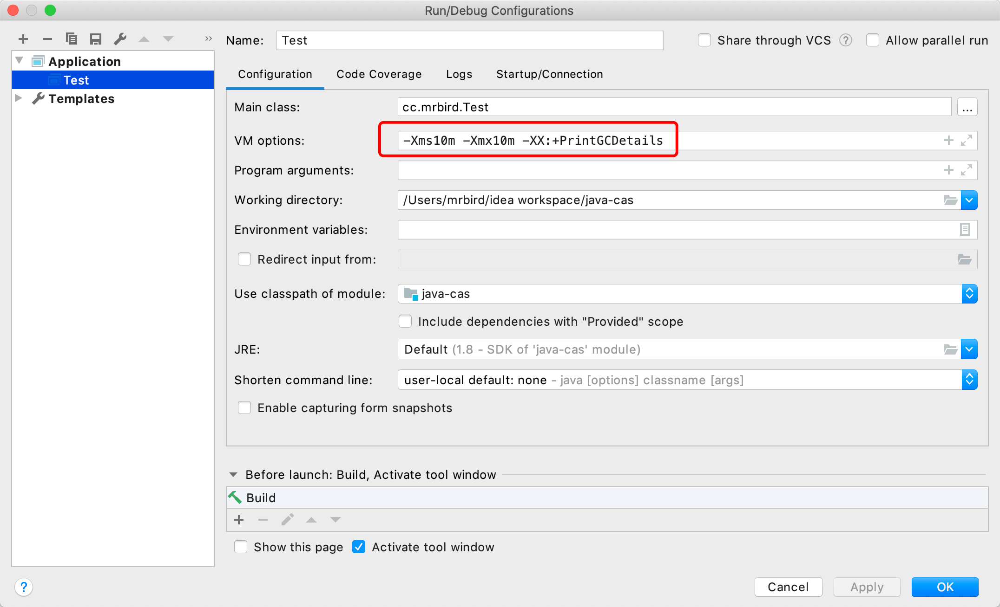
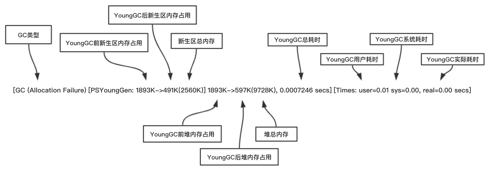
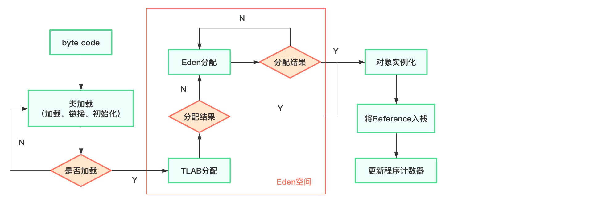

# 1. Java堆的基本概念

**Java 堆是虚拟机所管理的内存中最大的一块，**是被所有线程共享的一块内存区域，在虚拟机启动时创建。

**此内存区域的唯一作用就是存放对象实例，几乎所有的对象实例都是在这里分配的**（不绝对，在虚拟机的优化策略下，也会存在栈上分配、标量替换的情况）。

**Java 堆是 GC 回收的主要区域**，因此很多时候也被称为 GC 堆。

- 从内存回收的角度看，Java 堆还可以被细分为新生代和老年代；再细一点新生代还可以被划分为 Eden Space、From Survivor Space、To Survivor Space。
- 从内存分配的角度看，线程共享的 Java 堆可能划分出多个线程私有的分配缓冲区（Thread Local Allocation Buffer，TLAB）。「**属于线程共享的内存区域**」

堆中保存着所有引用类型的真实信息，以方便执行器执行。堆在逻辑上分为三个区域：

# 2. 堆的结构

**Java 7 及以前版本的堆划分为**：新生代、老年代、永久代。


**Java 8 及以后版本的堆划分为**：新生代、老年代、元空间（元空间使用的是直接内存）。



在Java7时代，堆分为新生区（新生区包含伊甸园区和幸存区，幸存区又包含幸存者0区和幸存者1区。此外，幸存者0区又称为From区，幸存者1区又称为To区，From区和To区并不是固定的，复制之后交互，谁空谁是To），养老区和永久代；

在Java8中，永久代已经被移除，被一个称为元空间的区域所取代。元空间的本质和永久代类似。

元空间与永久代之间最大的区别在于：永久代使用的JVM的堆内存，但是java8以后的元空间并不在虚拟机中而是使用本机物理内存（所以在上图中，我用虚线表示）。

堆之所以要分区是因为：Java程序中不同对象的生命周期不同，70%~99%对象都是临时对象，这类对象在新生区“朝生夕死”。如果没有分区，GC时搜集垃圾需要对整个堆内存进行扫描；分区后，回收这些 "朝生夕死"  的对象，只需要在小范围的区域中（新生区）搜集垃圾。所以，分区的唯一理由就是为了优化GC性能。

# 3. 堆空间对象分配过程

下面通过一个例子来讲述这几个区的交互逻辑：

**1. 几乎任何新的对象都是在伊甸园区被new出来创建，刚开始的时候两个幸存者区和养老区都是空的：**

**2. 随着对象的不断创建，伊甸园区空间逐渐被填满：**


**3. 这时候将触发一次Minor GC（Young GC），删除未引用的对象，GC剩下来的还存在引用的对象将移动到幸存者0区，然后清空伊甸园区：**


**4. 随着对象的创建，伊甸园区空间又满了，再一次触发Minor GC，删除未引用的对象，留下存在引用的对象。这次和上一次Minor GC有些不同，这轮GC留下的对象将被移动到幸存者1区，并且上一轮GC留下来的存储在幸存者0区的对象年龄递增并移动到幸存者1区。当所有幸存对象都移动到幸存者1区后，幸存者0区和伊甸园区空间清除：**


**5. 随着对象的创建伊甸园区空间再一次满了，触发了第三次Minor GC，这一次幸存区空间将发生互换，GC留下来的幸存者将移动到幸存者0区，幸存者1区的幸存对象年龄递增后也移动到幸存者0区，然后伊甸园区和幸存者1区的空间被清除：**


**6. 随着Minor GC的不断发生，幸存对象在两个幸存区不断地交换存储，年龄也不断递增。如此反反复复之后，当幸存对象的年龄达到指定的阈值（这个例子中是8，由JVM参数MaxTenuringThreshold决定）后，它们将被移动到养老区：**


**7. 随着上述过程的不断出现，当养老区快满时，将触发Major GC（Full GC）进行养老区的内存清理。若养老区执行了GC之后发现依然无法进行对象的保存，就会产生OOM异常。**

一个对象被放置到养老区除了它的年龄达到阈值外，以下几种情况也会使得该对象直接被放置到养老区：

1. 对象创建后，无法放置到伊甸园区（比如伊甸园区的大小为10m，新的对象大小为11m，伊甸园区不够放，触发YGC。YGC后伊甸园区被清空，但还是无法容下11m的“超大对象”，所以直接放置到养老区。当然如果养老区放置不下则会触发FGC，FGC后还放不下则OOM）；
2. YGC后，对象无法放置到幸存者To区也会直接晋升到养老区；
3. 如果幸存区中相同年龄的所有对象大小大于幸存区空间的一半，年龄大于或等于这些对象年龄的对象可以直接进入养老区，无需等到年龄阈值。

# 4. 堆参数

以JDK1.8+HotSpot为例，常用的可调整的堆参数有：

| 参数                            | 含义                                                         |
| :------------------------------ | :----------------------------------------------------------- |
| -Xms，等价于-XX:InitialHeapSize | 设置堆的初始内存大小，默认为物理内存的1/64                   |
| -Xmx，等价于-XX:MaxHeapSize     | 设置堆的最大内存大小，默认为物理内存的1/4                    |
| -XX:Newratio                    | 设置新生区和养老区的比例，比如值为2（默认值），则养老区是新生区的2倍，即养老区占据堆内存的2/3 |
| -XX:Surviorratio                | 设置伊甸园区和一个幸存区的比例，比如值为8（默认值）则表示伊甸园区占新生区的8/10（两个幸存区是一样大的） |
| -Xmn                            | 设置堆新生区的内存大小（一般不使用）                         |
| -XX:MaxTenuringThreshold        | 设置转入养老区的存活次数，默认值为15                         |
| -XX:+PrintFlagsInitial          | 查看所有参数的默认初始值                                     |
| -XX:+PrintFlagsFinal            | 查看所有参数的最终值（被我们修改后的值不再是默认初始值）     |

剩下所有可用参数可以查看oracle官方文档：https://docs.oracle.com/javase/8/docs/technotes/tools/unix/java.html。

**生产环境中，推荐将-Xms和-Xmx设置为一样大，因为这样做的话在Java垃圾回收清理完堆区后不需要重新计算堆区大小，从而提高性能**。此外，要在程序中输出详细的GC处理日志，可以使用`-XX:+PrintGCDetails`。

比如，我的电脑内存为32GB，所以堆的默认初始值大小为500MB左右，堆的最大值大约为8000MB左右：

```java
public class Test {
    public static void main(String[] args) {
        long maxMemory = Runtime.getRuntime().maxMemory();
        long totalMemory = Runtime.getRuntime().totalMemory();

        System.out.println("堆内存的初始值" + totalMemory / 1024 / 1024 + "mb");
        System.out.println("堆内存的最大值" + maxMemory / 1024 / 1024 + "mb");
    }
}
```

程序输出：

```
堆内存的初始值491mb
堆内存的最大值7282mb
```

可以通过IDEA调整堆的大小：



我们将堆内存的初始大小和最大值都设置为10mb，并且开启GC日志打印，重新运行下面这段程序：

```java
public class Test {
    public static void main(String[] args) {
        long maxMemory = Runtime.getRuntime().maxMemory();
        long totalMemory = Runtime.getRuntime().totalMemory();

        System.out.println("堆内存的初始值" + totalMemory / 1024  + "kb");
        System.out.println("堆内存的最大值" + maxMemory / 1024  + "kb");
    }
}
```


输出如下所示：

```
堆内存的初始值9728kb
堆内存的最大值9728kb
Heap
 PSYoungGen      total 2560K, used 1388K [0x00000007bfd00000, 0x00000007c0000000, 0x00000007c0000000)
  eden space 2048K, 67% used [0x00000007bfd00000,0x00000007bfe5b370,0x00000007bff00000)
  from space 512K, 0% used [0x00000007bff80000,0x00000007bff80000,0x00000007c0000000)
  to   space 512K, 0% used [0x00000007bff00000,0x00000007bff00000,0x00000007bff80000)
 ParOldGen       total 7168K, used 0K [0x00000007bf600000, 0x00000007bfd00000, 0x00000007bfd00000)
  object space 7168K, 0% used [0x00000007bf600000,0x00000007bf600000,0x00000007bfd00000)
 Metaspace       used 2947K, capacity 4496K, committed 4864K, reserved 1056768K
  class space    used 320K, capacity 388K, committed 512K, reserved 1048576K
```


可以看到，PSYoungGen（新生区）的总内存大小为2560k，ParOldGen（养老区）的总内存大小为7168k，总和刚好是9728K，这也说明了：Java8后的堆物理上只分为新生区和养老区，Metaspace（元空间）不占用堆内存，而是直接使用物理内存。

那为什么我们设置的堆内存大小是10m（10240kb），控制台输出却只有9728kb呢？从上面的例子我们知道，幸存者区分为0区和1区，根据复制算法的特点，这两个区同一时刻总有一个区是空的，所以控制台输出的内存计算方式为：**2048K(eden space)+512K(from space or to space)+7168K(ParOldGen)=9728K**。9728K再加一个幸存区的大小512K刚好是10240K。

再举个OOM的例子，使用刚刚`-Xms10m -Xmx10m -XX:+PrintGCDetails`的设置，运行下面这段程序：

```java
public class Test {
    public static void main(String[] args) {
        String value = "hello";
        while (true) {
            value += value + new Random().nextInt(1000000000) + new Random().nextInt(1000000000);
        }
    }
}
```

输出如下：

```
[GC (Allocation Failure) [PSYoungGen: 1893K->491K(2560K)] 1893K->597K(9728K), 0.0007246 secs] [Times: user=0.01 sys=0.00, real=0.00 secs] 
[GC (Allocation Failure) [PSYoungGen: 2207K->496K(2560K)] 2313K->1153K(9728K), 0.0008383 secs] [Times: user=0.00 sys=0.00, real=0.00 secs] 
[GC (Allocation Failure) [PSYoungGen: 2007K->496K(2560K)] 2664K->1897K(9728K), 0.0009456 secs] [Times: user=0.01 sys=0.00, real=0.01 secs] 
[GC (Allocation Failure) [PSYoungGen: 2021K->496K(2560K)] 4894K->4113K(9728K), 0.0010814 secs] [Times: user=0.00 sys=0.00, real=0.00 secs] 
[GC (Allocation Failure) [PSYoungGen: 1359K->496K(2560K)] 6448K->5600K(9728K), 0.0015792 secs] [Times: user=0.00 sys=0.00, real=0.00 secs] 
[GC (Allocation Failure) [PSYoungGen: 496K->496K(1536K)] 5600K->5600K(8704K), 0.0006416 secs] [Times: user=0.01 sys=0.00, real=0.00 secs] 
[Full GC (Allocation Failure) [PSYoungGen: 496K->0K(1536K)] [ParOldGen: 5104K->2585K(7168K)] 5600K->2585K(8704K), [Metaspace: 2982K->2982K(1056768K)], 0.0044783 secs] [Times: user=0.02 sys=0.00, real=0.01 secs] 
[GC (Allocation Failure) [PSYoungGen: 61K->192K(2048K)] 7061K->7192K(9216K), 0.0012566 secs] [Times: user=0.01 sys=0.00, real=0.00 secs] 
[Full GC (Ergonomics) [PSYoungGen: 192K->0K(2048K)] [ParOldGen: 7000K->1840K(7168K)] 7192K->1840K(9216K), [Metaspace: 3042K->3042K(1056768K)], 0.0072023 secs] [Times: user=0.02 sys=0.00, real=0.01 secs] 
[GC (Allocation Failure) [PSYoungGen: 65K->160K(2048K)] 6321K->6416K(9216K), 0.0022603 secs] [Times: user=0.02 sys=0.00, real=0.00 secs] 
[Full GC (Ergonomics) [PSYoungGen: 160K->0K(2048K)] [ParOldGen: 6256K->4785K(7168K)] 6416K->4785K(9216K), [Metaspace: 3076K->3076K(1056768K)], 0.0056740 secs] [Times: user=0.03 sys=0.00, real=0.01 secs] 
[GC (Allocation Failure) [PSYoungGen: 0K->0K(2048K)] 4785K->4785K(9216K), 0.0003871 secs] [Times: user=0.00 sys=0.00, real=0.00 secs] 
[Full GC (Allocation Failure) [PSYoungGen: 0K->0K(2048K)] [ParOldGen: 4785K->4765K(7168K)] 4785K->4765K(9216K), [Metaspace: 3076K->3076K(1056768K)], 0.0049903 secs] [Times: user=0.02 sys=0.00, real=0.00 secs] 
Heap
 PSYoungGen      total 2048K, used 59K [0x00000007bfd00000, 0x00000007c0000000, 0x00000007c0000000)
  eden space 1024K, 5% used [0x00000007bfd00000,0x00000007bfd0efb8,0x00000007bfe00000)
  from space 1024K, 0% used [0x00000007bfe00000,0x00000007bfe00000,0x00000007bff00000)
  to   space 1024K, 0% used [0x00000007bff00000,0x00000007bff00000,0x00000007c0000000)
 ParOldGen       total 7168K, used 4765K [0x00000007bf600000, 0x00000007bfd00000, 0x00000007bfd00000)
  object space 7168K, 66% used [0x00000007bf600000,0x00000007bfaa77b8,0x00000007bfd00000)
 Metaspace       used 3113K, capacity 4496K, committed 4864K, reserved 1056768K
  class space    used 339K, capacity 388K, committed 512K, reserved 1048576K
Exception in thread "main" java.lang.OutOfMemoryError: Java heap space
    at java.util.Arrays.copyOf(Arrays.java:3332)
    at java.lang.AbstractStringBuilder.ensureCapacityInternal(AbstractStringBuilder.java:124)
    at java.lang.AbstractStringBuilder.append(AbstractStringBuilder.java:674)
    at java.lang.StringBuilder.append(StringBuilder.java:208)
    at cc.mrbird.Test.main(Test.java:19)
```


可以看到，经过数次的GC和Full GC后，堆内存还是无法腾出空间，最终抛出OOM错误。日志的含义如下图所示：

Young GC（Minor GC）：



Full GC（Major GC）：


# 5. 本地线程分配缓冲区（TLAB）

JVM将Eden的一小部分区域划分成若干个缓冲区，将其交给应用程序的线程用于创建实例对象使用，这块区域就是TLAB（Thread Local Allocation Buffer）。

TLAB的大小会根据每个线程的情况进行动态调整，具体分配情况如下：

1. 如果有空间，那常规对象就会在TLAB中分配。
2. 如果没有，线程则会向虚拟机请求一个新的TLAB并再次尝试分配。
3. 如果这个对象连室的TLAB都容纳不下，那虚拟机接下来就不会考虑在TLAB中分配对象，而是尝试想办法在Eden区中直接分配对象。
4. 如果还是失败，下一步就是执行一次Young GC（这可能会调整堆的大小）。
5. 如果经过垃圾收集后重新分配内存仍是失败，那最后的办法就是直接在老年代中分配该对象。

**考虑到线程安全问题，在非TLAB分配内存的比率不能过高。**

多线程同时分配内存时，使用TLAB可以避免一系列非线程安全问题，同时还能够提升内存分配的吞吐量。尽管不是所有的对象实例都能够在TLAB中成功分配内存，但**JVM确实是将TLAB作为内存分配的首选：**




我们可以使用`-XX:UseTLAB`设置是否开启TLAB，举个例子：

```java
public class Test {

    public static void main(String[] args) throws InterruptedException {
        TimeUnit.SECONDS.sleep(100);
    }
}
```

运行main方法：可以看到TLAB默认是开启的。


TLAB空间的内存非常小，仅占整个伊甸园区的1%，可以通过`-XX:TLABWasteTargetPercent`设置TLAB空间所占用伊甸园区空间的百分比。

**有了TLAB的概念后，就不能说堆空间一定是线程共享的了。**