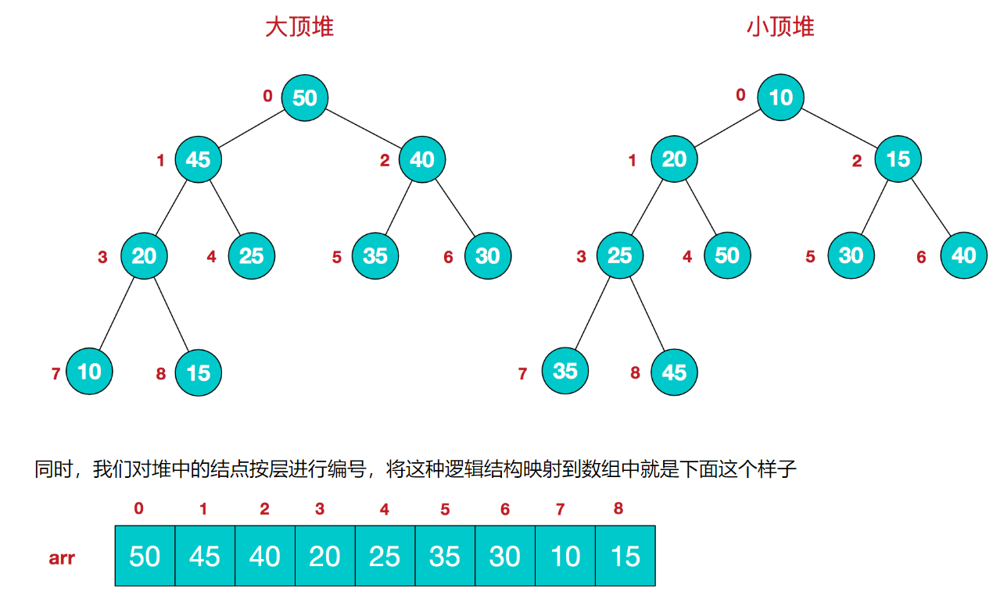
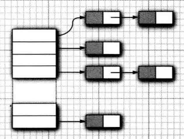

# 数据结构

---

# 排序

## 插入排序

> 核心思想：假设当前集合是有序集合(默认第一个元素为有序集合)，
>
> 从第二个元素开始，向前遍历当前元素与前一个元素的大小，并进行交换(不断重复该步骤)
>
> 时间复杂度：`O(N^2)`


```java
/**
 * @Description: 插入排序
 * @Param: arr
 * @return: void
 */
public static void insertionSort(int[] arr) {

    for (int i = 1; i < arr.length; i++) { // 从第二个元素开始

        int j = i;  // 记录当前元素位置

        // 从 i 处 向前索引并判断arr[j-1] 与 arr[j] 的大小
        while (j > 0 && arr[j - 1] > arr[j]) {
            swap(arr, j - 1, j);    // 当前一个元素大于后一个元素时，进行交换
            --j;
        }
    }
}

/**
 * @Description: 交换元素
 * @Param: arr 数组
 * @Param: i，j数组下标
 * @return: void
 */
public static void swap(int[] arr, int i, int j) {

    int temp = arr[i];
    arr[i] = arr[j];
    arr[j] = temp;
}
```

> 简单插入排序在最好情况下，需要比较n-1次，无需交换元素，时间复杂度为O(n);在最坏情况下，时间复杂度依然为O(N^2)

## 希尔排序

> 核心思想：将待排序的集合进行分组，分别为 length/2、length/4 …… length/n =1为止
>
> 时间复杂度：`O( NlogN ) - O(N^2)`


```java
public static <T extends Comparable<? super T>> void shellSort(T[] arr) {

    int j;

    // 对数组进行分组
    for (int gap = arr.length / 2; gap > 0; gap /= 2) {

        // 从当前gap值开始索引，至整个数组大小结束
        for (int i = gap; i < arr.length; i++) {
			
            // 记录当前索引值
            T tmp = arr[i];

            for (j = i; j >= gap && tmp.compareTo(arr[j - gap]) < 0; j -= gap) {
                // 若当前值 arr[j] < arr[j-gap],则进行赋值，并且向前回溯，直到arr[j] > arr[j-gap]
                arr[j] = arr[j - gap];
            }

            // 此时 j 为最小值所在的位置，则将 tmp 赋值给 arr[j]
            arr[j] = tmp;
        }
    }
}
```


## 堆排序

> 主要思想：
>
> 算法时间复杂度`O(NlogN)`
>
> ​	1、将无需序列构建成一个堆，根据升序降序需求选择**大顶堆或小顶堆**
>
> ​	2、将**堆顶元素与末尾元素交换**，将`最大元素"沉"到数组末端`，同时接着**重新调整堆的结构**
>
> ​	3、继续交换堆顶元素与当前末尾元素，**反复执行调整+交换步骤**，直到整个序列有序

[本文参考地址]: https://www.cnblogs.com/chengxiao/p/6129630.html

每个结点的值都`大于或等于其左右孩子结点`的值，称为**大顶堆**；或者每个结点的值都`小于或等于`其左右孩子结点的值，称为**小顶堆**



该数组从逻辑上讲就是一个堆结构，我们用简单的公式来描述一下堆的定义就是：

**大顶堆：arr[i] >= arr[2i+1] && arr[i] >= arr[2i+2]**  

**小顶堆：arr[i] <= arr[2i+1] && arr[i] <= arr[2i+2]**  

**二叉树相关知识：**

​		**第一个非叶子节点 m = arr.length / 2 -1**

​		**第一个非叶子节点的左孩子节点 n = 2 * m + 1**

```java
package com.jason.sort;

/**
 * @Authot CodeDuck
 * @Date 2020/7/17-13:20
 */
public class HeapSort {

    public static void main(String[] args) {
        int[] arr = {11, 7, 18, 3, 5, 4, 10, 9};
        sort(arr);
        for (int a : arr) {
            System.out.println(a);
        }
    }

    /**
     * @Description: 堆排序
     * @Param: arr数组
     * @return: void
     */
    public static void sort(int[] arr) {

        // 1、构建大顶堆
        for (int i = arr.length / 2 - 1; i >= 0; i--) {
            // 从第一个非叶子结点从下至上，从右至左调整结构
            adjustHeap(arr, i, arr.length);
        }

        // 2、调整堆结构+交换堆顶元素与末尾元素
        for (int i = arr.length - 1; i > 0; i--) {
            swap(arr, 0, i);
            adjustHeap(arr, 0, i);
        }
    }

    /**
     * @Description: 调整为大顶堆
     * @Param: arr数组
     * @Param: i 所要调整的节点
     * @Param: length：数组长度
     * @return: void
     */
    public static void adjustHeap(int[] arr, int i, int length) {

        int temp = arr[i]; // 获取当前交换的节点val
        for (int k = 2 * i + 1; k < length; k = 2 * k + 1) { // 获取当前节点的左孩子节点

            // 若左孩子节点小于右孩子节点，k指向右孩子节点
            if (k + 1 < length && arr[k] < arr[k + 1]) { 
                k++;
            }

            if (arr[k] > temp) {  // 如果当前孩子节点大于父节点
                arr[i] = arr[k];  // 将父节点的值 赋值于 被交换孩子节点
                i = k;            // 将 i 指向被交换孩子节点
            } else {
                break;
            }
        }
        arr[i] = temp; // 将temp赋值于被交换孩子节点
    }


    /**
     * @Description: 交换元素
     * @Param: arr 元素组
     * @Param: i，j数组下标
     * @return: void
     */
    public static void swap(int[] arr, int i, int j) {

        int temp = arr[i];
        arr[i] = arr[j];
        arr[j] = temp;
    }
}
```

> 堆排序是一种选择排序，整体主要由构建初始堆+交换堆顶元素和末尾元素并重建堆两部分组成。
>
> 建立N个元素的二叉堆花费时间：O(n)
>
> 在交换并重建堆的过程中，需交换n-1次，而重建堆的过程中，根据完全二叉树的性质，[log2(n-1),log2(n-2)...1]逐步递减，近似为`O(NlogN)`
>
> 因此，堆排序在面对最好和最坏的情况下都是稳定的


## 归并排序

[本文参考](https://www.cnblogs.com/chengxiao/p/6194356.html)

> 主要思想：将集合不断拆分，排序并合并的过程
>
> `时间复杂度稳定O（NlognN）`


```java
package com.jason.sort;

/**
 * @program: LeetCode
 * @description: 归并排序
 * @author: CodeDuck
 * @create: 2020-07-17 17:25
 **/
public class MergeSort {

    public static void main(String[] args) {
        Integer[] arr = {11, 7, 18, 3, 5, 4, 10, 9};
        mergeSort(arr);
        for (Integer a : arr) {
            System.out.println(a);
        }
    }


    // 类型 T 必须实现 Comparable 接口，并且这个接口的类型是 T 或 T 的任一父类,T 的实例和它的父类的实例之间，可以相互比较大小
    public static <T extends Comparable<? super T>> void mergeSort(T[] arr) {

        // 在排序前，先建好一个长度等于原数组长度的临时数组，避免递归中频繁开辟空间
        T[] tmpArr = (T[]) new Comparable[arr.length];

        mergeSort(arr, tmpArr, 0, arr.length - 1);
    }

    // 实现 拆分操作(从左至右进行拆分)
    private static <T extends Comparable<? super T>> void mergeSort(T[] arr, T[] tmpArr, int left, int right) {

        if (left < right) {
            int mid = (left + right) / 2;
            mergeSort(arr, tmpArr, left, mid);          // 左边归并排序，使得左子序列有序
            mergeSort(arr, tmpArr, mid + 1, right);  	// 右边归并排序，使得右子序列有序
            merge(arr, tmpArr, left, mid, right);       // 将两个有序子数组合并操作
        }
    }

    private static <T extends Comparable<? super T>> void merge(T[] arr, T[] tmpArr, int left, int mid, int right) {

        int i = left;    // 左序列指针
        int j = mid + 1; // 右序列指针
        int t = 0;       // 临时数组指针

        while (i <= mid && j <= right) {
            if (arr[i].compareTo(arr[j]) <= 0) {
                tmpArr[t++] = arr[i++];
            } else {
                tmpArr[t++] = arr[j++];
            }
        }
        while (i <= mid) { // 将左边剩余元素填充进tmpArr中
            tmpArr[t++] = arr[i++];
        }
        while (j <= right) { // 将右序列剩余元素填充进tmpArr中
            tmpArr[t++] = arr[j++];
        }

        t = 0;
        
        // 将tmpArr中的元素全部拷贝到原数组中
        while (left <= right) {
            arr[left++] = tmpArr[t++];
        }
    }
}
```


## 快速排序

核心思想：

1、选取一个左边第一个元素为基数，从两头遍历集合( i、j 分别从两端索引)

2、i 索引大于 基数的 值，j  索引小于 基数的值 （j 先索引，然后 i 索引，当遇到符合的条件时停止索引）

3、交换两个索引的数值，然后继续索引

4、当 i 与 j 相遇时 结束当前索引

5、将基数所在位置与 i，j 所索引位置的值进行交换

6、递归调用两端的集合

快速排序的`时间复杂度为O(log2N)`


```java
package com.jason.sort;

/**
 * @program: LeetCode
 * @description: 快速排序
 * @author: CodeDuck
 * @create: 2020-07-17 20:23
 **/
public class QuickSort {

    public static void main(String[] args) {
        int[] arr = {6, 7, 18, 3, 5, 4, 10, 9};
        quickSort(arr);
        for (int a : arr) {
            System.out.println(a);
        }
    }

    public static void quickSort(int[] arr) {
        quickSort(arr, 0, arr.length - 1);
    }

    /**
     * @Description: 快速排序
     * @Param: int[] 数组
     */
    private static void quickSort(int[] arr, int left, int right) {

        if (left >= right) {    // 当满足条件时结束当前递归
            return;
        }

        int i = left;   // 左索引
        int j = right;  // 右索引

        // 从数组的最左端开始，选取基准数
        int baseNum = arr[left];

        // 关于为什么是 右边的 J 先走问题
        // 此排序为升序排序，如果 I 先走，走到最后与J相遇是主动跑到J位置上
        // 此时的数是大于基数的，不能将此数同基数交换
        while (i < j) {
            while (arr[j] >= baseNum && i < j) {    // 从右至左选择小于基数的数
                j--;
            }
            while (arr[i] <= baseNum && i < j) {    // 从左至右选择大于基数的数
                i++;
            }

            if (i < j) {
                swap(arr, i, j);                    // 交换两个数值
            }
        }

        arr[left] = arr[i];                         // 将当前i与j相遇的值与技术交换
        arr[i] = baseNum;

        quickSort(arr, left, i - 1);            // 递归调用基数左边的集合
        quickSort(arr, i + 1, right);            // 递归调用基数右边的集合

    }

    /**
     * @Description: 交换元素
     * @Param: arr 元素组
     * @Param: i，j数组下标
     * @return: void
     */
    private static void swap(int[] arr, int i, int j) {

        int temp = arr[i];
        arr[i] = arr[j];
        arr[j] = temp;
    }
}
```


# 队列&栈

## 自定义单向队列

> 基于ArrayList自定义队列
>
> 判断队列是否队满：`if(索引值(index)>=data.size())`

```java
import java.util.ArrayList;

/**
 * @authot jason_yan
 * @date 2020/7/8-19:59
 * 基于ArrayList自定义队列
 */
public class MyQueue<T> {

    private ArrayList<T> data;
    private int index;

    // 构造函数
    public MyQueue() {
        data = new ArrayList<T>();
        index = 0;
    }

    // 入队
    public boolean enQueue(T x) {
        data.add(x);
        return true;
    }

    // 出队
    public boolean deQueue() {
        if (!isEmpty()) {
            data.remove(index);
            index++;
            return true;
        }
        return false;
    }

    // 获取对头元素
    public T getData() {

        return data.get(index);
    }

    // 获取队列大小
    public int size() {
        return data.size();
    }

    // 当对头指针大于等于队列长度时,队列为空
    public boolean isEmpty() {
        return index >= data.size();
    }
}
```


## 自定义循环队列

> 使用一维数组实现循环队列：使用`固定大小的数组`和`两个指针`来指示起始位置和结束位置
>
> 队列起始值：`head=-1`；`tail=-1`；`size=用户自定义`
>
> 判断队列是否为空： `if(head = -1);`
>
> 判断队列是否队满：`if((tail+ 1) % size == head);`

```java
/**
 * @authot jason_yan
 * @date 2020/7/8-21:02
 */
public class MyCircularQueue {

    private int[] data;
    private int head;
    private int tail;
    private int size;

    public MyCircularQueue(int k) {
        data = new int[k];
        head = -1;
        tail = -1;
        size = k;
    }

    //向循环队列插入一个元素。如果成功插入则返回真
    public boolean enQueue(int x) {
        if (isFull()) {
            return false;
        }
        if (isEmpty()) {
            head = 0;
        }
        tail = (tail + 1) % size;
        data[tail] = x;
        return true;
    }

    // 从循环队列中删除一个元素。如果成功删除则返回真
    public boolean deQueue() {
        if (isEmpty()) {
            return false;
        }
        if (head == tail) {
            head = -1;
            tail = -1;
            return true;
        }
        head = (head + 1) % size;
        return true;
    }

    // 获取队尾元素
    public int getRearData() {
        if (isEmpty()) {
            return -1;
        }
        return data[tail];
    }

    // 获取队首元素
    public int getFrontData() {
        if (isEmpty()) {
            return -1;
        }
        return data[head];
    }

    // 判断循环队列是否为空
    public boolean isEmpty() {
        return head == -1;
    }

    // 判断循环队列是否已满
    public boolean isFull() {
        return ((tail + 1) % size) == head;
    }
}
```

## 自定义栈

> 基于ArrayList自定义栈

```java
import java.util.ArrayList;

/**
 * @authot jason_yan
 * @date 2020/7/8-20:30
 * 基于ArrayList自定义栈
 */
public class MyStack<T> {

    private ArrayList<T> data;

    public MyStack() {
        data = new ArrayList<T>();
    }

    // 入栈
    public boolean push(T x) {
        data.add(x);
        return true;
    }

    // 出栈
    public boolean pop() {
        if (isEmpty()) {
            return false;
        }
        data.remove(data.size() - 1);
        return true;
    }

    // 获取当前栈大小
    public int size() {
        return data.size();
    }

    // 获取栈顶数据
    public T getData() {
        return data.get(data.size() - 1);
    }

    // 判断栈是否为空
    public boolean isEmpty() {
        return data.isEmpty();
    }
}
```


相关习题：

> 获取栈内最小的元素：在入栈的过程中记录最小值，然后返回最小值

```java
import java.util.ArrayList;
import java.util.List;

/**
 * @authot jason_yan
 * @date 2020/7/8-20:30
 * 基于ArrayList自定义栈
 */
public class MyStack<T extends Comparable> {

    private ArrayList<T> data;
    private T minValue;

    public MyStack() {
        data = new ArrayList<T>();
    }

    // 入栈
    public boolean push(T x) {
        if (isEmpty()) {
            minValue = x;
        } else {
            if (minValue.compareTo(x) > 0) {
                minValue = x;
            }
        }
        data.add(x);
        return true;
    }

  	...

    // 获取栈内最小的元素
    public T getMin() {
        return minValue;
    }
}
```


# 自定义堆

```java
public class Heap {
    /**
     * 堆的大小
     */
    public int size;
    
    /**
     * 数组默认容量
     */
    private static final int DEFAULT_CAPACITY = 10;
    
    /**
     * 作为存放堆元素的容器
     */
    private int[] heap;
    
    /**
     * true 最大堆 false最小堆
     */
    private final boolean isMaxHeap;

    public Heap(boolean isMaxHeap) {
        this.size = 0;
        this.heap = new int[DEFAULT_CAPACITY];
        this.isMaxHeap = isMaxHeap;
    }

    /**
     * 数组扩容，扩容后大小为原来的1.5倍，这个值参考了ArrayList的设计
     */
    private void grow() {
        int oldCapacity = heap.length;
        int newCapacity = oldCapacity + (oldCapacity >>> 1);
        heap = Arrays.copyOf(heap, newCapacity);
    }

    /**
     * 确认数组容量是否够，不够的话及时扩容
     */
    private void ensureCapacity() {
        if (size + 1 > heap.length) {
            grow();
        }
    }

    /** 
     * 在堆尾部添加一个元素，添加完后从下往上调整,至于为什么不添加到堆顶后从上往下，考虑下数组扩容的复杂度吧..
     */
    public void add(int num) {
        ensureCapacity();
        if (size == 0) {
            heap[0] = num;
        } else {
            siftUp(num, size);
        }
        size++;

    }

    /**
     * 从下往上调整
     */
    private void siftUp(int num, int pos) {
        while (pos > 0) {
            int p = (pos - 1) >>> 1;
            int parent = heap[p];
            if ((isMaxHeap && num <= parent) || ((!isMaxHeap) && num >= parent)) {
                heap[pos] = num;
                break;
            }
            heap[p] = num;
            heap[pos] = parent;
            pos = p;
        }
    }

    /**
     * 获得堆顶的值
     */
    public int getHead() {
        if (size == 0)
            throw new IllegalArgumentException((isMaxHeap ? "maxHeap" : "minorHeap") + "heap is now empty!");
        return heap[0];
    }

    /**
     * 修改堆顶的值，修改完后一定要重新调整
     */
    public void setHead(int num) {
        heap[0] = num;
        siftDown();
    }

    /**
     * 从上至下调整
     */
    public void siftDown() {
        int pos = 0;
        while (pos < size) {
            int s = heap[pos];
            int left = (pos << 1) + 1;
            if (left >= size) return;
            int right = left + 1;
            if (isMaxHeap) {
                if (right < size) {
                    int maxSonPos = heap[left] > heap[right] ? left : right;
                    if (s >= heap[maxSonPos]) break;
                    heap[pos] = heap[maxSonPos];
                    heap[maxSonPos] = s;
                    pos = maxSonPos;
                } else if (heap[left] > heap[pos]) {
                    heap[pos] = heap[left];
                    heap[left] = s;
                    break;
                } else {
                    break;
                }
            } else {
                if (right < size) {
                    int minSonPos = heap[left] < heap[right] ? left : right;
                    if (s <= heap[minSonPos]) break;
                    heap[pos] = heap[minSonPos];
                    heap[minSonPos] = s;
                    pos = minSonPos;
                } else if (heap[left] < heap[pos]) {
                    heap[pos] = heap[left];
                    heap[left] = s;
                    break;
                } else {
                    break;
                }
            }
        }
    }
}

```


# 自定义ArrayList

1. MyArraylist将保持基础数组，数组的容量，以及存储在 MyArraylist中的当前项数
2. MyArraylist将提供一种机制以改变基础数组的容量。通过获得一个新数组，将老数组拷贝到新数组中来改变数组的容量，允许虚拟机回收老数组。
3. MyArraylist将提供get和set的实现。
4. MyArraylist将提供基本的例程，如size、isEmpty和 clear，它们是典型的单行程序；还提供 remove，以及两种不同版本的add。如果数组的大小和容量相同，那么这两个add例程将增加容量。
5. MyArrayList将提供一个实现 Iterator接口的类。这个类将存储迭代序列中的下项的下标，并提供next、hasNext和 remove等方法的实现。MyArraylist的迭代器方法直接返回实现 Iterator接口的该类的新构造的实例。

```java
package com.jason.list;

import java.util.Iterator;

/**
 * @authot jason_yan
 * @date 2020/7/9-11:34
 */
public class MyArrayList<T> implements Iterable<T> {

    // 初始大小
    private static final int DEFAULT_CAPACITY = 4;

    private int theSize;
    private T[] theItems;

    public MyArrayList() {
        doClear();
    }

    public void clear(){
        doClear();
    }

    private void doClear() {
        this.theSize = 0;
        ensureCapacity(DEFAULT_CAPACITY);
    }

    // 返回数组大小
    public int size() {
        return theSize;
    }

    // 判断数组是否为空
    public boolean isEmpty(){
        return theSize == 0;
    }

    public void trimToSize(){
        ensureCapacity(size());
    }

    // 数组容量控制
    public void ensureCapacity(int newCapacity) {

        if (newCapacity < theSize){
            return;
        }
        T[] old = this.theItems;

        // 数组扩容
        theItems = (T[]) new Object[newCapacity];
        for (int i = 0; i < size(); i++){
            theItems[i] = old[i];
        }
    }

    // 获取当前索引的值
    public T get(int index){

        // 判断当前索引值是否越界
        if (index < 0 || index >= size()){
            throw new ArrayIndexOutOfBoundsException();
        }
        return theItems[index];
    }

    // 设置当前索引的值
    public T set(int index, T newVal){
        if (index < 0 || index >= size()){
            throw new ArrayIndexOutOfBoundsException();
        }
        T oldVal =theItems[index];
        theItems[index] = newVal;
        return oldVal;
    }

    // 添加元素
    public boolean add(T x){
        add(size(),x);
        return true;
    }

    // 在索引位置添加元素
    private void add(int index, T x) {

        if (theItems.length == size()){
            ensureCapacity(size() * 2 + 1);
        }
        for (int i = theSize; i > index; i--){
            theItems[i] = theItems[i-1];
        }

        theItems[index] = x;
        theSize++;
    }

    // 移除元素并返回值
    public T remove(int index){
        T removeItem = theItems[index];
        for (int i = index; i < size() - 1; i++){
            theItems[i] = theItems[i+1];
        }
        theSize--;
        return removeItem;
    }

    public java.util.Iterator<T> iterator() {
        return new ArrayListIterator();
    }

    // 实现迭代器
    private class ArrayListIterator implements java.util.Iterator<T>{

        private int current = 0;

        public boolean hasNext() {
            return current < size();
        }

        public T next() {
            if (!hasNext()){
                throw new java.util.NoSuchElementException();
            }
            return theItems[current++];
        }

        public void remove() {
            MyArrayList.this.remove(--current);
        }
    }
}
```


# 自定义链表

## 单向链表SinglyLinkedList

> 构造单向链表：`data=null`、`beginMarker==null`、`endMarker=null`
>
> 实现单向链表的`头插`，`尾插`、`中间插入`，以及`删除当前节点`的方法

```java
package com.jason.list;

/**
 * @authot jason_yan
 * @date 2020/7/9-16:28
 * 单向链表
 */
public class MySinglyLinkedList<T> {

    private int theSize;
    private Node<T> beginMarker;
    private Node<T> endMarker;

    // 单向链表的数据结构
    private static class Node<T> {
        T data;
        Node<T> next;

        public Node(T data, Node<T> next){
            this.data = data;
            this.next = next;
        }
    }

    // 构造单向链表
    public MySinglyLinkedList(){
        beginMarker = endMarker = new Node<>(null,null);
        theSize = 0;
    }

    // 获取当前链表大小
    public int size(){
        return theSize;
    }

    // 判断链表是否为空链表
    public boolean isEmpty(){
        return size() == 0;
    }

    // 删除当前节点
    public T deleteAtIndex(int index){
        if (isEmpty()){
            throw new java.util.ConcurrentModificationException();
        }
        Node<T> node = getPreNode(index);
        T currentVal = node.next.data;
        node.next = node.next.next;
        theSize--;
        return currentVal;
    }

    // 在链表末尾添加值为data的节点
    public boolean add(T data){
        add(size(),data);
        return true;
    }

    // 在当前索引位置后添加节点
    public void add(int index, T data) {
        if (index == size()){
            addAtTail(data);
        }else if (index == 0){
            addAtHead(data);
        }else {
            addAtMiddle(index,data);
        }
    }

    // 在链表首部插入节点
    private void addAtHead(T data) {
        Node<T> newNode = new Node<>(data, beginMarker);
        beginMarker = newNode;
        theSize++;
    }

    // 在中间位置插入节点
    private void addAtMiddle(int index, T data){
        Node<T> currentNode = getPreNode(index);
        Node<T> newNode = new Node<>(data, currentNode.next);
        currentNode.next = newNode;
        theSize++;
    }

    // 在链表尾部插入节点
    private void addAtTail(T data){
        Node<T> currentNode;

        currentNode = endMarker;
        currentNode.data = data;
        endMarker = new Node<>(null,null);
        currentNode.next = endMarker;
        theSize++;
    }

    // 获取当前节点的值
    public T getValue(int index) {
        return getNode(index).data;
    }

    // 获取当前节点
    private Node<T> getNode(int index) {
        if (index < 0 || index > size()-1){
            throw new IndexOutOfBoundsException();
        }
        Node<T>  node = beginMarker;
        for (int i = 0; i < index; i++){
            node = node.next;
        }
        return node;
    }

    // 当前节点的前驱节点
    public Node<T> getPreNode(int index){
        return getPreNode(index,0,size()-1);
    }

    // 当前节点的前驱节点
    private Node<T> getPreNode(int index, int low, int upper) {

        if (index < low || index > upper){
            throw new IndexOutOfBoundsException();
        }
        Node<T>  node = beginMarker;
        for (int i = 0; i < index-1; i++){
            node = node.next;
        }
        return node;
    }

}
```


## 双向链表LinkedList

LinkedList是一个双向链表，该数据结构保留表两端的引用

在考虑设计方面，我们将需要提供三个类

1. MyLinkedList类本身，它包含到两端的链、表的大小以及一些方法。
2. Node类是一个私有的嵌套类。一个节点包含数据以及到前一个节点的链和到下一个节点的链，还有一些适当的构造方法。
3. LinkeaListIterator类，该类抽象了位置的概念，是一个私有类，并实现接口Iterator。它提供了方法next、hasNext和 remove的实现。

```java
package com.jason.list;

/**
 * @authot jason_yan
 * @date 2020/7/9-11:31
 * 双向链表
 */
public class MyLinkedList<T> implements Iterable<T> {

    private int theSize;
    private int modCount = 0;
    private Node<T> beginMarker;
    private Node<T> endMarker;


    // 节点Node数据结构
    private static class Node<T> {

        public T data;
        public Node<T> prev;    // 前驱指针
        public Node<T> next;    // 后驱指针

        public Node(T data, Node<T> prev, Node<T> next) {
            this.data = data;
            this.prev = prev;
            this.next = next;
        }
    }

    public MyLinkedList() {
        doClear();
    }

    public void clear() {
        doClear();
    }

    private void doClear() {
        beginMarker = new Node<T>(null, null, null);
        endMarker = new Node<T>(null, beginMarker, null);
        beginMarker.next = endMarker;

        theSize = 0;
        modCount++;

    }

    // 当前链表大小
    public int size() {
        return theSize;
    }

    // 判断链表是否为空
    public boolean isEmpty() {
        return size() == 0;
    }

    // 添加节点
    public boolean add(T data) {
        add(size(), data);
        return true;
    }

    // 在固定索引位置添加node
    public void add(int index, T data) {
        addBefore(getNode(index, 0, size()), data);
    }

    // 在当前节点p前添加新节点
    private void addBefore(Node<T> p, T x) {
        Node<T> newNode = new Node<>(x, p.prev, p); // 将新节点的前驱指向p的前驱，后驱指向p
        p.prev.next = newNode;  // 将p的前驱节点指向新节点
        p.prev = newNode;       // 将p的前驱指向新节点

        theSize++;
        modCount++;
    }

    // 获取当前索引的node
    public Node<T> getNode(int index) {
        return getNode(index, 0, size() - 1);
    }

    private Node<T> getNode(int index, int lower, int upper) {

        Node<T> node;

        // 判断索引位置是否越界
        if (index < lower || index > upper) {
            throw new IndexOutOfBoundsException();
        }

        // 若索引位置小于链表长度的1/2
        if (index < size() / 2) {
            node = beginMarker.next;
            for (int i = 0; i < index; i++) {
                node = node.next; // 遍历下一个节点直到结束
            }
        } else {
            node = endMarker;
            for (int i = size(); i > index; i--) {
                node = node.prev; // 遍历前一个节点直到结束
            }
        }
        return node;
    }

    // 获取当前node的值
    public T getValue(int index) {
        Node<T> node = getNode(index);
        return node.data;
    }

    // 设置当前节点的值
    public T set(int index, T newVal) {
        Node<T> node = getNode(index);
        T oldVal = node.data;
        node.data = newVal;
        return oldVal;
    }

    // 删除当前索引的node节点
    public T remove(int index) {
        return remove(getNode(index));
    }

    // 移除当前node节点
    private T remove(Node<T> node) {
        node.prev.next = node.next;
        node.next.prev = node.prev;
        theSize--;
        modCount++;
        return node.data;
    }

    public java.util.Iterator<T> iterator() {
        return new LinkedListIterator();
    }

    private class LinkedListIterator implements java.util.Iterator<T> {

        private Node<T> current = beginMarker.next;
        private int expectedModCount = modCount;
        private boolean okToRemove = false;

        public boolean hasNext() {
            // 当current节点的下一个节点 不等于 尾结点时，不为空
            return current != endMarker;
        }

        public T next() {
            if (modCount != expectedModCount) {
                throw new java.util.ConcurrentModificationException();
            }
            if (!hasNext()) {
                throw new IndexOutOfBoundsException();
            }
            T Item = current.data;
            current = current.next;
            okToRemove = true;
            return Item;
        }

        public void remove() {
            if (modCount != expectedModCount) {
                throw new java.util.ConcurrentModificationException();
            }
            if (!hasNext()) {
                throw new IndexOutOfBoundsException();
            }
            // 若删除当前节点则会丢失下一个节点的索引
            MyLinkedList.this.remove(current.prev);
            expectedModCount++;
            okToRemove = false;
        }
    }
}
```


简要回顾一下单链表和双链表

它们在许多操作中是相似的

1. 它们都无法在常量时间内`随机访问数据`。
2. 它们都能够`在 O(1) 时间内在给定结点之后或列表开头添加一个新结点`。
3. 它们都能够`在 O(1) 时间内删除第一个结点`。

但是删除给定结点(包括最后一个结点)时略有不同。

- 在单链表中，它无法获取给定结点的前一个结点，因此在删除给定结点之前我们必须花费 `O(N)` 时间来找出前一结点。
- 在双链表中，这会更容易，因为我们可以使用“prev”引用字段获取前一个结点。因此我们可以在 `O(1)` 时间内删除给定结点。


**总结以上数据结构复杂度**


> 如果你需要经常添加或删除结点，链表可能是一个不错的选择。
>
> 如果你需要经常按索引访问元素，数组可能是比链表更好的选择。


# 自定义哈希表

`哈希表`是一种使用`哈希函数`组织数据，以支持快速插入和搜索的数据结构。

有两种不同类型的哈希表：哈希集合和哈希映射。

- `哈希集合`是`集合`数据结构的实现之一，用于存储`非重复值`。
- `哈希映射`是`映射` 数据结构的实现之一，用于存储`(key, value)`键值对。

在`标准模板库`的帮助下，哈希表是`易于使用的`。大多数常见语言（如Java，C ++ 和 Python）都支持哈希集合和哈希映射。


## 基于分离链接法构造散列表

**散列函数：**获取每个对象的`hashCode() % listSize = hashVal`

**数据结构：**使用**集合类型数组**`list<T>[] theList= new LinkedList[primeVal]`来存储每个链表 `theLists[i] = new LinkedList<>()`的索引

**散列表扩容：**散列表默认大小101，当存储容量`currentSize > theList.length` 时，使用`rehash()`对散列表扩容

**rehash()：**将当前`theList.length`大小得旧散列表进行双倍扩增，同时将就散列表的值，重新散列到新散列表中

**contains(T x)：**判断当前散列表中是否含有该对象。仅需获取该对象的`hashVal`，然后调用 `List.contains（x）`函数即可判断





```java
public class MyHashSet <T>{

    // 表的大小最好为素数,有助于更好的进行散列
    private static final int DEFAULT_TABLE_SIZE = 101;
    // 使用数组链表实现散列表
    private List<T>[] theLists;
    // 当前数组链表的大小
    private int currentSize;

    // 初始化默认散列表大小
    public MyHashSet(){
        this(DEFAULT_TABLE_SIZE); // 调用本类中有参构造器 MyHashSet(int DEFAULT_TABLE_SIZE)
    }

    public MyHashSet(int size){

        theLists = new LinkedList[nextPrime(size)];
        for (int i = 0; i < theLists.length; i++){
            theLists[i] = new LinkedList<>();
        }
    }

    // 将散列表置空
    public void makeEmpty(){

        for (int i = 0; i < theLists.length; i++){
            theLists[i].clear();
        }
        currentSize = 0;
    }

    // 计算当前对象的hashCode
    private int myHashCode(T x){

        // hashCode的取值有正有负
        int hashVal = x.hashCode();

        hashVal %= theLists.length;

        // 当hashVal为负数时
        if (hashVal < 0){
            hashVal += theLists.length;
        }
        return hashVal;
    }

    // 将当前对象插入到散列表中
    public void insert(T x){
        int hashCode = myHashCode(x);
        List<T> whichList = theLists[hashCode];
        if (!whichList.contains(x)){
            whichList.add(x);
            if (++currentSize > theLists.length){
                rehash();
            }
        }else {
            throw new IllegalArgumentException();
        }
    }

    // 将当前对象从散列表中移除
    public void remove(T x){
        int hashCode = myHashCode(x);
        List<T> whichList = theLists[hashCode];
        if (whichList.contains(x)){
            whichList.remove(x);
            currentSize--;
        }
    }

    // 判断当前散列表中是否包含此对象
    public boolean contains(T x){

        int hashCode = myHashCode(x);
        List<T> whichList = theLists[hashCode];
        return whichList.contains(x);   // 调用LinkedList中的contains函数
    }

    // 当散列表大小超过当前散列链表大小时，对原散列链表进行双倍扩增
    private void rehash(){
        List<T>[] oldLists = this.theLists;

        // 创建一个新的双倍空链表
        theLists = new List[nextPrime(2 * theLists.length)];

        // 初始化新的数组链表
        for (int j = 0; j < theLists.length; j++){
            theLists[j] = new LinkedList<>();
        }

        // 拷贝旧数组链表的值至新数组链表中
        currentSize = 0;
        for (int i = 0; i < oldLists.length; i++){
            for (T item : oldLists[i]){
                // 将oldLists[i]链表中的所有元素重新计算散列值，并插入到新的散列表中
                insert(item);
            }
        }
    }

    // 获取下一个素数
    private static int nextPrime(int N){
        if (N % 2 == 0)
            ++N;
        while (!isPrime(N)){
            N = N + 2;
        }
        return N;
    }

    // 判断一个数是否为素数
    private static boolean isPrime(int N){

        if(N <= 1 || N == 2){
            return false;
        }

        for (int i = 2; i < N; i++){
            if (N % i == 0)
                return false;
        }
        return true;
    }
}
```


# 树

## 红黑树

红黑树是AVL树的变种。所谓红黑树，不仅是一个二叉搜索树，而且必须满足一下规则：

1. 每个节点不是红色就是黑色。
2. 根节点为黑色。
3. 如果节点为红色，其子节点必须为黑色。
4. 任意一个节点到NULL（树尾端）的任何路径，包含的黑色节点数必须相同。

上面的这些约束保证了这个树大致上是平衡的，这也决定了红黑树的插入、删除、查询等操作是比较快速的。对红黑树`最坏操作花费的时间为O（log N）`。

 根据规则4，**新增节点必须为红色；**

根据规则3，**新增节点之父节点必须为黑色。**

当新增节点根据二叉搜索树的规则到达其插入点时，却未能符合上述条件时，就必须调整颜色并旋转树形。


对比 AVL 树，AVL 要求每个节点的左右子树的高度之差的绝对值（平衡因子）最多为 1，而红黑树通过适当的放低该条件（红黑树限制从根到叶子的最长的可能路径不多于最短的可能路径的两倍长，结果是这个树大致上是平衡的），以此来减少插入/删除时的平衡调整耗时，从而获取更好的性能，而这虽然会导致红黑树的查询会比 AVL 稍慢，但相比插入/删除时获取的时间，这个付出在大多数情况下显然是值得的。

在 HashMap 中的应用：HashMap 在进行插入和删除时有可能会触发红黑树的插入平衡调整（balanceInsertion 方法）或删除平衡调整（balanceDeletion 方法），调整的方式主要有以下手段：左旋转（rotateLeft 方法）、右旋转（rotateRight 方法）、改变节点颜色（x.red = false、x.red = true），进行调整的原因是为了维持红黑树的数据结构。


### 红黑树自底向上的插入


